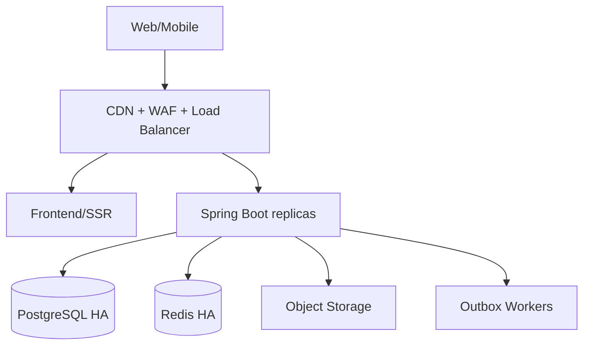

# Đánh giá triển khai, tối ưu và khả năng mở rộng

> Repository: [Babychandoi/Real-estate](https://github.com/Babychandoi/Real-estate)  
> Commit: [4f52c76](https://github.com/Babychandoi/Real-estate/commit/4f52c76f99d982aae3d7fd37dc9b76d647599b80)  
> Ngày đánh giá: 2026-09-11

## 1. Trả lời trực tiếp

**Không. Hệ thống hiện tại chưa scale được vài triệu người dùng đồng thời.**

**Điểm production scalability: 2,0/10.** Cấu hình hiện tại là một cụm Docker Compose đơn node: một frontend, một backend, một PostgreSQL và một Redis. Không có load balancer, autoscaling, HA database, cluster cache, CDN, object storage implementation, worker outbox, load test hay SLO.

“Vài triệu tài khoản đăng ký” khác hoàn toàn “vài triệu người đồng thời”:

- Vài triệu tài khoản với vài nghìn người hoạt động đồng thời có thể phục vụ bằng modular monolith được tối ưu và scale ngang.
- Vài triệu kết nối đồng thời hoặc hàng trăm nghìn request/giây là bài toán hyperscale, cần mô hình tải cụ thể, nhiều vùng, CDN/edge, phân vùng dữ liệu và kiểm thử thực tế.

Không được cam kết con số concurrency nếu chưa có workload model và benchmark.

## 2. Điểm nghẽn hiện tại

### 2.1 Topology và high availability

- [docker-compose.yml](https://github.com/Babychandoi/Real-estate/blob/4f52c76f99d982aae3d7fd37dc9b76d647599b80/docker-compose.yml) chỉ có một instance mỗi service.
- `container_name` cố định cản trở `docker compose --scale` cùng project.
- PostgreSQL và Redis là single point of failure, không replica/failover/PITR.
- Backend/frontend không có healthcheck trong Compose; `depends_on` chỉ giúp thứ tự khởi động, không tạo HA.
- Không có Kubernetes/ECS/Nomad manifest, HPA, PDB, rolling/canary hoặc multi-zone.

### 2.2 Database/search

- Hikari pool tối đa 15 kết nối mỗi instance; chưa có connection budget toàn cụm hoặc PgBouncer.
- Listing search dùng `LIKE '%keyword%'`, range trên hai cột lat/lng và offset pagination: [ListingJpaRepository](https://github.com/Babychandoi/Real-estate/blob/4f52c76f99d982aae3d7fd37dc9b76d647599b80/backend/src/main/java/com/company/bds/listing/infrastructure/persistence/repository/ListingJpaRepository.java#L44-L68).
- Migration bật PostGIS nhưng dữ liệu vẫn là `DOUBLE PRECISION`; không có geometry/geography column hoặc GiST index. Có thể dùng [ST_DWithin](https://postgis.net/docs/ST_DWithin.html) với spatial index thay cho bounding-box thủ công.
- Search query fetch toàn bộ revisions của mỗi listing, làm row amplification và tăng bộ nhớ.
- `page`/`size` không clamp; page âm gây lỗi, size quá lớn tạo DoS/memory pressure.
- Nhiều queue/list endpoint dùng `findAll()` không pagination: KYC, verification, project, report, CMS, contract.
- Analytics đọc toàn bộ lead vào JVM rồi đếm; endpoint overview phần lớn hardcode.

### 2.3 Cache, async và media

- Redis dependency/config có nhưng không có `RedisTemplate`, `@Cacheable` hay rate limiter trong code.
- Có bảng `outbox_events` nhưng không có producer/publisher/worker.
- Ảnh dùng URL ngoài; không có object storage adapter, image processing hoặc CDN.
- Notification/email/SMS không có worker; thao tác dễ trở thành synchronous nếu bổ sung ngây thơ.

### 2.4 Frontend/edge

- JS bundle 568,05 KB minified; tất cả route import eager, chưa route-level code splitting.
- Nginx chỉ proxy và SPA fallback; chưa gzip/Brotli, cache-control asset immutable, security headers, request limit, timeout hoặc upstream keepalive tuning.
- Không có CDN/edge cache cho ảnh, static assets và public listing pages.
- SPA client-rendered hoàn toàn làm SEO/listing landing kém và tăng time-to-content trên thiết bị yếu.

### 2.5 Observability và vận hành

- Actuator expose health/info/metrics nhưng chưa có Prometheus registry, distributed tracing, structured logs, dashboards hoặc alert rules.
- Không có SLI/SLO cho availability, latency, error rate, freshness, moderation và transaction.
- Không có load test, soak test, failover/chaos test hay capacity report.
- Không có backup policy, PITR, RPO/RTO, restore drill hoặc disaster recovery.
- Không có CI/CD, environment promotion, migration gate hoặc rollback automation.

## 3. Ưu điểm kiến trúc

- Modular monolith là lựa chọn hợp lý ở giai đoạn đầu: deploy đơn giản, transaction nội bộ rõ và ít distributed failure.
- Spring Boot stateless HTTP có thể scale ngang sau khi auth/session được thiết kế đúng.
- Flyway, PostgreSQL, Redis, outbox schema, Docker multi-stage và `open-in-view=false` là nền tốt.
- Listing search đã có pagination bước đầu; schema có một số index theo owner/status/time.

Không cần chuyển microservice ngay. Cần làm monolith production-grade trước.

## 4. Kiến trúc mục tiêu theo giai đoạn

### Giai đoạn 1 — Production baseline

- Managed PostgreSQL Multi-AZ + PITR; Redis HA; object storage + CDN.
- Backend replicas stateless, graceful shutdown, readiness/liveness/startup probes.
- Session Redis hoặc token architecture; không state local.
- PgBouncer; pool budget: tổng max connections của mọi pod thấp hơn ngưỡng DB an toàn.
- Queue/outbox worker riêng; idempotent consumer và dead-letter handling.
- TLS, WAF, rate limit, bot protection; secret manager.

### Giai đoạn 2 — Tối ưu dữ liệu và search

- Tách query model tin public; chỉ lấy public revision, không fetch toàn lịch sử.
- Keyset/cursor pagination thay offset sâu; clamp `size <= 100`.
- PostGIS geography + GiST cho radius/viewport; `pg_trgm`/GIN cho keyword ban đầu.
- Khi nhu cầu ranking/faceting tăng, đồng bộ sang OpenSearch/Elasticsearch qua outbox; DB vẫn là source of truth.
- Pre-aggregate analytics theo event/time window; không `findAll()` trong request path.
- Cache listing detail/search phổ biến với TTL và invalidation event-driven.

### Giai đoạn 3 — Scale rất lớn

- Tách theo bounded context chỉ khi metric chứng minh nhu cầu: search/read, media, notifications, identity/risk, transaction.
- Partition bảng event/lead/audit theo thời gian/tenant; read replica cho workload đọc.
- Multi-region active-passive trước; active-active chỉ khi business yêu cầu và mô hình consistency rõ.
- Edge cache public search/detail; image resize ở edge.
- Dùng [Horizontal Pod Autoscaling](https://kubernetes.io/docs/concepts/workloads/autoscaling/horizontal-pod-autoscale/) theo CPU + RPS/queue lag, có min/max và scale-down stabilization.

## 5. Kế hoạch tối ưu P0–P3

### P0 — đúng và đo được

- Xóa `container_name`; thêm health/readiness; đóng port DB/Redis.
- Thêm metrics, tracing, structured log, dashboard và SLO.
- Pagination mọi list; clamp input; bỏ `findAll()` request path.
- Route lazy loading; Nginx compression/cache/timeouts.
- K6/Gatling smoke benchmark và baseline CPU/RAM/DB.

### P1 — scale ngang an toàn

- Orchestrator + load balancer + HPA + PDB; managed Postgres/Redis HA.
- Object storage/CDN; async outbox worker; idempotency.
- PgBouncer và connection budget; read model cho listing.
- Backup/PITR/restore drill; rolling deploy và rollback.

### P2 — tải lớn

- PostGIS/trigram/search index; keyset pagination; cache strategy.
- Event analytics pipeline; rate limiting phân tán.
- Load/soak/failover tests theo 10x traffic dự báo.

### P3 — hàng triệu concurrent

- Xác định loại concurrency: active request, idle session, SSE/WebSocket hay viewer CDN.
- Multi-region, edge-heavy delivery, data partitioning và capacity reservation.
- Benchmark từng tầng tới failure point; kiểm tra recovery, không chỉ peak throughput.

## 6. Mẫu capacity plan bắt buộc

Trước khi nói “scale được”, phải chốt:

| Chỉ số | Cần xác định |
|---|---|
| Registered users / DAU / peak concurrent | Ba con số riêng |
| Peak RPS | Search, detail, write, upload, transaction riêng |
| Data volume | Listing, revision, media, lead, audit/event |
| SLO | Availability; p50/p95/p99; error rate |
| Traffic shape | Normal, campaign spike, bot/crawler |
| Consistency | Tin đăng, tồn tại, hợp đồng, ledger |
| Recovery | RPO/RTO, zone/region failure |

Theo Little’s Law, concurrency đang xử lý xấp xỉ `RPS × thời gian đáp ứng`. Vì vậy “1 triệu concurrent” không đủ để suy ra số pod nếu không biết hành vi và latency.

## 7. Bộ test scale tối thiểu

- Search/detail: ramp, spike và cache cold/warm.
- Create/update/submit listing có media.
- Lead/report abuse test và rate limit.
- OTP/contract idempotency/concurrency race.
- Outbox retry, duplicate, poison message và backlog recovery.
- DB failover, Redis failover, pod termination khi đang xử lý.
- 2–8 giờ soak test; theo dõi leak, GC, pool, locks, slow query.

## 8. Phán quyết

**Chưa tối ưu và chưa có bằng chứng scale.** Hướng đúng là giữ modular monolith, làm stateless + HA + observability + data access hiệu quả, rồi benchmark. Chỉ tách service và multi-region khi số liệu cho thấy điểm nghẽn cụ thể.
