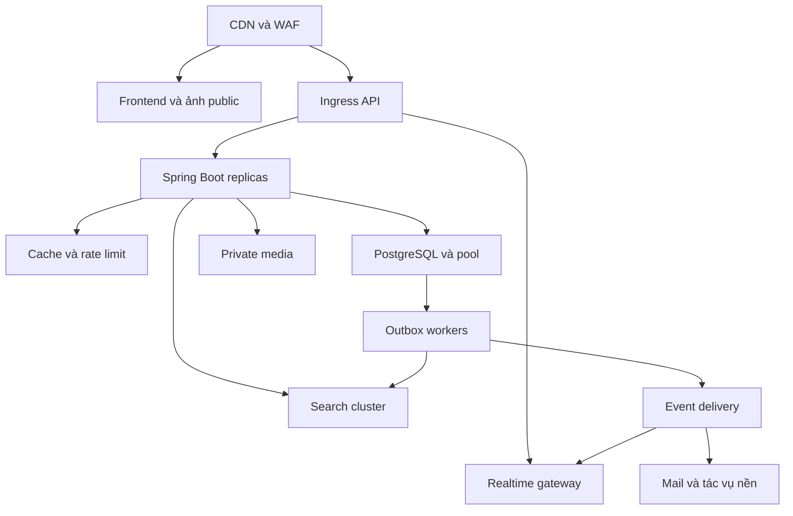

# Đánh giá Senior triển khai và mở rộng — bản cập nhật 13/09/2026

**Ngày đánh giá:** 13/09/2026. **Repository:** [Babychandoi/Real-estate](https://github.com/Babychandoi/Real-estate).

**Bản được kiểm tra:** `main` tại [8afba2c](https://github.com/Babychandoi/Real-estate/commit/8afba2c24e19eb2fb7cc90fee7c71e8ff283f6e2), commit “feat: complete production platform workflows”, lúc 07:43:03 UTC ngày 13/09/2026. Đối chiếu bản trước `4f52c76`; có 1 commit mới, 200 tệp thay đổi. Mọi liên kết source trong báo cáo được cố định theo SHA này.

**Cách đọc bằng chứng:** “Xác nhận từ source” là kết luận về đường đi trong mã/cấu hình; “đã chạy” là kết quả kiểm tra thực tế; “cần kiểm thử” là giả thuyết hoặc tiêu chí nghiệm thu còn thiếu. Đã đối chiếu nội dung 328 tệp văn bản với Git blob SHA. Đây không phải chứng nhận kiểm thử toàn bộ sản phẩm. Không thực hiện pentest, tải lớn hay thao tác mua bán trên hệ thống công khai; chưa xác nhận website đang chạy đúng SHA này.

## 1. Trả lời khả năng phục vụ vài triệu người đồng thời

**Chưa có cơ sở để khẳng định hệ thống hiện phục vụ được vài triệu người dùng cùng lúc; thiết kế/cấu hình hiện tại còn những điểm chặn rõ ràng trước mục tiêu đó.** Có Docker, HPA hay tên các dịch vụ HA chưa phải bằng chứng về công suất. Chưa có phép đo đủ để cam kết ngay cả một mức thấp hơn như 10.000 concurrent cho bản này.

Tiến bộ so với trước: healthcheck, giới hạn tài nguyên backend, PDB/HPA, mẫu PostgreSQL HA/External Secrets, outbox lease/fencing, query phân trang ID trước hydrate, scripts tải/backup và chia bundle frontend. Đây là nền tảng để đo và cải tiến, chưa phải nghiệm thu production quy mô lớn. [Docker Compose](https://github.com/Babychandoi/Real-estate/blob/8afba2c24e19eb2fb7cc90fee7c71e8ff283f6e2/docker-compose.yml#L2); [Deployment, PDB và HPA](https://github.com/Babychandoi/Real-estate/blob/8afba2c24e19eb2fb7cc90fee7c71e8ff283f6e2/infra/k8s/app.yaml#L1); [Mẫu hạ tầng production](https://github.com/Babychandoi/Real-estate/blob/8afba2c24e19eb2fb7cc90fee7c71e8ff283f6e2/infra/k8s/production-platform.yaml#L1); [Outbox có lease và fencing](https://github.com/Babychandoi/Real-estate/blob/8afba2c24e19eb2fb7cc90fee7c71e8ff283f6e2/backend/src/main/java/com/company/bds/shared/outbox/OutboxLeaseRepository.java#L17); [Tải tin từ kết quả tìm kiếm](https://github.com/Babychandoi/Real-estate/blob/8afba2c24e19eb2fb7cc90fee7c71e8ff283f6e2/backend/src/main/java/com/company/bds/listing/infrastructure/persistence/adapter/ListingPersistenceAdapter.java#L69).

## 2. Hạ tầng hiện có và phần chưa được chứng minh

| Thành phần | Thực trạng trong repository | Hệ quả |
| --- | --- | --- |
| Root Compose | 8 service: Postgres, Redis, MinIO, ClamAV, ES, backend, frontend, cloudflared | Phù hợp một host/demo hoặc môi trường nhỏ; cùng host vẫn chung miền lỗi |
| API | Một backend trong Compose; template K8s 2 replica, CPU HPA tối đa 10 | Không biết throughput/pod; CPU không bao quát DB, I/O, SSE |
| PostgreSQL | Một instance ở Compose; template CloudNativePG 3 instance | Template khác với cluster đang vận hành được kiểm chứng |
| Redis | Có password; root Compose bật AOF nhưng không mount volume Redis; code rate limit vẫn local | Có container Redis chưa tạo cache/rate limit phân tán; AOF không bền qua recreate container nếu không có storage |
| Elasticsearch | Single-node ở Compose; full sync mỗi tiến trình | Chưa có read/write capacity, shard/replica và failover được đo |
| Media | MinIO riêng tư; public image đi qua backend | API/JVM vẫn chịu băng thông và tải đọc ảnh; cần đường phục vụ media quy mô lớn |
| Public ingress | Tài liệu mô tả Cloudflare Tunnel → Docker Desktop trên workstation | Phụ thuộc máy cá nhân theo topology được mô tả; không coi đây là HA production |
| Metrics | Có Prometheus config nhưng SecurityConfig deny endpoint metrics | Chưa thu được số liệu qua đường cấu hình hiện tại |
| Load test | `load`: 25 VU; `soak`: 20 VU; chỉ gọi trang đầu listing search rồi sleep | Không đại diện vài triệu người, đăng nhập, upload, billing hay nhiều kết nối SSE |

Nguồn: [Docker Compose](https://github.com/Babychandoi/Real-estate/blob/8afba2c24e19eb2fb7cc90fee7c71e8ff283f6e2/docker-compose.yml#L2), [Deployment, PDB và HPA](https://github.com/Babychandoi/Real-estate/blob/8afba2c24e19eb2fb7cc90fee7c71e8ff283f6e2/infra/k8s/app.yaml#L1), [Mẫu hạ tầng production](https://github.com/Babychandoi/Real-estate/blob/8afba2c24e19eb2fb7cc90fee7c71e8ff283f6e2/infra/k8s/production-platform.yaml#L1), [Tài liệu triển khai và hạ tầng local](https://github.com/Babychandoi/Real-estate/blob/8afba2c24e19eb2fb7cc90fee7c71e8ff283f6e2/infra/production/README.md#L3), [Giới hạn tần suất](https://github.com/Babychandoi/Real-estate/blob/8afba2c24e19eb2fb7cc90fee7c71e8ff283f6e2/backend/src/main/java/com/company/bds/shared/security/RequestRateLimitFilter.java#L18), [Đồng bộ và tìm kiếm Elasticsearch](https://github.com/Babychandoi/Real-estate/blob/8afba2c24e19eb2fb7cc90fee7c71e8ff283f6e2/backend/src/main/java/com/company/bds/search/ElasticsearchListingIndex.java#L20), [Lưu và đọc media](https://github.com/Babychandoi/Real-estate/blob/8afba2c24e19eb2fb7cc90fee7c71e8ff283f6e2/backend/src/main/java/com/company/bds/media/MediaStorageService.java#L63), [Cấu hình thu metrics](https://github.com/Babychandoi/Real-estate/blob/8afba2c24e19eb2fb7cc90fee7c71e8ff283f6e2/infra/observability/prometheus.yml#L1), [Quy tắc truy cập API](https://github.com/Babychandoi/Real-estate/blob/8afba2c24e19eb2fb7cc90fee7c71e8ff283f6e2/backend/src/main/java/com/company/bds/shared/security/SecurityConfig.java#L55), [Kịch bản tải k6](https://github.com/Babychandoi/Real-estate/blob/8afba2c24e19eb2fb7cc90fee7c71e8ff283f6e2/infra/k6/workload.js#L4).

Tài liệu còn mô tả một cluster KIND local với Redis Sentinel, MinIO, Vault và frontend replicas. Những cấu hình này được ghi nhận là công việc hạ tầng có ích; audit này chưa truy cập cluster hoặc xem report failover đủ để xác nhận deployment thực. Nhiều pod trên cùng workstation không giải quyết sự cố mất cả host. [Tài liệu triển khai và hạ tầng local](https://github.com/Babychandoi/Real-estate/blob/8afba2c24e19eb2fb7cc90fee7c71e8ff283f6e2/infra/production/README.md#L3).

## 3. Chuyển “triệu concurrent” thành workload đo được

Phải tách số tài khoản đăng ký, người active trong tháng, số phiên mở, số người đang tương tác, request/giây và số kết nối dài. Dùng mô hình minh họa:

`API RPS = số phiên đồng thời × tỷ lệ đang tương tác × API request mỗi người mỗi giây tương tác`.

| Kịch bản giả định, không phải kết quả benchmark | Phép tính | API RPS trước tối ưu cache |
| --- | --- | ---: |
| 1 triệu phiên mở; 10% tương tác; mỗi người đang tương tác 1 API/10 giây | 1.000.000 × 0,10 × 0,10 | 10.000 |
| 3 triệu phiên mở; 20% tương tác; 1 API/10 giây | 3.000.000 × 0,20 × 0,10 | 60.000 |
| 3 triệu người đều đang thao tác; 1 API/5 giây | 3.000.000 × 1 × 0,20 | 600.000 |

Các số này chưa tính ảnh/map tiles, email, background jobs và burst. Nếu 1 triệu phiên đều giữ SSE, có thể cần quản lý 1 triệu kết nối dài dù API RPS thấp. Nếu mỗi phiên tải 1 MB ảnh trong cùng cửa sổ 60 giây, tổng khoảng 1 TB/phút, tức khoảng 16,7 GB/s hay 133 Gbit/s theo đơn vị thập phân — trước khi tính cache/CDN. Đó là ví dụ ngân sách lưu lượng, không phải ước lượng traffic hiện tại.

Với 60.000 RPS và độ trễ trung bình 0,2 giây, mô hình ổn định cho khoảng 12.000 request đang xử lý; còn số kết nối mở là đại lượng khác. Muốn định cỡ phải có workload, hardware, latency budget, hit ratio và kết quả kiểm thử thật.

## 4. Các điểm nghẽn cụ thể và cách giải quyết

### OPS-01 — Elasticsearch full sync vừa tốn tài nguyên vừa sai trạng thái — P0/P1

Mỗi backend query toàn bộ tin ACTIVE vào một list, gửi tuần tự một HTTP PUT/tin, rồi chờ 60 giây trước vòng sau. Nếu một triệu tin, một vòng là một triệu request index cho mỗi pod; 10 pod có thể làm cùng công việc. Không có batching, checkpoint hoặc single worker ownership. Thời gian vòng tăng theo dữ liệu nên không được diễn giải là index luôn mới trong 60 giây. Cùng logic không delete tin ẩn và không kiểm tra HTTP 400 đúng ngữ cảnh. [Đồng bộ và tìm kiếm Elasticsearch](https://github.com/Babychandoi/Real-estate/blob/8afba2c24e19eb2fb7cc90fee7c71e8ff283f6e2/backend/src/main/java/com/company/bds/search/ElasticsearchListingIndex.java#L20).

**Giải pháp:** chuyển index sang worker nhận sự kiện outbox UPSERT/DELETE có version; bulk API, backpressure, retry/DLQ và chỉ mục alias khi rebuild. Rebuild theo batch có checkpoint, không chạy toàn bộ ở mỗi startup/pod. Lớp public read vẫn xác nhận trạng thái được phép công khai. [Tải tin từ kết quả tìm kiếm](https://github.com/Babychandoi/Real-estate/blob/8afba2c24e19eb2fb7cc90fee7c71e8ff283f6e2/backend/src/main/java/com/company/bds/listing/infrastructure/persistence/adapter/ListingPersistenceAdapter.java#L69).

**Đo để đóng:** độ trễ publish/hide → index, index queue age, bulk errors, DB load và heap khi rebuild. Test event trễ/lặp/đảo thứ tự; sự kiện cũ không làm sống lại tin bị khóa.

### OPS-02 — Database vẫn nằm trên nhiều đường nóng — P1

Hikari tối đa 15 connection/pod; HPA 10 pod có thể tạo 150 connection chỉ riêng API, chưa tính worker/migration/monitoring. Không có phép đo để kết luận con số này đã phù hợp DB. Mỗi request có Bearer tra DB session; mỗi login còn DELETE toàn bộ session expired/revoked. Trang chủ tin/broker có nhánh lấy toàn bộ listings cùng revisions; fallback search dùng LIKE `%keyword%`, bounding-box lat/lng và OFFSET. PostGIS image không tự biến query thành truy vấn có spatial index. [Cấu hình Spring Boot](https://github.com/Babychandoi/Real-estate/blob/8afba2c24e19eb2fb7cc90fee7c71e8ff283f6e2/backend/src/main/resources/application.yml#L19); [Đăng ký, đăng nhập và phiên](https://github.com/Babychandoi/Real-estate/blob/8afba2c24e19eb2fb7cc90fee7c71e8ff283f6e2/backend/src/main/java/com/company/bds/iam/application/AuthService.java#L48); [Truy vấn tin đăng và revisions](https://github.com/Babychandoi/Real-estate/blob/8afba2c24e19eb2fb7cc90fee7c71e8ff283f6e2/backend/src/main/java/com/company/bds/listing/infrastructure/persistence/repository/ListingJpaRepository.java#L25); [Nhận và xử lý lead](https://github.com/Babychandoi/Real-estate/blob/8afba2c24e19eb2fb7cc90fee7c71e8ff283f6e2/backend/src/main/java/com/company/bds/lead/application/LeadApplicationService.java#L46).

**Giải pháp:** budget kết nối dựa trên DB; PgBouncer với cấu hình được kiểm chứng; session cache có TTL và cơ chế revoke đúng; dọn session theo batch ngoài login. Query lead join owner trực tiếp, giới hạn page trên mọi endpoint, dùng projection public revision, keyset/cursor khi cần. Lựa chọn full-text/spatial index theo query plan thực; dùng read replica cho đường đọc chấp nhận trễ.

**Đo để đóng:** `EXPLAIN ANALYZE`, p95 query theo lượng dữ liệu, buffer hit, lock wait, pool wait, replication lag và bloat. Không thêm index tùy tiện cho mọi cột.

### OPS-03 — Rate limit và realtime chưa hoạt động nhất quán nhiều pod — P1

Rate bucket nằm trong ConcurrentHashMap, không eviction; ngưỡng tăng theo số pod và reset khi restart. SSE emitter cũng nằm trong memory của pod nhận kết nối; sự kiện tạo ở pod khác không tới client đó. Nginx `/api/` timeout 30 giây, không cấu hình riêng tắt proxy buffering cho SSE; service không có heartbeat/replay event ID. [Giới hạn tần suất](https://github.com/Babychandoi/Real-estate/blob/8afba2c24e19eb2fb7cc90fee7c71e8ff283f6e2/backend/src/main/java/com/company/bds/shared/security/RequestRateLimitFilter.java#L18); [Thông báo và SSE](https://github.com/Babychandoi/Real-estate/blob/8afba2c24e19eb2fb7cc90fee7c71e8ff283f6e2/backend/src/main/java/com/company/bds/notification/RealtimeNotificationService.java#L20); [Gateway Nginx](https://github.com/Babychandoi/Real-estate/blob/8afba2c24e19eb2fb7cc90fee7c71e8ff283f6e2/frontend/nginx.conf#L1).

**Giải pháp:** rate limit shared store với TTL; event bus/Redis Streams hoặc cơ chế tương đương phù hợp mức tải; notification DB giữ trạng thái, gateway phân phối có replay/checkpoint. Phát sự kiện sau commit/outbox, heartbeat, timeout hợp lý và thử reconnect. Redis Pub/Sub đơn thuần chỉ phù hợp phần realtime chấp nhận mất thông báo; không coi nó là hàng đợi bền vững.

**Đo để đóng:** kết nối đồng thời, memory/connection, reconnect burst, message lag, mất/trùng event khi kill pod; cùng một người có nhiều thiết bị vẫn đúng quyền.

### OPS-04 — Geocoding hiện bị tuần tự hóa và phụ thuộc public service hạn mức thấp — P1

Toàn bộ method là `synchronized`, gồm DB cache, sleep và HTTP tối đa 8 giây; một request chậm giữ cả lock của endpoint trên pod. Nominatim URL và contact `admin@example.invalid` hardcode. Hạn khoảng 1 request/giây hiện là mỗi pod, không phải toàn ứng dụng. [Geocoding](https://github.com/Babychandoi/Real-estate/blob/8afba2c24e19eb2fb7cc90fee7c71e8ff283f6e2/backend/src/main/java/com/company/bds/search/GeocodingController.java#L12).

Public Nominatim yêu cầu tối đa **1 request/giây cho toàn website/ứng dụng**, nhận diện ứng dụng, attribution và không dùng cho autocomplete. Mục tiêu hàng triệu người dùng cần nhà cung cấp phù hợp hoặc dịch vụ tự vận hành, không tăng replica để nhân hạn mức public. [Chính sách Nominatim](https://operations.osmfoundation.org/policies/nominatim/).

**Giải pháp:** provider adapter/endpoint cấu hình được, ngân sách quota toàn hệ thống, cache có kiểm soát, timeout/circuit breaker và bulkhead; giữ hoạt động xem tin khi geocoding lỗi. Đo cache hit và latency theo provider.

### OPS-05 — Cần tách băng thông media và kiểm soát công việc nặng — P1

Hiện backend đọc object thành bytes và trả ảnh; upload còn nhận bytes rồi quét AV đồng bộ. MinIO, DB và ClamAV lỗi/chậm đều có thể kéo dài request. Nginx tối đa body `10m` nhưng backend cho file `10MB` và request `11MB`; multipart sát ngưỡng có thể bị 413 ở gateway trước validation. [Lưu và đọc media](https://github.com/Babychandoi/Real-estate/blob/8afba2c24e19eb2fb7cc90fee7c71e8ff283f6e2/backend/src/main/java/com/company/bds/media/MediaStorageService.java#L63); [Gateway Nginx](https://github.com/Babychandoi/Real-estate/blob/8afba2c24e19eb2fb7cc90fee7c71e8ff283f6e2/frontend/nginx.conf#L1); [Cấu hình Spring Boot](https://github.com/Babychandoi/Real-estate/blob/8afba2c24e19eb2fb7cc90fee7c71e8ff283f6e2/backend/src/main/resources/application.yml#L19).

**Giải pháp:** public media immutable qua CDN/object gateway, thumbnail responsive; private KYC giữ quyền kiểm soát chặt, cache private phù hợp. Upload có quota, staging/quarantine và scan worker nếu tải đòi hỏi; không xuất bản trước khi scan đạt. Đồng bộ giới hạn giữa UI/Nginx/Spring/object storage. Sửa cleanup hồ sơ trước mọi tối ưu lưu trữ. [Xóa media và dọn orphan](https://github.com/Babychandoi/Real-estate/blob/8afba2c24e19eb2fb7cc90fee7c71e8ff283f6e2/backend/src/main/java/com/company/bds/media/MediaStorageService.java#L124).

### OPS-06 — Metrics và HA chưa thành chu trình vận hành — P0/P1

Prometheus scrape `/actuator/prometheus` trên backend nhưng security chỉ cho health/info; endpoint còn lại rơi vào denyAll, không có matcher cho metrics collector. Không thể đánh giá SLO qua cấu hình scrape này. [Cấu hình thu metrics](https://github.com/Babychandoi/Real-estate/blob/8afba2c24e19eb2fb7cc90fee7c71e8ff283f6e2/infra/observability/prometheus.yml#L1); [Quy tắc truy cập API](https://github.com/Babychandoi/Real-estate/blob/8afba2c24e19eb2fb7cc90fee7c71e8ff283f6e2/backend/src/main/java/com/company/bds/shared/security/SecurityConfig.java#L55).

**Giải pháp:** management port/path nội bộ, cho collector đúng quyền qua network policy/auth riêng; không mở metrics công khai để khắc phục nhanh. Bổ sung dashboard API latency/errors, DB pool, search lag, outbox age, AV failures, media cleanup, SMTP queue và billing exceptions.

K8s có replica/HPA nhưng template dùng placeholder image/host/storage; cần secrets, operators và topology thực. HPA thay đổi số replica dựa trên metric, không tự tăng capacity DB/object store hay bảo đảm hiệu năng. [Tài liệu Kubernetes HPA](https://kubernetes.io/docs/concepts/workloads/autoscaling/horizontal-pod-autoscale/). [Deployment, PDB và HPA](https://github.com/Babychandoi/Real-estate/blob/8afba2c24e19eb2fb7cc90fee7c71e8ff283f6e2/infra/k8s/app.yaml#L1); [Mẫu hạ tầng production](https://github.com/Babychandoi/Real-estate/blob/8afba2c24e19eb2fb7cc90fee7c71e8ff283f6e2/infra/k8s/production-platform.yaml#L1).

**Nghiệm thu HA:** mất một pod/node/zone, DB failover, restore backup và key, storage unavailable, Vault restart; đo thời gian phục hồi và dữ liệu mất. Cluster nhiều node trong một máy vẫn cần phân biệt với nhiều miền lỗi độc lập.

### OPS-07 — Outbox tốt hơn nhưng chưa có bảo đảm exactly-once — P1

Lease/fencing chặn worker cũ finalize trạng thái sau khi mất lease. Nhưng webhook có thể đã xử lý rồi response bị mất; retry gửi lại là hành vi bình thường. Dispatcher chưa đặt timeout riêng rõ ràng và chưa có DLQ/giới hạn thử lại trong code được kiểm tra. Email đăng ký còn gửi đồng bộ trong afterCommit, email billing gửi trong transaction và chỉ log khi lỗi; không phải tất cả side effect đều qua outbox. [Outbox có lease và fencing](https://github.com/Babychandoi/Real-estate/blob/8afba2c24e19eb2fb7cc90fee7c71e8ff283f6e2/backend/src/main/java/com/company/bds/shared/outbox/OutboxLeaseRepository.java#L17); [Gửi webhook outbox](https://github.com/Babychandoi/Real-estate/blob/8afba2c24e19eb2fb7cc90fee7c71e8ff283f6e2/backend/src/main/java/com/company/bds/shared/outbox/OutboxWebhookDispatcher.java#L34); [Gửi email sau commit](https://github.com/Babychandoi/Real-estate/blob/8afba2c24e19eb2fb7cc90fee7c71e8ff283f6e2/backend/src/main/java/com/company/bds/iam/application/AuthService.java#L120); [Mua gói và đối soát](https://github.com/Babychandoi/Real-estate/blob/8afba2c24e19eb2fb7cc90fee7c71e8ff283f6e2/backend/src/main/java/com/company/bds/billing/BillingService.java#L28).

**Giải pháp:** receiver dedupe bằng event ID, timeout/backoff/jitter, DLQ và replay có audit, alert oldest unprocessed age. Đưa email/notification nghiệp vụ cần độ bền vào outbox sau khi thống nhất transaction boundary; không giữ DB transaction qua HTTP/SMTP dài.

## 5. Kiến trúc đích đề xuất theo lộ trình

Giữ modular monolith cho API khi chưa có dữ liệu cho thấy cần tách dịch vụ. Tách các loại tải khác nhau trước: static/media, API, search indexing, mail/AV/outbox và realtime. Sơ đồ sau là **đề xuất**, không phải mô tả đã deploy:

Scale từng thành phần dựa trên queue, latency, utilization và ngân sách kết nối. Chỉ phân vùng dữ liệu hoặc tách microservice khi throughput, đội vận hành và giới hạn fault domain cho thấy lợi ích rõ; Spring Boot + React TypeScript không phải yếu tố tự chặn việc mở rộng.

## 6. Kế hoạch benchmark có thể nghiệm thu

| Chặng | Kịch bản đề xuất | Bằng chứng phải lưu |
| --- | --- | --- |
| Baseline | Một API replica, cấu hình máy cố định, dữ liệu 100k rồi 1m tin và revisions đại diện | SHA/image digest, DB size/index, cấu hình, warm/cold cache, metrics/report |
| Mixed load | Ví dụ 60% search, 25% detail, 8% phiên/account, 5% lead, 2% thao tác người bán | Đo từng endpoint, lỗi nghiệp vụ và write consistency; chỉnh tỷ lệ theo analytics thật |
| Stress | Tăng arrival rate theo bậc đến khi vi phạm SLO | Điểm nghẽn đầu tiên, pool/heap/queue, capacity bền vững, headroom |
| Soak | 8–24 giờ tại tải mục tiêu sau khi có baseline | Memory growth, backlog, connection leak, DB growth, retry storm |
| Realtime/media riêng | Ramp số SSE, reconnect; upload/scan và tải ảnh phân phối | Memory/connection, throughput, mất event, p95 scan, bandwidth/CDN hit |
| Failure | Kill pod/node, DB failover, ES/SMTP/object store ngừng tạm | RTO/RPO đo được, graceful degradation, không mất/nhân đôi side effect |

Dùng arrival-rate phù hợp để tránh test closed-loop làm giảm tải gửi khi server chậm. Bộ k6 hiện tại chỉ 25 VU trên cùng trang đầu search là smoke/load nhỏ; cần dataset, nhiều query/geo, auth và write flows đại diện. Không dùng chính production để thử tải đột biến chưa có kế hoạch. [Kịch bản tải k6](https://github.com/Babychandoi/Real-estate/blob/8afba2c24e19eb2fb7cc90fee7c71e8ff283f6e2/infra/k6/workload.js#L4).

**SLO đề xuất để đội dự án chốt, chưa đạt thực tế:** search/detail p95 <500ms và p99 <1s ở target load được định nghĩa; lỗi server <0,5%; không mất lead/order; index publish p95 <10s nhưng lệnh ẩn phải được enforce ngay tại authoritative read. RPO ≤5 phút, RTO ≤30 phút là mục tiêu thảo luận cho giai đoạn đầu, cần khớp chi phí và được diễn tập. Không công bố SLA trước khi có lịch sử vận hành.

Ước tính replica sau khi benchmark: `replica cần thiết ≈ RPS origin mục tiêu / RPS bền vững mỗi replica × hệ số dự phòng`. Xác minh DB/search/network không bão hòa khi tăng replica; phép nhân API không đảm bảo toàn hệ thống scale tuyến tính.

## 7. Release pipeline và kiểm chứng hiện tại

| Kiểm tra | Kết quả độc lập trong lần đánh giá này |
| --- | --- |
| `npm ci` và `npm run build` | **PASS** trên Node 24.19.0, npm 11.9.0; TypeScript và Vite build thành công. CI cấu hình Node 22, nên vẫn cần pipeline trên đúng runtime CI. |
| `npm audit --json` | **0 vulnerability được registry báo cáo** cho cây dependency frontend tại thời điểm kiểm tra; không đại diện bảo mật backend/container hay lỗi nghiệp vụ. |
| `sh mvnw --batch-mode verify` | **CHƯA XÁC MINH**: không resolve được parent Spring Boot 3.3.4 vì DNS của `repo.maven.apache.org` trong môi trường đánh giá. Chưa đến bước compile/test; không kết luận code backend build lỗi. |
| GitHub Actions của commit | **FAIL ở Set up job**: không tìm thấy `aquasecurity/trivy-action@0.28.0`; job chưa chạy các bước kiểm thử/build. [Run 34745938355](https://github.com/Babychandoi/Real-estate/actions/runs/34745938355). |
| Docker toàn bộ stack, E2E nghiệp vụ, load/soak, restore | **CHƯA CHẠY trong lần đánh giá này**. Môi trường không có Docker daemon; không suy ra các kiểm tra đã pass từ tài liệu trong repo. |

Ngoài Trivy sai ref, source cho thấy wrapper Git mode 100644 không chạy trực tiếp trên Ubuntu; E2E workflow chưa start backend trước test cần data; screenshot baselines hiện là Windows. Sửa theo thứ tự, không ghi tất cả là lỗi CI đã quan sát: log hiện chỉ xác nhận fail lúc chuẩn bị action. [Workflow CI](https://github.com/Babychandoi/Real-estate/blob/8afba2c24e19eb2fb7cc90fee7c71e8ff283f6e2/.github/workflows/ci.yml#L26); [Maven Wrapper](https://github.com/Babychandoi/Real-estate/blob/8afba2c24e19eb2fb7cc90fee7c71e8ff283f6e2/backend/mvnw#L1); [Cấu hình kiểm thử trình duyệt](https://github.com/Babychandoi/Real-estate/blob/8afba2c24e19eb2fb7cc90fee7c71e8ff283f6e2/frontend/playwright.config.ts#L2); [Test tìm kiếm sang chi tiết](https://github.com/Babychandoi/Real-estate/blob/8afba2c24e19eb2fb7cc90fee7c71e8ff283f6e2/frontend/tests/e2e/public-navigation.spec.ts#L1).

Branch metadata trong lần kiểm tra cho `main` là `protected:false`. Sau khi sửa pipeline, bật required checks/review phù hợp để ngăn merge khi gate không chạy; đọc thêm ruleset hiệu lực nếu tổ chức dùng ruleset riêng. [Metadata nhánh main](https://api.github.com/repos/Babychandoi/Real-estate/branches/main).

## 8. Lộ trình đưa lên production

| Thứ tự | Mục tiêu | Điều kiện chuyển bước |
| --- | --- | --- |
| 1 — Sửa đúng | Cleanup KYC, ownership, tin ẩn, lead contact, env/setup và CI | Các regression/UAT P0 pass trên môi trường đại diện |
| 2 — Vận hành đo được | Origin không phụ thuộc workstation, metrics, backup/restore, secrets, runbook rollback | Deploy/restore/failover có report, alert kiểm chứng |
| 3 — Scale tải thường | Shared rate limit, incremental ES, query/pool budget, CDN media, email/outbox | Benchmark mixed load và soak đạt SLO mục tiêu |
| 4 — Scale rất lớn | Nhiều miền lỗi, gateway realtime và hệ lưu trữ/search đúng capacity | Load phân tán đúng mô hình concurrent, failure tests và cost model |

**Quyết định:** chưa nhận cam kết “vài triệu người dùng đồng thời”. Trước mắt nên đóng lỗi tính đúng đắn và đạt một mức tải đo được, sau đó mở rộng có số liệu; mua thêm máy hoặc tăng HPA đơn thuần không xử lý các điểm chặn đã nêu.
