

# Kế hoạch triển khai website bất động sản

**Bản Markdown của hồ sơ Waterfall phiên bản 0.9.1**

Công nghệ đã chọn: **backend Spring Boot; frontend React TypeScript**. Bản này giữ toàn bộ nội dung, 32 user story, 8 nhóm use case, 61 sơ đồ UML/ERD và hình kiến trúc từ tài liệu Word. Số mục tương ứng với trang của bản Word 124 trang để đối chiếu; các tham chiếu đã chuyển thành liên kết trong tài liệu.

**Tra cứu nhanh:** [Mục lục](#p002) · [Công nghệ](#p044) · [User story](#p045) · [Bảng chỉ dẫn 11 mục](#p043) · [Ma trận truy vết](#p122).

**Cách dùng sơ đồ:** mã PlantUML đầy đủ nằm trong phần mở rộng bên dưới từng hình; mã kiến trúc dùng Mermaid. Tệp Markdown có thể dùng trực tiếp để đọc nội dung hoặc đưa cho AI. Để xem ảnh sơ đồ, giải nén gói Markdown kèm theo và giữ thư mục `assets/bds` cạnh tệp `.md`. Trình xem có hỗ trợ PlantUML hoặc Mermaid có thể dựng hình từ các khối mã tương ứng.

Bộ tài liệu dự án theo quy trình Waterfall

Mã hồ sơ BDS WF 2026   •   Phiên bản 0.9.1   •   Ngày 10 tháng 09 năm 2026

**Trạng thái:** đề xuất để chủ đầu tư xem xét và chốt phạm vi. Các mốc phê duyệt, kết quả kiểm thử và nghiệm thu trong hồ sơ chưa được thực hiện.

### Định hướng đề xuất

Xây dựng nền tảng đăng tin mua bán và cho thuê bất động sản, khởi đầu ở một địa bàn có nguồn tin chủ động. Giá trị cốt lõi là tin còn hiệu lực, thông tin minh bạch, tìm kiếm theo vị trí và tiếp nhận khách liên hệ có kiểm soát. Căn hộ và nhà ở là hai nhóm tài sản ưu tiên cho lần phát hành đầu.

Bộ hồ sơ phục vụ chủ đầu tư, quản lý dự án, phân tích nghiệp vụ, thiết kế, lập trình, kiểm thử và vận hành. Tài liệu nối mục tiêu kinh doanh với yêu cầu, thiết kế, công việc và phép kiểm tra bằng mã định danh để đội dự án có thể bàn giao và kiểm soát thay đổi.

| **Quyết định cơ sở** | **Phương án lập kế hoạch** |
| --- | --- |
| Mô hình | Nền tảng đăng tin nhiều người bán; giao dịch BĐS diễn ra ngoài website. |
| Bản phát hành đầu | 32 FR, 12 NFR; Spring Boot và React TypeScript; bộ UML từ [mục 43](#p043). |
| Tiến độ | 20 tuần từ khi huy động đội ngũ và bắt đầu khởi động; phụ thuộc các cổng duyệt. |
| Công sức phát triển | 2.240 giờ ước tính; ngân sách xây dựng 537,6 đến 940,8 triệu đồng, đã gồm dự phòng 20%. |
| Điều kiện phát hành | Đạt G0 đến G5, có nguồn tin được phép sử dụng và đội kiểm duyệt vận hành. |

**Kết luận khảo sát:** nên học cơ chế tìm kiếm, kiểm duyệt và hỗ trợ ra quyết định của các nền tảng lớn; lợi thế ban đầu cần đến từ nguồn cung đáng tin trong khu vực phục vụ. Danh sách website, bằng chứng và giới hạn so sánh nằm ở [mục 3](#p003) đến [5](#p005).

## 2. Mục lục và cách sử dụng hồ sơ

[Khảo sát website và bài học sản phẩm — mục 3](#p003)

[Định vị sản phẩm và yêu cầu nghiệp vụ — mục 6](#p006)

[Quy trình Waterfall và lịch triển khai — mục 8](#p008)

[Phân công nhân sự và ngân sách — mục 10](#p010)

[Đặc tả yêu cầu chức năng — mục 12](#p012)

[Đặc tả tình huống sử dụng — mục 16](#p016)

[Yêu cầu chất lượng và pháp lý — mục 19](#p019)

[Thiết kế trải nghiệm và SEO — mục 21](#p021)

[Thiết kế kiến trúc và hạ tầng — mục 23](#p023)

[Mô hình dữ liệu và giao diện API — mục 25](#p025)

[Kế hoạch và danh mục kiểm thử — mục 29](#p029)

[Ma trận truy vết và UAT — mục 33](#p033)

[Triển khai và vận hành — mục 36](#p036)

[Rủi ro và kiểm soát thay đổi — mục 38](#p038)

[Biểu mẫu phê duyệt và bàn giao — mục 39](#p039)

[Nguồn tham khảo — mục 40](#p040)

[Các quyết định cần chốt — mục 42](#p042)

[User story và bộ mô hình UML phân tích thiết kế — mục 43](#p043)

### Quy ước sử dụng

BR là yêu cầu kinh doanh; FR là yêu cầu chức năng; NFR là yêu cầu chất lượng; UC là tình huống sử dụng; TC là ca kiểm thử; G là cổng phê duyệt; CR là đề nghị thay đổi. P0 là bắt buộc để phát hành; P1 là phần mở rộng cần một phạm vi mới được duyệt.

Phiên bản 0.9.1 bổ sung user story và UML theo công nghệ đã chọn; yêu cầu vẫn ở trạng thái đề xuất. Sau G1, SRS 1.0 trở thành baseline được quản lý thay đổi. Thiết kế được duyệt tại G2; kết quả kiểm thử có hồ sơ bằng chứng riêng.

Hồ sơ tham chiếu kỹ nghệ yêu cầu ISO/IEC/IEEE 29148, vòng đời phần mềm ISO/IEC/IEEE 12207 và tài liệu kiểm thử ISO/IEC/IEEE 29119-3. Waterfall là cách tổ chức do dự án lựa chọn; các tài liệu tham chiếu không tạo thành chứng nhận tuân thủ ISO. [\[S11\]](https://www.iso.org/standard/72089.html) [\[S12\]](https://www.iso.org/standard/90219.html) [\[S13\]](https://www.iso.org/standard/79429.html)

## 3. Khảo sát mức độ quan tâm của thị trường

Tại thời điểm khảo sát ngày 09/09/2026, bảng Similarweb theo ngành Real Estate, thị trường Việt Nam, kỳ tháng 8/2026 hiển thị năm website sau. Trang nguồn ghi cập nhật ngày 01/09/2026. [\[S01\]](https://www.similarweb.com/top-websites/vietnam/business-and-consumer-services/real-estate/)

| **Hạng** | **Website** | **Nhóm giá trị để tham khảo** |
| --- | --- | --- |
| 1 | Batdongsan.com.vn | Tìm mua và thuê, dự án, công cụ và hệ sinh thái người đăng tin. |
| 2 | Guland.vn | Tra cứu bản đồ, vị trí, quy hoạch và tham khảo giá. |
| 3 | Nhatot.com | Mua bán, cho thuê và các dịch vụ cho người đăng tin. |
| 4 | Cafeland.vn | Nội dung thị trường, dự án và hệ thống chuyên mục BĐS. |
| 5 | Alonhadat.com.vn | Rao bán và cho thuê với bộ lọc thuộc tính chi tiết. |

### Cách hiểu mức độ phổ biến

Thứ hạng trên là ước tính truy cập của một nhà cung cấp dữ liệu, trong một ngành và một kỳ xác định. Nó không chứng minh số giao dịch thành công, mức độ tin cậy của tin đăng, thị phần doanh thu hay mức độ hài lòng. Không cộng số liệu khác kỳ hoặc khác phương pháp để tạo một bảng xếp hạng mới.

OneHousing và Mogi được đưa vào nhóm tham khảo bổ sung do có hướng giải quyết hữu ích cho sản phẩm. Hồ sơ không gán thứ hạng top 5 cho hai website này. [\[S09\]](https://onehousing.vn/) [\[S10\]](https://mogi.vn/)

### Phương pháp khảo sát

- Đọc trang công khai của bảy website và tài liệu tính năng chính thức; ghi nhận các chức năng có bằng chứng.

- Phân biệt tính năng quan sát được với chỉ số do doanh nghiệp tự công bố. Không dùng số liệu tiếp thị làm dự báo doanh thu dự án.

- Đánh giá phần có thể áp dụng cho sản phẩm mới theo khả năng cung cấp dữ liệu, chi phí vận hành và hành trình của người sử dụng.

Phạm vi khảo sát công khai không bao gồm kiểm thử luồng trả tiền, tốc độ thực đo, giao diện sau đăng nhập hoặc kiểm toán dữ liệu đối thủ. Vì vậy, các nhận xét ở mục tiếp theo là phân tích sản phẩm; không phải kết luận về chất lượng toàn bộ hệ thống.

## 4. Đối chiếu các nền tảng tham khảo chính

### Batdongsan com vn

Trang công khai phân chia mua, thuê, dự án, kiến thức và danh bạ; có tin lưu và tìm theo địa chỉ mới. Tài liệu riêng mô tả tìm trên bản đồ và kiểm tra tin dựa trên hồ sơ, ảnh, video do người đăng cung cấp. [\[S02\]](https://batdongsan.com.vn/) [\[S03\]](https://tinxacthuc.batdongsan.com.vn/) [\[S04\]](https://wiki.batdongsan.com.vn/tin-tuc/ra-mat-ban-do-nha-dat-828619)

**Áp dụng:** tổ chức thuộc tính chuẩn; hiển thị thời điểm cập nhật; mỗi nhãn kiểm tra giải thích rõ phạm vi. **Giới hạn áp dụng:** sản phẩm mới cần một quy trình kiểm duyệt có nhân sự và chứng cứ trước khi phát hành nhãn tương tự.

### Guland

Trang chủ tập trung vào bản đồ quy hoạch, bản đồ giá, tin thuê và tra cứu vị trí; bộ chọn địa điểm thể hiện cả địa danh cũ và mới. Đây là bằng chứng về định hướng sản phẩm của nền tảng, không xác nhận độ chính xác từng lớp dữ liệu. [\[S06\]](https://guland.vn/)

**Áp dụng:** bản đồ tin đăng và truy vấn theo vùng nhìn. **Phần mở rộng:** lớp quy hoạch cần hợp đồng dữ liệu, nguồn, ngày hiệu lực, phạm vi bao phủ và quy trình cập nhật; không đưa lớp này vào phạm vi cơ sở khi chưa có nguồn được phép sử dụng.

### Nhà Tốt

Trang công khai tách mua bán và cho thuê, gồm phòng trọ; thể hiện công cụ tham khảo giá và dịch vụ cho môi giới như hội viên, tài khoản doanh nghiệp và chuyên trang khu vực. [\[S05\]](https://www.nhatot.com/)

**Áp dụng:** lối vào theo nhu cầu, bộ lọc gọn, thao tác đăng tin rõ và trang quản lý liên hệ. **Lựa chọn dự án:** bán gói hiển thị chỉ được xem xét sau khi chứng minh người đăng nhận được liên hệ có giá trị.

### CafeLand

Cấu trúc nội dung bao gồm thị trường, quy hoạch, hạ tầng, tài chính, dự án, kiến thức và liên kết nhà đất. Nền tảng có vai trò tham khảo về kiến trúc nội dung. [\[S07\]](https://cafeland.vn/)

**Áp dụng:** CMS với tác giả, người duyệt, nguồn và ngày cập nhật. Nội dung phục vụ câu hỏi cụ thể của người mua tại địa bàn khởi đầu. Kế hoạch không dựa vào việc sao chép bài báo hoặc mở đồng loạt nhiều chuyên mục thiếu người phụ trách.

## 5. Tham khảo bổ sung và quyết định sản phẩm

### Alonhadat

Trang công khai cung cấp lọc theo vị trí, loại tin, loại BĐS, hướng, diện tích và giá; có dự án và danh mục môi giới. [\[S08\]](https://alonhadat.com.vn/)

**Áp dụng:** lọc phải có tính quyết định và đơn vị rõ ràng. Trên điện thoại, đưa bốn bộ lọc chính ra trước; các trường ít dùng nằm trong phần mở rộng. Đây là đề xuất thiết kế cho dự án, không phải kết quả đo usability của đối thủ.

### OneHousing

Trang chủ dẫn vào mua nhà, bán hoặc ký gửi, công cụ so sánh và định giá. Nền tảng tự giới thiệu hoạt động môi giới. [\[S09\]](https://onehousing.vn/)

**Áp dụng:** giúp người xem so sánh giá, diện tích, phí và vị trí trước khi liên hệ. Định giá tự động nằm ở giai đoạn sau, với dữ liệu đầu vào đủ chất lượng và cách công bố sai số. Không dùng giá chào bán làm nhãn giá giao dịch đã xác nhận.

### Mogi

Trang công khai hiển thị tin đã lưu, tìm kiếm đã lưu, tiện ích theo khu vực, nhà trọ gần trường và tra cứu sáp nhập. [\[S10\]](https://mogi.vn/)

**Áp dụng:** lưu điều kiện tìm và dữ liệu địa danh có phiên bản. Phiên bản đầu chỉ lưu bộ lọc; thông báo tự động về tin phù hợp được đánh giá sau khi đo được tỷ lệ quay lại.

| **Bài học tổng hợp** | **Quyết định cho bản phát hành đầu** |
| --- | --- |
| Niềm tin | Kiểm duyệt trước khi đăng; tách nhãn theo nội dung đã kiểm tra. |
| Tìm đúng vị trí | Lọc chuẩn, địa chỉ cũ và mới, bản đồ tin có vị trí công khai phù hợp. |
| Quay lại sử dụng | Tin lưu, tìm kiếm lưu, so sánh tối đa ba tin. |
| Hiệu quả người đăng | Hộp liên hệ, trạng thái xử lý và thống kê tách lượt bấm khỏi lead. |
| Kiểm soát chi phí | Chưa triển khai AI định giá, bản đồ quy hoạch hoặc ứng dụng native. |

## 6. Định vị và phạm vi sản phẩm

**Đề xuất:** website đăng tin nhiều chủ thể, tập trung căn hộ và nhà ở mua bán hoặc cho thuê trong một thành phố. Địa bàn cụ thể được chốt tại G0 theo mạng lưới nguồn hàng và khả năng kiểm duyệt. Đây là giả định phạm vi, chưa phải nhu cầu đã được phỏng vấn xác nhận.

| **Mô hình** | **Phù hợp khi** | **Đánh đổi** |
| --- | --- | --- |
| Website doanh nghiệp | Một doanh nghiệp đăng nguồn hàng của mình. | Nhẹ hơn; bỏ tài khoản nhiều người đăng và một phần chống lạm dụng. |
| Nền tảng đăng tin | Nhiều chủ nhà và môi giới cùng đăng tin. | Phải đầu tư vào phân quyền, kiểm duyệt, dữ liệu và vận hành. |
| Cổng dữ liệu BĐS | Có nguồn giá hoặc quy hoạch được cấp quyền. | Phụ thuộc lớn vào dữ liệu, chuyên môn và trách nhiệm giải thích. |

### Phạm vi phiên bản đầu

- Web công khai ưu tiên điện thoại; tài khoản người đăng; web quản trị kiểm duyệt; tiếng Việt.

- Đăng và cập nhật tin; tìm kiếm; bản đồ tin; chi tiết; lưu tin và bộ lọc; so sánh; gửi yêu cầu liên hệ.

- Hồ sơ người đăng; kiểm tra thông tin theo cấp; báo xấu; hộp lead; CMS cơ bản; dữ liệu dự án do quản trị nhập.

- Tự động hết hạn; nhắc người đăng cập nhật; thống kê; import có đối soát; sao lưu và giám sát.

### Phần mở rộng sau khi có bằng chứng nhu cầu

P1 gồm thu phí gói đăng tin qua một cổng thanh toán, thông báo tin phù hợp, nhiều thành viên trong doanh nghiệp và song ngữ Việt Anh. P2 gồm quy hoạch, định giá, hành trình vay, kết nối CRM ngoài, video 360 và ứng dụng native. Mỗi phần mở rộng phải có SRS, ngân sách và cổng duyệt riêng.

Phiên bản cơ sở không xử lý tiền cọc, tiền mua bán BĐS, hợp đồng chuyển nhượng, ví nội bộ hoặc chia hoa hồng giao dịch. Các chức năng này làm thay đổi đáng kể trách nhiệm vận hành và phải được đánh giá thành một phạm vi khác.

### Mô hình doanh thu dự kiến

Thử nghiệm miễn phí với hạn mức tin để xây nguồn cung; sau đó kiểm chứng khả năng thu phí hiển thị và gói người đăng. Tin được tài trợ phải có nhãn riêng, không được bỏ qua điều kiện phù hợp bộ lọc hoặc thay thế nhãn kiểm tra thông tin.

## 7. Mục tiêu kinh doanh và kế hoạch xác nhận nhu cầu

| **Mã** | **Yêu cầu kinh doanh** | **Chỉ số đề xuất sau 90 ngày** |
| --- | --- | --- |
| BR01 | Người tìm có thể chọn được nguồn hàng phù hợp. | Tỷ lệ phiên xem chi tiết có hành động liên hệ từ 5% trở lên. |
| BR02 | Tin đăng đủ thông tin và được làm mới. | Tối thiểu 90% tin hoạt động có xác nhận còn hàng trong 30 ngày. |
| BR03 | Người đăng quản lý được khách liên hệ. | Tối thiểu 80% lead hợp lệ có cập nhật xử lý trong 1 ngày làm việc. |
| BR04 | Đội vận hành kiểm soát chất lượng và khiếu nại. | Ít nhất 95% tin chờ được xử lý trong SLA nội bộ 8 giờ làm việc. |
| BR05 | Hình thành nguồn cung tại thị trường khởi đầu. | 500 tin còn hiệu lực từ ít nhất 30 người đăng trước mở công khai. |
| BR06 | Vận hành ổn định và kiểm soát dữ liệu. | Đạt NFR và báo cáo chi phí mỗi tháng; không phát hành khi còn lỗi chặn. |

Các mục tiêu này là ngưỡng đề xuất để điều hành, không phải dự báo thị trường hay điều kiện nghiệm thu doanh thu. BR01 đo số phiên có contact\_click hoặc lead\_submit thành công chia số phiên có listing\_view; báo cáo hai sự kiện riêng. Một lượt bấm gọi không chứng minh đã gọi hoặc giao dịch thành công.

### Nhóm người sử dụng

Người mua và thuê cần thông tin rõ, lọc đúng và liên hệ nhanh. Chủ nhà và môi giới cần đăng tin, cập nhật còn hàng và xử lý lead. Kiểm duyệt viên cần hàng đợi, hồ sơ kiểm tra và lịch sử thay đổi. Chủ đầu tư cần số liệu chất lượng nguồn cung, chi phí và hiệu quả chuyển đổi.

### Công việc xác nhận trong tuần 2 đến 4

- BA phỏng vấn tối thiểu 5 người tìm mua, 5 người tìm thuê, 5 người đăng và 2 người vận hành; ghi nguyên vấn đề, tần suất và cách xử lý hiện tại.

- Thu thập 100 tin mẫu được cấp quyền; đối chiếu trường giá, diện tích, địa chỉ, tình trạng và tỷ lệ thiếu dữ liệu.

- Chọn một địa bàn và hai nhóm tài sản; ghi nhận đối tác nguồn hàng, người phụ trách kiểm duyệt và quy trình tiếp nhận khiếu nại.

- Chủ đầu tư xác nhận BR, phạm vi và giả định bằng G1. Nếu chưa có nguồn cung hoặc nhu cầu ưu tiên khác, điều chỉnh trước khi thiết kế.

## 8. Quy trình Waterfall và các cổng phê duyệt

Các giai đoạn đi theo thứ tự. Review tài liệu và chuẩn bị kiểm thử được thực hiện sớm trong giai đoạn yêu cầu hoặc thiết kế; kiểm thử hệ thống chính thức bắt đầu sau khi hoàn tất xây dựng. Một lần demo trong giai đoạn xây dựng không tự thay đổi baseline.

| **Giai đoạn** | **Tuần** | **Đầu ra cần nộp** | **Điều kiện qua cổng** |
| --- | --- | --- | --- |
| Khởi động G0 | 1 | Charter, phạm vi cơ sở, ngân sách trần, vai trò. | Chủ đầu tư xác nhận mô hình, địa bàn dự kiến và nguồn lực. |
| Yêu cầu G1 | 2 đến 4 | BRD, SRS, user story, UC và kịch bản, lớp thực thể, mô hình phân tích, RTM. | Mỗi P0 đo kiểm được; chốt nghiệp vụ, trạng thái và phân loại pháp lý. |
| Thiết kế G2 | 5 đến 7 | UX, HLD, lớp thiết kế, ERD, activity, sequence, API, kế hoạch test. | Review thiết kế, bảo mật, tải; đối chiếu đủ bộ UML và yêu cầu P0. |
| Xây dựng G3 | 8 đến 14 | Mã nguồn, migration, unit và integration test, bản staging. | Hoàn tất FR và NFR đã thiết kế; build tái lập; RTM có commit hoặc PR. |
| Kiểm thử G4 | 15 đến 17 | Báo cáo hệ thống, tải, an toàn, khôi phục. | 100% P0 đạt; không còn lỗi nghiêm trọng hoặc cao chưa khắc phục. |
| UAT G5 | 18 | Biên bản UAT và danh sách tồn đọng. | Đại diện nghiệp vụ xác nhận luồng thực tế; các điều kiện phát hành đạt. |
| Phát hành G6 | 19 | Release record, đào tạo, dữ liệu đầu kỳ, runbook. | Smoke test đạt; giám sát và trực sự cố hoạt động; cho phép mở công khai. |
| Ổn định G7 | 20 | Biên bản bàn giao vận hành. | Theo dõi 7 ngày; không còn sự cố nghiêm trọng; vận hành nhận trách nhiệm. |

**Quyền quyết định:** chủ đầu tư phê duyệt G0, G1, G5, G6, G7; trưởng kỹ thuật chịu trách nhiệm G2 và G3; trưởng QA đề xuất G4, chủ đầu tư xác nhận cho UAT. Pháp chế xác nhận các kết luận pháp lý tại G1 và trước G6.

Khi một cổng không đạt, sửa đầu ra của giai đoạn đó; thay đổi đã ảnh hưởng baseline cũ phải mở CR và duyệt lại các cổng liên quan. Thủ tục với cơ quan quản lý là phụ thuộc ngoài, không được mặc định có thời hạn 20 tuần.

## 9. Kế hoạch công việc và phụ thuộc

| **WBS** | **Công việc** | **Tuần** | **Phụ thuộc** | **Chủ trì** |
| --- | --- | --- | --- | --- |
| 01 | Charter và huy động đội ngũ | 1 | Bắt đầu | PM |
| 02 | Phỏng vấn và khảo sát nguồn tin | 2 đến 3 | G0 | BA |
| 03 | SRS, story, UC, kịch bản và mô hình phân tích | 3 đến 4 | 02 | BA |
| 04 | UX và kiểm tra prototype | 5 đến 6 | G1 | UX |
| 05 | HLD, lớp, ERD, activity, sequence và API | 5 đến 7 | G1 | TL |
| 06 | CI, môi trường, tài khoản, phân quyền | 8 đến 9 | G2 | TL |
| 07 | Danh mục, địa chỉ, tin và media | 9 đến 11 | 06 | BE |
| 08 | Tìm kiếm, bản đồ, SEO và chi tiết | 10 đến 12 | 07 có hợp đồng API | FE |
| 09 | Kiểm duyệt, báo xấu và xác minh | 11 đến 13 | 07 | BE |
| 10 | Lead, lưu tin, so sánh và CMS | 12 đến 14 | 07 và 08 | FE |
| 11 | Tích hợp, unit và bàn giao build | 14 | 06 đến 10 | TL |
| 12 | System, tải, bảo mật và khôi phục | 15 đến 17 | G3 | QA |
| 13 | UAT với dữ liệu và vai trò thật | 18 | G4 | BA |
| 14 | Phát hành và đào tạo | 19 | G5 và điều kiện ngoài | DevOps |
| 15 | Ổn định và bàn giao | 20 | G6 | PM |

### Đường găng và quản lý tiến độ

Đường găng cơ sở: 01 → 02 → 03 → 05 → 06 → 07 → 09 hoặc 10 → 11 → 12 → 13 → 14 → 15. Thời lượng chính xác của nhánh 09 và 10 được khóa tại G2 theo công sức được ước tính lại; bảng này không giả định mọi nhánh có thể chạy độc lập.

PM cập nhật dự báo hoàn thành mỗi tuần bằng công việc đã được chấp nhận, không dùng tỷ lệ do người làm tự ước lượng. Trễ một cổng trên 3 ngày làm việc phải có phương án điều chỉnh và phân tích tác động; phần dự phòng ngân sách không đồng nghĩa với thời gian trống sẵn có.

### Điều kiện lập lịch

Một tuần kế hoạch có 5 ngày làm việc, mỗi ngày 8 giờ. Mốc tuần được dùng vì ngày khởi động chưa chốt; PM phải quy đổi ra lịch thực tế, ngày nghỉ và độ sẵn sàng nhân sự tại G0. Không tự rút ngắn UAT hoặc bỏ thử khôi phục để giữ ngày ra mắt.

## 10. Tổ chức dự án và trách nhiệm

PM là quản lý dự án; BA là phân tích nghiệp vụ; TL là trưởng kỹ thuật; UX là thiết kế trải nghiệm; FE và BE là phát triển giao diện và backend; QA là kiểm thử. Một người có thể kiêm vai trò nhưng người viết không tự phê duyệt các thay đổi có ảnh hưởng cao.

| **Đầu ra** | **Chủ đầu tư** | **PM và BA** | **TL và Dev** | **UX** | **QA** | **Vận hành** |
| --- | --- | --- | --- | --- | --- | --- |
| Charter và ngân sách | A | R | C | I | I | C |
| SRS và phạm vi | A | R | C | C | C | C |
| Thiết kế UX | C | A | C | R | C | C |
| HLD và API | I | C | A/R | C | C | C |
| Mã và bản build | I | I | A/R | C | C | I |
| Báo cáo test | I | C | C | I | A/R | C |
| UAT và phát hành | A | R | C | I | R | C |
| Bàn giao vận hành | A | R | C | I | C | R |

R thực hiện; A chịu trách nhiệm phê duyệt cuối; C tham vấn; I được thông tin. Pháp chế là C bắt buộc ở SRS và phát hành, đồng thời ký kết luận phân loại hoạt động. Chỉ một A cho mỗi đầu ra trong ma trận.

### Nguồn lực cơ sở

- Nhóm xây dựng: 1 TL có làm backend, 1 FE và 1 BE; huy động đầy đủ trong các tuần viết phần mềm theo lịch đã chốt.

- PM kiêm BA, UX, QA và DevOps tham gia theo giai đoạn. QA phải độc lập với người phát triển chức năng đang kiểm thử.

- Vận hành sau ra mắt: tối thiểu một đầu mối kiểm duyệt và một người thay thế; một đầu mối chăm sóc người đăng, có thể kiêm khi tải thấp.

### Nhịp phối hợp

Họp tiến độ ngắn hằng tuần; review đầu ra tại cuối giai đoạn; demo bản staging trong giai đoạn xây dựng để phát hiện sai lệch so với thiết kế. Yêu cầu mới đi qua CR. Mọi quyết định, người duyệt và phiên bản tài liệu được ghi tại kho hồ sơ dự án.

Điểm liên hệ chính, tên người thay thế và quyền truy cập phải được điền trước G0. Chuyên gia pháp lý và đối tác cung cấp dữ liệu là phụ thuộc ngoài nhóm phát triển, có đầu việc và hạn bàn giao riêng.

## 11. Ước tính công sức và ngân sách

Đây là mô hình tính phục vụ lựa chọn đầu tư, chưa phải báo giá thị trường hoặc cam kết của nhà thầu. Công sức giả định dành cho phạm vi [mục 6](#p006) và SRS [mục 12](#p012) đến [20](#p020); cần ước tính lại tại G1 và G2 bằng các đầu việc cụ thể.

| **Vai trò** | **Giờ dự kiến** | **FTE bình quân trong 20 tuần** |
| --- | --- | --- |
| PM và BA | 360 | 0.45 |
| TL kiêm backend | 480 | 0.60 |
| Frontend | 440 | 0.55 |
| Backend bổ sung | 360 | 0.45 |
| QA | 320 | 0.40 |
| UX | 160 | 0.20 |
| DevOps | 120 | 0.15 |
| Tổng | 2.240 | 2,80 |

FTE bình quân chỉ biểu diễn tổng công sức chia 800 giờ/người; không dùng để bố trí đều nhân sự. Dev tập trung ở tuần 8 đến 14; UX ở tuần 4 đến 7, gồm hỗ trợ yêu cầu ở tuần 4 và thiết kế sau G1; QA tăng tải ở tuần 15 đến 18. PM lập lịch từng người để kiểm tra quá tải trước khi chốt giá.

| **Khoản tính** | **Đầu thấp** | **Đầu cao** |
| --- | --- | --- |
| Đơn giá giả định cho 1 giờ | 200.000 đồng | 350.000 đồng |
| 2.240 giờ xây dựng | 448 triệu đồng | 784 triệu đồng |
| Dự phòng 20% | 89,6 triệu đồng | 156,8 triệu đồng |
| Tổng xây dựng | 537,6 triệu đồng | 940,8 triệu đồng |
| Hạ tầng và dịch vụ mỗi tháng | 6 triệu đồng | 18 triệu đồng |

Ngân sách xây dựng chưa gồm VAT nếu áp dụng, pháp lý, mua dữ liệu, nhân sự vận hành, sản xuất nội dung, quảng cáo và phí dịch vụ trong thời gian phát triển. Khoản 6 đến 18 triệu đồng/tháng là hạn mức dự trù tổng cho máy chủ, DB, ảnh/CDN, giám sát, bản đồ và OTP ở pilot, không phải bảng giá nhà cung cấp.

### Cách kiểm soát chi phí

Chi phí dịch vụ phải lập từ lưu trữ GB, băng thông, lượt tải bản đồ, lượt geocode, OTP và dung lượng log; bật cảnh báo 50%, 80%, 100% hạn mức. Nếu trần đầu tư không phù hợp, giảm về website nguồn hàng một doanh nghiệp và ước tính lại, hoặc chia phạm vi qua một CR đã duyệt; không giữ nguyên phạm vi rồi cắt kiểm thử.

## 12. Tài khoản dữ liệu nền và đăng tin

Đặc tả SRS   •   Tất cả yêu cầu trong trang là P0   •   Nguồn yêu cầu là phương án sản phẩm đề xuất

### FR01 Tài khoản và đăng nhập

Đăng ký, đăng nhập bằng OTP điện thoại; lưu phiên an toàn; đăng xuất và thu hồi phiên. Tài khoản bị khóa không được cấp phiên mới. **Đạt khi:** OTP hết hạn sau 5 phút, dùng một lần; tối đa 5 lần nhập sai; gửi lại sau 60 giây; kiểm tra lỗi không tiết lộ tài khoản tồn tại.

### FR02 Hồ sơ người đăng

Người đăng quản lý tên hiển thị, loại chủ nhà hoặc môi giới và thông tin liên hệ. Phân loại tự khai phải có nhãn tương ứng. **Đạt khi:** Chỉ chủ tài khoản sửa hồ sơ; đổi số điện thoại phải xác minh lại; không tự gán đã xác minh danh tính.

### FR03 Phân quyền theo vai trò

Hệ thống phân quyền người dùng, người đăng, kiểm duyệt, biên tập và quản trị; kiểm tra ở backend cho từng thao tác và bản ghi. **Đạt khi:** Người A không đọc lead, hồ sơ riêng hoặc sửa tin của B; kiểm duyệt viên không tự cấp vai trò quản trị.

### FR04 Danh mục và địa chỉ

Quản trị cập nhật loại BĐS và đơn vị hành chính có mã, phiên bản, ngày hiệu lực và tên thay thế; tìm được cả địa chỉ cũ và mới. **Đạt khi:** Tên cũ ánh xạ nhiều đơn vị phải yêu cầu chọn; lưu bản gốc, không tự đổi vị trí hoặc viết đè lịch sử.

### FR05 Soạn và lưu nháp tin

Người đăng tạo nháp với mục đích, loại BĐS, địa chỉ, giá, diện tích, mô tả và liên hệ; tự lưu sau thay đổi, có báo trạng thái lưu. **Đạt khi:** Gửi duyệt thiếu trường bắt buộc trả lỗi theo trường; tải lại nháp giữ dữ liệu đã lưu; không sinh bản ghi trùng do bấm hai lần.

### FR06 Tải và quản lý ảnh

Tin có 3 đến 20 ảnh JPEG, PNG hoặc WebP, tối đa 10 MB/ảnh; sắp xếp và chọn ảnh bìa; chuyển mã trước công khai. **Đạt khi:** Chặn tệp giả ảnh và ảnh quá giới hạn; chỉ dùng ảnh READY; loại metadata vị trí; tệp xác minh không thành ảnh công khai.

### FR07 Gửi và xem kết quả duyệt

Gửi nháp hợp lệ thành phiên bản chờ duyệt; hiển thị trạng thái, thời gian gửi, lý do trả về và khả năng sửa để gửi lại. **Đạt khi:** Người đăng không tự xuất bản; gửi lặp cùng khóa không tạo hai yêu cầu; kết quả gắn đúng phiên bản.

### FR08 Hàng đợi kiểm duyệt

Nhân viên nhận tin, xem thông tin và chứng cứ, duyệt hoặc trả về với mã lý do; thao tác ghi vào nhật ký. **Đạt khi:** Hai nhân viên duyệt đồng thời chỉ một kết quả được ghi; không được duyệt phiên bản đã bị thay đổi.

## 13. Vòng đời tin và hành trình tìm kiếm

Đặc tả SRS   •   Tất cả yêu cầu trong trang là P0   •   Nguồn yêu cầu là phương án sản phẩm đề xuất

### FR09 Sửa và tái kiểm duyệt

Sửa nội dung công khai tạo phiên bản mới để duyệt; khi gửi sửa, tạm ẩn bản đang công khai cho tới khi duyệt xong. **Đạt khi:** Không lộ nội dung mới qua trang, API hoặc cache trước duyệt; thay đổi dữ liệu đã kiểm tra làm mất hiệu lực nhãn liên quan.

### FR10 Vòng đời và hết hạn tin

Người đăng tạm dừng hoặc đánh dấu đã giao dịch; tin hết hạn sau 30 ngày kể từ lần xác nhận còn hàng gần nhất. **Đạt khi:** Tin hết hạn không xuất hiện trong tìm kiếm; gia hạn phải xác nhận thông tin, không tự làm mới; thời gian được lưu và đối soát.

### FR11 Tìm kiếm và lọc

Tìm theo nhu cầu, loại, địa điểm, khoảng giá, diện tích, phòng ngủ và nhãn kiểm tra; hỗ trợ có dấu và không dấu. **Đạt khi:** Các nhóm lọc kết hợp AND; nhiều giá trị cùng nhóm dùng OR; mua bán không lẫn thuê; giá thỏa thuận xử lý theo lựa chọn riêng.

### FR12 Sắp xếp và phân trang

Sắp xếp mới nhất, giá tăng hoặc giảm, diện tích; trang tối đa 20 tin; giữ trạng thái trong URL và khi quay lại. **Đạt khi:** Giá thuê và giá bán không dùng chung thứ tự; thứ tự ổn định bằng khóa phụ ID; bản ghi hết hạn bị loại trước trả kết quả.

### FR13 Bản đồ tin đăng

Chuyển giữa danh sách và bản đồ, truy vấn theo vùng đang xem, gom cụm điểm; công bố vị trí gần đúng nếu người đăng chọn ẩn địa chỉ. **Đạt khi:** Kết quả bản đồ và danh sách cùng bộ lọc; vị trí riêng không xuất hiện trong JSON, HTML hay ảnh; khi dịch vụ bản đồ lỗi vẫn dùng danh sách.

### FR14 Trang chi tiết tin

Hiển thị ảnh, giá và đơn vị, diện tích, địa chỉ công khai, thông tin người đăng, ngày cập nhật, tình trạng và phạm vi nhãn kiểm tra. **Đạt khi:** Tin ẩn không lộ dữ liệu; tin hết hạn có trạng thái rõ và không nhận lead; mọi nội dung thiếu có cách thể hiện thống nhất.

### FR15 Tin đã lưu

Người dùng đăng nhập thêm hoặc bỏ lưu và xem danh sách cá nhân; mục đã hết hạn vẫn hiển thị trạng thái phù hợp. **Đạt khi:** Không lưu trùng; A không xem danh sách của B; trạng thái đã ẩn không làm lộ ảnh hoặc địa chỉ của tin.

### FR16 Tìm kiếm đã lưu

Lưu tên và bộ lọc dưới cấu trúc có phiên bản; mở lại áp dụng đúng điều kiện và địa danh tương thích. **Đạt khi:** Tối đa 20 bộ lọc/tài khoản; bộ lọc dùng địa danh hết hiệu lực được giải thích và yêu cầu chọn lại khi mơ hồ.

## 14. Liên hệ kiểm duyệt và nội dung

Đặc tả SRS   •   Tất cả yêu cầu trong trang là P0   •   Nguồn yêu cầu là phương án sản phẩm đề xuất

### FR17 So sánh tin

So sánh tối đa 3 tin cùng mục đích mua hoặc thuê theo giá, diện tích, phòng, vị trí, phí và tình trạng. **Đạt khi:** Tin khác mục đích bị từ chối thêm; trường thiếu ghi Chưa cung cấp; không tính giá trên mét vuông với giá thỏa thuận.

### FR18 Yêu cầu liên hệ

Khách gửi tên, số liên hệ, lời nhắn và xác nhận chia sẻ cho người đăng cụ thể; số được xác minh khi gửi. **Đạt khi:** Chỉ nhận khi tin ACTIVE; ghi bản đồng ý và người nhận; gửi lặp theo quy tắc chống trùng trả cùng lead; không chia sẻ sang người khác.

### FR19 Hộp lead của người đăng

Người đăng xem liên hệ của tin mình, cập nhật mới, đang xử lý, đã liên hệ, đóng và ghi chú nội bộ. **Đạt khi:** Backend kiểm tra quyền sở hữu; đóng lead có lý do; không công khai ghi chú hoặc số khách trong analytics.

### FR20 Thông báo giao dịch hệ thống

Thông báo trong tài khoản và SMS tối thiểu cho lead hoặc tình trạng tin theo chính sách; có lịch sử gửi và lỗi. **Đạt khi:** Lỗi gửi không làm mất lead; retry có giới hạn và chống gửi trùng; nội dung SMS không chứa dữ liệu hồ sơ nhạy cảm.

### FR21 Nhận và xử lý báo xấu

Nhận phản ánh về tin sai, trùng, hết hàng hoặc vi phạm; có mã vụ việc, phân công, chứng cứ và kết quả xử lý. **Đạt khi:** Giới hạn gửi để chống spam; người bị phản ánh không thấy danh tính người báo; lạm dụng và khiếu nại có lịch sử quyết định.

### FR22 Kiểm tra thông tin và nhãn

Lưu từng hạng mục kiểm tra, người kiểm tra, bằng chứng, ngày và thời hạn; công khai đúng tên hạng mục đã kiểm tra. **Đạt khi:** OTP chỉ tạo nhãn số điện thoại; nhãn tin hết hiệu lực sau tối đa 30 ngày hoặc khi dữ liệu liên quan đổi; hồ sơ kiểm tra là riêng tư.

### FR23 Phát hiện tin có dấu hiệu trùng

Tính tín hiệu trùng từ người đăng, vị trí, giá, nội dung và hash ảnh; đưa vào hàng đợi xem xét có giải thích. **Đạt khi:** Không tự kết luận gian lận từ một tín hiệu; người duyệt xem được lý do và xác nhận trùng hoặc khác.

### FR24 CMS nội dung

Biên tập tạo bài, người duyệt xuất bản; có nguồn, tác giả, ảnh được phép dùng, metadata SEO và phiên bản. **Đạt khi:** Người viết không vượt quyền xuất bản; HTML được làm sạch; chỉnh sửa bài đã công khai tạo phiên bản chờ duyệt.

## 15. Quản trị dữ liệu và vận hành sản phẩm

Đặc tả SRS   •   Tất cả yêu cầu trong trang là P0   •   Nguồn yêu cầu là phương án sản phẩm đề xuất

### FR25 Danh mục dự án cơ bản

Quản trị nhập hồ sơ dự án với chủ đầu tư, địa chỉ, thông tin cơ bản, nguồn và thời điểm cập nhật; liên kết các tin tương ứng. **Đạt khi:** Không tự gắn trạng thái pháp lý hoặc mở bán từ nội dung người đăng; thông tin nguồn cũ phải hiển thị thời điểm.

### FR26 SEO kỹ thuật

Sinh trang công khai có HTML đọc được, canonical, sitemap, metadata và trạng thái HTTP đúng; kiểm soát URL lọc. **Đạt khi:** Chỉ URL đủ điều kiện vào sitemap; trang cá nhân không index; tin gỡ không được phục vụ từ cache cũ.

### FR27 Quản trị tài khoản và cấu hình

Quản trị khóa hoặc mở tài khoản có lý do; cấu hình hạn mức và SLA có lịch sử; thay đổi nhạy cảm yêu cầu xác thực lại. **Đạt khi:** Khóa tài khoản thu hồi phiên và ẩn tin theo quyết định; không xóa lịch sử, không cho tự nâng quyền.

### FR28 Nhật ký kiểm toán

Ghi hành động quản trị, duyệt, xuất dữ liệu và sửa nội dung với tác nhân, thời gian, đối tượng và phiên bản. **Đạt khi:** Không ghi OTP hoặc mật khẩu; người dùng thường không đọc log; người vận hành ứng dụng không sửa lịch sử qua API.

### FR29 Báo cáo sản phẩm

Thống kê nguồn tin, thời gian duyệt, lượt xem, contact\_click, lead\_submit, xử lý lead và nguồn truy cập. **Đạt khi:** Có định nghĩa chỉ số và loại bot; phân biệt lượt bấm gọi với lead xác minh; không đưa dữ liệu cá nhân vào nền tảng đo lường.

### FR30 Nhập dữ liệu được cấp quyền

Quản trị tải mẫu dữ liệu của đối tác, xem kiểm tra trước nhập và kết quả theo dòng; bản nhập đi qua kiểm duyệt. **Đạt khi:** Có source và external\_id duy nhất; chạy lại không tạo trùng; dòng sai không làm mất dòng đúng; có quyền sử dụng dữ liệu.

### FR31 Quyền đối với dữ liệu cá nhân

Người dùng gửi yêu cầu truy cập, chỉnh sửa, rút đồng ý hoặc xóa; vận hành xác minh người yêu cầu và xử lý theo chính sách được duyệt. **Đạt khi:** Phân biệt xóa với lưu bắt buộc hoặc legal hold; rút đồng ý marketing có hiệu lực ngay; có nhật ký và phản hồi, không xóa vô điều kiện.

### FR32 Trang chính sách và hỗ trợ

Công khai đơn vị vận hành, điều khoản, quyền riêng tư, quy chế tin đăng, mô tả nhãn, khiếu nại và kênh liên hệ. **Đạt khi:** Lưu phiên bản và hiệu lực; biểu mẫu liên quan tham chiếu đúng bản; mọi liên kết chính sách hoạt động trên điện thoại.

## 16. Tình huống sử dụng tài khoản và đăng tin

### UC01 Tài khoản và dữ liệu cá nhân

**Tác nhân:** người dùng; quản trị hỗ trợ khi cần. **Tiền điều kiện:** truy cập được kênh nhận OTP; chính sách đang có hiệu lực. **Kích hoạt:** đăng nhập hoặc yêu cầu xử lý dữ liệu.

**Luồng chính:** 1. Nhập số điện thoại. 2. Hệ thống áp hạn mức, gửi OTP và hiển thị thời hạn. 3. Kiểm tra OTP, tạo phiên và ghi loại xác minh. 4. Người dùng sửa hồ sơ hoặc gửi yêu cầu về dữ liệu. 5. Hệ thống ghi mã yêu cầu và trạng thái. **Ngoại lệ:** OTP sai, hết hạn, tài khoản bị khóa hoặc nhà cung cấp lỗi phải có thông báo và không tạo phiên. **Hậu điều kiện:** phiên hợp lệ hoặc yêu cầu được tiếp nhận, không tự cấp nhãn pháp lý.

### UC02 Tạo và gửi tin

**Tác nhân:** người đăng. **Tiền điều kiện:** đã đăng nhập, số điện thoại đã xác minh, tài khoản còn hạn mức. **Kích hoạt:** chọn Đăng tin.

**Luồng chính:** 1. Chọn mua bán hoặc cho thuê và loại tài sản. 2. Điền vị trí, thuộc tính và giá theo đơn vị. 3. Tải ảnh, chờ xử lý, chọn ảnh bìa. 4. Xem trước và xác nhận quyền sử dụng nội dung. 5. Gửi phiên bản tin để duyệt. 6. Nhận trạng thái và mã tin. **Ngoại lệ:** thiếu trường, media chưa READY, tọa độ lệch địa bàn hoặc trùng nghi vấn được chỉ rõ; tin không tự xuất bản. **Hậu điều kiện:** một phiên bản PENDING\_REVIEW, có người tạo và dấu thời gian.

### UC03 Duyệt sửa và quản lý vòng đời tin

**Tác nhân:** người đăng và kiểm duyệt viên. **Tiền điều kiện:** tin chờ có revision chưa đổi. **Luồng chính:** 1. Nhận việc. 2. Kiểm tra trường và chứng cứ. 3. Ghi hạng mục đã kiểm tra. 4. Duyệt hoặc trả về có lý do. 5. Xuất bản khi hợp lệ và đặt hạn tin. 6. Người đăng cập nhật tình trạng còn hàng hoặc đã giao dịch. **Ngoại lệ:** revision đổi trả xung đột; nghi vấn phải bổ sung hồ sơ. Khi gửi sửa tin đang ACTIVE, bản công khai tạm ẩn và nhãn liên quan bị thu hồi. **Hậu điều kiện:** một quyết định áp dụng một revision, các kênh công khai cùng trạng thái.

## 17. Tình huống sử dụng tìm kiếm và liên hệ

### UC04 Tìm kiếm và xem chi tiết

**Tác nhân:** khách hoặc người dùng. **Tiền điều kiện:** có tin công khai hợp lệ. **Luồng chính:** 1. Chọn mua hoặc thuê. 2. Nhập khu vực bằng tên cũ hoặc mới và xác nhận địa điểm gợi ý. 3. Lọc khoảng giá, diện tích và thuộc tính. 4. Đổi thứ tự hoặc bản đồ. 5. Mở chi tiết. 6. Quay lại đúng bộ lọc và vị trí danh sách. **Ngoại lệ:** không có kết quả hiển thị điều kiện đang dùng và gợi ý nới từng điều kiện; không tự nới lọc. Bản đồ lỗi vẫn cho xem danh sách. **Hậu điều kiện:** tin hiển thị đúng trạng thái; vị trí riêng được bảo vệ.

### UC05 Lưu và so sánh

**Tác nhân:** người dùng đăng nhập để lưu; khách có thể so sánh trong phiên. **Luồng chính:** 1. Lưu tin hoặc bộ lọc. 2. Chọn tối đa ba tin cùng nhu cầu. 3. Xem so sánh có đơn vị và dữ liệu còn thiếu. 4. Mở lại danh sách đã lưu. **Ngoại lệ:** tin hết hạn giữ trạng thái hết hạn; tin bị gỡ vì riêng tư ẩn nội dung. Địa danh thay đổi được yêu cầu chọn lại khi ánh xạ không duy nhất. **Hậu điều kiện:** dữ liệu riêng gắn với đúng tài khoản; không thông báo tin mới tự động trong bản cơ sở.

### UC06 Gửi và xử lý khách liên hệ

**Tác nhân:** người tìm và người đăng. **Tiền điều kiện:** tin ACTIVE; người nhận hợp lệ. **Luồng chính:** 1. Khách nhập liên hệ hoặc dùng hồ sơ. 2. Xác minh số nếu chưa có xác minh hiện hành. 3. Đọc và chấp nhận chia sẻ cho người đăng được nêu tên. 4. Gửi; backend kiểm tra trạng thái và chống trùng. 5. Ghi lead cùng sự kiện outbox trong một giao dịch. 6. Thông báo người đăng. 7. Người đăng cập nhật kết quả chăm sóc. **Ngoại lệ:** thông báo lỗi vẫn giữ lead; tin đã hết hạn trả lỗi và không gửi thông tin; timeout cho phép tra kết quả bằng khóa yêu cầu. **Hậu điều kiện:** không mất hoặc chia nhầm liên hệ.

**Quy tắc chống trùng:** cùng số liên hệ đã chuẩn hóa, cùng tin và cùng mục đích trong 24 giờ trả về lead đang có; lời nhắn mới được lưu như bổ sung theo quyền. Khóa idempotency bảo vệ retry của cùng một thao tác; chống trùng nghiệp vụ bảo vệ các thao tác khác nhau nhưng cùng nhu cầu.

## 18. Tình huống quản trị và trạng thái tin

### UC07 Xử lý vi phạm và quản trị

**Tác nhân:** người báo, kiểm duyệt, quản trị. **Luồng chính:** nhận phản ánh → áp giới hạn → phân loại mức độ → đối chiếu tin và chứng cứ → yêu cầu giải trình hoặc tạm ẩn theo quy chế → ra quyết định có lý do → thông báo kết quả thích hợp. Khóa tài khoản thu hồi phiên và xử lý các tin liên quan theo quyết định ghi nhận. **Ngoại lệ:** báo xấu hàng loạt không tự tạo kết luận; khiếu nại được người khác rà soát. **Hậu điều kiện:** có hồ sơ vụ việc và nhật ký; người bị phản ánh không nhận dữ liệu riêng của người báo.

### UC08 Nội dung dự án dữ liệu và báo cáo

**Tác nhân:** biên tập, người duyệt, quản trị và chủ đầu tư. **Luồng chính:** tạo hoặc nhập dữ liệu có nguồn → kiểm tra theo dòng → duyệt → xuất bản → kiểm tra URL và sitemap → theo dõi chỉ số. **Ngoại lệ:** dữ liệu không có quyền sử dụng, HTML nguy hiểm hoặc trường pháp lý không có nguồn bị trả về; nhập lại được chống trùng. **Hậu điều kiện:** nội dung truy xuất được nguồn, phiên bản và người chịu trách nhiệm.

| **Trạng thái hiện tại** | **Sự kiện hợp lệ** | **Trạng thái tiếp theo** |
| --- | --- | --- |
| DRAFT | Người đăng gửi đủ dữ liệu | PENDING\_REVIEW |
| PENDING\_REVIEW | Duyệt đúng revision | ACTIVE |
| PENDING\_REVIEW | Trả về và ghi lý do | CHANGES\_REQUIRED |
| CHANGES\_REQUIRED | Sửa và gửi lại | PENDING\_REVIEW |
| ACTIVE | Gửi sửa nội dung công khai | PENDING\_REVIEW và ẩn bản cũ |
| ACTIVE | Chủ tin tạm dừng | PAUSED |
| ACTIVE | Hết 30 ngày hoặc đã giao dịch | EXPIRED hoặc CLOSED |
| PAUSED hoặc EXPIRED | Xác nhận lại và gửi duyệt | PENDING\_REVIEW |
| Trạng thái chưa CLOSED | Quyết định gỡ do vi phạm | REMOVED |
| REMOVED | Khiếu nại được chấp nhận | PENDING\_REVIEW |

CLOSED không được tự mở lại; đăng nguồn hàng mới tạo tin mới. Nhật ký giữ toàn bộ chuyển trạng thái. Nhãn kiểm tra được quản lý riêng theo hạng mục và thời hạn, không suy ra chỉ từ trạng thái ACTIVE.

## 19. Yêu cầu chất lượng cốt lõi

### NFR01 Hiệu năng API

Trên bộ dữ liệu 100.000 tin hoạt động và 1 triệu tin lịch sử: p95 API tìm kiếm ≤800 ms; chi tiết ≤500 ms; tạo lead ≤1.000 ms, đo tại ingress, không gồm thời gian chờ SMS hoặc upload. **Cách nghiệm thu:** Chạy mô hình 100 request/giây trong 30 phút sau ramp 10 phút; lỗi 5xx và timeout &lt;1%; không thất lạc hoặc trùng lead.

### NFR02 Trải nghiệm tải trang

Mục tiêu thực địa tại p75: LCP ≤2,5 giây, INP ≤200 ms, CLS ≤0,1; tách mobile và desktop. Đây là ngưỡng chất lượng tham khảo Web Vitals. [\[S16\]](https://web.dev/articles/vitals) **Cách nghiệm thu:** Trước phát hành đo lab với cấu hình cố định ở [mục 29](#p029); sau phát hành đo RUM trong 28 ngày khi đủ mẫu. Không dùng điểm Lighthouse thay kết luận INP thực địa.

### NFR03 Khả dụng và giám sát

Mục tiêu khả dụng end to end 99,5% mỗi tháng; phép đo 1 phút từ hai vị trí; kiểm tra tìm, chi tiết và nhận lead. Thời gian bảo trì ảnh hưởng người dùng cũng được tính. **Cách nghiệm thu:** Có cảnh báo trong 5 phút; kiểm tra một instance dừng và một phụ thuộc lỗi. Không khẳng định đạt SLA tháng chỉ từ bài thử staging.

### NFR04 Sao lưu và khôi phục

DB có RPO ≤1 giờ, RTO ≤4 giờ; snapshot hằng ngày cộng lưu log giao dịch liên tục; thử khôi phục định kỳ. Media có versioning và chính sách sao lưu riêng. **Cách nghiệm thu:** Khôi phục DB tại môi trường sạch, đối soát tin và lead; phục hồi media bị xóa; ghi thời gian đo, thời điểm dữ liệu và biên bản.

### NFR05 Bảo mật ứng dụng

Lập phạm vi kiểm tra theo OWASP ASVS 5.0, lấy L2 làm mục tiêu các kiểm soát áp dụng; TLS, quản lý secret, phiên an toàn, MFA quản trị và kiểm soát tệp. [\[S14\]](https://owasp.org/www-project-application-security-verification-standard/) **Cách nghiệm thu:** Không còn phát hiện Critical hoặc High; thử IDOR, XSS, injection, CSRF, upload giả, OTP abuse và lộ tệp riêng; có rà soát quyền ở từng endpoint.

### NFR06 Riêng tư và vòng đời dữ liệu

Phân loại dữ liệu; tối thiểu hóa thu thập; lưu căn cứ xử lý và consent version; dữ liệu liên hệ và hồ sơ kiểm tra tách khỏi nội dung công khai. **Cách nghiệm thu:** Kiểm tra rút đồng ý, quyền truy cập và xóa theo lịch đã duyệt; không lộ PII trong log, URL, analytics, cache hoặc tải ảnh.

Các mục tiêu kỹ thuật là điều kiện thiết kế và phép đo của dự án, không phải năng lực đã được kiểm chứng. Phiên bản hồ sơ này chưa có kết quả benchmark hoặc kiểm toán bảo mật.

## 20. Yêu cầu chất lượng và điều kiện pháp lý

### NFR07 Khả năng tiếp cận

Mục tiêu WCAG 2.2 mức AA cho các luồng P0: bàn phím, focus, nhãn nhập, thông báo lỗi, tương phản và thay thế thao tác bản đồ. [\[S15\]](https://www.w3.org/TR/WCAG22/) **Cách nghiệm thu:** Kiểm tra tự động kết hợp bàn phím và screen reader; hoàn thành tìm tin và gửi lead khi không dùng chuột; không chỉ dùng màu cho trạng thái.

### NFR08 Thiết bị và trình duyệt

Dải 360 đến 1.440 CSS px; ma trận Chrome, Edge, Safari phiên bản được hỗ trợ tại G2; có thiết bị Android và iOS thật. **Cách nghiệm thu:** Không tràn ngang ngoài khối so sánh có chủ ý; nút liên hệ không che nội dung hoặc bàn phím; kiểm tra xoay màn hình và zoom 200%.

### NFR09 Toàn vẹn và nhất quán

Giao dịch DB bảo vệ trạng thái duyệt và lead; unique constraint cho idempotency và import; mọi ghi có kiểm tra revision. **Cách nghiệm thu:** Thử hai yêu cầu đồng thời, timeout và gửi lại; không có tin chưa duyệt công khai; gỡ tin khỏi API ngay, cache công khai tối đa 60 giây.

### NFR10 Dễ bảo trì và phát hành

TypeScript, module theo nghiệp vụ, hợp đồng OpenAPI có phiên bản, migration được review, dependency lock và hướng dẫn dựng lại. **Cách nghiệm thu:** Máy CI sạch dựng và chạy smoke thành công; cấu hình qua môi trường; thay theme qua token; chuỗi UI qua dictionary để sẵn sàng dịch.

### NFR11 Giới hạn và khả năng mở rộng

Giới hạn upload, OTP, truy vấn bản đồ, phân trang và thời gian truy vấn; theo dõi tài nguyên, ngân sách dịch vụ, độ dài hàng đợi. **Cách nghiệm thu:** Khi vượt quota trả lỗi kiểm soát; tải đột biến không làm mất dữ liệu; chỉ tăng cấu hình hoặc tách search sau số liệu tải và chi phí.

### NFR12 Thời gian và địa chỉ

Lưu thời gian UTC, hiển thị Asia/Ho\_Chi\_Minh; lưu tiền VND bằng số nguyên, diện tích bằng decimal; địa chỉ có phiên bản. **Cách nghiệm thu:** Thử qua nửa đêm, hết hạn, tên trùng và ánh xạ nhiều địa danh; không dùng số thực để tính tiền; thống kê theo đúng ngày Việt Nam.

### Điều kiện cần chốt theo mô hình hoạt động

Tại mốc nghiên cứu, Luật TMĐT 122/2025/QH15 và Nghị định 248/2026/NĐ-CP đã có hiệu lực từ 01/07/2026; Luật Bảo vệ dữ liệu cá nhân 91/2025/QH15 có hiệu lực từ 01/01/2026. Phân loại và thủ tục phải rà soát theo khung hiện hành. [\[S23\]](https://vanban.chinhphu.vn/?classid=1&docid=216503&orggroupid=1&pageid=27160) [\[S24\]](https://vanban.chinhphu.vn/?docid=218747&pageid=27160) [\[S25\]](https://congbao.chinhphu.vn/van-ban/luat-so-91-2025-qh15-45578.htm)

Pháp chế phải phân biệt nền tảng đăng tin, nền tảng TMĐT và hoạt động sàn hoặc môi giới BĐS; xác định thủ tục, điều kiện kinh doanh và dữ liệu phải xác minh theo tính năng thực tế. Không có thanh toán trực tuyến hoặc chưa thu phí không đủ để tự kết luận miễn nghĩa vụ. [\[S26\]](https://xaydungchinhsach.chinhphu.vn/7-nhom-quy-dinh-moi-trong-tam-trong-luat-kinh-doanh-bat-dong-san-2023-119240308131022309.htm) [\[S27\]](https://xaydungchinhsach.chinhphu.vn/toan-van-nghi-dinh-96-2024-nd-cp-quy-dinh-chi-tiet-mot-so-dieu-cua-luat-kinh-doanh-bat-dong-san-119240827180542829.htm)

## 21. Kiến trúc thông tin và hệ thống màn hình

| **Nhóm** | **Màn hình cần thiết** | **Nhiệm vụ chính** |
| --- | --- | --- |
| Công khai | Trang chủ; tìm mua; tìm thuê; kết quả và bản đồ. | Chọn nhu cầu, vị trí, giá và thấy các kết quả phù hợp. |
| Chi tiết | Chi tiết tin; so sánh; hồ sơ người đăng. | Kiểm tra thông tin và chọn cách liên hệ. |
| Nội dung | Danh sách và chi tiết dự án; danh sách và chi tiết bài. | Tìm thông tin có nguồn và thời điểm cập nhật. |
| Tài khoản | Đăng nhập OTP; hồ sơ; tin lưu; tìm kiếm lưu; dữ liệu cá nhân. | Giữ thông tin riêng và quản lý quyền của mình. |
| Người đăng | Tổng quan; danh sách tin; tạo và sửa tin; kết quả duyệt. | Đăng nguồn hàng, duy trì thông tin và hiểu yêu cầu bổ sung. |
| Khách liên hệ | Biểu mẫu liên hệ; xác nhận; hộp lead; chi tiết lead. | Tiếp nhận nhu cầu đúng người và cập nhật xử lý. |
| Kiểm duyệt | Hàng đợi; chi tiết kiểm tra; báo xấu; hồ sơ nhãn. | Xem chứng cứ, quyết định và lưu lịch sử. |
| Quản trị | Tài khoản và quyền; danh mục địa chỉ; CMS; import; audit; báo cáo; cấu hình. | Quản lý nền tảng có kiểm soát truy cập. |
| Hỗ trợ | Điều khoản; riêng tư; quy chế; khiếu nại; liên hệ; trang lỗi. | Giải thích trách nhiệm và cách được hỗ trợ. |

### Quy chuẩn thiết kế giao diện

Phong cách sáng, hiện đại và tập trung thông tin. Dùng nền trắng hoặc xám rất nhạt, màu thương hiệu chính xanh đậm và một màu nhấn cho hành động. Card tin ưu tiên ảnh, giá, diện tích, vị trí, cập nhật và nhãn; tránh ảnh trang trí chiếm chỗ của bộ tìm kiếm.

Thiết kế token dùng chung cho màu, font, khoảng cách, radius và trạng thái; Tailwind CSS và daisyUI là phương án đề xuất để tạo theme riêng và tái sử dụng thành phần. Không hardcode màu ở từng màn hình. Toàn bộ chuỗi giao diện đi qua dictionary; bản đầu chỉ cần tiếng Việt. [\[S21\]](https://tailwindcss.com/docs/theme) [\[S22\]](https://daisyui.com/docs/themes/?lang=en)

Bộ thành phần phải có đủ loading, empty, error, disabled, success và không có quyền. Form giữ dữ liệu khi lỗi mạng; thông báo lỗi gắn với trường; thao tác xóa hoặc đóng tin có mô tả hậu quả rõ.

## 22. Thiết kế luồng trọng tâm và SEO

### Mẫu hành trình trên điện thoại

Trang chủ mở bằng thanh chọn Mua hoặc Thuê, khu vực và nút tìm. Kết quả hiển thị chip bộ lọc đang dùng, số tin và tùy chọn bản đồ; bộ lọc mở theo nhóm. Chi tiết đặt giá và diện tích gần ảnh đầu, sau đó thông tin, vị trí, người đăng và trạng thái kiểm tra. Nút liên hệ cố định phải tránh vùng bàn phím và nội dung cuối trang.

### Kiểm tra prototype tại G2

Dùng 8 người đại diện, gồm 4 người tìm và 4 người đăng. Giao nhiệm vụ tìm một tin theo ngân sách, so sánh, gửi liên hệ, tạo tin và sửa tin bị trả về. Mục tiêu đề xuất: ít nhất 7/8 người hoàn thành nhiệm vụ chính của nhóm mình không cần người hướng dẫn; không còn lỗi khiến hiểu sai giá hoặc nhãn kiểm tra. Ghi thời gian, điểm vướng và quyết định sửa.

### Chính sách URL và lập chỉ mục

| **Loại trang** | **Quy tắc đề xuất** |
| --- | --- |
| Tin đang hoạt động | URL có ID ổn định; đổi slug chuyển 301 tới URL chuẩn; HTML đầy đủ và canonical tự trỏ. |
| Trang khu vực | Chỉ tạo landing page khi có nguồn tin thật và nội dung hữu ích; có canonical riêng. |
| Bộ lọc và sắp xếp | Bản cơ sở dùng fragment cho trạng thái bộ lọc tùy ý; landing SEO được tạo có kiểm soát. API vẫn nhận tham số hợp lệ. |
| Phân trang công khai | URL riêng cho mỗi trang, canonical tương ứng; trang không tồn tại trả 404. |
| Tin hết hạn | Trang có trạng thái hết hạn và noindex trong thời gian giữ; sau thời hạn lưu công khai trả 410. |
| Tin bị gỡ vì riêng tư | Ngừng phục vụ nội dung, xóa khỏi sitemap, purge cache; trả 404 hoặc 410 theo chính sách. |
| Tài khoản và quản trị | Yêu cầu xác thực, không vào sitemap, noindex; không coi robots.txt là biện pháp bảo mật. |

Thiết kế URL cần kiểm soát không gian bộ lọc ngay từ đầu. Google cảnh báo bộ lọc có thể tạo rất nhiều URL và làm lãng phí lượt thu thập; canonical không thay thế việc thiết kế đường dẫn và giới hạn đúng. [\[S17\]](https://developers.google.com/crawling/docs/faceted-navigation)

Metadata, breadcrumb và dữ liệu có cấu trúc phải mô tả đúng nội dung. Không hứa rich result BĐS hoặc thứ hạng SEO. Các trang địa chỉ cũ chỉ chuyển hướng khi ánh xạ chắc chắn; trường hợp chia tách cần trang giải thích và lựa chọn.

## 23. Thiết kế kiến trúc tổng thể

Chọn backend Java Spring Boot dạng modular monolith. Frontend React TypeScript dùng React Router Framework Mode và Vite, bật SSR cho trang công khai; PostgreSQL và PostGIS giữ dữ liệu và truy vấn vị trí. [\[S18\]](https://reactrouter.com/start/framework/rendering) [\[S19\]](https://spring.io/projects/spring-boot/) [\[S20\]](https://postgis.net/documentation/)

Mã nguồn Mermaid kiến trúc

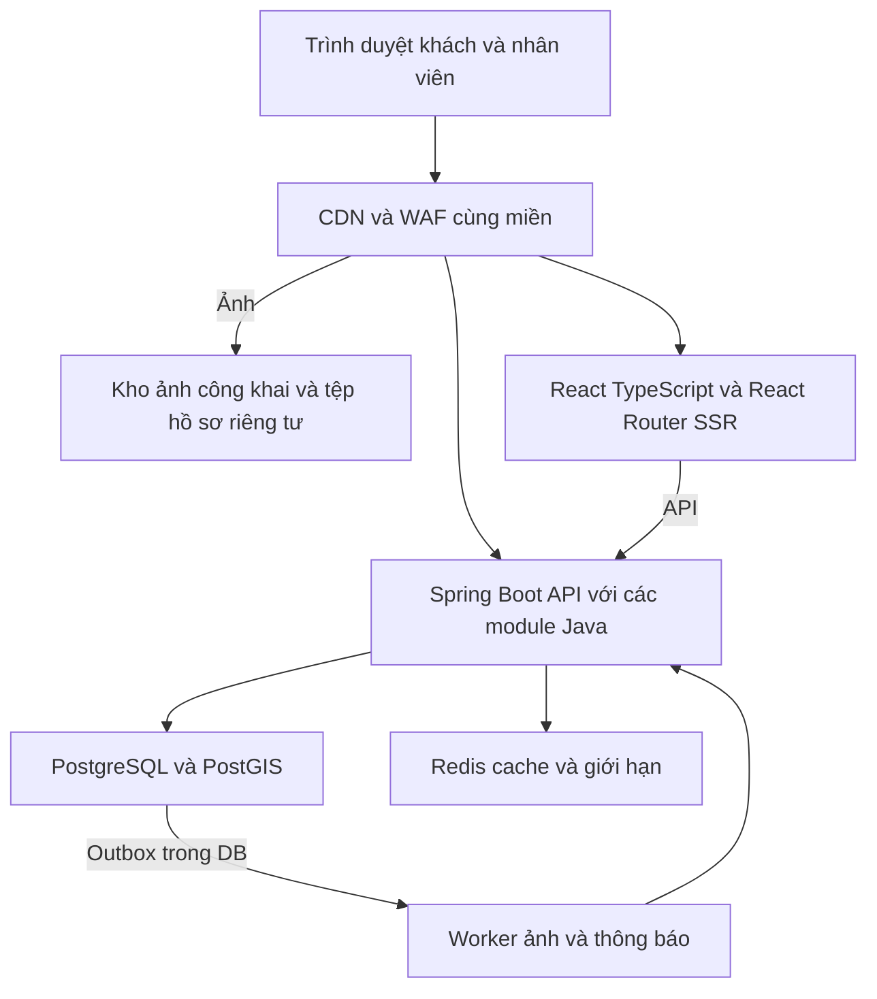
```mermaid
flowchart TD
    B["Trình duyệt khách và nhân viên"] --> E["CDN và WAF cùng miền"]
    E -->|Ảnh| O["Kho ảnh công khai và tệp hồ sơ riêng tư"]
    E --> F["React TypeScript và React Router SSR"]
    E --> A["Spring Boot API với các module Java"]
    F -->|API| A
    A --> D["PostgreSQL và PostGIS"]
    A --> R["Redis cache và giới hạn"]
    D -->|Outbox trong DB| W["Worker ảnh và thông báo"]
    W --> A
```

Sơ đồ luồng truy cập và thành phần triển khai đề xuất

### Ranh giới trách nhiệm

React xử lý giao diện, SSR và HTML công khai; Spring Boot xử lý API, phân quyền, trạng thái và lead. Module gồm IAM, Catalog, Listing, Media, Search, Moderation, Verification, Lead, Content, Privacy, Import và Audit. Worker Java nhận việc bền vững từ DB để xử lý ảnh, thông báo và hết hạn.

PostgreSQL là nguồn chuẩn; lead và outbox được ghi cùng giao dịch. Worker đọc outbox có khóa nhận việc và retry giới hạn; Redis phục vụ cache và rate limit. Ảnh công khai qua CDN; hồ sơ xác minh ở kho riêng. Phiên dùng Spring Session JDBC; API cùng miền áp dụng Spring Security và CSRF. [\[S30\]](https://docs.spring.io/spring-security/reference/servlet/exploits/csrf.html) [\[S33\]](https://docs.spring.io/spring-session/reference/configuration/jdbc.html)

### Quyết định kiến trúc cần ghi tại G2

ADR01 chọn module và ranh giới; ADR02 chọn cách search; ADR03 phiên và phân quyền; ADR04 media và vị trí riêng; ADR05 cache và gỡ tin; ADR06 nhà cung cấp và chi phí. Khóa các phiên bản được hỗ trợ tại G2, lưu lockfile và đánh giá lỗ hổng trước phát hành.

## 24. Thiết kế tích hợp và hạ tầng

| **Thành phần** | **Cấu hình khởi điểm để thử tải** | **Vai trò và giới hạn** |
| --- | --- | --- |
| Web và API | 2 instance tổng hợp, mỗi instance 4 vCPU và 8 GB RAM. | Sau bộ cân bằng tải; phiên không lưu riêng trong RAM của một instance. |
| DB | PostgreSQL 4 vCPU, 16 GB RAM, SSD; có standby hoặc dịch vụ tương đương. | Tách khỏi web; PostGIS; connection pool; bản sao lưu ở miền lỗi khác. |
| Redis và worker | Redis 2 GB; worker 2 vCPU, 4 GB RAM. | Giới hạn cache; worker nhận outbox từ PostgreSQL, retry và cảnh báo. |
| Ảnh và tệp | Object storage, CDN, versioning, private bucket. | Không lưu ảnh trên ổ của container; tính riêng biến thể và băng thông. |
| Staging | Môi trường tách tài khoản, secret và dữ liệu. | Cấu hình gần production khi thử tải; không dùng dữ liệu cá nhân thật. |

Các cấu hình trên là điểm bắt đầu cho phép đo, không bảo đảm đạt NFR01 hay số người đồng thời. Mục tiêu tải được mô tả bằng request/giây và hành vi; một triệu tài khoản đăng ký không tương đương một triệu người truy cập cùng lúc.

### Tích hợp bên ngoài

Chọn nhà cung cấp bản đồ có quyền hiển thị, điều khoản lưu tọa độ và giá phù hợp; không mặc định máy chủ tile công cộng là hạ tầng production miễn phí. Lớp Map adapter chuẩn hóa geocode, timeout, hạn mức và attribution. Nhà cung cấp OTP/SMS cần sandbox, hợp đồng xử lý dữ liệu, sender được phép và cơ chế đối soát gửi.

Tất cả tích hợp có timeout, giới hạn retry, circuit breaker và ghi metric không chứa PII. API lỗi bản đồ vẫn trả danh sách; SMS lỗi lưu trạng thái và cho người đăng xem lead trong hệ thống. Chỉ server nắm khóa bí mật; khóa bản đồ công khai phải có giới hạn miền và quota.

### Khi nào nâng cấp kiến trúc

Ưu tiên đo truy vấn chậm, thêm chỉ mục, tối ưu vùng nhìn và cache. Chỉ bổ sung công cụ tìm kiếm riêng khi PostgreSQL không đạt SLA sau tối ưu có bằng chứng. Tách dịch vụ hoặc điều phối container phức tạp cần lý do về vận hành và đội chịu trách nhiệm; bản cơ sở triển khai container đơn giản với IaC và CI/CD.

## 25. Mô hình dữ liệu logic

| **Thực thể** | **Trường định danh và quan hệ** | **Trách nhiệm** |
| --- | --- | --- |
| users và sessions | user\_id; session.user\_id → users. | Tài khoản, trạng thái và phiên có thể thu hồi. |
| roles và user\_roles | role\_id; user\_id và role\_id duy nhất. | Quyền hệ thống; thao tác còn phải kiểm tra sở hữu. |
| admin\_units và aliases | unit\_id, version; alias → một hoặc nhiều unit. | Địa chỉ có hiệu lực và tên lịch sử. |
| projects | project\_id; unit\_id; source\_id. | Dữ liệu dự án do quản trị quản lý. |
| listings | listing\_id; owner\_id; current\_revision; public\_revision. | Trạng thái và các tham chiếu phiên bản. |
| listing\_revisions | revision\_id; listing\_id; số revision duy nhất. | Snapshot nội dung, giá, địa chỉ và thuộc tính. |
| media và revision\_media | media\_id; owner\_id; revision\_id. | Tệp, trạng thái xử lý và quyền truy cập. |
| moderation\_decisions | decision\_id; revision\_id; reviewer\_id. | Quyết định duyệt có lý do và phiên bản. |
| verification\_checks | check\_id; listing\_id; revision\_id; evidence\_id. | Hạng mục, người kiểm tra và thời hạn nhãn. |
| leads và lead\_events | lead\_id; listing\_id; recipient\_id; consent\_id. | Nhu cầu khách và lịch sử xử lý. |
| favorites và saved\_searches | user\_id; listing\_id hoặc search\_id. | Sở thích và cấu trúc bộ lọc có version. |
| reports và case\_events | case\_id; listing\_id; reporter\_id tùy quyền. | Phản ánh, chứng cứ và khiếu nại. |
| articles và content\_revisions | article\_id; author\_id; approved\_revision. | Bài viết, chính sách và lịch sử xuất bản. |
| consents và privacy\_requests | consent\_id; subject\_id; policy\_version. | Căn cứ chia sẻ và yêu cầu dữ liệu. |
| sources và import\_jobs | source\_id; external\_id; job\_id; row\_id. | Nguồn được cấp quyền và đối soát nhập. |
| audit\_logs và outbox | event\_id; actor\_id; object\_id; published\_at. | Kiểm toán và phát sự kiện bền vững. |

Quan hệ cốt lõi: một người đăng có nhiều tin; một tin có nhiều revision nhưng tối đa một revision công khai; mỗi revision có nhiều ảnh và tối đa một quyết định duyệt qua case; một tin có nhiều lead, nhãn kiểm tra và phản ánh. Project là liên kết tùy chọn, không gộp nhiều tin thành một tài sản đã xác minh.

Phần UML từ [mục 43](#p043) cụ thể hóa các thực thể thành lớp phân tích, lớp Java, ERD và từ điển CSDL dùng chung. Schema và migration phải được duyệt tại G2, sau đó kiểm chứng trên PostgreSQL ở G3; thiết kế trong hồ sơ chưa phải bằng chứng đã chạy migration.

## 26. Từ điển dữ liệu và quy tắc toàn vẹn

| **Trường quan trọng** | **Kiểu đề xuất** | **Ràng buộc** |
| --- | --- | --- |
| purpose | enum SALE hoặc RENT | Bắt buộc; đổi nhu cầu tạo revision cần duyệt. |
| price\_mode | enum FIXED hoặc NEGOTIABLE | FIXED yêu cầu price\_vnd &gt; 0; NEGOTIABLE để giá null. |
| price\_vnd | bigint | VND nguyên; là tổng giá bán hoặc tiền thuê tháng, không trộn đơn vị. |
| area\_m2 | numeric 12,2 | Lớn hơn 0; diện tích có ý nghĩa rõ theo loại tài sản. |
| bedrooms và bathrooms | smallint nullable | Không âm; chưa cung cấp khác với 0. |
| unit\_id và unit\_version | UUID và version | Mã địa danh hợp lệ tại thời điểm nhập; giữ địa chỉ gốc. |
| private\_location | geography Point 4326 | Chỉ vai trò có quyền; không đưa vào payload công khai. |
| public\_location | geography Point 4326 | Điểm đã làm mờ; công khai kèm mức chính xác ước lượng. |
| status và revision\_no | enum và integer | Chuyển trạng thái có điều kiện; tăng revision; không ghi đè snapshot duyệt. |
| published\_at và expires\_at | timestamptz | UTC; thời hạn do server tính; không nhận trạng thái từ client. |
| contact\_phone | Giá trị mã hóa và chỉ mục băm | Chuẩn hóa; hạn chế giải mã; không đưa thẳng vào log hoặc phân tích. |
| idempotency\_key | varchar và request\_hash | Unique theo actor và endpoint; cùng khóa khác payload trả 409. |

### Các bất biến cần bảo vệ bằng DB và backend

- Tin công khai phải có public\_revision đã duyệt, ảnh READY, chủ tin hợp lệ và chưa hết hạn. Tạo lead đọc lại điều kiện trong giao dịch.

- Mỗi người dùng chỉ lưu một lần một tin; mỗi cặp nguồn và external\_id chỉ sinh một tin nguồn; không tự gộp tin của các chủ thể khác nhau.

- Duyệt dùng optimistic lock theo revision; sửa đồng thời phải báo xung đột. Unique constraint bảo vệ lead và khóa retry.

- Chỉ mục B-tree cho trạng thái, loại, địa bàn, giá; GiST cho vùng bản đồ; chỉ mục văn bản chuẩn hóa cho tìm tên. Kiểm tra EXPLAIN bằng dữ liệu thử tải.

Danh mục hành chính lấy từ nguồn chính thức và cập nhật theo văn bản có hiệu lực; Quyết định 19/2025/QĐ-TTg là nguồn khởi điểm tham khảo, cần kiểm tra sửa đổi tại lúc nhập. Tên cũ là alias có phiên bản, không bắt buộc cấu trúc quận hoặc huyện vào mọi địa chỉ mới. [\[S28\]](https://vanban.chinhphu.vn/?docid=214409&pageid=27160)

## 27. Danh mục giao diện API

Prefix API là /api/v1. Tài nguyên riêng yêu cầu phiên hợp lệ; cùng miền để đơn giản cookie và CSRF. Bảng là hợp đồng phạm vi, cần cụ thể hóa OpenAPI tại G2 gồm schema, ví dụ, lỗi, quyền, phân trang và hạn mức.

| **Phương thức và đường dẫn** | **Quyền** | **Kết quả chính** |
| --- | --- | --- |
| POST /auth/otp/request và /verify | Khách có hạn mức | Yêu cầu OTP; xác minh để tạo phiên. |
| POST /auth/logout | Đăng nhập | Thu hồi phiên; phản hồi 204. |
| GET hoặc PATCH /me | Chính chủ | Đọc và sửa hồ sơ theo trường được phép. |
| GET /catalog/locations | Công khai | Gợi ý địa chỉ có version và alias. |
| POST /listings | Người đăng | Tạo nháp, trả 201 và revision. |
| PATCH /listings/{id} | Chủ tin | Sửa với expected\_revision; trả 409 khi xung đột. |
| POST /listings/{id}/submit | Chủ tin | Kiểm tra và chuyển chờ duyệt. |
| POST /media/upload-intents | Người đăng | Cấp upload URL có hạn; xử lý hoàn tất riêng. |
| GET /listings và /listings/{id} | Công khai | Kết quả hoặc chi tiết chỉ từ bản công khai. |
| GET /listings/map | Công khai | Cụm hoặc điểm trong bbox đã giới hạn. |
| POST /listings/{id}/leads | Khách xác minh số | Tạo lead hoặc trả lead trùng theo chính sách. |
| GET /me/leads và PATCH /leads/{id} | Người nhận | Danh sách và trạng thái xử lý. |
| PUT hoặc DELETE /me/favorites/{id} | Chính chủ | Lưu hoặc bỏ lưu idempotent. |
| GET hoặc POST /me/saved-searches | Chính chủ | Bộ lọc đã lưu có schema version. |
| POST /reports | Khách có hạn mức | Tạo mã phản ánh; không công khai hồ sơ. |
| POST /admin/reviews/{id}/decision | Kiểm duyệt | Quyết định theo revision và quyền. |
| POST /admin/imports | Quản trị | Dry run, xác nhận nhập và báo cáo theo dòng. |
| POST /me/privacy-requests | Chính chủ | Ghi yêu cầu về dữ liệu và mã theo dõi. |

Các API quản trị dự án, CMS, người dùng, nhãn, audit, báo cáo và cấu hình tuân cùng nguyên tắc. Không xây API sửa status tùy ý; mỗi chuyển trạng thái đi qua hành động nghiệp vụ đã kiểm tra quyền.

## 28. Hợp đồng xử lý API trọng yếu

### Tạo khách liên hệ

POST /api/v1/listings/{id}/leads nhận contact\_name, verified\_contact\_token, message, purpose và consent\_version; header Idempotency-Key bắt buộc. Backend suy ra người nhận từ tin, không tin recipient\_id do client gửi. Ghi lead và outbox cùng giao dịch; phản hồi 201 gồm lead\_id, status và created\_at.

Retry cùng khóa và payload trong 24 giờ trả kết quả trước đó; cùng khóa khác payload trả 409. Cùng số, tin và mục đích trong 24 giờ trả 200 với deduplicated=true. Tin hết hạn hoặc vừa bị gỡ trả 409 LISTING\_UNAVAILABLE; không tạo hoặc chuyển lead. Không trả số người gửi trong lỗi.

### Duyệt tin

POST /api/v1/admin/reviews/{id}/decision nhận revision\_id, expected\_revision, expected\_version, decision, reason\_code, note và hạng mục kiểm tra. expected\_revision là số bản nội dung; expected\_version là khóa lạc quan của Listing. Kiểm tra quyền, không tự duyệt; ghi quyết định, public\_revision, audit và outbox cùng giao dịch.

Xung đột trả 409 REVISION\_CONFLICT kèm phiên bản mới được phép xem. Kết quả duyệt không tự xác nhận quyền sở hữu tài sản. Gỡ khẩn cấp được ghi DB trước; API chặn truy cập lập tức, cache công khai được purge và có TTL tối đa 60 giây để hạn chế nội dung cũ.

### Tìm kiếm theo vùng bản đồ

GET /api/v1/listings/map nhận bbox, zoom và bộ lọc đã chuẩn hóa; giới hạn độ lớn bbox, thời gian truy vấn và số điểm. API trả public\_location, precision và cluster\_count; không trả private\_location. Thu phóng quá rộng chỉ trả cụm; không tải toàn bộ tọa độ xuống client.

### Quy tắc dùng chung

| **Vấn đề** | **Hợp đồng** |
| --- | --- |
| Lỗi | error\_code, message, field\_errors nếu có và request\_id; không chứa stack hoặc secret. |
| Xác thực và quyền | 401 khi thiếu hoặc hết phiên; 403 khi thiếu quyền; tài nguyên riêng không được phép có thể trả 404 để hạn chế lộ tồn tại. |
| Giới hạn | 429 kèm Retry-After; timeout trả lỗi kiểm soát, không retry vô hạn. |
| Thời gian và số | Thời gian ISO 8601 UTC; số tiền lớn biểu diễn chuỗi thập phân trong JSON để tránh mất chính xác. |
| Phân trang | Cursor có sort và khóa phụ; kiểm tra filter hash; không tin cursor có thể sửa tự do. |

## 29. Kế hoạch kiểm thử

**Mục tiêu:** chứng minh phạm vi P0 đáp ứng SRS và không làm lộ dữ liệu, mất lead hoặc công khai tin chưa duyệt. QA quản lý ca kiểm thử có mã, dữ liệu, build, môi trường, bước, kết quả kỳ vọng, kết quả thực tế, bằng chứng và người thực hiện; cấu trúc tham chiếu tài liệu kiểm thử ISO/IEC/IEEE 29119-3. [\[S13\]](https://www.iso.org/standard/79429.html)

### Các mức và điều kiện bắt đầu

Unit kiểm tra giá, hạn tin, quyền, trạng thái và chuẩn hóa dữ liệu. Integration kiểm tra DB, outbox, tệp và adapter bên ngoài. System kiểm tra hành trình đầy đủ tại staging; bắt đầu khi G3 đạt, dữ liệu fixture sẵn sàng và smoke đạt. UAT do người nghiệp vụ thực hiện sau G4; không thay thế kiểm thử kỹ thuật.

### Bộ dữ liệu và tải chuẩn

Fixture gồm người đăng A và B, người dùng C, kiểm duyệt M, quản trị D; tin SALE và RENT ở các trạng thái, địa danh một và nhiều ánh xạ, ảnh lỗi, số đã xác minh, giấy tờ giả lập và tài khoản bị khóa. Không dùng hồ sơ hoặc số điện thoại thật ngoài nhóm được phép.

Tải chuẩn gồm 100.000 tin ACTIVE và 1 triệu lịch sử, thuộc nhiều khu vực, khoảng giá và loại; 10 ảnh/tin ở bộ dữ liệu metadata, bộ media thực đủ đại diện kích thước. Tải API: 60% tìm kiếm, 25% chi tiết, 10% bản đồ, 5% ghi; tăng tới 100 request/giây trong 10 phút và giữ 30 phút. OTP sandbox được mô phỏng ở bài tải API; kiểm thử tích hợp nhà cung cấp thực hiện riêng theo quota.

Dùng arrival rate để giữ nhịp yêu cầu; số virtual user được tự điều chỉnh theo thời gian đáp ứng. Tối thiểu một lượt cache nguội và một lượt cache ấm, báo cáo tách nhau; không chấp nhận kết quả chỉ đo cache-hit. Bài stress tăng tới 200 request/giây trong 10 phút để quan sát suy giảm, không phải cam kết tải vận hành.

### Đo giao diện và tiêu chí kết thúc

Lab dùng Chrome stable đã chốt, viewport 390 × 844, mạng 1,6 Mbps xuống, 750 Kbps lên, RTT 150 ms, CPU slowdown 4 lần; đo 5 lượt cache nguội/trang. Ngưỡng trước phát hành: trung vị LCP ≤2,5 giây và CLS ≤0,1 mỗi trang; lưu cấu hình và raw result.

G4 yêu cầu toàn bộ ca P0 đạt, FR và NFR có bằng chứng đúng thời điểm nghiệm thu, không còn lỗi Critical hoặc High và đã thử khôi phục. Với NFR02 và NFR03, G4 kiểm tra lab, khả năng chịu lỗi và thiết lập đo; Ops đánh giá RUM sau 28 ngày đủ mẫu và SLA sau tháng vận hành đầu tiên, lập việc khắc phục nếu chưa đạt.

Lỗi Medium hoặc Low chỉ chấp nhận khi không phá điều kiện P0, có người sở hữu và hạn sửa. Ghi Not run, Passed, Failed hoặc Blocked; không đánh Passed khi chưa chạy hoặc chưa đủ kỳ đo thực địa.

## 30. Ca kiểm thử tài khoản tin và tìm kiếm

Danh mục ca P0 dự kiến   •   Tất cả trạng thái hiện tại là Not run   •   Dùng fixture và quy tắc thực hiện [mục 29](#p029)

| **Mã** | **Dữ liệu và bước kiểm tra** | **Kết quả kỳ vọng** |
| --- | --- | --- |
| TC01 FR01 | Yêu cầu OTP; nhập sai 5 lần, dùng lại mã, chờ hết hạn và đăng nhập tài khoản khóa. | Không cấp phiên trái phép; giới hạn đúng; mã hợp lệ chỉ sử dụng một lần. |
| TC02 FR02 | A sửa tên; đổi số chưa xác minh; B gọi API sửa hồ sơ A. | Tên cập nhật; số chưa xác minh không hoạt động; B bị chặn. |
| TC03 FR03 | A dùng ID tin, lead và tệp của B; M gọi API cấp quyền. | Tất cả bị từ chối; không lộ payload riêng; audit ghi thao tác cần theo dõi. |
| TC04 FR04 | Tìm cùng địa điểm bằng tên cũ, mới, không dấu; thử alias ánh xạ nhiều nơi. | Kết quả tương ứng; trường hợp mơ hồ yêu cầu chọn; giữ địa chỉ gốc. |
| TC05 FR05 | Nhập tin hợp lệ; tải lại; bỏ giá FIXED; bấm tạo hai lần cùng khóa. | Dữ liệu đã lưu được giữ; thiếu giá báo đúng trường; chỉ một nháp được tạo. |
| TC06 FR06 | Tải 2 rồi 3 ảnh; tải 21 ảnh, tệp HTML đổi đuôi JPG và ảnh có EXIF GPS. | Chỉ gửi khi đủ ảnh; chặn tệp sai; không có GPS trong ảnh công khai. |
| TC07 FR07 | Gửi đủ dữ liệu hai lần cùng khóa; tự sửa status=ACTIVE. | Chỉ một revision chờ; tự xuất bản bị từ chối; người đăng thấy đúng trạng thái. |
| TC08 FR08 | M và D duyệt cùng revision; người đăng cập nhật revision trước khi duyệt. | Một quyết định thắng; yêu cầu stale nhận 409; không duyệt dữ liệu mới vô tình. |
| TC09 FR09 | Sửa giá và ảnh của tin ACTIVE rồi gửi; mở trang và API trước khi duyệt. | Bản công khai tạm ẩn; dữ liệu mới chưa lộ; nhãn liên quan hết hiệu lực. |
| TC10 FR10 | Đưa đồng hồ tới hạn 30 ngày; tìm, mở chi tiết, gửi lead và xin gia hạn. | Không còn trong tìm kiếm; trạng thái rõ; không tạo lead; gia hạn qua duyệt. |
| TC11 FR11 | Tổ hợp mua hoặc thuê, giá, diện tích, phòng; giá thỏa thuận bật và tắt. | Tập kết quả đúng fixture; không nới điều kiện hoặc lẫn mục đích. |
| TC12 FR12 | Giá bằng nhau, thêm tin giữa hai trang, quay lại URL và đổi sort. | Thứ tự khóa phụ ổn định theo hợp đồng cursor; giữ filter, không hiển thị tin hết hạn. |
| TC13 FR13 | Lọc cùng vùng; thử tọa độ riêng; kiểm tra HTML và JSON; gây lỗi map. | Chỉ vị trí công khai; danh sách khớp điều kiện và dùng được khi bản đồ lỗi. |
| TC14 FR14 | Mở tin hoạt động, hết hạn, bị gỡ; thử các trường thiếu và nhãn hết hạn. | Dữ liệu, đơn vị, tình trạng và nhãn đúng; tin bị gỡ không lộ nội dung. |
| TC15 FR15 | A lưu hai lần, bỏ lưu; B truy cập; tin lưu sau đó bị gỡ riêng tư. | Không trùng; B bị chặn; nội dung tin gỡ không tiếp tục hiển thị. |
| TC16 FR16 | Lưu và mở bộ lọc; vượt 20; thay phiên bản địa danh thành ánh xạ nhiều nơi. | Khôi phục chính xác; chặn vượt hạn; yêu cầu chọn lại nơi mơ hồ. |

## 31. Ca kiểm thử liên hệ quản trị và dữ liệu

Danh mục ca P0 dự kiến   •   Tất cả trạng thái hiện tại là Not run   •   Dùng fixture và quy tắc thực hiện [mục 29](#p029)

| **Mã** | **Dữ liệu và bước kiểm tra** | **Kết quả kỳ vọng** |
| --- | --- | --- |
| TC17 FR17 | Thêm 3 rồi 4 tin; trộn SALE với RENT; dùng tin thiếu giá hoặc diện tích. | Chặn trường hợp sai; nhãn thiếu rõ; không tạo giá trên mét vuông giả. |
| TC18 FR18 | Gửi hợp lệ, retry, cùng khóa khác payload; tin bị gỡ ngay lúc gửi. | Một lead khi hợp lệ; 409 khi khóa sai hoặc tin không còn; người nhận từ server. |
| TC19 FR19 | A đọc và cập nhật lead của A; B truy cập; đóng không có lý do. | Đúng chủ mới được xem; chặn B; bắt buộc lý do khi đóng. |
| TC20 FR20 | Cho nhà cung cấp trả lỗi rồi phục hồi; chạy lại worker cùng event. | Lead vẫn tồn tại; gửi lại có giới hạn; không thông báo trùng cùng event. |
| TC21 FR21 | Gửi phản ánh, spam, xem danh tính người báo bằng tài khoản bị báo. | Có mã vụ việc; chặn spam; không lộ người báo; quyết định có người và lý do. |
| TC22 FR22 | Chỉ xác minh OTP; kiểm tra ảnh có hạn; sửa nội dung hoặc qua ngày hết hạn. | Không gán pháp lý từ OTP; đúng nhãn, phạm vi và ngày; nhãn cũ bị thu hồi. |
| TC23 FR23 | Hai tin tương tự từ fixture và hai tin khác cùng tòa nhà. | Có tín hiệu giải thích; không tự xóa cả hai; nhân viên chốt kết quả. |
| TC24 FR24 | Biên tập tạo và cố xuất bản; chèn script; sửa bài đã duyệt. | Chặn vượt quyền; script bị loại; bản sửa chưa duyệt không công khai. |
| TC25 FR25 | Tạo dự án có nguồn, liên kết tin; thử tự sửa pháp lý bằng người đăng. | Nguồn và ngày có trên trang; người đăng không thay trường quản trị. |
| TC26 FR26 | Crawl HTML, canonical, sitemap, URL cũ, trang riêng và trang gỡ. | Chỉ URL đủ điều kiện index; redirect đúng; không có nội dung riêng trong sitemap. |
| TC27 FR27 | D khóa A; dùng phiên A đang mở; gọi cấu hình bằng M. | Phiên A không dùng được; xử lý tin đúng quyết định; M không sửa cấu hình vượt quyền. |
| TC28 FR28 | Duyệt, sửa quyền và xuất dữ liệu; thử sửa log; quét OTP trong log. | Có chuỗi sự kiện đủ dữ liệu; API không sửa log; không có OTP hoặc secret. |
| TC29 FR29 | Phát sinh view, click gọi và lead với event\_id biết trước; gửi trùng event. | Số liệu khớp định nghĩa; ba loại tách riêng; sự kiện trùng không nhân đôi. |
| TC30 FR30 | Nạp tệp có dòng đúng, sai và trùng; dry run; chạy lại source/external\_id. | Báo cáo theo dòng; dry run không ghi; chạy lại không tạo tin trùng; tin cần duyệt. |
| TC31 FR31 | Gửi yêu cầu xóa, rút marketing; thử impersonation và dữ liệu có legal hold. | Xác minh chủ thể; dừng marketing; xử lý giữ hoặc xóa đúng chính sách và có phản hồi. |
| TC32 FR32 | Mở các trang chính sách trên mobile; gửi form trước và sau đổi version. | Liên kết hoạt động; lưu đúng bản có hiệu lực; phiên bản cũ truy xuất được. |

## 32. Ca kiểm thử các yêu cầu chất lượng

Tất cả trạng thái hiện tại là Not run. QA lưu raw result, cấu hình và báo cáo; kiểm tra tính hợp lệ của phép đo trước khi kết luận đạt.

| **Mã** | **Thực hiện** | **Kết quả kỳ vọng** |
| --- | --- | --- |
| TC33 NFR01 | Chạy load theo [mục 29](#p029), cache nguội và ấm; đối soát số lead. | Đạt mọi ngưỡng NFR01; lưu p95 từng nhóm API và tỷ lệ lỗi. |
| TC34 NFR02 | Đo 5 lượt lab mỗi trang; bật RUM mobile và desktop. | Lab đạt ngưỡng [mục 29](#p029); RUM theo dõi p75 khi đủ mẫu, không giả lập kết quả thực địa. |
| TC35 NFR03 | Dừng một instance; gây lỗi phụ thuộc; kiểm tra probe và cảnh báo. | Chuyển lưu lượng đúng, cảnh báo trong 5 phút; có cách tính SLA tháng. |
| TC36 NFR04 | Khôi phục DB vào máy sạch tại mốc chọn trước; khôi phục ảnh đã xóa. | Đạt RPO và RTO, đối soát tin và lead, có bằng chứng media. |
| TC37 NFR05 | Kiểm tra IDOR, XSS, SQL injection, CSRF, OTP, upload và quyền quản trị. | Không còn Critical hoặc High; checklist ASVS áp dụng có kết quả và lý do loại trừ. |
| TC38 NFR06 | Tìm PII trong URL, log, analytics và cache; chạy yêu cầu quyền dữ liệu. | Không lộ; rút đồng ý và retention đúng; dữ liệu riêng được phân quyền. |
| TC39 NFR07 | Dùng bàn phím, screen reader và kiểm tra tương phản ở luồng P0. | Đạt tiêu chí WCAG AA thuộc phạm vi; tìm và gửi lead được không dùng chuột. |
| TC40 NFR08 | Chạy ma trận thiết bị, browser, độ rộng, xoay và zoom 200%. | Không mất thao tác, che trường hay tràn bố cục ngoài thiết kế. |
| TC41 NFR09 | Gửi đồng thời hai duyệt, hai lead và hai import; mô phỏng timeout. | Không mất hoặc trùng; revision chính xác; gỡ cache trong 60 giây. |
| TC42 NFR10 | Build ở CI sạch; chạy migration trên bản sao; đổi theme và dictionary. | Build tái lập; hợp đồng API và tài liệu khớp; thay đổi không cần sửa từng trang. |
| TC43 NFR11 | Vượt quota map, ảnh, OTP và tăng tải stress; kiểm tra cảnh báo chi phí. | 429 hoặc lỗi có kiểm soát; không mất dữ liệu; có cảnh báo ở các ngưỡng. |
| TC44 NFR12 | Qua nửa đêm Việt Nam, hết hạn, số tiền lớn và địa danh mơ hồ. | UTC lưu đúng; hiển thị và báo cáo đúng ngày; tiền không sai số; yêu cầu chọn khi mơ hồ. |

Đo hiệu năng trong hồ sơ này mới là kế hoạch. Kết quả dự án chỉ được cập nhật sau khi có hệ thống, dữ liệu và điều kiện đo thực tế; không lấy cấu hình máy hoặc số virtual user làm bằng chứng thay thế.

## 33. Ma trận truy vết yêu cầu chức năng phần một

Mỗi yêu cầu P0 có nguồn BR, tình huống sử dụng, module thiết kế và ca kiểm thử. Khi thực hiện, bổ sung liên kết thiết kế cụ thể, PR hoặc commit, build, kết quả và bằng chứng; trạng thái ban đầu là Proposed và Not run.

| **Yêu cầu** | **Nguồn** | **Luồng** | **Module** | **Ca kiểm thử** |
| --- | --- | --- | --- | --- |
| FR01 | BR06 | UC01 | IAM | TC01 |
| FR02 | BR02 | UC01 | IAM | TC02 |
| FR03 | BR06 | UC01 | IAM | TC03 |
| FR04 | BR01 | UC02 | Catalog | TC04 |
| FR05 | BR02 | UC02 | Listing | TC05 |
| FR06 | BR02 | UC02 | Media | TC06 |
| FR07 | BR04 | UC02 | Listing | TC07 |
| FR08 | BR04 | UC03 | Moderation | TC08 |
| FR09 | BR02 | UC03 | Listing | TC09 |
| FR10 | BR02 | UC03 | Listing | TC10 |
| FR11 | BR01 | UC04 | Search | TC11 |
| FR12 | BR01 | UC04 | Search | TC12 |
| FR13 | BR01 | UC04 | Search | TC13 |
| FR14 | BR01 | UC04 | Listing | TC14 |
| FR15 | BR01 | UC05 | Engagement | TC15 |
| FR16 | BR01 | UC05 | Engagement | TC16 |

### Quy tắc duy trì ma trận

BA sở hữu mã yêu cầu; TL sở hữu ánh xạ thiết kế và mã; QA sở hữu ca test và kết quả. Mã không được tái sử dụng cho nghĩa khác. Khi yêu cầu bị loại, giữ bản ghi trạng thái Retired và CR cho phép loại để tránh mất dấu vết.

Tại G1, tất cả FR phải có nguồn và tiêu chí chấp nhận. Tại G2, mọi FR phải có vị trí trong thiết kế. Tại G3 có phần hiện thực. Tại G4 phải có kết quả kiểm thử và evidence tương ứng.

## 34. Ma trận truy vết yêu cầu chức năng phần hai

Mỗi yêu cầu P0 có nguồn BR, tình huống sử dụng, module thiết kế và ca kiểm thử. Khi thực hiện, bổ sung liên kết thiết kế cụ thể, PR hoặc commit, build, kết quả và bằng chứng; trạng thái ban đầu là Proposed và Not run.

| **Yêu cầu** | **Nguồn** | **Luồng** | **Module** | **Ca kiểm thử** |
| --- | --- | --- | --- | --- |
| FR17 | BR01 | UC05 | Engagement | TC17 |
| FR18 | BR03 | UC06 | Lead | TC18 |
| FR19 | BR03 | UC06 | Lead | TC19 |
| FR20 | BR03 | UC06 | Notification | TC20 |
| FR21 | BR04 | UC07 | Moderation | TC21 |
| FR22 | BR02 | UC03 | Verification | TC22 |
| FR23 | BR04 | UC07 | Moderation | TC23 |
| FR24 | BR05 | UC08 | Content | TC24 |
| FR25 | BR01 | UC08 | Content | TC25 |
| FR26 | BR05 | UC08 | Content | TC26 |
| FR27 | BR04 | UC07 | Admin | TC27 |
| FR28 | BR06 | UC07 | Audit | TC28 |
| FR29 | BR05 | UC08 | Analytics | TC29 |
| FR30 | BR05 | UC08 | Import | TC30 |
| FR31 | BR06 | UC01 | Privacy | TC31 |
| FR32 | BR06 | UC08 | Content | TC32 |

### Quy tắc duy trì ma trận

Một TC trong bảng là nhóm kiểm tra tối thiểu cho yêu cầu, gồm các biến thể dữ liệu và phủ định ghi tại [mục 30](#p030) hoặc 31. QA tách thành TCxx-01, TCxx-02 khi thực hiện, vẫn giữ liên kết với TC gốc. Không hiểu một hàng là chỉ thử một happy path.

Thay đổi nguồn BR hoặc SRS phải rà lại các hàng liên quan, cập nhật thiết kế, mã, ca test và nội dung UAT; chỉ được đóng CR khi toàn bộ liên kết chịu tác động đã được kiểm tra lại.

## 35. Truy vết chất lượng và nghiệm thu người dùng

| **Yêu cầu** | **Nguồn** | **Thiết kế** | **Ca kiểm thử** |
| --- | --- | --- | --- |
| NFR01 Hiệu năng API | BR06 | Performance | TC33 |
| NFR02 Trải nghiệm tải trang | BR01 | Web | TC34 |
| NFR03 Khả dụng và giám sát | BR06 | Ops | TC35 |
| NFR04 Sao lưu và khôi phục | BR06 | Ops | TC36 |
| NFR05 Bảo mật ứng dụng | BR06 | Security | TC37 |
| NFR06 Riêng tư và vòng đời dữ liệu | BR06 | Privacy | TC38 |
| NFR07 Khả năng tiếp cận | BR01 | Web | TC39 |
| NFR08 Thiết bị và trình duyệt | BR01 | Web | TC40 |
| NFR09 Toàn vẹn và nhất quán | BR06 | Data | TC41 |
| NFR10 Dễ bảo trì và phát hành | BR06 | Engineering | TC42 |
| NFR11 Giới hạn và khả năng mở rộng | BR06 | Ops | TC43 |
| NFR12 Thời gian và địa chỉ | BR01 | Catalog | TC44 |

### Kịch bản UAT tối thiểu

| **Mã** | **Người thực hiện** | **Nghiệm thu theo nghiệp vụ** |
| --- | --- | --- |
| UAT01 | Người tìm | Tìm mua hoặc thuê đúng khu vực và ngân sách; so sánh; lưu và mở lại. |
| UAT02 | Người đăng | Tạo tin, nhận yêu cầu bổ sung, sửa, được duyệt và nhìn đúng trạng thái. |
| UAT03 | Người tìm và người đăng | Gửi liên hệ có đồng ý; người đăng nhận đúng, cập nhật và đối soát báo cáo. |
| UAT04 | Kiểm duyệt | Kiểm tra nhãn, báo xấu, gỡ tin và xử lý khiếu nại theo quy chế. |
| UAT05 | Quản trị và vận hành | Nhập dữ liệu, duyệt nội dung, khóa tài khoản, xử lý quyền dữ liệu và xem audit. |

Mỗi kịch bản dùng người đại diện được chủ đầu tư chỉ định, dữ liệu tương tự vận hành và build dự kiến phát hành. Biên bản ghi kết quả từng bước, vấn đề, mức độ, người xử lý và chữ ký; không thay bằng nhận xét chung giao diện đẹp hoặc chạy ổn.

G5 chỉ đạt khi toàn bộ UAT P0 Passed, SRS có truy vết đầy đủ, đội vận hành đã được đào tạo và không còn điều kiện pháp lý hoặc dữ liệu bắt buộc chưa đáp ứng. Tính năng ngoài phạm vi được ghi CR, không tự thêm vào biên bản lỗi.

## 36. Kế hoạch phát hành và xử lý sự cố

| **Thời điểm** | **Công việc** | **Bằng chứng hoặc điều kiện dừng** |
| --- | --- | --- |
| Trước 5 ngày | Khóa build; kiểm tra domain, TLS, secret, backup và giám sát. | Release manifest, image digest, migration và checklist có người ký. |
| Trước 2 ngày | Diễn tập triển khai và khôi phục trên staging; chốt dữ liệu đầu kỳ. | Kết quả restore, test import và đối soát 500 tin hợp lệ. |
| Trước 1 ngày | Chốt ca trực, kênh liên hệ, chính sách, thông báo và quyền quản trị. | Pháp chế và nghiệp vụ xác nhận; chỉ cấp quyền tối thiểu. |
| Giờ phát hành | Backup; chạy migration tương thích; đưa bản mới lên ít lưu lượng rồi tăng. | Health và smoke đạt; theo dõi lỗi, p95 và số lead. |
| Sau phát hành | Smoke UC02, UC04, UC06, UC07; kiểm tra sitemap và OTP. | Không có lead thất lạc, tin chưa duyệt lộ hoặc tệp riêng truy cập được. |
| Tuần ổn định | Đối soát hằng ngày; xử lý sự cố; bàn giao trực vận hành. | G7 sau 7 ngày theo dõi và xử lý hết sự cố nghiêm trọng. |

### Khi nào quay lại bản cũ

Dừng tăng lưu lượng nếu 5xx vượt 2% trong 5 phút, p95 cao hơn hai lần ngưỡng NFR01 trong 10 phút, phát hiện mất hoặc chia nhầm lead, tin chưa duyệt bị lộ hoặc tệp riêng truy cập công khai. TL quyết định kỹ thuật, PM thông tin chủ đầu tư; sự cố dữ liệu hoặc bảo mật kích hoạt quy trình chuyên trách.

Rollback ứng dụng về image digest trước, giữ DB khi migration tương thích ngược. Dùng chiến lược expand rồi contract; chưa xóa cột ở cùng đợt phát hành. Không phục hồi snapshot DB một cách tự động vì có thể làm mất lead mới; nếu dữ liệu hỏng phải chặn ghi phù hợp, xác định mốc và đối soát trước khi restore.

### Runbook sự cố lead không đến

1. Kiểm tra API đã trả mã lead chưa. 2. Đối chiếu DB và outbox. 3. Kiểm tra queue, dead letter và nhà cung cấp. 4. Phát lại sự kiện idempotent đã được xác nhận. 5. Đối soát số lead với thông báo và người nhận. 6. Ghi nguyên nhân, thời gian ảnh hưởng và biện pháp ngăn lặp. Không yêu cầu khách gửi lại hàng loạt khi chưa đối soát.

## 37. Vận hành dữ liệu và phát triển nguồn cung

### Chuẩn bị nguồn tin trước khi mở công khai

Chủ đầu tư chọn nhóm đối tác trong địa bàn đã chốt, ký hoặc xác nhận quyền sử dụng tin, ảnh và liên hệ. Mục tiêu đề xuất là 500 tin còn hiệu lực từ ít nhất 30 người đăng; kiểm tra ngẫu nhiên 50 tin về giá, còn hàng, ảnh và địa chỉ trước mở. Tin thiếu dữ liệu hoặc quyền sử dụng phải được bổ sung trước nhập.

Không xây cơ sở dữ liệu bằng sao chép hàng loạt ảnh, số điện thoại hoặc nội dung đối thủ. Dữ liệu demo là giả lập và phải được loại bỏ trước production. Nguồn đối tác có source\_id, external\_id, thời điểm cập nhật và người chịu trách nhiệm; import luôn có dry run và đối soát.

### Nhịp vận hành

| **Tần suất** | **Đầu việc** | **Chủ trì** |
| --- | --- | --- |
| Trong ngày làm việc | Duyệt tin; xử lý báo xấu khẩn; theo dõi lead, hàng đợi và OTP. | Kiểm duyệt và hỗ trợ |
| Hằng ngày | Tin sắp hết hạn; đối soát import; lỗi 5xx; backup và chi phí bất thường. | Ops |
| Hằng tuần | Lấy mẫu chất lượng tin; báo cáo funnel; rà tài khoản lạm dụng và nợ lỗi. | PM sản phẩm |
| Hằng tháng | Khôi phục mẫu; quyền truy cập; dependency và chi phí từng dịch vụ. | TL và Ops |
| Theo yêu cầu | Xử lý quyền dữ liệu; yêu cầu cơ quan quản lý; cập nhật địa danh. | Đầu mối dữ liệu và pháp chế |

### Chính sách lưu trữ cần phê duyệt

Đề xuất nội bộ để pháp chế chốt trước G1: OTP tối đa 5 phút; khóa idempotency 24 giờ; log kỹ thuật 30 ngày; audit 12 tháng; lead đóng 12 tháng; tệp chứng cứ 90 ngày sau khi kết thúc kiểm tra hoặc tranh chấp. Thời hạn bắt buộc theo luật, hợp đồng hoặc legal hold được ưu tiên; đây không phải các thời hạn luật định mặc định.

Hết hạn lưu không chỉ xóa DB: phải xử lý bản sao, search index, cache và kho tệp; backup theo lịch hết hạn được duyệt. Giảm quyền xem lead theo nhiệm vụ và ghi audit khi truy cập hoặc xuất dữ liệu. Theo dõi riêng yêu cầu xóa còn chờ vì nghĩa vụ lưu giữ.

### Kế hoạch 90 ngày sau phát hành

Tháng 1 tập trung chất lượng và lỗi hành trình; tháng 2 cải thiện trang khu vực có nhu cầu thật và chăm sóc người đăng; tháng 3 đánh giá tỷ lệ quay lại, lead hợp lệ, chi phí/lead và thử nghiệm khả năng thu phí. Chỉ duyệt P1 khi có số liệu từ cohort người đăng và năng lực vận hành đáp ứng.

## 38. Rủi ro và kiểm soát thay đổi

| **Mã và rủi ro** | **Mức ưu tiên** | **Ứng phó và người sở hữu** |
| --- | --- | --- |
| R01 Không đủ nguồn tin | Cao | Chốt đối tác tại G0; pilot địa bàn nhỏ; chủ đầu tư chịu trách nhiệm. |
| R02 Tin sai hoặc hết hàng | Cao | Duyệt, làm mới có xác nhận, báo xấu và nhãn theo hạng mục; vận hành. |
| R03 Thay đổi phạm vi muộn | Cao | Đóng baseline và dùng CR; PM không cho thêm việc ngoài lịch. |
| R04 Chậm thủ tục hoặc phân loại sai | Cao | Kết luận mô hình tại G1, theo dõi phụ thuộc ngoài; pháp chế. |
| R05 Địa chỉ sai sau sáp nhập | Cao | Danh mục có version, alias và xử lý mơ hồ; BA và dữ liệu. |
| R06 Lộ lead hoặc hồ sơ | Cao | Phân quyền bản ghi, kho riêng, log truy cập và test đối kháng; TL. |
| R07 Chi phí map hoặc OTP tăng | Vừa | Quota, adapter, ngân sách và chống abuse; DevOps. |
| R08 Không đạt tải | Cao | Dữ liệu đại diện, thử tải, tối ưu query và đo lại; TL và QA. |
| R09 Thiếu người ở đường găng | Cao | Lịch nhân sự và người thay thế; cắt phạm vi qua CR; PM. |
| R10 Truy cập có nhưng ít lead | Vừa | Đo funnel và chất lượng nguồn; phỏng vấn, không thêm tính năng tùy tiện; sản phẩm. |

### Quy trình đề nghị thay đổi

1. Người đề nghị tạo CR với lý do và mã yêu cầu bị ảnh hưởng. 2. BA phân loại lỗi so với baseline hoặc yêu cầu mới. 3. TL, QA và PM ước tính tác động thiết kế, dữ liệu, test, giờ, lịch, ngân sách và vận hành. 4. Hội đồng thay đổi gồm chủ đầu tư, PM và TL quyết định; pháp chế tham gia khi liên quan. 5. Cập nhật baseline, RTM, WBS và kế hoạch test. 6. Thực hiện, kiểm tra hồi quy và đóng CR bằng bằng chứng.

Thay đổi ảnh hưởng quyền riêng tư, trạng thái tin, thanh toán hoặc dữ liệu phải duyệt lại G1 và G2 liên quan. Sửa lỗi để khớp SRS không được tự tính thành chức năng mới; vẫn cần kiểm tra hồi quy và ghi lịch sử bản phát hành.

### Ví dụ CR có thể lập

CR001 thêm thanh toán gói đăng tin sau G1: phải xác định loại phí, cổng, hóa đơn, hoàn phí, webhook chống lặp, đối soát, quyền hủy và điều kiện quảng cáo. Chỉ sau phân tích tác động mới bổ sung vào lịch; phiên bản cơ sở hiện tại chưa bao gồm chức năng này.

## 39. Biểu mẫu phê duyệt và danh mục bàn giao

### Biên bản phê duyệt cổng

Mã biên bản: \_\_\_\_\_\_\_\_\_\_   Cổng G: \_\_\_\_   Ngày: \_\_\_\_\_\_\_\_\_\_
Tên và phiên bản đầu ra: \_\_\_\_\_\_\_\_\_\_\_\_\_\_\_\_\_\_\_\_\_\_\_\_\_\_\_\_\_\_\_\_\_\_
Người trình: \_\_\_\_\_\_\_\_\_\_\_\_\_\_\_\_\_\_   Người phê duyệt: \_\_\_\_\_\_\_\_\_\_\_\_\_\_\_\_\_\_

Kết quả: Đạt / Chưa đạt. Bằng chứng kiểm tra: \_\_\_\_\_\_\_\_\_\_\_\_\_\_\_\_\_\_
Điểm còn mở và hạn xử lý: \_\_\_\_\_\_\_\_\_\_\_\_\_\_\_\_\_\_\_\_\_\_\_\_\_\_\_\_\_\_\_\_\_\_
Tác động đến cổng tiếp theo: \_\_\_\_\_\_\_\_\_\_\_\_\_\_\_\_\_\_\_\_\_\_\_\_\_\_\_\_\_\_\_\_
Chữ ký xác nhận và ngày: \_\_\_\_\_\_\_\_\_\_\_\_\_\_\_\_\_\_\_\_\_\_\_\_\_\_\_\_\_\_\_\_\_\_

### Phiếu thay đổi

Mã CR: \_\_\_\_\_\_   Người đề nghị: \_\_\_\_\_\_   Ngày: \_\_\_\_\_\_
Vấn đề và kết quả mong muốn: \_\_\_\_\_\_\_\_\_\_\_\_\_\_\_\_\_\_\_\_\_\_\_\_\_\_\_\_\_\_
BR / FR / NFR / thiết kế / TC bị ảnh hưởng: \_\_\_\_\_\_\_\_\_\_\_\_\_\_\_\_\_\_\_\_\_
Phương án và tác động giờ, chi phí, lịch, dữ liệu: \_\_\_\_\_\_\_\_\_\_\_\_\_\_\_\_\_
Quyết định cùng người duyệt: \_\_\_\_\_\_\_\_\_\_\_\_\_\_\_\_\_\_\_\_\_\_\_\_\_\_\_\_\_\_\_\_
Phiên bản mới và bằng chứng đóng: \_\_\_\_\_\_\_\_\_\_\_\_\_\_\_\_\_\_\_\_\_\_\_\_\_\_

### Danh mục phải có khi bàn giao

| **Hồ sơ** | **Người chịu trách nhiệm** | **Điều kiện hoàn tất** |
| --- | --- | --- |
| Charter, BRD, SRS và RTM | PM và BA | Đúng phiên bản đã duyệt; không mất mã yêu cầu. |
| UX, HLD, LLD, ERD và OpenAPI | UX và TL | Khớp bản triển khai; có ADR và quy tắc dữ liệu. |
| Mã nguồn và CI/CD | TL | Chủ đầu tư có quyền kho; dựng được từ môi trường sạch. |
| Test, UAT và release record | QA và PM | Có build, kết quả, evidence và tồn đọng được chấp nhận. |
| Hạ tầng và tài khoản dịch vụ | DevOps | Quyền sở hữu rõ; secret bàn giao qua kênh an toàn. |
| Dữ liệu và quyền sử dụng | Đầu mối dữ liệu | Nguồn, hợp đồng, đối soát và lịch cập nhật. |
| Runbook và đào tạo | Ops | Thử khôi phục, trực sự cố, quy trình kiểm duyệt và xử lý dữ liệu. |
| Chính sách và xác nhận pháp lý | Chủ đầu tư và pháp chế | Hoàn thành các điều kiện áp dụng trước mở công khai. |

Các biểu mẫu trên để điền trong quá trình dự án, không thể hiện bất kỳ phê duyệt hoặc kết quả nghiệm thu nào đã diễn ra. Hồ sơ kiểm thử cuối phải có kết quả thực tế, không chỉ danh mục TC trong bản kế hoạch.

## 40. Nguồn tham khảo thị trường và tiêu chuẩn

Ngày truy cập nguồn công khai 09/09/2026. Bấm tên nguồn để mở tài liệu. Các nguồn website xác nhận chức năng công bố; các đề xuất triển khai trong hồ sơ là phương án của dự án.

[S01 Similarweb xếp hạng website BĐS tại Việt Nam tháng 8 năm 2026](https://www.similarweb.com/top-websites/vietnam/business-and-consumer-services/real-estate/)

Thứ hạng truy cập ước tính; trang ghi cập nhật ngày 01/09/2026.

[S02 Batdongsan.com.vn trang chủ](https://batdongsan.com.vn/)

Danh mục, dự án, tin lưu, công cụ và tìm theo địa chỉ mới.

[S03 Batdongsan.com.vn giới thiệu Tin xác thực](https://tinxacthuc.batdongsan.com.vn/)

Mô tả phạm vi kiểm tra tin; số liệu hiệu quả là tự công bố.

[S04 Batdongsan.com.vn giới thiệu tìm kiếm trên bản đồ](https://wiki.batdongsan.com.vn/tin-tuc/ra-mat-ban-do-nha-dat-828619)

Bài giới thiệu tính năng cập nhật ngày 12/02/2025.

[S05 Nhà Tốt trang chủ](https://www.nhatot.com/)

Mua bán, cho thuê, tham khảo giá và dịch vụ cho môi giới.

[S06 Guland trang chủ](https://guland.vn/)

Bản đồ quy hoạch, giá, nhà thuê và tra cứu địa điểm.

[S07 CafeLand trang chủ](https://cafeland.vn/)

Cấu trúc nội dung thị trường, dự án, quy hoạch và nhà đất.

[S08 Alonhadat trang chủ](https://alonhadat.com.vn/)

Bộ lọc nhiều thuộc tính, danh mục và hồ sơ môi giới.

[S09 OneHousing trang chủ](https://onehousing.vn/)

Hành trình mua bán, ký gửi, so sánh và định giá.

[S10 Mogi trang chủ](https://mogi.vn/)

Tìm kiếm đã lưu, tiện ích theo khu vực và tra cứu sáp nhập.

[S11 ISO IEC IEEE 29148 phiên bản 2018](https://www.iso.org/standard/72089.html)

Tham chiếu kỹ nghệ yêu cầu; trang ISO xác nhận phiên bản hiện hành.

[S12 ISO IEC IEEE 12207 phiên bản 2026](https://www.iso.org/standard/90219.html)

Khung quy trình vòng đời phần mềm; tiêu chuẩn không bắt buộc Waterfall.

[S13 ISO IEC IEEE 29119 phần 3 phiên bản 2021](https://www.iso.org/standard/79429.html)

Tham chiếu cấu trúc tài liệu kiểm thử.

[S14 OWASP Application Security Verification Standard](https://owasp.org/www-project-application-security-verification-standard/)

Bản ổn định được trang dự án công bố là 5.0.0.

## 41. Nguồn tham khảo kỹ thuật và pháp lý

Ngày truy cập nguồn công khai 09/09/2026. Bấm tên nguồn để mở tài liệu. Các nguồn website xác nhận chức năng công bố; các đề xuất triển khai trong hồ sơ là phương án của dự án.

[S15 W3C Web Content Accessibility Guidelines 2.2](https://www.w3.org/TR/WCAG22/)

Cơ sở lựa chọn mục tiêu tiếp cận mức AA cho giao diện.

[S16 Google Web Vitals](https://web.dev/articles/vitals)

Ngưỡng LCP, INP, CLS và cách đánh giá phân vị 75.

[S17 Google quản lý URL của bộ lọc](https://developers.google.com/crawling/docs/faceted-navigation)

Ngăn không gian URL bộ lọc tăng vô hạn và lãng phí lượt thu thập.

[S18 React Router Rendering Strategies](https://reactrouter.com/start/framework/rendering)

React TypeScript với Framework Mode hỗ trợ SSR và dựng sẵn trang; cập nhật 10/09/2026.

[S19 Spring Boot documentation](https://spring.io/projects/spring-boot/)

Backend Java Spring Boot; cập nhật lựa chọn công nghệ theo yêu cầu ngày 10/09/2026.

[S20 PostGIS documentation](https://postgis.net/documentation/)

Tài liệu truy vấn dữ liệu không gian trên PostgreSQL.

[S21 Tailwind CSS Theme variables](https://tailwindcss.com/docs/theme)

Tập trung màu, chữ, khoảng cách và các token giao diện.

[S22 daisyUI Themes documentation](https://daisyui.com/docs/themes/?lang=en)

Tạo theme riêng và tái sử dụng thành phần giao diện.

[S23 Luật Thương mại điện tử số 122 năm 2025 QH15](https://vanban.chinhphu.vn/?classid=1&docid=216503&orggroupid=1&pageid=27160)

Khung pháp lý TMĐT có hiệu lực ngày 01/07/2026.

[S24 Nghị định số 248 năm 2026 NĐ CP](https://vanban.chinhphu.vn/?docid=218747&pageid=27160)

Quy định chi tiết Luật TMĐT; có hiệu lực ngày 01/07/2026.

[S25 Luật Bảo vệ dữ liệu cá nhân số 91 năm 2025 QH15](https://congbao.chinhphu.vn/van-ban/luat-so-91-2025-qh15-45578.htm)

Công báo ghi hiệu lực ngày 01/01/2026.

[S26 Cổng Chính phủ giới thiệu Luật Kinh doanh BĐS 2023](https://xaydungchinhsach.chinhphu.vn/7-nhom-quy-dinh-moi-trong-tam-trong-luat-kinh-doanh-bat-dong-san-2023-119240308131022309.htm)

Tham chiếu phạm vi kinh doanh, công khai thông tin và hoạt động dịch vụ.

[S27 Nghị định số 96 năm 2024 NĐ CP](https://xaydungchinhsach.chinhphu.vn/toan-van-nghi-dinh-96-2024-nd-cp-quy-dinh-chi-tiet-mot-so-dieu-cua-luat-kinh-doanh-bat-dong-san-119240827180542829.htm)

Nguồn rà soát điều kiện hoạt động BĐS theo mô hình được chọn.

[S28 Quyết định số 19 năm 2025 QĐ TTg](https://vanban.chinhphu.vn/?docid=214409&pageid=27160)

Danh mục và mã số đơn vị hành chính Việt Nam, hiệu lực 01/07/2025.

## 42. Các quyết định cần chốt trước khi triển khai

| **Mã** | **Quyết định** | **Phương án đề xuất** | **Chốt tại** |
| --- | --- | --- | --- |
| D01 | Mô hình kinh doanh | Nền tảng đăng tin nhiều chủ thể, kết nối ngoài website. | G0 |
| D02 | Địa bàn và tài sản | Một thành phố có nguồn hàng; căn hộ và nhà ở. | G0 |
| D03 | Chủ thể và pháp lý | Chỉ định đơn vị vận hành; xác định thủ tục và nghĩa vụ theo mô hình. | G1 |
| D04 | Nguồn dữ liệu | Đối tác cấp quyền; tối thiểu 30 người đăng và 500 tin trước mở. | G0 và G6 |
| D05 | Đội và trần ngân sách | Đội theo [mục 10](#p010); trần xây dựng và hạn mức dịch vụ theo [mục 11](#p011). | G0 |
| D06 | Nhãn kiểm tra | Công khai từng hạng mục, ngày, thời hạn; không đánh đồng OTP với pháp lý. | G1 |
| D07 | Mức tải và khả dụng | Thử tải API 100 request/giây trước phát hành; SLA tháng mục tiêu 99,5%. | G1 |
| D08 | Nhà cung cấp | Bản đồ, OTP, hạ tầng và điều khoản dữ liệu; có hạn mức chi phí. | G2 |
| D09 | Lưu giữ và quyền dữ liệu | Chính sách retention, xử lý yêu cầu và quyền xem theo pháp lý áp dụng. | G1 |
| D10 | Ngày khởi động | Lập lịch 20 tuần theo người được huy động và các phụ thuộc ngoài. | G0 |

### Trình tự dùng hồ sơ để bắt đầu

Chủ đầu tư chốt D01, D02, D04, D05 và D10 để thông qua charter. BA thực hiện phỏng vấn và kiểm tra nguồn tin ở [mục 7](#p007), sau đó cập nhật SRS và các giả định. Khi G1 được ký, nhóm mới khóa thiết kế chi tiết; các tiêu chí P0 là cơ sở nghiệm thu thống nhất.

Ưu tiên điều chỉnh mô hình và phạm vi trước khi điều chỉnh công nghệ. Nếu mục tiêu thực tế chỉ là giới thiệu dự án và nhận liên hệ cho một doanh nghiệp, phải ước tính lại phương án nhẹ hơn; ngân sách và cấu trúc nhiều người đăng của hồ sơ này không tự áp dụng nguyên trạng.

### Tình trạng phiên bản này

Phiên bản 0.9.1 đã cập nhật Spring Boot và React TypeScript, bổ sung user story cùng bộ UML phân tích thiết kế từ [mục 43](#p043). Đây là hồ sơ đề xuất để review G1 và G2. Còn cần xác nhận nghiệp vụ thực tế, phê duyệt, hiện thực phần mềm và chạy kiểm thử; các biểu đồ không thể hiện kết quả đã triển khai.

## 43. Bộ mô hình phân tích và thiết kế bổ sung

Phần này bổ sung user story và đủ 11 nhóm hồ sơ được yêu cầu, thống nhất với 32 FR và 8 nhóm UC ở phần trước. Công nghệ triển khai là **Java Spring Boot và React TypeScript**. Phiên bản 0.9.1 là bản để review, chưa phải biên bản đã duyệt G1 hoặc G2.

Trong Waterfall, G1 khóa yêu cầu và mô hình phân tích; G2 khóa thiết kế trước lập trình. User story được dùng để diễn đạt mục tiêu của tác nhân và truy vết yêu cầu, không tổ chức dự án thành sprint. Ký pháp sơ đồ tham chiếu UML 2.5.1; các quyết định nghiệp vụ trong sơ đồ là thiết kế đề xuất của dự án. [\[S29\]](https://www.omg.org/spec/UML/2.5.1/)

| **Mục yêu cầu** | **Nội dung đã bổ sung** | Liên kết mục |
| --- | --- | --- |
| User story | 32 US có tiêu chí chấp nhận và liên kết FR UC TC | [Mục 45](#p045) |
| 1 | Biểu đồ use case và mô tả tác nhân phạm vi | [Mục 49](#p049) |
| 2 | Kịch bản chuẩn thay thế và ngoại lệ có mã bước | [Mục 54](#p054) |
| 3 | Trích lớp thực thể dùng chung và lý do chọn | [Mục 62](#p062) |
| 4 | Biểu đồ trạng thái và điều kiện chuyển | [Mục 64](#p064) |
| 5 | Biểu đồ lớp pha phân tích gồm mô hình BCE | [Mục 68](#p068) |
| 6 | Biểu đồ giao tiếp pha phân tích | [Mục 73](#p073) |
| 7 | Thiết kế lớp thực thể Java dùng chung | [Mục 77](#p077) |
| 8 | ERD từ điển CSDL khóa và ràng buộc dùng chung | [Mục 81](#p081) |
| 9 | Biểu đồ lớp thiết kế và các giao diện nội bộ | [Mục 96](#p096) |
| 10 | Biểu đồ hoạt động có nhánh và phân làn | [Mục 101](#p101) |
| 11 | Biểu đồ tuần tự có nhánh và ranh giới giao dịch | [Mục 111](#p111) |

### Quy ước đọc mô hình

UC01 đến UC08 là nhóm nghiệp vụ để giữ liên kết với SRS cũ; UCxx.n là tình huống con trên sơ đồ. M là kịch bản chuẩn, A là nhánh thay thế hợp lệ, E là ngoại lệ. AC là lớp phân tích; CM là giao tiếp; ED là lớp thực thể thiết kế; DC là lớp ứng dụng; AD là hoạt động; SQ là tuần tự; ST là trạng thái.

Trong UML, &lt;&lt;boundary&gt;&gt; là nơi trao đổi với tác nhân, &lt;&lt;control&gt;&gt; điều phối nghiệp vụ, &lt;&lt;entity&gt;&gt; là đối tượng nghiệp vụ. Hình thoi đặc biểu thị thành phần thuộc vòng đời đối tượng chủ. Quan hệ ở mức phân tích không tự đồng nghĩa với ON DELETE CASCADE trong CSDL.

## 44. Công nghệ và ranh giới triển khai cập nhật

| **Lớp** | **Lựa chọn** | **Quy tắc triển khai** |
| --- | --- | --- |
| Backend | Java Spring Boot | REST API; modular monolith; package theo nghiệp vụ, có application domain infrastructure web. |
| Dữ liệu | Spring Data JPA và JDBC | JPA cho CRUD; truy vấn PostGIS, khóa và outbox có SQL tham số hóa; transaction ở application service. |
| Xác thực | Spring Security và Spring Session JDBC | Cookie HttpOnly Secure SameSite; CSRF cho thao tác ghi; quyền và chủ sở hữu kiểm tra tại API. |
| Frontend | React TypeScript và React Router Framework Mode | Dùng Vite; SSR cho trang công khai, client data loading cho chức năng riêng; Tailwind CSS và daisyUI. |
| Database | PostgreSQL và PostGIS | Flyway quản lý migration; Hibernate validate schema ở production; không dùng ddl-auto=update. |
| Tác vụ nền | Worker Java và outbox trong PostgreSQL | Nhận việc theo lease, retry có hạn; Redis chỉ cache/rate limit trong phương án này. |
| Triển khai | Container cho API Java SSR Node và worker Java | Định tuyến /api/v1 vào Spring Boot; còn lại vào React SSR; ảnh public qua CDN, hồ sơ ở kho riêng. |

React SSR cần runtime Node cho việc kết xuất HTML; toàn bộ quyết định nghiệp vụ vẫn thuộc Spring Boot. Route loader gọi API qua mạng nội bộ, không truy cập DB trực tiếp. Frontend chỉ nhận DTO đã lọc trường; không serialize JPA Entity ra JSON. [\[S18\]](https://reactrouter.com/start/framework/rendering) [\[S19\]](https://spring.io/projects/spring-boot/)

Chốt và pin phiên bản Java, Spring Boot, React, React Router, JDBC driver, PostGIS và Node tại G2 theo ma trận tương thích đang được hỗ trợ. Maven BOM và lockfile frontend được lưu cùng repository; công nghệ trong bảng là lựa chọn thiết kế, không phải tuyên bố hệ thống đã chạy.

### Tác động đến kế hoạch

WBS03 bao gồm story, kịch bản và mô hình phân tích; WBS05 bao gồm UML thiết kế, ERD và API. Khung 20 tuần và 2.240 giờ ở phần trước là ước tính ban đầu: BA và TL phải ước tính lại theo khối lượng mô hình mở rộng, năng lực Java/React và điều kiện nghiệm thu trước khi chốt tại G1 và G2.

Sổ thay đổi CHG01 ngày 10/09/2026: người dùng yêu cầu Spring Boot và React TypeScript, thêm user story và 11 nhóm UML. Bản 0.9.1 cập nhật trực tiếp khi chưa có baseline được ký; không giả lập chữ ký hoặc một CR đã được phê duyệt.

## 45. User story nhóm 1

Mọi US là P0 đề xuất. AC dưới đây bổ sung cách đọc theo bối cảnh và kết quả; tiêu chí đầy đủ vẫn là FR tương ứng ở [mục 12](#p012) đến [15](#p015). Mã TC là ca kiểm thử đã lập kế hoạch, chưa thực thi.

### US01 Tài khoản và đăng nhập

Là người dùng, tôi muốn đăng nhập bằng số điện thoại để truy cập tài khoản an toàn.

**Chấp nhận:** Có OTP còn hạn; nhập đúng một lần thì tạo phiên. Mã đã dùng hoặc sai lần thứ 5 không tạo phiên. **Truy vết:** FR01 · UC01 · TC01.

### US02 Hồ sơ người đăng

Là người đăng, tôi muốn cập nhật hồ sơ và loại chủ nhà hoặc môi giới để người tìm biết bên liên hệ.

**Chấp nhận:** Đang đăng nhập; sửa tên thì chỉ hồ sơ của tôi đổi. Đổi số phải xác minh lại. **Truy vết:** FR02 · UC01 · TC02.

### US03 Phân quyền theo vai trò

Là đơn vị vận hành, tôi muốn phân quyền theo vai trò và từng bản ghi để bảo vệ dữ liệu người dùng.

**Chấp nhận:** A gọi API đọc lead của B thì bị chặn; kiểm duyệt viên không tự cấp quyền quản trị. **Truy vết:** FR03 · UC01 · TC03.

### US04 Danh mục và địa chỉ

Là quản trị danh mục, tôi muốn quản lý địa danh có phiên bản và tên cũ để tin được tìm đúng khu vực.

**Chấp nhận:** Tên cũ có nhiều đích; tra cứu phải yêu cầu chọn, không tự chọn hoặc ghi đè địa chỉ gốc. **Truy vết:** FR04 · UC02 · TC04.

### US05 Soạn và lưu nháp tin

Là người đăng, tôi muốn soạn và lưu nháp tin để hoàn thành tin qua nhiều lần làm việc.

**Chấp nhận:** Nháp đã lưu; tải lại giữ dữ liệu. Thiếu diện tích hoặc thiếu giá ở chế độ FIXED thì gửi bị chặn, chỉ rõ lỗi và giữ nháp. **Truy vết:** FR05 · UC02 · TC05.

### US06 Tải và quản lý ảnh

Là người đăng, tôi muốn tải và sắp xếp ảnh để giới thiệu tài sản rõ ràng.

**Chấp nhận:** Có 3 đến 20 ảnh READY thì được gửi; tệp giả ảnh hoặc lớn hơn 10 MB bị từ chối. **Truy vết:** FR06 · UC02 · TC06.

### US07 Gửi và xem kết quả duyệt

Là người đăng, tôi muốn gửi tin và xem kết quả duyệt để biết việc cần bổ sung.

**Chấp nhận:** Nháp hợp lệ; gửi hai lần cùng khóa chỉ tạo một yêu cầu duyệt, có mã và thời điểm. **Truy vết:** FR07 · UC02 · TC07.

### US08 Hàng đợi kiểm duyệt

Là kiểm duyệt viên, tôi muốn duyệt đúng phiên bản tin và ghi lý do để kiểm soát nội dung công khai.

**Chấp nhận:** Hai người duyệt cùng revision; chỉ một quyết định thành công, người còn lại nhận xung đột. **Truy vết:** FR08 · UC03 · TC08.

## 46. User story nhóm 2

Mọi US là P0 đề xuất. AC dưới đây bổ sung cách đọc theo bối cảnh và kết quả; tiêu chí đầy đủ vẫn là FR tương ứng ở [mục 12](#p012) đến [15](#p015). Mã TC là ca kiểm thử đã lập kế hoạch, chưa thực thi.

### US09 Sửa và tái kiểm duyệt

Là người đăng, tôi muốn sửa tin đã xuất bản qua duyệt lại để thông tin mới được kiểm soát.

**Chấp nhận:** Gửi bản sửa thì tin tạm ẩn; nội dung sửa không xuất hiện công khai trước khi được duyệt. **Truy vết:** FR09 · UC03 · TC09.

### US10 Vòng đời và hết hạn tin

Là người đăng, tôi muốn xác nhận còn hàng và đóng tin đã giao dịch để người tìm tránh liên hệ tin cũ.

**Chấp nhận:** Hết 30 ngày thì loại khỏi tìm kiếm; gia hạn yêu cầu xác nhận lại và gửi duyệt. **Truy vết:** FR10 · UC03 · TC10.

### US11 Tìm kiếm và lọc

Là người tìm BĐS, tôi muốn lọc theo nhu cầu khu vực giá và diện tích để thu hẹp lựa chọn phù hợp.

**Chấp nhận:** Chọn thuê và khoảng giá thì chỉ nhận tin thuê thỏa mọi nhóm lọc; không tự nới điều kiện. **Truy vết:** FR11 · UC04 · TC11.

### US12 Sắp xếp và phân trang

Là người tìm BĐS, tôi muốn sắp xếp và quay lại đúng kết quả để so sánh lựa chọn liên tục.

**Chấp nhận:** Hai tin bằng giá được xếp ổn định bằng ID; mỗi trang tối đa 20 tin và giữ bộ lọc. **Truy vết:** FR12 · UC04 · TC12.

### US13 Bản đồ tin đăng

Là người tìm BĐS, tôi muốn xem tin theo vùng bản đồ để đánh giá vị trí.

**Chấp nhận:** Cùng bộ lọc thì bản đồ và danh sách nhất quán; vị trí riêng không có trong payload. **Truy vết:** FR13 · UC04 · TC13.

### US14 Trang chi tiết tin

Là người tìm BĐS, tôi muốn xem chi tiết và phạm vi nhãn kiểm tra để hiểu thông tin trước khi liên hệ.

**Chấp nhận:** Tin hết hạn hiển thị trạng thái và tắt gửi lead; nhãn chỉ mô tả hạng mục thực sự đã kiểm tra. **Truy vết:** FR14 · UC04 · TC14.

### US15 Tin đã lưu

Là người dùng, tôi muốn lưu và bỏ lưu tin để xem lại các lựa chọn.

**Chấp nhận:** Lưu cùng tin hai lần chỉ có một mục; người khác không đọc được danh sách của tôi. **Truy vết:** FR15 · UC05 · TC15.

### US16 Tìm kiếm đã lưu

Là người dùng, tôi muốn lưu bộ lọc tìm kiếm để mở lại nhu cầu tìm nhà.

**Chấp nhận:** Đã có 20 bộ lọc; lưu thêm bị từ chối có giải thích. Ánh xạ địa danh mơ hồ yêu cầu chọn lại. **Truy vết:** FR16 · UC05 · TC16.

## 47. User story nhóm 3

Mọi US là P0 đề xuất. AC dưới đây bổ sung cách đọc theo bối cảnh và kết quả; tiêu chí đầy đủ vẫn là FR tương ứng ở [mục 12](#p012) đến [15](#p015). Mã TC là ca kiểm thử đã lập kế hoạch, chưa thực thi.

### US17 So sánh tin

Là người tìm BĐS, tôi muốn so sánh tối đa ba tin cùng nhu cầu để nhìn rõ khác biệt.

**Chấp nhận:** Thêm tin thuê vào nhóm mua bị từ chối; trường thiếu ghi Chưa cung cấp. **Truy vết:** FR17 · UC05 · TC17.

### US18 Yêu cầu liên hệ

Là người tìm BĐS, tôi muốn gửi liên hệ đã xác minh cho đúng người đăng để nhận tư vấn về tin quan tâm.

**Chấp nhận:** Tin ACTIVE và đã đồng ý; gửi hợp lệ tạo lead. Tin vừa bị gỡ thì không chuyển thông tin. **Truy vết:** FR18 · UC06 · TC18.

### US19 Hộp lead của người đăng

Là người đăng, tôi muốn quản lý trạng thái và ghi chú khách liên hệ để theo dõi chăm sóc khách.

**Chấp nhận:** Lead thuộc tin của tôi; đóng phải có lý do. Người khác không đọc số khách hoặc ghi chú. **Truy vết:** FR19 · UC06 · TC19.

### US20 Thông báo giao dịch hệ thống

Là người đăng, tôi muốn nhận thông báo khi có khách liên hệ để phản hồi kịp thời.

**Chấp nhận:** Lead đã ghi; SMS lỗi vẫn xem được trong hộp lead, retry không tạo thêm lead. **Truy vết:** FR20 · UC06 · TC20.

### US21 Nhận và xử lý báo xấu

Là người tìm BĐS, tôi muốn báo tin sai và theo dõi mã phản ánh để góp phần làm sạch nguồn tin.

**Chấp nhận:** Gửi báo cáo hợp lệ có mã vụ việc; người bị báo không nhận danh tính người báo. **Truy vết:** FR21 · UC07 · TC21.

### US22 Kiểm tra thông tin và nhãn

Là kiểm duyệt viên, tôi muốn ghi từng hạng mục kiểm tra có bằng chứng và hạn để công bố mức kiểm tra chính xác.

**Chấp nhận:** Chỉ xác minh điện thoại thì không có nhãn pháp lý; đổi dữ liệu liên quan thu hồi nhãn. **Truy vết:** FR22 · UC03 · TC22.

### US23 Phát hiện tin có dấu hiệu trùng

Là kiểm duyệt viên, tôi muốn xem tín hiệu tin nghi trùng để quyết định sau khi đối chiếu.

**Chấp nhận:** Có hash ảnh giống thì tạo gợi ý kèm lý do; hệ thống không tự kết luận gian lận. **Truy vết:** FR23 · UC07 · TC23.

### US24 CMS nội dung

Là biên tập viên, tôi muốn soạn bài có nguồn và gửi duyệt để cung cấp nội dung hữu ích.

**Chấp nhận:** Người viết gửi bài; chỉ người có quyền duyệt được xuất bản; HTML nguy hiểm bị làm sạch. **Truy vết:** FR24 · UC08 · TC24.

## 48. User story nhóm 4

Mọi US là P0 đề xuất. AC dưới đây bổ sung cách đọc theo bối cảnh và kết quả; tiêu chí đầy đủ vẫn là FR tương ứng ở [mục 12](#p012) đến [15](#p015). Mã TC là ca kiểm thử đã lập kế hoạch, chưa thực thi.

### US25 Danh mục dự án cơ bản

Là quản trị nội dung, tôi muốn quản lý hồ sơ dự án có nguồn và thời điểm để liên kết tin với dự án.

**Chấp nhận:** Thông tin pháp lý không có nguồn bị trả về; trang hiển thị thời điểm cập nhật nguồn. **Truy vết:** FR25 · UC08 · TC25.

### US26 SEO kỹ thuật

Là người tìm qua công cụ tìm kiếm, tôi muốn mở URL có nội dung HTML và trạng thái đúng để đến đúng tin đang được công khai.

**Chấp nhận:** Tin được duyệt có canonical và HTML; tin riêng không nằm trong sitemap hoặc cache công khai. **Truy vết:** FR26 · UC08 · TC26.

### US27 Quản trị tài khoản và cấu hình

Là quản trị viên, tôi muốn khóa tài khoản và sửa cấu hình có lý do để xử lý vận hành có trách nhiệm.

**Chấp nhận:** Khóa tài khoản thu hồi phiên; đổi cấu hình nhạy cảm yêu cầu xác thực lại và ghi lịch sử. **Truy vết:** FR27 · UC07 · TC27.

### US28 Nhật ký kiểm toán

Là người kiểm tra nội bộ, tôi muốn tra nhật ký thao tác nhạy cảm để đối chiếu trách nhiệm.

**Chấp nhận:** Lọc theo đối tượng thấy tác nhân và phiên bản; API ứng dụng không sửa hoặc xóa audit. **Truy vết:** FR28 · UC07 · TC28.

### US29 Báo cáo sản phẩm

Là chủ đầu tư, tôi muốn xem báo cáo nguồn tin và chuyển đổi để đánh giá hoạt động.

**Chấp nhận:** contact\_click và lead\_submit có định nghĩa riêng; báo cáo không chứa số điện thoại khách. **Truy vết:** FR29 · UC08 · TC29.

### US30 Nhập dữ liệu được cấp quyền

Là quản trị dữ liệu, tôi muốn nhập tin từ nguồn được cấp quyền để khởi tạo nguồn cung có kiểm soát.

**Chấp nhận:** Dry run hiển thị lỗi từng dòng; nhập lại cùng nguồn và external\_id không tạo tin thứ hai. **Truy vết:** FR30 · UC08 · TC30.

### US31 Quyền đối với dữ liệu cá nhân

Là chủ thể dữ liệu, tôi muốn gửi yêu cầu truy cập chỉnh sửa hoặc xóa dữ liệu để thực hiện quyền theo chính sách.

**Chấp nhận:** Yêu cầu được xác minh và có mã; dữ liệu thuộc legal hold được giải thích và ghi nhận riêng. **Truy vết:** FR31 · UC01 · TC31.

### US32 Trang chính sách và hỗ trợ

Là người dùng, tôi muốn đọc chính sách và kênh hỗ trợ đang hiệu lực để hiểu quyền và quy chế sử dụng.

**Chấp nhận:** Biểu mẫu trỏ đúng phiên bản chính sách; liên kết hỗ trợ sử dụng được trên điện thoại. **Truy vết:** FR32 · UC08 · TC32.

## 49. Biểu đồ use case và phạm vi tình huống

Tám nhóm UC được phân rã thành các tình huống con trên UCD01 đến UCD08. Mỗi nhóm có kịch bản chuẩn và các nhánh A/E ở phần kế tiếp; các chức năng phân quyền, audit và trạng thái là quy tắc xuyên suốt.

| **Nhóm** | **Tác nhân chính** | **Mục tiêu và tình huống con** |
| --- | --- | --- |
| UC01 | Người dùng và nhân viên dữ liệu | Đăng nhập đăng xuất; sửa hồ sơ; yêu cầu quyền dữ liệu. |
| UC02 | Người đăng và quản trị danh mục | Soạn nháp; ảnh; gửi duyệt; địa danh. |
| UC03 | Kiểm duyệt và người đăng | Duyệt; sửa; vòng đời; hạng mục kiểm tra. |
| UC04 | Người tìm BĐS | Tìm lọc sắp xếp; bản đồ; chi tiết. |
| UC05 | Người dùng và khách so sánh | Tin lưu; tìm kiếm lưu; so sánh. |
| UC06 | Người tìm và người đăng | Gửi liên hệ; xử lý lead; thông báo. |
| UC07 | Người báo kiểm duyệt quản trị người kiểm tra | Phản ánh; nghi trùng; tài khoản cấu hình; audit. |
| UC08 | Biên tập người duyệt quản trị chủ đầu tư | CMS; dự án; import; báo cáo; chính sách. |

### Quan hệ giữa các tình huống

Đường liền nối tác nhân với UC mà họ tham gia. Mũi tên &lt;&lt;include&gt;&gt; đi từ UC gọi sang hành vi bắt buộc được tái sử dụng. Mũi tên &lt;&lt;extend&gt;&gt; đi từ hành vi bổ sung về UC cơ sở, có điều kiện và điểm mở rộng; ví dụ chọn bản đồ khi xem kết quả hoặc xác minh số khi chưa có proof.

UC01.1 đăng nhập bao gồm xác minh số; UC01.4 đăng xuất thu hồi phiên hiện hành. Phiên đăng nhập có sẵn là tiền điều kiện của các UC riêng tư; người dùng không phải đăng nhập lại mỗi lần bấm nút.

Dịch vụ OTP/SMS và bản đồ là tác nhân hỗ trợ bên ngoài. Worker và đồng hồ hết hạn nằm trong hệ thống nên được mô tả bằng activity, sequence và sự kiện trạng thái, không dùng như một người dùng bên ngoài.

## 50. Biểu đồ use case nhóm 1 và 2

Mã nguồn PlantUML UCD01

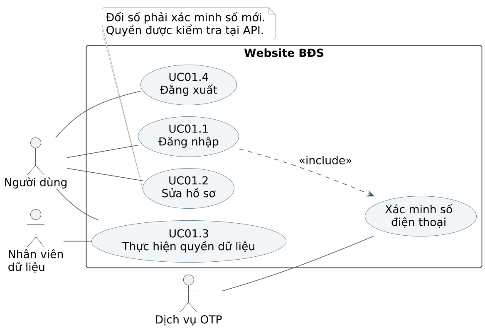
```plantuml
@startuml
!pragma layout smetana
skinparam backgroundColor white
skinparam shadowing false
skinparam defaultFontName DejaVu Sans
skinparam defaultFontSize 17
skinparam dpi 150
skinparam ArrowColor #405B6E
skinparam LineThickness 1
skinparam roundCorner 7
skinparam nodesep 30
skinparam ranksep 40
skinparam classAttributeIconSize 0
skinparam classBackgroundColor #F2F6F9
skinparam classBorderColor #405B6E
skinparam objectBackgroundColor #F2F6F9
skinparam objectBorderColor #405B6E
skinparam usecaseBackgroundColor #F2F6F9
skinparam usecaseBorderColor #405B6E
skinparam stateBackgroundColor #F2F6F9
skinparam stateBorderColor #405B6E
skinparam activityBackgroundColor #F2F6F9
skinparam activityBorderColor #405B6E
skinparam noteBackgroundColor #FFFFFF
skinparam noteBorderColor #999999
skinparam sequenceMessageAlign center
skinparam sequenceArrowThickness 1
skinparam sequenceParticipantBackgroundColor #F2F6F9
skinparam sequenceParticipantBorderColor #405B6E
skinparam maxMessageSize 280
hide circle
hide footbox
left to right direction
actor "Người dùng" as U
actor "Nhân viên\ndữ liệu" as P
actor "Dịch vụ OTP" as O
rectangle "Website BĐS" {
usecase "UC01.1\nĐăng nhập" as A
usecase "UC01.2\nSửa hồ sơ" as B
usecase "UC01.3\nThực hiện quyền dữ liệu" as C
usecase "Xác minh số\nđiện thoại" as D
usecase "UC01.4\nĐăng xuất" as E
}
U -- A
U -- B
U -- C
U -- E
P -- C
O -- D
A ..> D : <<include>>
note bottom of B
Đổi số phải xác minh số mới.
Quyền được kiểm tra tại API.
end note
@enduml
```

UCD01 Tài khoản và dữ liệu cá nhân

Mã nguồn PlantUML UCD02

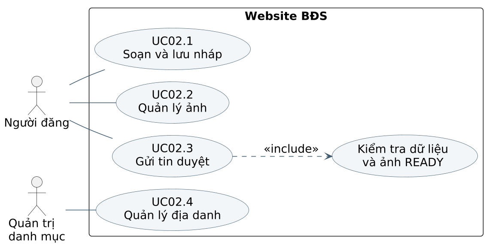
```plantuml
@startuml
!pragma layout smetana
skinparam backgroundColor white
skinparam shadowing false
skinparam defaultFontName DejaVu Sans
skinparam defaultFontSize 17
skinparam dpi 150
skinparam ArrowColor #405B6E
skinparam LineThickness 1
skinparam roundCorner 7
skinparam nodesep 30
skinparam ranksep 40
skinparam classAttributeIconSize 0
skinparam classBackgroundColor #F2F6F9
skinparam classBorderColor #405B6E
skinparam objectBackgroundColor #F2F6F9
skinparam objectBorderColor #405B6E
skinparam usecaseBackgroundColor #F2F6F9
skinparam usecaseBorderColor #405B6E
skinparam stateBackgroundColor #F2F6F9
skinparam stateBorderColor #405B6E
skinparam activityBackgroundColor #F2F6F9
skinparam activityBorderColor #405B6E
skinparam noteBackgroundColor #FFFFFF
skinparam noteBorderColor #999999
skinparam sequenceMessageAlign center
skinparam sequenceArrowThickness 1
skinparam sequenceParticipantBackgroundColor #F2F6F9
skinparam sequenceParticipantBorderColor #405B6E
skinparam maxMessageSize 280
hide circle
hide footbox
left to right direction
actor "Người đăng" as P
actor "Quản trị\ndanh mục" as A
rectangle "Website BĐS" {
usecase "UC02.1\nSoạn và lưu nháp" as D
usecase "UC02.2\nQuản lý ảnh" as M
usecase "UC02.3\nGửi tin duyệt" as S
usecase "UC02.4\nQuản lý địa danh" as C
usecase "Kiểm tra dữ liệu\nvà ảnh READY" as V
}
P -- D
P -- M
P -- S
A -- C
S ..> V : <<include>>
@enduml
```

UCD02 Tạo và gửi tin

## 51. Biểu đồ use case nhóm 3 và 4

Mã nguồn PlantUML UCD03

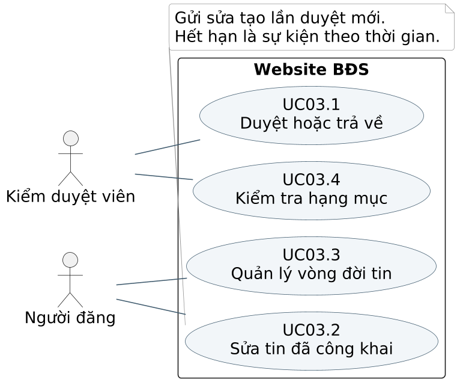
```plantuml
@startuml
!pragma layout smetana
skinparam backgroundColor white
skinparam shadowing false
skinparam defaultFontName DejaVu Sans
skinparam defaultFontSize 17
skinparam dpi 150
skinparam ArrowColor #405B6E
skinparam LineThickness 1
skinparam roundCorner 7
skinparam nodesep 30
skinparam ranksep 40
skinparam classAttributeIconSize 0
skinparam classBackgroundColor #F2F6F9
skinparam classBorderColor #405B6E
skinparam objectBackgroundColor #F2F6F9
skinparam objectBorderColor #405B6E
skinparam usecaseBackgroundColor #F2F6F9
skinparam usecaseBorderColor #405B6E
skinparam stateBackgroundColor #F2F6F9
skinparam stateBorderColor #405B6E
skinparam activityBackgroundColor #F2F6F9
skinparam activityBorderColor #405B6E
skinparam noteBackgroundColor #FFFFFF
skinparam noteBorderColor #999999
skinparam sequenceMessageAlign center
skinparam sequenceArrowThickness 1
skinparam sequenceParticipantBackgroundColor #F2F6F9
skinparam sequenceParticipantBorderColor #405B6E
skinparam maxMessageSize 280
hide circle
hide footbox
left to right direction
actor "Kiểm duyệt viên" as M
actor "Người đăng" as P
rectangle "Website BĐS" {
usecase "UC03.1\nDuyệt hoặc trả về" as R
usecase "UC03.2\nSửa tin đã công khai" as E
usecase "UC03.3\nQuản lý vòng đời tin" as L
usecase "UC03.4\nKiểm tra hạng mục" as V
}
M -- R
M -- V
P -- E
P -- L
note bottom of E
Gửi sửa tạo lần duyệt mới.
Hết hạn là sự kiện theo thời gian.
end note
@enduml
```

UCD03 Duyệt sửa và quản lý vòng đời tin

Mã nguồn PlantUML UCD04

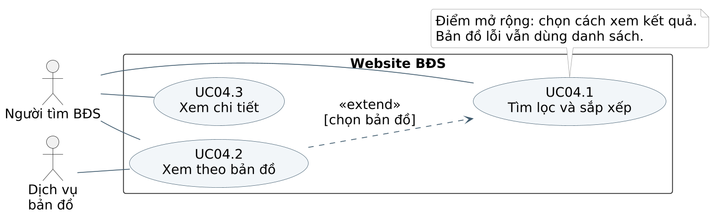
```plantuml
@startuml
!pragma layout smetana
skinparam backgroundColor white
skinparam shadowing false
skinparam defaultFontName DejaVu Sans
skinparam defaultFontSize 17
skinparam dpi 150
skinparam ArrowColor #405B6E
skinparam LineThickness 1
skinparam roundCorner 7
skinparam nodesep 30
skinparam ranksep 40
skinparam classAttributeIconSize 0
skinparam classBackgroundColor #F2F6F9
skinparam classBorderColor #405B6E
skinparam objectBackgroundColor #F2F6F9
skinparam objectBorderColor #405B6E
skinparam usecaseBackgroundColor #F2F6F9
skinparam usecaseBorderColor #405B6E
skinparam stateBackgroundColor #F2F6F9
skinparam stateBorderColor #405B6E
skinparam activityBackgroundColor #F2F6F9
skinparam activityBorderColor #405B6E
skinparam noteBackgroundColor #FFFFFF
skinparam noteBorderColor #999999
skinparam sequenceMessageAlign center
skinparam sequenceArrowThickness 1
skinparam sequenceParticipantBackgroundColor #F2F6F9
skinparam sequenceParticipantBorderColor #405B6E
skinparam maxMessageSize 280
hide circle
hide footbox
left to right direction
actor "Người tìm BĐS" as U
actor "Dịch vụ\nbản đồ" as M
rectangle "Website BĐS" {
usecase "UC04.1\nTìm lọc và sắp xếp" as S
usecase "UC04.2\nXem theo bản đồ" as B
usecase "UC04.3\nXem chi tiết" as D
}
U -- S
U -- B
U -- D
M -- B
B ..> S : <<extend>>\n[chọn bản đồ]
note bottom of S
Điểm mở rộng: chọn cách xem kết quả.
Bản đồ lỗi vẫn dùng danh sách.
end note
@enduml
```

UCD04 Tìm kiếm và xem chi tiết

## 52. Biểu đồ use case nhóm 5 và 6

Mã nguồn PlantUML UCD05

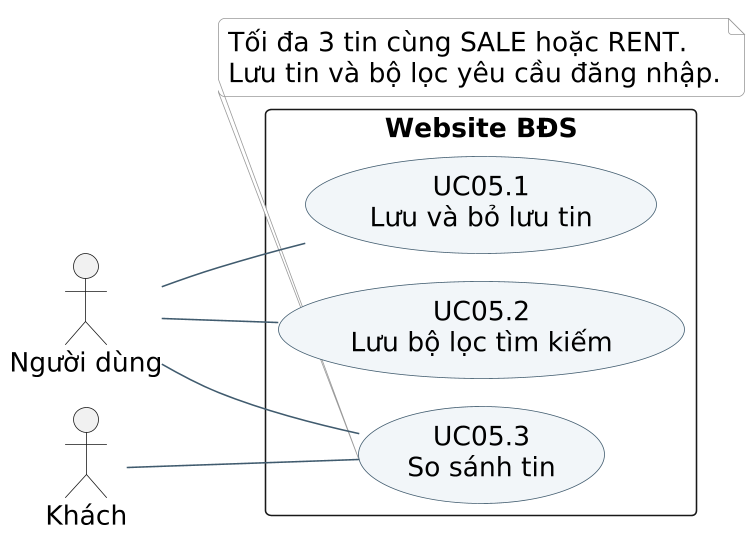
```plantuml
@startuml
!pragma layout smetana
skinparam backgroundColor white
skinparam shadowing false
skinparam defaultFontName DejaVu Sans
skinparam defaultFontSize 17
skinparam dpi 150
skinparam ArrowColor #405B6E
skinparam LineThickness 1
skinparam roundCorner 7
skinparam nodesep 30
skinparam ranksep 40
skinparam classAttributeIconSize 0
skinparam classBackgroundColor #F2F6F9
skinparam classBorderColor #405B6E
skinparam objectBackgroundColor #F2F6F9
skinparam objectBorderColor #405B6E
skinparam usecaseBackgroundColor #F2F6F9
skinparam usecaseBorderColor #405B6E
skinparam stateBackgroundColor #F2F6F9
skinparam stateBorderColor #405B6E
skinparam activityBackgroundColor #F2F6F9
skinparam activityBorderColor #405B6E
skinparam noteBackgroundColor #FFFFFF
skinparam noteBorderColor #999999
skinparam sequenceMessageAlign center
skinparam sequenceArrowThickness 1
skinparam sequenceParticipantBackgroundColor #F2F6F9
skinparam sequenceParticipantBorderColor #405B6E
skinparam maxMessageSize 280
hide circle
hide footbox
left to right direction
actor "Người dùng" as U
actor "Khách" as G
rectangle "Website BĐS" {
usecase "UC05.1\nLưu và bỏ lưu tin" as F
usecase "UC05.2\nLưu bộ lọc tìm kiếm" as S
usecase "UC05.3\nSo sánh tin" as C
}
U -- F
U -- S
U -- C
G -- C
note bottom of C
Tối đa 3 tin cùng SALE hoặc RENT.
Lưu tin và bộ lọc yêu cầu đăng nhập.
end note
@enduml
```

UCD05 Lưu và so sánh

Mã nguồn PlantUML UCD06

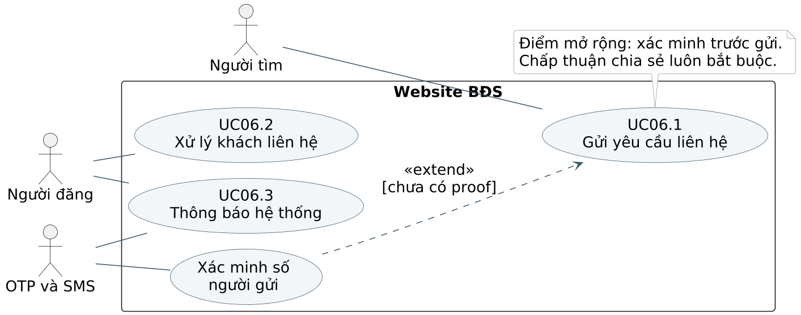
```plantuml
@startuml
!pragma layout smetana
skinparam backgroundColor white
skinparam shadowing false
skinparam defaultFontName DejaVu Sans
skinparam defaultFontSize 17
skinparam dpi 150
skinparam ArrowColor #405B6E
skinparam LineThickness 1
skinparam roundCorner 7
skinparam nodesep 30
skinparam ranksep 40
skinparam classAttributeIconSize 0
skinparam classBackgroundColor #F2F6F9
skinparam classBorderColor #405B6E
skinparam objectBackgroundColor #F2F6F9
skinparam objectBorderColor #405B6E
skinparam usecaseBackgroundColor #F2F6F9
skinparam usecaseBorderColor #405B6E
skinparam stateBackgroundColor #F2F6F9
skinparam stateBorderColor #405B6E
skinparam activityBackgroundColor #F2F6F9
skinparam activityBorderColor #405B6E
skinparam noteBackgroundColor #FFFFFF
skinparam noteBorderColor #999999
skinparam sequenceMessageAlign center
skinparam sequenceArrowThickness 1
skinparam sequenceParticipantBackgroundColor #F2F6F9
skinparam sequenceParticipantBorderColor #405B6E
skinparam maxMessageSize 280
hide circle
hide footbox
left to right direction
actor "Người tìm" as U
actor "Người đăng" as P
actor "OTP và SMS" as O
rectangle "Website BĐS" {
usecase "UC06.1\nGửi yêu cầu liên hệ" as L
usecase "UC06.2\nXử lý khách liên hệ" as H
usecase "UC06.3\nThông báo hệ thống" as N
usecase "Xác minh số\nngười gửi" as V
}
U -- L
P -- H
P -- N
O -- V
O -- N
V ..> L : <<extend>>\n[chưa có proof]
note bottom of L
Điểm mở rộng: xác minh trước gửi.
Chấp thuận chia sẻ luôn bắt buộc.
end note
@enduml
```

UCD06 Gửi và xử lý khách liên hệ

## 53. Biểu đồ use case nhóm 7 và 8

Mã nguồn PlantUML UCD07

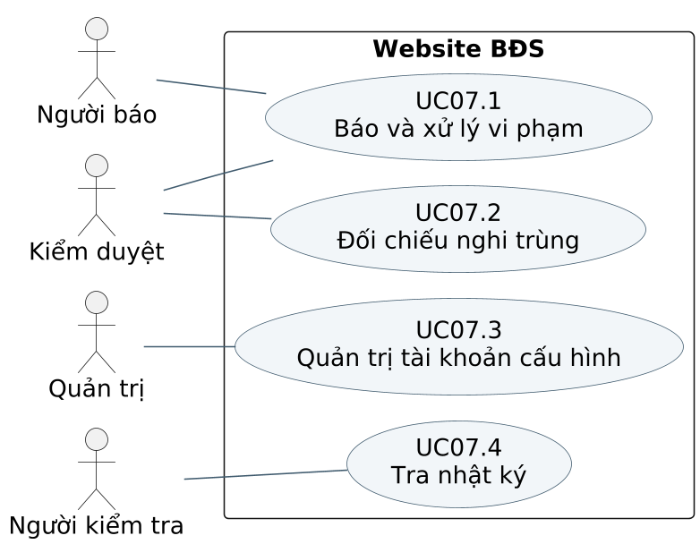
```plantuml
@startuml
!pragma layout smetana
skinparam backgroundColor white
skinparam shadowing false
skinparam defaultFontName DejaVu Sans
skinparam defaultFontSize 17
skinparam dpi 150
skinparam ArrowColor #405B6E
skinparam LineThickness 1
skinparam roundCorner 7
skinparam nodesep 30
skinparam ranksep 40
skinparam classAttributeIconSize 0
skinparam classBackgroundColor #F2F6F9
skinparam classBorderColor #405B6E
skinparam objectBackgroundColor #F2F6F9
skinparam objectBorderColor #405B6E
skinparam usecaseBackgroundColor #F2F6F9
skinparam usecaseBorderColor #405B6E
skinparam stateBackgroundColor #F2F6F9
skinparam stateBorderColor #405B6E
skinparam activityBackgroundColor #F2F6F9
skinparam activityBorderColor #405B6E
skinparam noteBackgroundColor #FFFFFF
skinparam noteBorderColor #999999
skinparam sequenceMessageAlign center
skinparam sequenceArrowThickness 1
skinparam sequenceParticipantBackgroundColor #F2F6F9
skinparam sequenceParticipantBorderColor #405B6E
skinparam maxMessageSize 280
hide circle
hide footbox
left to right direction
actor "Người báo" as U
actor "Kiểm duyệt" as M
actor "Quản trị" as A
actor "Người kiểm tra" as R
rectangle "Website BĐS" {
usecase "UC07.1\nBáo và xử lý vi phạm" as C
usecase "UC07.2\nĐối chiếu nghi trùng" as D
usecase "UC07.3\nQuản trị tài khoản cấu hình" as A1
usecase "UC07.4\nTra nhật ký" as L
}
U -- C
M -- C
M -- D
A -- A1
R -- L
@enduml
```

UCD07 Xử lý vi phạm và quản trị

Mã nguồn PlantUML UCD08

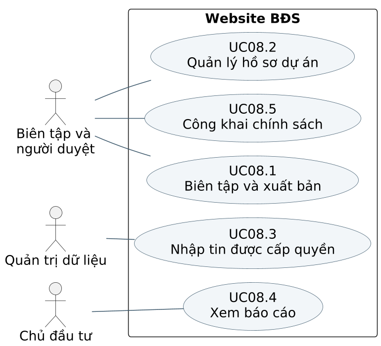
```plantuml
@startuml
!pragma layout smetana
skinparam backgroundColor white
skinparam shadowing false
skinparam defaultFontName DejaVu Sans
skinparam defaultFontSize 17
skinparam dpi 150
skinparam ArrowColor #405B6E
skinparam LineThickness 1
skinparam roundCorner 7
skinparam nodesep 30
skinparam ranksep 40
skinparam classAttributeIconSize 0
skinparam classBackgroundColor #F2F6F9
skinparam classBorderColor #405B6E
skinparam objectBackgroundColor #F2F6F9
skinparam objectBorderColor #405B6E
skinparam usecaseBackgroundColor #F2F6F9
skinparam usecaseBorderColor #405B6E
skinparam stateBackgroundColor #F2F6F9
skinparam stateBorderColor #405B6E
skinparam activityBackgroundColor #F2F6F9
skinparam activityBorderColor #405B6E
skinparam noteBackgroundColor #FFFFFF
skinparam noteBorderColor #999999
skinparam sequenceMessageAlign center
skinparam sequenceArrowThickness 1
skinparam sequenceParticipantBackgroundColor #F2F6F9
skinparam sequenceParticipantBorderColor #405B6E
skinparam maxMessageSize 280
hide circle
hide footbox
left to right direction
actor "Biên tập và\nngười duyệt" as E
actor "Quản trị dữ liệu" as A
actor "Chủ đầu tư" as O
rectangle "Website BĐS" {
usecase "UC08.1\nBiên tập và xuất bản" as C
usecase "UC08.2\nQuản lý hồ sơ dự án" as P
usecase "UC08.3\nNhập tin được cấp quyền" as I
usecase "UC08.4\nXem báo cáo" as R
usecase "UC08.5\nCông khai chính sách" as S
}
E -- C
E -- P
A -- I
O -- R
E -- S
@enduml
```

UCD08 Nội dung dự án dữ liệu và báo cáo

## 54. UC01 Kịch bản tài khoản và dữ liệu cá nhân

**Tác nhân:** Người dùng, nhân viên xử lý dữ liệu; dịch vụ OTP hỗ trợ. **Kích hoạt:** Chọn đăng nhập; hoặc mở hồ sơ và quyền dữ liệu.

**Tiền điều kiện:** Có kênh nhận OTP; chính sách hiệu lực. Các thao tác hồ sơ yêu cầu phiên còn hiệu lực. **Hậu điều kiện thành công:** Có phiên hợp lệ hoặc hồ sơ/yêu cầu dữ liệu được ghi nhận; không tự cấp nhãn pháp lý.

### Kịch bản chuẩn

**M1** Người dùng nhập số điện thoại và yêu cầu mã.

**M2** Hệ thống chuẩn hóa số, kiểm tra hạn mức, tạo challenge 5 phút và gửi OTP.

**M3** Người dùng nhập mã; hệ thống khóa challenge, kiểm tra số lần sai, thời hạn và tài khoản.

**M4** Mã đúng được tiêu thụ một lần; hệ thống tạo hoặc lấy tài khoản, xoay ID phiên.

**M5** Hệ thống trả cookie phiên; giao diện tải hồ sơ và quyền phù hợp.

**M6** Người dùng đăng xuất; hệ thống hủy phiên và xóa cookie.

### Kịch bản thay thế

**A1 từ M5** Sửa hồ sơ: kiểm tra chính chủ → cập nhật tên/loại tự khai → audit; đổi số chạy challenge riêng rồi mới áp dụng.

**A2 từ M5** Quyền dữ liệu: chọn loại → xác minh người yêu cầu → lập hồ sơ → đánh giá legal hold → xử lý/phản hồi → đóng, có lịch sử.

**A3 từ M5** Rút đồng ý marketing: có hiệu lực ngay; tách khỏi việc xử lý yêu cầu xóa còn chờ.

### Kịch bản ngoại lệ

**E1 tại M3** Sai/hết hạn/dùng lại mã: không cấp phiên; tăng bộ đếm; lần sai thứ 5 khóa challenge.

**E2 tại M2** Quá hạn mức hoặc OTP lỗi: trả 429/503; giữ UI cho gửi lại đúng thời gian, không retry vô hạn.

**E3 tại M3 hoặc M5** Tài khoản khóa hoặc truy cập bản ghi người khác: từ chối; không tiết lộ dữ liệu.

**E4 tại A2** Không chứng minh được chủ thể hoặc có legal hold: yêu cầu bổ sung/hoãn phần bị giữ; nêu lý do và hạn xem xét.

**Trích lớp:** User, Role, PhoneChallenge, PrivacyRequest, Consent. **Yêu cầu:** FR01 FR02 FR03 FR31. **Kiểm thử:** TC01 TC02 TC03 TC31 TC37 TC38.

## 55. UC02 Kịch bản tạo và gửi tin

**Tác nhân:** Người đăng; quản trị danh mục. **Kích hoạt:** Chọn Đăng tin hoặc mở nháp.

**Tiền điều kiện:** Đăng nhập, điện thoại xác minh, tài khoản hoạt động; nguồn nội dung được phép sử dụng. **Hậu điều kiện thành công:** Một revision SUBMITTED và một hồ sơ duyệt OPEN; Listing chuyển PENDING\_REVIEW.

### Kịch bản chuẩn

**M1** Người đăng chọn mục đích, loại tài sản và địa bàn.

**M2** Hệ thống tra danh mục và tên thay thế; người đăng xác nhận đơn vị đúng.

**M3** Người đăng nhập giá, diện tích, mô tả, địa chỉ và lưu nháp.

**M4** Giao diện xin upload intent; người đăng tải ảnh vào kho; worker kiểm tra, bỏ EXIF và tạo biến thể.

**M5** Người đăng sắp xếp 3 đến 20 ảnh READY, chọn bìa và xem trước.

**M6** Người đăng xác nhận quyền sử dụng nội dung và gửi kèm khóa yêu cầu, phiên bản kỳ vọng.

**M7** Hệ thống kiểm tra quyền, phiên bản, trường và ảnh trong giao dịch; đóng băng revision, tạo hồ sơ duyệt.

**M8** Trả mã tin và trạng thái chờ; nhật ký ghi lần gửi.

### Kịch bản thay thế

**A1 từ M3** Rời màn hình sau khi lưu thành công; mở lại tiếp tục cùng nháp, chưa gửi duyệt.

**A2 tại M2** Tên cũ có nhiều đích: hiện danh sách để chọn; quản trị duy trì alias và ngày hiệu lực qua màn danh mục.

**A3 tại M7** Có tín hiệu nghi trùng: đính kèm gợi ý cho kiểm duyệt; không tự công khai hay kết luận vi phạm.

### Kịch bản ngoại lệ

**E1 tại M4 hoặc M5** Ảnh quá 10 MB, sai định dạng hoặc chưa READY: loại/chờ ảnh; không cho gửi thiếu ảnh hợp lệ.

**E2 tại M7** Thiếu trường, tọa độ sai phạm vi: trả lỗi theo trường; giữ dữ liệu nháp.

**E3 tại M7** Sai chủ sở hữu hoặc phiên bản đổi: 403/409; yêu cầu tải lại, không ghi đè.

**E4 tại M8** Timeout: tra/retry cùng khóa; trả kết quả đã lưu, không tạo hồ sơ duyệt thứ hai.

**Trích lớp:** Listing, ListingRevision, MediaAsset, AdminUnit, ModerationCase. **Yêu cầu:** FR04 FR05 FR06 FR07. **Kiểm thử:** TC04 TC05 TC06 TC07 TC33 TC41.

## 56. UC03 Kịch bản duyệt sửa và quản lý vòng đời tin

**Tác nhân:** Kiểm duyệt viên, người đăng. **Kích hoạt:** Nhận tin chờ; gửi bản sửa; tạm dừng hoặc hết hạn.

**Tiền điều kiện:** Có quyền phù hợp, hồ sơ duyệt OPEN và revision hiện hành; người duyệt không là chủ tin. **Hậu điều kiện thành công:** Một quyết định áp dụng một revision; trạng thái, nhãn và kênh công khai nhất quán.

### Kịch bản chuẩn

**M1** Kiểm duyệt viên mở hàng chờ, nhận hồ sơ và xem revision đã gửi.

**M2** Đối chiếu nội dung, ảnh và chứng cứ theo từng hạng mục.

**M3** Ghi hạng mục đã kiểm tra, người thực hiện, bằng chứng và thời hạn.

**M4** Chọn duyệt; gửi decision kèm revision và version kỳ vọng.

**M5** Backend khóa tin, kiểm tra quyền, trạng thái và version; ghi quyết định, audit và outbox.

**M6** Revision thành APPROVED; Listing ACTIVE trỏ public\_revision, đặt hạn theo lần xác nhận còn hàng.

**M7** Worker purge cache và gửi thông báo; người đăng xem kết quả.

### Kịch bản thay thế

**A1 tại M4** Trả về: bắt buộc lý do → revision REJECTED → Listing CHANGES\_REQUIRED; chủ tin tạo nháp mới và gửi lại UC02.

**A2 sau M6** Sửa tin: tạo revision nháp mới; bản cũ còn hiển thị khi đang soạn. Khi gửi, tin tạm ẩn và nhãn liên quan bị thu hồi.

**A3 sau M6** Chủ tin tạm dừng → PAUSED; xác nhận đã giao dịch → CLOSED. Worker tới hạn → EXPIRED. PAUSED/EXPIRED phải gửi duyệt để mở.

**A4 tại M3** Xác minh theo hạng mục; không đủ chứng cứ thì giữ PENDING hoặc từ chối hạng mục, không gán nhãn pháp lý.

### Kịch bản ngoại lệ

**E1 tại M5** Version thay đổi hoặc hồ sơ đã xử lý: 409; không ghi quyết định thứ hai.

**E2 tại M5** Tự duyệt tin hoặc thiếu quyền: từ chối và audit.

**E3 tại M7** Purge/SMS lỗi: retry có hạn; DB là nguồn chuẩn, không hoàn tác quyết định đã commit.

**Trích lớp:** Listing, ListingRevision, ModerationCase, ModerationDecision, VerificationCheck. **Yêu cầu:** FR08 FR09 FR10 FR22. **Kiểm thử:** TC08 TC09 TC10 TC22 TC36 TC41.

## 57. UC04 Kịch bản tìm kiếm và xem chi tiết

**Tác nhân:** Khách, người dùng; dịch vụ bản đồ hỗ trợ. **Kích hoạt:** Tìm mua hoặc thuê; mở URL tin.

**Tiền điều kiện:** Website truy cập được; có thể có hoặc không có tin phù hợp. **Hậu điều kiện thành công:** Chỉ dữ liệu được phép công khai xuất hiện; URL giữ bộ lọc và kết quả không tự nới.

### Kịch bản chuẩn

**M1** Khách chọn SALE hoặc RENT và nhập khu vực.

**M2** Hệ thống chuẩn hóa tên, gợi ý địa danh; khách chọn khi có nhiều ánh xạ.

**M3** Khách đặt bộ lọc và sắp xếp; giao diện tạo SearchQuery có schema version.

**M4** Backend kiểm tra giới hạn, chỉ truy vấn tin ACTIVE còn hạn và public\_revision đã duyệt.

**M5** Trả tối đa 20 tin, cursor ổn định và vị trí công khai đã làm mờ.

**M6** Khách mở tin; server render HTML, metadata và trạng thái HTTP đúng.

**M7** Khách quay lại danh sách; khôi phục bộ lọc và vị trí cuộn.

### Kịch bản thay thế

**A1 từ M3** Chuyển bản đồ: gửi bbox/zoom cùng bộ lọc; nhận cluster hoặc điểm; mở pin dẫn tới chi tiết.

**A2 tại M5** Không có tin: hiện trạng thái rỗng và gợi ý nới từng điều kiện; người dùng tự chọn.

**A3 tại M6** Tin hết hạn: hiện trang trạng thái noindex theo thời hạn lưu; tắt gửi lead.

### Kịch bản ngoại lệ

**E1 tại M2** Địa danh mơ hồ: yêu cầu chọn, không tự đổi tọa độ.

**E2 tại M4** Cursor sai hoặc bbox quá lớn: trả lỗi/cluster theo hợp đồng; không trả toàn bộ vị trí.

**E3 tại A1** Dịch vụ bản đồ lỗi: giữ nguyên bộ lọc và cho dùng danh sách.

**E4 tại M6** Tin bị gỡ/riêng tư: 404 hoặc 410; không trả ảnh, địa chỉ và cache cũ.

**Trích lớp:** SearchQuery, Listing, ListingRevision, AdminUnit, Project. **Yêu cầu:** FR11 FR12 FR13 FR14. **Kiểm thử:** TC11 TC12 TC13 TC14 TC33 TC34 TC44.

## 58. UC05 Kịch bản lưu và so sánh

**Tác nhân:** Người dùng; khách được so sánh trong phiên. **Kích hoạt:** Bấm lưu tin, lưu bộ lọc hoặc thêm so sánh.

**Tiền điều kiện:** Lưu yêu cầu đăng nhập; so sánh có tối đa 3 tin cùng mục đích. **Hậu điều kiện thành công:** Favorite/SavedSearch thuộc đúng tài khoản; so sánh không làm thay đổi tin.

### Kịch bản chuẩn

**M1** Người dùng bấm lưu trên tin đang xem.

**M2** Hệ thống xác thực và kiểm tra mức công khai của tin.

**M3** Ghi Favorite theo khóa user và listing; trả trạng thái đã lưu.

**M4** Người dùng mở danh sách đã lưu; hệ thống áp trạng thái hiện tại của từng tin.

**M5** Người dùng bỏ lưu; xóa liên kết Favorite và cập nhật giao diện.

### Kịch bản thay thế

**A1 từ bộ lọc** Đặt tên tìm kiếm → kiểm tra chưa quá 20 → lưu JSON có schema version → mở lại chuẩn hóa địa danh → áp lọc.

**A2 từ chi tiết** Chọn tin so sánh → kiểm tra tối đa 3 và cùng SALE/RENT → tải dữ liệu công khai → trình bày các thuộc tính, đơn vị và giá trị thiếu.

**A3 tại M3 hoặc M5** Lưu hoặc bỏ lưu lặp trả cùng trạng thái đích; không sinh bản ghi trùng.

### Kịch bản ngoại lệ

**E1 tại M2** Chưa đăng nhập: hướng sang UC01 và giữ ý định lưu; không lưu vào tài khoản khác.

**E2 tại M4** Tin hết hạn giữ nhãn trạng thái; tin bị gỡ chỉ hiện mục không còn khả dụng, không lộ nội dung.

**E3 tại A1** Vượt 20 bộ lọc hoặc địa danh mơ hồ: yêu cầu xóa bớt/chọn lại; không tự sửa bộ lọc.

**E4 tại A2** Khác mục đích hoặc tin thứ 4: không thêm; giá thỏa thuận không tính giá/m².

**Trích lớp:** Favorite, SavedSearch, ComparisonSelection, Listing. **Yêu cầu:** FR15 FR16 FR17. **Kiểm thử:** TC15 TC16 TC17 TC39 TC40.

## 59. UC06 Kịch bản gửi và xử lý khách liên hệ

**Tác nhân:** Người tìm, người đăng; dịch vụ OTP và SMS. **Kích hoạt:** Bấm yêu cầu liên hệ; người đăng mở hộp lead.

**Tiền điều kiện:** Tin đang hiển thị ACTIVE, người nhận hợp lệ; có kênh xác minh số và chính sách chia sẻ đang hiệu lực. **Hậu điều kiện thành công:** Lead, consent, event và outbox nhất quán; cùng thao tác không tạo trùng; không chia sai người nhận.

### Kịch bản chuẩn

**M1** Khách nhập liên hệ và lời nhắn; xác minh số nếu chưa có proof hợp lệ.

**M2** Giao diện nêu người nhận và phiên bản chính sách; khách xác nhận chia sẻ.

**M3** Gửi yêu cầu kèm proof, purpose và Idempotency-Key.

**M4** Backend kiểm tra receipt, proof và đồng ý; khóa người nhận, tin và khóa chống trùng theo thứ tự quy định.

**M5** Đọc lại ACTIVE, hạn tin và public\_revision; suy ra recipient từ owner của tin.

**M6** Ghi consent, lead NEW, lịch sử và outbox trong một transaction; lưu receipt rồi commit.

**M7** Trả 201 với mã lead; worker gửi thông báo, lưu kết quả riêng.

**M8** Người đăng mở lead của mình, nhận xử lý, đánh dấu đã liên hệ và đóng có lý do.

### Kịch bản thay thế

**A1 tại M4** Cùng khóa/cùng payload: trả receipt trước. Cùng số, tin và mục đích trong 24 giờ: trả 200 lead hiện có, bổ sung lời nhắn theo quyền.

**A2 tại M8** Lead có thể NEW → IN\_PROGRESS → CONTACTED → CLOSED; đóng trực tiếp cũng phải có lý do.

**A3 tại M7** SMS lỗi: giữ lead; worker retry có giới hạn, người đăng vẫn xem hộp lead.

### Kịch bản ngoại lệ

**E1 tại M4** Cùng khóa khác payload: 409; proof sai, hết hạn hoặc thiếu đồng ý: từ chối, không chia sẻ.

**E2 tại M5** Tin hết hạn, chủ tin khóa hoặc vừa bị gỡ: 409 LISTING\_UNAVAILABLE, rollback toàn bộ.

**E3 tại M6 hoặc M7** DB lỗi: rollback; timeout sau commit: retry cùng khóa để tra receipt, không gửi thao tác mới.

**E4 tại M8** Sai người nhận hoặc version lead đổi: 403/409; không lộ số khách hoặc ghi chú.

**Trích lớp:** Lead, LeadEvent, Consent, LeadDedupKey, IdempotencyReceipt, OutboxEvent. **Yêu cầu:** FR18 FR19 FR20. **Kiểm thử:** TC18 TC19 TC20 TC33 TC37 TC38 TC41.

## 60. UC07 Kịch bản xử lý vi phạm và quản trị

**Tác nhân:** Người báo, kiểm duyệt, quản trị và người kiểm tra nội bộ. **Kích hoạt:** Gửi phản ánh; phát hiện nghi trùng; thao tác quản trị.

**Tiền điều kiện:** Phản ánh qua hạn mức; thao tác xử lý có quyền, lý do và phiên hiện hành. **Hậu điều kiện thành công:** Vụ việc có quyết định và lịch sử; danh tính người báo được bảo vệ; quyền và trạng thái được thực thi.

### Kịch bản chuẩn

**M1** Người báo chọn lý do và cung cấp thông tin cho tin cần phản ánh.

**M2** Hệ thống kiểm tra hạn mức, ghi Report RECEIVED và trả mã tiếp nhận.

**M3** Kiểm duyệt nhận việc; đối chiếu revision, chứng cứ và các tín hiệu nghi trùng.

**M4** Yêu cầu giải trình khi cần; chỉ người có quyền xem danh tính người báo.

**M5** Kiểm duyệt quyết định không vi phạm hoặc xử lý có lý do.

**M6** Backend khóa đối tượng, cập nhật vụ việc và trạng thái tin khi cần; ghi audit và outbox cùng giao dịch.

**M7** Gửi phản hồi thích hợp; đóng vụ việc, cho phép quy trình khiếu nại.

### Kịch bản thay thế

**A1 từ M3** DuplicateCandidate chỉ là tín hiệu: xem ảnh/vị trí/nội dung → xác nhận khác hoặc chuyển thành hồ sơ xử lý.

**A2 sau M7** Khiếu nại → mở lại hồ sơ → phân công người khác → quyết định mới. Tin được phục hồi phải qua duyệt lại.

**A3 quản trị** Xác thực lại → kiểm tra quyền → khóa/mở tài khoản có lý do → thu hồi phiên và xử lý tin theo quyết định → audit.

**A4 quản trị** Đổi cấu hình có version hoặc tra audit theo quyền; audit chỉ đọc, không có API sửa lịch sử.

### Kịch bản ngoại lệ

**E1 tại M2** Spam/quá hạn mức: 429, không kết luận vi phạm chỉ vì số lượt báo.

**E2 tại M6** Đối tượng đổi version: 409 và xem lại; không ghi đè quyết định.

**E3 tại A2 hoặc A3** Người có xung đột lợi ích hoặc tự nâng quyền: từ chối và audit.

**Trích lớp:** Report, CaseEvent, DuplicateCandidate, User, AuditLog, SystemSetting. **Yêu cầu:** FR21 FR23 FR27 FR28. **Kiểm thử:** TC21 TC23 TC27 TC28 TC37 TC41.

## 61. UC08 Kịch bản nội dung dự án dữ liệu và báo cáo

**Tác nhân:** Biên tập, người duyệt nội dung, quản trị dữ liệu, chủ đầu tư. **Kích hoạt:** Soạn bài hoặc hồ sơ dự án; nhập nguồn; mở báo cáo.

**Tiền điều kiện:** Có quyền đúng tác vụ; có nguồn và quyền sử dụng; người viết không tự vượt quyền xuất bản. **Hậu điều kiện thành công:** Nội dung có revision, nguồn, người duyệt; nhập idempotent; chỉ dữ liệu công khai vào SEO.

### Kịch bản chuẩn

**M1** Biên tập tạo bài nháp có tiêu đề, nội dung, nguồn và ảnh được cấp quyền.

**M2** Hệ thống làm sạch HTML, kiểm tra trường và lưu ContentRevision DRAFT.

**M3** Biên tập gửi duyệt; revision đóng băng.

**M4** Người có quyền xem nguồn, nội dung và metadata; duyệt hoặc trả về có lý do.

**M5** Backend kiểm tra version, ghi quyết định, public\_revision, audit và outbox.

**M6** Frontend phục vụ HTML công khai; worker cập nhật sitemap và purge cache.

**M7** Chủ đầu tư xem chỉ số theo định nghĩa và khoảng thời gian.

### Kịch bản thay thế

**A1 hồ sơ dự án** Tạo ProjectRevision có địa danh, chủ đầu tư, nguồn, ngày cập nhật → kiểm tra nguồn → duyệt → liên kết tin với project.

**A2 nhập tin** Chọn nguồn hợp lệ → upload mẫu → dry run từng dòng → xác nhận hash báo cáo → nhập dòng hợp lệ → khóa source/external\_id → tạo nháp → gửi duyệt UC02.

**A3 chính sách** Article loại POLICY có phiên bản hiệu lực; biểu mẫu lưu policy\_revision\_id đang dùng, không thay nội dung bản đã chấp thuận.

**A4 sửa bài** Tạo revision mới; khi gửi sửa thì tạm ẩn bản cũ theo cùng quy tắc tin; chỉ công khai lại sau duyệt.

### Kịch bản ngoại lệ

**E1 tại M2 hoặc M4** Không có quyền nguồn/HTML nguy hiểm/thông tin pháp lý thiếu nguồn: trả về, không xuất bản.

**E2 tại M5** Sai quyền hoặc version đổi: 403/409; không ghi đè.

**E3 tại A2** Dòng sai ghi lỗi riêng; import lại không trùng; snapshot dry run đã đổi thì phải chạy lại.

**E4 tại M7** Dữ liệu thiếu hoặc sự kiện đến muộn: ghi thời điểm chốt; không đưa PII vào analytics.

**Trích lớp:** Article, ContentRevision, Project, ProjectRevision, Source, ImportJob, ImportRow. **Yêu cầu:** FR24 FR25 FR26 FR29 FR30 FR32. **Kiểm thử:** TC24 TC25 TC26 TC29 TC30 TC32 TC34 TC41.

## 62. Trích lớp thực thể dùng chung cho nghiệp vụ

Trích danh từ có định danh, dữ liệu cần lưu, quan hệ hoặc vòng đời trong kịch bản UC. Một lớp dùng lại giữa nhiều UC; không tạo lớp TinDangChoUC02 và TinDangChoUC03 riêng biệt. Bảng này là mô hình phân tích, chưa gắn với framework.

| **Lớp thực thể** | **Căn cứ chọn** | **Yêu cầu** |
| --- | --- | --- |
| User và Role | Người dùng có định danh, trạng thái; quyền nhiều nhiều. | FR01–04, FR27 |
| PhoneChallenge | Cần kiểm tra một lần, hạn dùng và số lần sai. | FR01, FR18 |
| AdminUnit và LocationAlias | Địa danh có phiên bản, tên cũ và ánh xạ nhiều đích. | FR04 |
| PropertyType | Danh mục loại tài sản dùng chung. | FR04, FR11 |
| Consent và PrivacyRequest | Căn cứ chia sẻ khác với yêu cầu thực hiện quyền. | FR18, FR31 |
| Source | Có chủ thể cấp quyền, phạm vi và thời hạn sử dụng. | FR24, FR25, FR30 |
| Listing | Danh tính tin ổn định và vòng đời công khai. | FR05–14 |
| ListingRevision | Snapshot nội dung thay đổi cần duyệt. | FR05, FR07–09 |
| MediaAsset và RevisionMedia | Tệp có quyền và trạng thái; liên kết ảnh với revision. | FR06 |
| ModerationCase và ModerationDecision | Hồ sơ chờ xử lý khác với quyết định bất biến. | FR08 |
| VerificationCheck | Hạng mục kiểm tra có bằng chứng, thời hạn riêng. | FR22 |
| Report và CaseEvent | Phản ánh có vòng đời, quyết định và khiếu nại. | FR21 |
| DuplicateCandidate | Tín hiệu nghi trùng cần con người kết luận. | FR23 |

Listing biểu diễn một tin chào bán hoặc cho thuê; chưa có đủ dữ liệu để đồng nhất nhiều tin thành một tài sản pháp lý duy nhất. Vì vậy bản cơ sở không tự gộp Listing thành một Property đã xác minh quyền sở hữu.

## 63. Trích lớp thực thể cho liên hệ nội dung và vận hành

| **Lớp thực thể** | **Căn cứ chọn** | **Yêu cầu** |
| --- | --- | --- |
| Lead và LeadEvent | Khách liên hệ và lịch sử chăm sóc/lời nhắn. | FR18–20 |
| Favorite và SavedSearch | Quan hệ lưu tin khác cấu trúc bộ lọc có version. | FR15, FR16 |
| Article và ContentRevision | Nội dung/chính sách có nguồn và phê duyệt. | FR24, FR26, FR32 |
| Project và ProjectRevision | Hồ sơ dự án có nguồn riêng và lịch sử. | FR25 |
| ImportJob và ImportRow | Lần nhập và kết quả từng dòng phải đối soát. | FR30 |
| AuditLog và SystemSetting | Nhật ký bất biến, cấu hình có version. | FR27, FR28 |
| OutboxEvent và NotificationDelivery | Sự kiện bền vững và kết quả gửi tách nhau. | FR20 |
| ProductEvent | Sự kiện đo lường có định nghĩa, không chứa PII. | FR29 |

### Các khái niệm không thành bảng riêng mặc định

| **Khái niệm** | **Cách mô hình hóa** |
| --- | --- |
| Money Address GeoPoint | Value object, gộp vào thuộc tính của snapshot; không tạo ID riêng nếu không có vòng đời độc lập. |
| SearchQuery ComparisonSelection | Đối tượng giá trị hoặc trạng thái giao diện; ComparisonSelection chỉ nằm trong phiên, không có bảng so sánh. |
| LoginForm ContactForm ReviewConsole | Boundary ở pha phân tích, route/component React ở pha thiết kế; không là entity JPA. |
| AccountControl ListingControl LeadControl | Control điều phối; ánh xạ thành application service Spring Boot, không là bảng CSDL. |
| Chủ nhà Môi giới Kiểm duyệt | Vai trò hoặc phân loại của User; không dùng kế thừa để thay thế kiểm tra quyền. |

## 64. Biểu đồ trạng thái tin đăng

ST01 mô tả vòng đời thông thường của Listing. Điều kiện hết hạn luôn được kiểm tra khi đọc và tạo lead, kể cả khi worker chưa kịp cập nhật trạng thái EXPIRED.

Mã nguồn PlantUML ST01

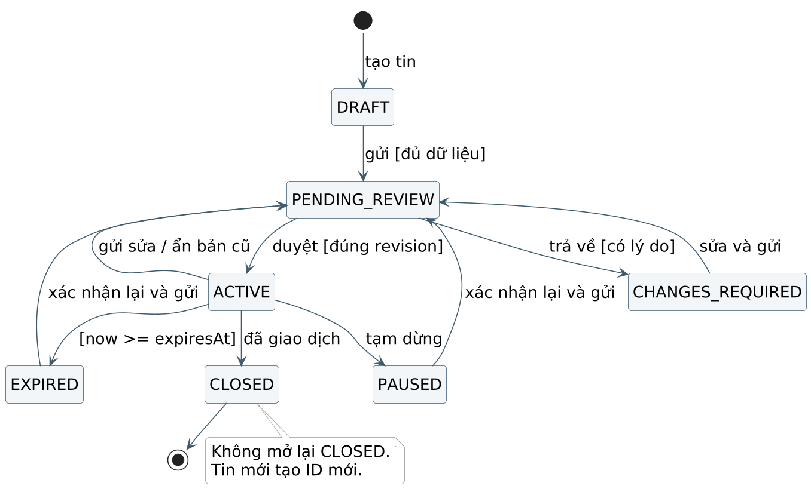
```plantuml
@startuml
!pragma layout smetana
skinparam backgroundColor white
skinparam shadowing false
skinparam defaultFontName DejaVu Sans
skinparam defaultFontSize 17
skinparam dpi 150
skinparam ArrowColor #405B6E
skinparam LineThickness 1
skinparam roundCorner 7
skinparam nodesep 30
skinparam ranksep 40
skinparam classAttributeIconSize 0
skinparam classBackgroundColor #F2F6F9
skinparam classBorderColor #405B6E
skinparam objectBackgroundColor #F2F6F9
skinparam objectBorderColor #405B6E
skinparam usecaseBackgroundColor #F2F6F9
skinparam usecaseBorderColor #405B6E
skinparam stateBackgroundColor #F2F6F9
skinparam stateBorderColor #405B6E
skinparam activityBackgroundColor #F2F6F9
skinparam activityBorderColor #405B6E
skinparam noteBackgroundColor #FFFFFF
skinparam noteBorderColor #999999
skinparam sequenceMessageAlign center
skinparam sequenceArrowThickness 1
skinparam sequenceParticipantBackgroundColor #F2F6F9
skinparam sequenceParticipantBorderColor #405B6E
skinparam maxMessageSize 280
hide circle
hide footbox
hide empty description
[*] --> DRAFT : tạo tin
DRAFT --> PENDING_REVIEW : gửi [đủ dữ liệu]
PENDING_REVIEW --> ACTIVE : duyệt [đúng revision]
PENDING_REVIEW --> CHANGES_REQUIRED : trả về [có lý do]
CHANGES_REQUIRED --> PENDING_REVIEW : sửa và gửi
ACTIVE --> PENDING_REVIEW : gửi sửa / ẩn bản cũ
ACTIVE --> PAUSED : tạm dừng
ACTIVE --> EXPIRED : [now >= expiresAt]
ACTIVE --> CLOSED : đã giao dịch
PAUSED --> PENDING_REVIEW : xác nhận lại và gửi
EXPIRED --> PENDING_REVIEW : xác nhận lại và gửi
CLOSED --> [*]
note bottom of CLOSED
Không mở lại CLOSED.
Tin mới tạo ID mới.
end note
@enduml
```

ST01 Listing và các chuyển trạng thái thông thường

Sự kiện gửi sửa khác với lưu nháp sửa: chỉ khi gửi bản mới thì tin đang ACTIVE mới tạm ẩn. CLOSED là kết thúc nghiệp vụ; cần nguồn hàng mới thì tạo tin mới.

## 65. Trạng thái gỡ tin và phiên bản nội dung

Mã nguồn PlantUML ST02

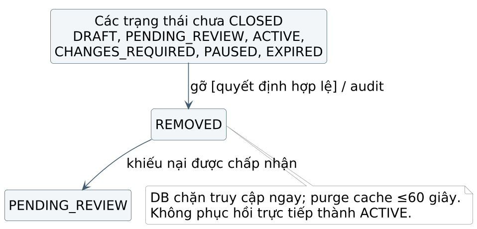
```plantuml
@startuml
!pragma layout smetana
skinparam backgroundColor white
skinparam shadowing false
skinparam defaultFontName DejaVu Sans
skinparam defaultFontSize 17
skinparam dpi 150
skinparam ArrowColor #405B6E
skinparam LineThickness 1
skinparam roundCorner 7
skinparam nodesep 30
skinparam ranksep 40
skinparam classAttributeIconSize 0
skinparam classBackgroundColor #F2F6F9
skinparam classBorderColor #405B6E
skinparam objectBackgroundColor #F2F6F9
skinparam objectBorderColor #405B6E
skinparam usecaseBackgroundColor #F2F6F9
skinparam usecaseBorderColor #405B6E
skinparam stateBackgroundColor #F2F6F9
skinparam stateBorderColor #405B6E
skinparam activityBackgroundColor #F2F6F9
skinparam activityBorderColor #405B6E
skinparam noteBackgroundColor #FFFFFF
skinparam noteBorderColor #999999
skinparam sequenceMessageAlign center
skinparam sequenceArrowThickness 1
skinparam sequenceParticipantBackgroundColor #F2F6F9
skinparam sequenceParticipantBorderColor #405B6E
skinparam maxMessageSize 280
hide circle
hide footbox
hide empty description
state "Các trạng thái chưa CLOSED\nDRAFT, PENDING_REVIEW, ACTIVE,\nCHANGES_REQUIRED, PAUSED, EXPIRED" as ELIGIBLE
state "REMOVED" as R
ELIGIBLE --> R : gỡ [quyết định hợp lệ] / audit
R --> PENDING_REVIEW : khiếu nại được chấp nhận
note bottom of R
DB chặn truy cập ngay; purge cache ≤60 giây.
Không phục hồi trực tiếp thành ACTIVE.
end note
@enduml
```

ST02 Nhánh gỡ và khôi phục qua kiểm duyệt

Mã nguồn PlantUML ST03

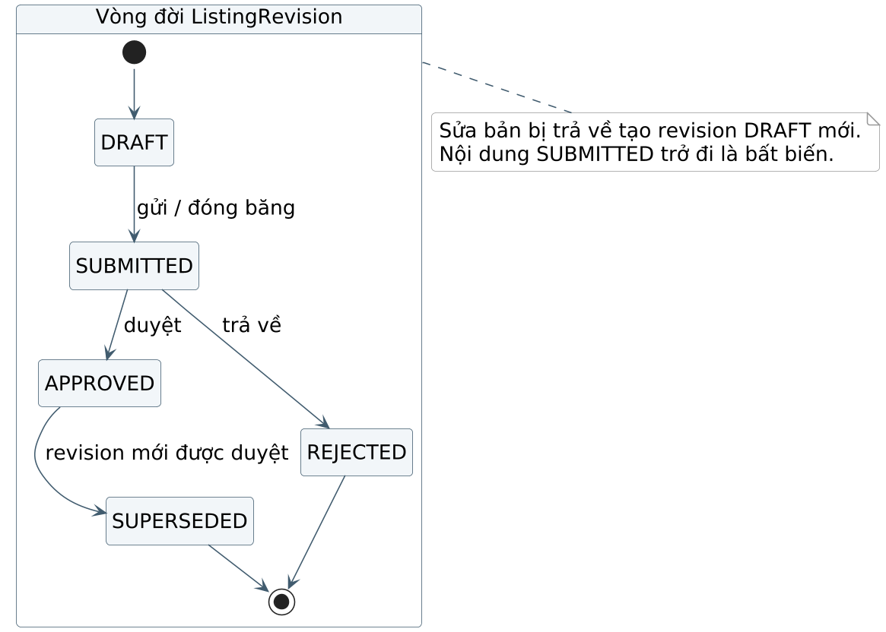
```plantuml
@startuml
!pragma layout smetana
skinparam backgroundColor white
skinparam shadowing false
skinparam defaultFontName DejaVu Sans
skinparam defaultFontSize 17
skinparam dpi 150
skinparam ArrowColor #405B6E
skinparam LineThickness 1
skinparam roundCorner 7
skinparam nodesep 30
skinparam ranksep 40
skinparam classAttributeIconSize 0
skinparam classBackgroundColor #F2F6F9
skinparam classBorderColor #405B6E
skinparam objectBackgroundColor #F2F6F9
skinparam objectBorderColor #405B6E
skinparam usecaseBackgroundColor #F2F6F9
skinparam usecaseBorderColor #405B6E
skinparam stateBackgroundColor #F2F6F9
skinparam stateBorderColor #405B6E
skinparam activityBackgroundColor #F2F6F9
skinparam activityBorderColor #405B6E
skinparam noteBackgroundColor #FFFFFF
skinparam noteBorderColor #999999
skinparam sequenceMessageAlign center
skinparam sequenceArrowThickness 1
skinparam sequenceParticipantBackgroundColor #F2F6F9
skinparam sequenceParticipantBorderColor #405B6E
skinparam maxMessageSize 280
hide circle
hide footbox
hide empty description
state "Vòng đời ListingRevision" as LR {
 [*] --> DRAFT
 DRAFT --> SUBMITTED : gửi / đóng băng
 SUBMITTED --> APPROVED : duyệt
 SUBMITTED --> REJECTED : trả về
 APPROVED --> SUPERSEDED : revision mới được duyệt
 SUPERSEDED --> [*]
 REJECTED --> [*]
}
note bottom of LR
Sửa bản bị trả về tạo revision DRAFT mới.
Nội dung SUBMITTED trở đi là bất biến.
end note
@enduml
```

ST03 ListingRevision đóng băng nội dung sau gửi

ST03 cũng áp dụng cho ContentRevision và ProjectRevision. Article/Project dùng DRAFT, PENDING\_REVIEW, CHANGES\_REQUIRED, ACTIVE, REMOVED; không dùng PAUSED, EXPIRED hoặc CLOSED của tin BĐS.

## 66. Trạng thái khách liên hệ và hạng mục kiểm tra

Mã nguồn PlantUML ST04

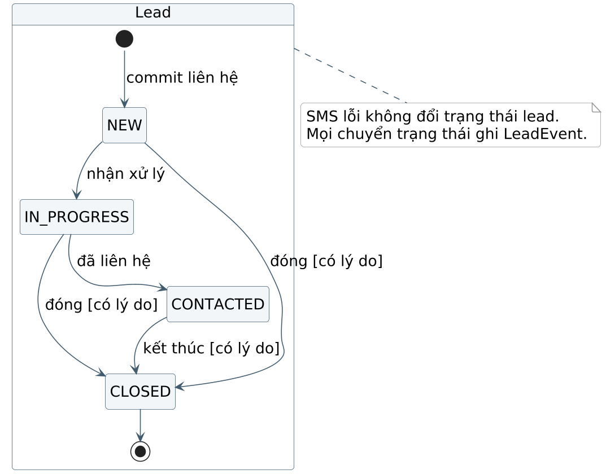
```plantuml
@startuml
!pragma layout smetana
skinparam backgroundColor white
skinparam shadowing false
skinparam defaultFontName DejaVu Sans
skinparam defaultFontSize 17
skinparam dpi 150
skinparam ArrowColor #405B6E
skinparam LineThickness 1
skinparam roundCorner 7
skinparam nodesep 30
skinparam ranksep 40
skinparam classAttributeIconSize 0
skinparam classBackgroundColor #F2F6F9
skinparam classBorderColor #405B6E
skinparam objectBackgroundColor #F2F6F9
skinparam objectBorderColor #405B6E
skinparam usecaseBackgroundColor #F2F6F9
skinparam usecaseBorderColor #405B6E
skinparam stateBackgroundColor #F2F6F9
skinparam stateBorderColor #405B6E
skinparam activityBackgroundColor #F2F6F9
skinparam activityBorderColor #405B6E
skinparam noteBackgroundColor #FFFFFF
skinparam noteBorderColor #999999
skinparam sequenceMessageAlign center
skinparam sequenceArrowThickness 1
skinparam sequenceParticipantBackgroundColor #F2F6F9
skinparam sequenceParticipantBorderColor #405B6E
skinparam maxMessageSize 280
hide circle
hide footbox
hide empty description
state "Lead" as L {
 [*] --> NEW : commit liên hệ
 NEW --> IN_PROGRESS : nhận xử lý
 IN_PROGRESS --> CONTACTED : đã liên hệ
 NEW --> CLOSED : đóng [có lý do]
 IN_PROGRESS --> CLOSED : đóng [có lý do]
 CONTACTED --> CLOSED : kết thúc [có lý do]
 CLOSED --> [*]
}
note bottom of L
SMS lỗi không đổi trạng thái lead.
Mọi chuyển trạng thái ghi LeadEvent.
end note
@enduml
```

ST04 Lead từ tiếp nhận đến đóng có lý do

Mã nguồn PlantUML ST06

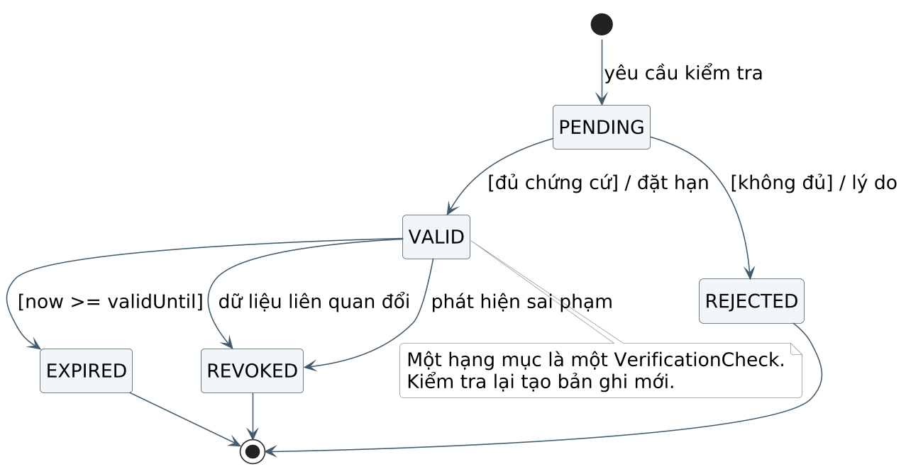
```plantuml
@startuml
!pragma layout smetana
skinparam backgroundColor white
skinparam shadowing false
skinparam defaultFontName DejaVu Sans
skinparam defaultFontSize 17
skinparam dpi 150
skinparam ArrowColor #405B6E
skinparam LineThickness 1
skinparam roundCorner 7
skinparam nodesep 30
skinparam ranksep 40
skinparam classAttributeIconSize 0
skinparam classBackgroundColor #F2F6F9
skinparam classBorderColor #405B6E
skinparam objectBackgroundColor #F2F6F9
skinparam objectBorderColor #405B6E
skinparam usecaseBackgroundColor #F2F6F9
skinparam usecaseBorderColor #405B6E
skinparam stateBackgroundColor #F2F6F9
skinparam stateBorderColor #405B6E
skinparam activityBackgroundColor #F2F6F9
skinparam activityBorderColor #405B6E
skinparam noteBackgroundColor #FFFFFF
skinparam noteBorderColor #999999
skinparam sequenceMessageAlign center
skinparam sequenceArrowThickness 1
skinparam sequenceParticipantBackgroundColor #F2F6F9
skinparam sequenceParticipantBorderColor #405B6E
skinparam maxMessageSize 280
hide circle
hide footbox
hide empty description
[*] --> PENDING : yêu cầu kiểm tra
PENDING --> VALID : [đủ chứng cứ] / đặt hạn
PENDING --> REJECTED : [không đủ] / lý do
VALID --> EXPIRED : [now >= validUntil]
VALID --> REVOKED : dữ liệu liên quan đổi
VALID --> REVOKED : phát hiện sai phạm
EXPIRED --> [*]
REVOKED --> [*]
REJECTED --> [*]
note bottom of VALID
Một hạng mục là một VerificationCheck.
Kiểm tra lại tạo bản ghi mới.
end note
@enduml
```

ST06 VerificationCheck có thời hạn riêng

## 67. Trạng thái phản ánh và khiếu nại

Mã nguồn PlantUML ST05

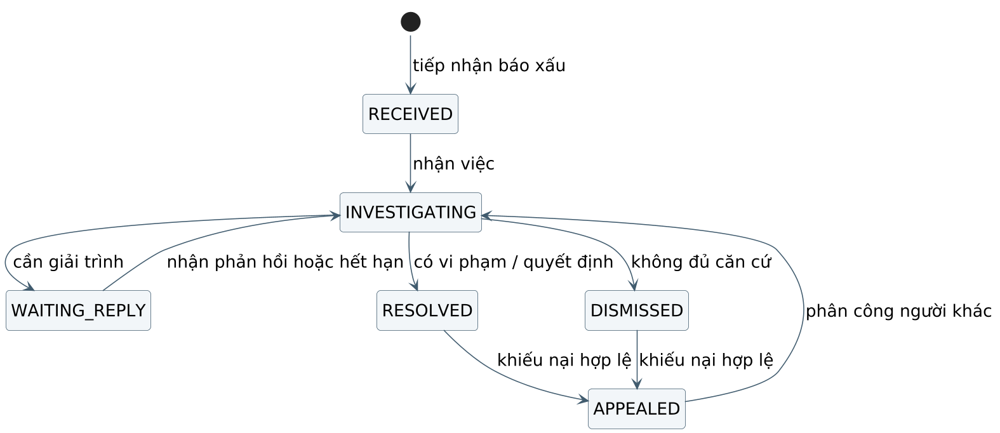
```plantuml
@startuml
!pragma layout smetana
skinparam backgroundColor white
skinparam shadowing false
skinparam defaultFontName DejaVu Sans
skinparam defaultFontSize 17
skinparam dpi 150
skinparam ArrowColor #405B6E
skinparam LineThickness 1
skinparam roundCorner 7
skinparam nodesep 30
skinparam ranksep 40
skinparam classAttributeIconSize 0
skinparam classBackgroundColor #F2F6F9
skinparam classBorderColor #405B6E
skinparam objectBackgroundColor #F2F6F9
skinparam objectBorderColor #405B6E
skinparam usecaseBackgroundColor #F2F6F9
skinparam usecaseBorderColor #405B6E
skinparam stateBackgroundColor #F2F6F9
skinparam stateBorderColor #405B6E
skinparam activityBackgroundColor #F2F6F9
skinparam activityBorderColor #405B6E
skinparam noteBackgroundColor #FFFFFF
skinparam noteBorderColor #999999
skinparam sequenceMessageAlign center
skinparam sequenceArrowThickness 1
skinparam sequenceParticipantBackgroundColor #F2F6F9
skinparam sequenceParticipantBorderColor #405B6E
skinparam maxMessageSize 280
hide circle
hide footbox
hide empty description
[*] --> RECEIVED : tiếp nhận báo xấu
RECEIVED --> INVESTIGATING : nhận việc
INVESTIGATING --> WAITING_REPLY : cần giải trình
WAITING_REPLY --> INVESTIGATING : nhận phản hồi hoặc hết hạn
INVESTIGATING --> RESOLVED : có vi phạm / quyết định
INVESTIGATING --> DISMISSED : không đủ căn cứ
RESOLVED --> APPEALED : khiếu nại hợp lệ
DISMISSED --> APPEALED : khiếu nại hợp lệ
APPEALED --> INVESTIGATING : phân công người khác
@enduml
```

ST05 Report có nhánh giải trình và xem xét lại

| **Điều kiện** | **Quy tắc** |
| --- | --- |
| Quyết định | RESOLVED hoặc DISMISSED có lý do, người xử lý và CaseEvent; không xóa lịch sử khi mở lại. |
| Khiếu nại | APPEALED phân công người khác; quyết định sau có thể thay kết quả nhưng vẫn giữ quyết định trước. |
| Tác động đến tin | Có quyết định gỡ mới đưa Listing sang REMOVED. Nhận nhiều báo cáo không tự tạo chuyển trạng thái vi phạm. |

## 68. Biểu đồ lớp pha phân tích mô hình boundary control entity

Mức phân tích: đối tượng nghiệp vụ, trách nhiệm và quan hệ; không phụ thuộc Spring, HTTP hay kiểu cột SQL. Các lớp tham chiếu ở nhiều hình là cùng một lớp trong mô hình chung.

Mã nguồn PlantUML AC00

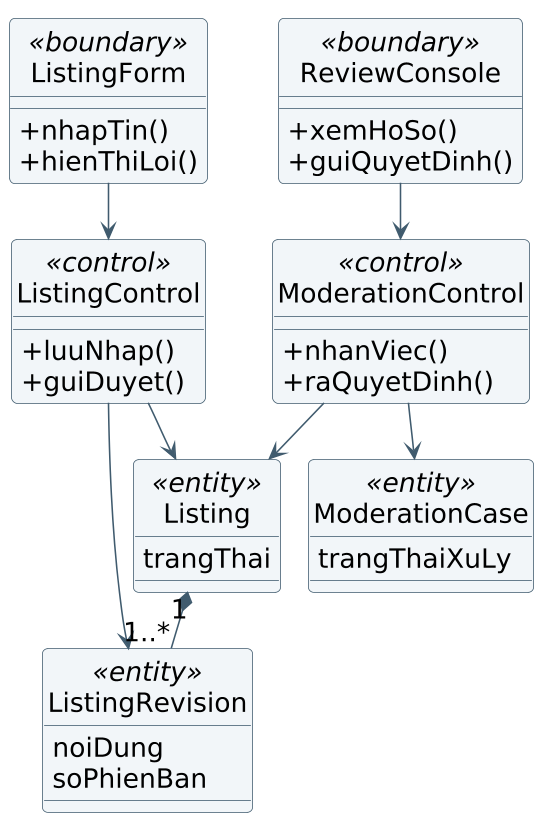
```plantuml
@startuml
!pragma layout smetana
skinparam backgroundColor white
skinparam shadowing false
skinparam defaultFontName DejaVu Sans
skinparam defaultFontSize 17
skinparam dpi 150
skinparam ArrowColor #405B6E
skinparam LineThickness 1
skinparam roundCorner 7
skinparam nodesep 30
skinparam ranksep 40
skinparam classAttributeIconSize 0
skinparam classBackgroundColor #F2F6F9
skinparam classBorderColor #405B6E
skinparam objectBackgroundColor #F2F6F9
skinparam objectBorderColor #405B6E
skinparam usecaseBackgroundColor #F2F6F9
skinparam usecaseBorderColor #405B6E
skinparam stateBackgroundColor #F2F6F9
skinparam stateBorderColor #405B6E
skinparam activityBackgroundColor #F2F6F9
skinparam activityBorderColor #405B6E
skinparam noteBackgroundColor #FFFFFF
skinparam noteBorderColor #999999
skinparam sequenceMessageAlign center
skinparam sequenceArrowThickness 1
skinparam sequenceParticipantBackgroundColor #F2F6F9
skinparam sequenceParticipantBorderColor #405B6E
skinparam maxMessageSize 280
hide circle
hide footbox
class ListingForm <<boundary>> {
+nhapTin()
+hienThiLoi()
}
class ReviewConsole <<boundary>> {
+xemHoSo()
+guiQuyetDinh()
}
class ListingControl <<control>> {
+luuNhap()
+guiDuyet()
}
class ModerationControl <<control>> {
+nhanViec()
+raQuyetDinh()
}
class Listing <<entity>> {
trangThai
}
class ListingRevision <<entity>> {
noiDung
soPhienBan
}
class ModerationCase <<entity>> {
trangThaiXuLy
}
ListingForm --> ListingControl
ReviewConsole --> ModerationControl
ListingControl --> Listing
ListingControl --> ListingRevision
ModerationControl --> Listing
ModerationControl --> ModerationCase
Listing "1" *-- "1..*" ListingRevision
@enduml
```

AC00 Mô hình boundary control entity

Bội số 0..1 là tùy chọn, 1 là bắt buộc, 0..\* là nhiều. Composition biểu diễn trách nhiệm vòng đời trong miền nghiệp vụ; chính sách lưu giữ có thể yêu cầu giữ dữ liệu khi ngừng công khai.

## 69. Biểu đồ lớp pha phân tích tài khoản và quyền dữ liệu

Mức phân tích: đối tượng nghiệp vụ, trách nhiệm và quan hệ; không phụ thuộc Spring, HTTP hay kiểu cột SQL. Các lớp tham chiếu ở nhiều hình là cùng một lớp trong mô hình chung.

Mã nguồn PlantUML AC01

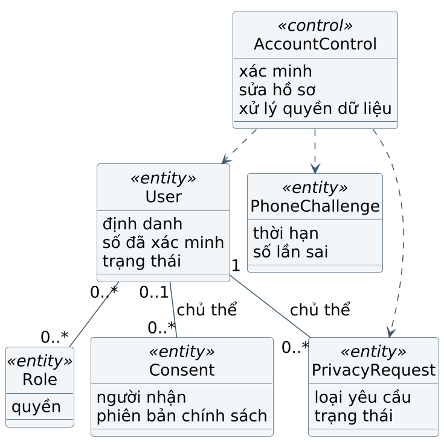
```plantuml
@startuml
!pragma layout smetana
skinparam backgroundColor white
skinparam shadowing false
skinparam defaultFontName DejaVu Sans
skinparam defaultFontSize 17
skinparam dpi 150
skinparam ArrowColor #405B6E
skinparam LineThickness 1
skinparam roundCorner 7
skinparam nodesep 30
skinparam ranksep 40
skinparam classAttributeIconSize 0
skinparam classBackgroundColor #F2F6F9
skinparam classBorderColor #405B6E
skinparam objectBackgroundColor #F2F6F9
skinparam objectBorderColor #405B6E
skinparam usecaseBackgroundColor #F2F6F9
skinparam usecaseBorderColor #405B6E
skinparam stateBackgroundColor #F2F6F9
skinparam stateBorderColor #405B6E
skinparam activityBackgroundColor #F2F6F9
skinparam activityBorderColor #405B6E
skinparam noteBackgroundColor #FFFFFF
skinparam noteBorderColor #999999
skinparam sequenceMessageAlign center
skinparam sequenceArrowThickness 1
skinparam sequenceParticipantBackgroundColor #F2F6F9
skinparam sequenceParticipantBorderColor #405B6E
skinparam maxMessageSize 280
hide circle
hide footbox
class User <<entity>> {
định danh
số đã xác minh
trạng thái
}
class Role <<entity>> {
quyền
}
class PhoneChallenge <<entity>> {
thời hạn
số lần sai
}
class Consent <<entity>> {
người nhận
phiên bản chính sách
}
class PrivacyRequest <<entity>> {
loại yêu cầu
trạng thái
}
class AccountControl <<control>> {
xác minh
sửa hồ sơ
xử lý quyền dữ liệu
}
User "0..*" -- "0..*" Role
User "1" -- "0..*" PrivacyRequest : chủ thể
User "0..1" -- "0..*" Consent : chủ thể
AccountControl ..> User
AccountControl ..> PhoneChallenge
AccountControl ..> PrivacyRequest
@enduml
```

AC01 Tài khoản và quyền dữ liệu

Bội số 0..1 là tùy chọn, 1 là bắt buộc, 0..\* là nhiều. Composition biểu diễn trách nhiệm vòng đời trong miền nghiệp vụ; chính sách lưu giữ có thể yêu cầu giữ dữ liệu khi ngừng công khai.

## 70. Biểu đồ lớp pha phân tích tin phiên bản và kiểm duyệt

Mức phân tích: đối tượng nghiệp vụ, trách nhiệm và quan hệ; không phụ thuộc Spring, HTTP hay kiểu cột SQL. Các lớp tham chiếu ở nhiều hình là cùng một lớp trong mô hình chung.

Mã nguồn PlantUML AC02

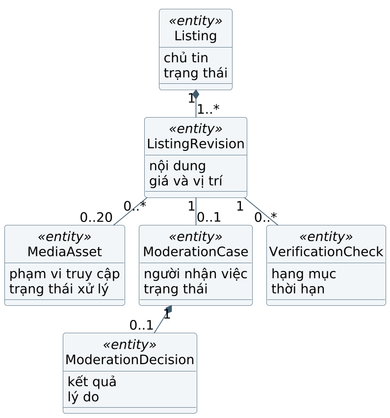
```plantuml
@startuml
!pragma layout smetana
skinparam backgroundColor white
skinparam shadowing false
skinparam defaultFontName DejaVu Sans
skinparam defaultFontSize 17
skinparam dpi 150
skinparam ArrowColor #405B6E
skinparam LineThickness 1
skinparam roundCorner 7
skinparam nodesep 30
skinparam ranksep 40
skinparam classAttributeIconSize 0
skinparam classBackgroundColor #F2F6F9
skinparam classBorderColor #405B6E
skinparam objectBackgroundColor #F2F6F9
skinparam objectBorderColor #405B6E
skinparam usecaseBackgroundColor #F2F6F9
skinparam usecaseBorderColor #405B6E
skinparam stateBackgroundColor #F2F6F9
skinparam stateBorderColor #405B6E
skinparam activityBackgroundColor #F2F6F9
skinparam activityBorderColor #405B6E
skinparam noteBackgroundColor #FFFFFF
skinparam noteBorderColor #999999
skinparam sequenceMessageAlign center
skinparam sequenceArrowThickness 1
skinparam sequenceParticipantBackgroundColor #F2F6F9
skinparam sequenceParticipantBorderColor #405B6E
skinparam maxMessageSize 280
hide circle
hide footbox
class Listing <<entity>> {
chủ tin
trạng thái
}
class ListingRevision <<entity>> {
nội dung
giá và vị trí
}
class MediaAsset <<entity>> {
phạm vi truy cập
trạng thái xử lý
}
class ModerationCase <<entity>> {
người nhận việc
trạng thái
}
class ModerationDecision <<entity>> {
kết quả
lý do
}
class VerificationCheck <<entity>> {
hạng mục
thời hạn
}
Listing "1" *-- "1..*" ListingRevision
ListingRevision "0..*" -- "0..20" MediaAsset
ListingRevision "1" -- "0..1" ModerationCase
ModerationCase "1" *-- "0..1" ModerationDecision
ListingRevision "1" -- "0..*" VerificationCheck
MediaAsset -[hidden]- ModerationDecision
@enduml
```

AC02 Tin phiên bản và kiểm duyệt

Quan hệ ảnh cho phép 0 đến 20 khi soạn; tại thời điểm gửi/duyệt phải có 3 đến 20 ảnh READY và một ảnh bìa. ModerationDecision chỉ tồn tại khi hồ sơ đã có quyết định.

## 71. Biểu đồ lớp pha phân tích liên hệ và tương tác cá nhân

Mức phân tích: đối tượng nghiệp vụ, trách nhiệm và quan hệ; không phụ thuộc Spring, HTTP hay kiểu cột SQL. Các lớp tham chiếu ở nhiều hình là cùng một lớp trong mô hình chung.

Mã nguồn PlantUML AC03

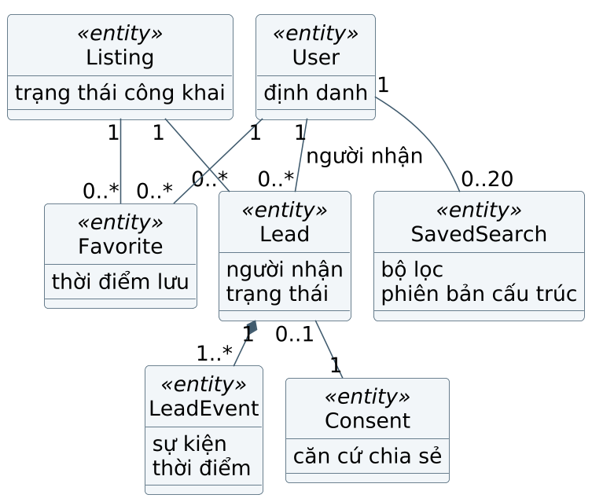
```plantuml
@startuml
!pragma layout smetana
skinparam backgroundColor white
skinparam shadowing false
skinparam defaultFontName DejaVu Sans
skinparam defaultFontSize 17
skinparam dpi 150
skinparam ArrowColor #405B6E
skinparam LineThickness 1
skinparam roundCorner 7
skinparam nodesep 30
skinparam ranksep 40
skinparam classAttributeIconSize 0
skinparam classBackgroundColor #F2F6F9
skinparam classBorderColor #405B6E
skinparam objectBackgroundColor #F2F6F9
skinparam objectBorderColor #405B6E
skinparam usecaseBackgroundColor #F2F6F9
skinparam usecaseBorderColor #405B6E
skinparam stateBackgroundColor #F2F6F9
skinparam stateBorderColor #405B6E
skinparam activityBackgroundColor #F2F6F9
skinparam activityBorderColor #405B6E
skinparam noteBackgroundColor #FFFFFF
skinparam noteBorderColor #999999
skinparam sequenceMessageAlign center
skinparam sequenceArrowThickness 1
skinparam sequenceParticipantBackgroundColor #F2F6F9
skinparam sequenceParticipantBorderColor #405B6E
skinparam maxMessageSize 280
hide circle
hide footbox
class User <<entity>> {
định danh
}
class Listing <<entity>> {
trạng thái công khai
}
class Lead <<entity>> {
người nhận
trạng thái
}
class LeadEvent <<entity>> {
sự kiện
thời điểm
}
class Consent <<entity>> {
căn cứ chia sẻ
}
class Favorite <<entity>> {
thời điểm lưu
}
class SavedSearch <<entity>> {
bộ lọc
phiên bản cấu trúc
}
Listing "1" -- "0..*" Lead
Lead "1" *-- "1..*" LeadEvent
Lead "0..1" -- "1" Consent
User "1" -- "0..*" Lead : người nhận
User "1" -- "0..*" Favorite
Listing "1" -- "0..*" Favorite
User "1" -- "0..20" SavedSearch
@enduml
```

AC03 Liên hệ và tương tác cá nhân

Consent trên Lead là chấp thuận ban đầu; chấp thuận cho lời nhắn bổ sung có thể gắn LeadEvent. Người nhận lead là User khác với chủ thể gửi, được suy ra từ tin.

## 72. Biểu đồ lớp pha phân tích nội dung dự án và nguồn dữ liệu

Mức phân tích: đối tượng nghiệp vụ, trách nhiệm và quan hệ; không phụ thuộc Spring, HTTP hay kiểu cột SQL. Các lớp tham chiếu ở nhiều hình là cùng một lớp trong mô hình chung.

Mã nguồn PlantUML AC04

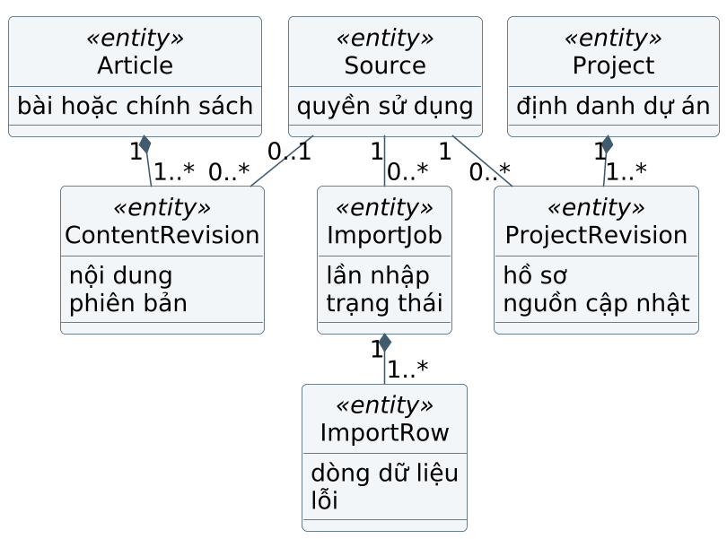
```plantuml
@startuml
!pragma layout smetana
skinparam backgroundColor white
skinparam shadowing false
skinparam defaultFontName DejaVu Sans
skinparam defaultFontSize 17
skinparam dpi 150
skinparam ArrowColor #405B6E
skinparam LineThickness 1
skinparam roundCorner 7
skinparam nodesep 30
skinparam ranksep 40
skinparam classAttributeIconSize 0
skinparam classBackgroundColor #F2F6F9
skinparam classBorderColor #405B6E
skinparam objectBackgroundColor #F2F6F9
skinparam objectBorderColor #405B6E
skinparam usecaseBackgroundColor #F2F6F9
skinparam usecaseBorderColor #405B6E
skinparam stateBackgroundColor #F2F6F9
skinparam stateBorderColor #405B6E
skinparam activityBackgroundColor #F2F6F9
skinparam activityBorderColor #405B6E
skinparam noteBackgroundColor #FFFFFF
skinparam noteBorderColor #999999
skinparam sequenceMessageAlign center
skinparam sequenceArrowThickness 1
skinparam sequenceParticipantBackgroundColor #F2F6F9
skinparam sequenceParticipantBorderColor #405B6E
skinparam maxMessageSize 280
hide circle
hide footbox
class Article <<entity>> {
bài hoặc chính sách
}
class ContentRevision <<entity>> {
nội dung
phiên bản
}
class Project <<entity>> {
định danh dự án
}
class ProjectRevision <<entity>> {
hồ sơ
nguồn cập nhật
}
class Source <<entity>> {
quyền sử dụng
}
class ImportJob <<entity>> {
lần nhập
trạng thái
}
class ImportRow <<entity>> {
dòng dữ liệu
lỗi
}
Article "1" *-- "1..*" ContentRevision
Project "1" *-- "1..*" ProjectRevision
Source "0..1" -- "0..*" ContentRevision
Source "1" -- "0..*" ProjectRevision
Source "1" -- "0..*" ImportJob
ImportJob "1" *-- "1..*" ImportRow
@enduml
```

AC04 Nội dung dự án và nguồn dữ liệu

Bội số 0..1 là tùy chọn, 1 là bắt buộc, 0..\* là nhiều. Composition biểu diễn trách nhiệm vòng đời trong miền nghiệp vụ; chính sách lưu giữ có thể yêu cầu giữ dữ liệu khi ngừng công khai.

## 73. Biểu đồ giao tiếp phân tích nhóm 1 và 2

Đối tượng có tên instance và lớp; thông điệp đánh số thể hiện thứ tự gọi trên các liên kết, không dùng trục thời gian. Đây là tương tác nghiệp vụ, chưa phải lời gọi controller/repository.

Mã nguồn PlantUML CM01

```plantuml
@startuml
!pragma layout smetana
skinparam backgroundColor white
skinparam shadowing false
skinparam defaultFontName DejaVu Sans
skinparam defaultFontSize 17
skinparam dpi 150
skinparam ArrowColor #405B6E
skinparam LineThickness 1
skinparam roundCorner 7
skinparam nodesep 30
skinparam ranksep 40
skinparam classAttributeIconSize 0
skinparam classBackgroundColor #F2F6F9
skinparam classBorderColor #405B6E
skinparam objectBackgroundColor #F2F6F9
skinparam objectBorderColor #405B6E
skinparam usecaseBackgroundColor #F2F6F9
skinparam usecaseBorderColor #405B6E
skinparam stateBackgroundColor #F2F6F9
skinparam stateBorderColor #405B6E
skinparam activityBackgroundColor #F2F6F9
skinparam activityBorderColor #405B6E
skinparam noteBackgroundColor #FFFFFF
skinparam noteBorderColor #999999
skinparam sequenceMessageAlign center
skinparam sequenceArrowThickness 1
skinparam sequenceParticipantBackgroundColor #F2F6F9
skinparam sequenceParticipantBorderColor #405B6E
skinparam maxMessageSize 280
hide circle
hide footbox
object "<u>ui: LoginForm</u>" as B <<boundary>>
object "<u>ctl: AccountControl</u>" as C <<control>>
object "<u>e1: PhoneChallenge</u>" as E0 <<entity>>
object "<u>e2: User</u>" as E1 <<entity>>
object "<u>e3: PrivacyRequest</u>" as E2 <<entity>>
B -right-> C : 1: gửi số và OTP
C -down-> E0 : 1.1: kiểm tra và tiêu thụ
C -down-> E1 : 1.2: lấy hoặc tạo tài\nkhoản
C -down-> E2 : 2: lập yêu cầu quyền dữ\nliệu
E0 -[hidden]right- E1
E1 -[hidden]right- E2
@enduml
```

CM01 Tài khoản và dữ liệu cá nhân

Mã nguồn PlantUML CM02

```plantuml
@startuml
!pragma layout smetana
skinparam backgroundColor white
skinparam shadowing false
skinparam defaultFontName DejaVu Sans
skinparam defaultFontSize 17
skinparam dpi 150
skinparam ArrowColor #405B6E
skinparam LineThickness 1
skinparam roundCorner 7
skinparam nodesep 30
skinparam ranksep 40
skinparam classAttributeIconSize 0
skinparam classBackgroundColor #F2F6F9
skinparam classBorderColor #405B6E
skinparam objectBackgroundColor #F2F6F9
skinparam objectBorderColor #405B6E
skinparam usecaseBackgroundColor #F2F6F9
skinparam usecaseBorderColor #405B6E
skinparam stateBackgroundColor #F2F6F9
skinparam stateBorderColor #405B6E
skinparam activityBackgroundColor #F2F6F9
skinparam activityBorderColor #405B6E
skinparam noteBackgroundColor #FFFFFF
skinparam noteBorderColor #999999
skinparam sequenceMessageAlign center
skinparam sequenceArrowThickness 1
skinparam sequenceParticipantBackgroundColor #F2F6F9
skinparam sequenceParticipantBorderColor #405B6E
skinparam maxMessageSize 280
hide circle
hide footbox
object "<u>ui: ListingForm</u>" as B <<boundary>>
object "<u>ctl: ListingControl</u>" as C <<control>>
object "<u>e1: Listing</u>" as E0 <<entity>>
object "<u>e2: MediaAsset</u>" as E1 <<entity>>
object "<u>e3: ModerationCase</u>" as E2 <<entity>>
B -right-> C : 1: gửi nháp hợp lệ
C -down-> E0 : 1.1: kiểm tra revision
C -down-> E1 : 1.2: kiểm tra ảnh READY
C -down-> E2 : 1.3: tạo hồ sơ duyệt
E0 -[hidden]right- E1
E1 -[hidden]right- E2
@enduml
```

CM02 Tạo và gửi tin

Số 1.1, 1.2 và 1.3 là các lời gọi phát sinh trong yêu cầu 1. Số 2 hoặc 3 biểu diễn tình huống thay thế độc lập trong cùng nhóm UC; không bắt buộc người dùng thực hiện liên tiếp mọi nhánh.

## 74. Biểu đồ giao tiếp phân tích nhóm 3 và 4

Đối tượng có tên instance và lớp; thông điệp đánh số thể hiện thứ tự gọi trên các liên kết, không dùng trục thời gian. Đây là tương tác nghiệp vụ, chưa phải lời gọi controller/repository.

Mã nguồn PlantUML CM03

```plantuml
@startuml
!pragma layout smetana
skinparam backgroundColor white
skinparam shadowing false
skinparam defaultFontName DejaVu Sans
skinparam defaultFontSize 17
skinparam dpi 150
skinparam ArrowColor #405B6E
skinparam LineThickness 1
skinparam roundCorner 7
skinparam nodesep 30
skinparam ranksep 40
skinparam classAttributeIconSize 0
skinparam classBackgroundColor #F2F6F9
skinparam classBorderColor #405B6E
skinparam objectBackgroundColor #F2F6F9
skinparam objectBorderColor #405B6E
skinparam usecaseBackgroundColor #F2F6F9
skinparam usecaseBorderColor #405B6E
skinparam stateBackgroundColor #F2F6F9
skinparam stateBorderColor #405B6E
skinparam activityBackgroundColor #F2F6F9
skinparam activityBorderColor #405B6E
skinparam noteBackgroundColor #FFFFFF
skinparam noteBorderColor #999999
skinparam sequenceMessageAlign center
skinparam sequenceArrowThickness 1
skinparam sequenceParticipantBackgroundColor #F2F6F9
skinparam sequenceParticipantBorderColor #405B6E
skinparam maxMessageSize 280
hide circle
hide footbox
object "<u>ui: ReviewForm</u>" as B <<boundary>>
object "<u>ctl: ModerationControl</u>" as C <<control>>
object "<u>e1: ModerationCase</u>" as E0 <<entity>>
object "<u>e2: Listing</u>" as E1 <<entity>>
object "<u>e3: VerificationCheck</u>" as E2 <<entity>>
B -right-> C : 1: duyệt revision
C -down-> E0 : 1.1: kiểm tra việc còn mở
C -down-> E1 : 1.2: ghi trạng thái công\nkhai
C -down-> E2 : 1.3: ghi hạng mục kiểm\ntra
E0 -[hidden]right- E1
E1 -[hidden]right- E2
@enduml
```

CM03 Duyệt sửa và quản lý vòng đời tin

Mã nguồn PlantUML CM04

```plantuml
@startuml
!pragma layout smetana
skinparam backgroundColor white
skinparam shadowing false
skinparam defaultFontName DejaVu Sans
skinparam defaultFontSize 17
skinparam dpi 150
skinparam ArrowColor #405B6E
skinparam LineThickness 1
skinparam roundCorner 7
skinparam nodesep 30
skinparam ranksep 40
skinparam classAttributeIconSize 0
skinparam classBackgroundColor #F2F6F9
skinparam classBorderColor #405B6E
skinparam objectBackgroundColor #F2F6F9
skinparam objectBorderColor #405B6E
skinparam usecaseBackgroundColor #F2F6F9
skinparam usecaseBorderColor #405B6E
skinparam stateBackgroundColor #F2F6F9
skinparam stateBorderColor #405B6E
skinparam activityBackgroundColor #F2F6F9
skinparam activityBorderColor #405B6E
skinparam noteBackgroundColor #FFFFFF
skinparam noteBorderColor #999999
skinparam sequenceMessageAlign center
skinparam sequenceArrowThickness 1
skinparam sequenceParticipantBackgroundColor #F2F6F9
skinparam sequenceParticipantBorderColor #405B6E
skinparam maxMessageSize 280
hide circle
hide footbox
object "<u>ui: SearchPage</u>" as B <<boundary>>
object "<u>ctl: SearchControl</u>" as C <<control>>
object "<u>e1: AdminUnit</u>" as E0 <<entity>>
object "<u>e2: ListingRevision</u>" as E1 <<entity>>
object "<u>e3: Project</u>" as E2 <<entity>>
B -right-> C : 1: tìm với bộ lọc
C -down-> E0 : 1.1: giải nghĩa địa danh
C -down-> E1 : 1.2: lấy nội dung công\nkhai
C -down-> E2 : 1.3: lấy dự án liên quan
E0 -[hidden]right- E1
E1 -[hidden]right- E2
@enduml
```

CM04 Tìm kiếm và xem chi tiết

Số 1.1, 1.2 và 1.3 là các lời gọi phát sinh trong yêu cầu 1. Số 2 hoặc 3 biểu diễn tình huống thay thế độc lập trong cùng nhóm UC; không bắt buộc người dùng thực hiện liên tiếp mọi nhánh.

## 75. Biểu đồ giao tiếp phân tích nhóm 5 và 6

Đối tượng có tên instance và lớp; thông điệp đánh số thể hiện thứ tự gọi trên các liên kết, không dùng trục thời gian. Đây là tương tác nghiệp vụ, chưa phải lời gọi controller/repository.

Mã nguồn PlantUML CM05

```plantuml
@startuml
!pragma layout smetana
skinparam backgroundColor white
skinparam shadowing false
skinparam defaultFontName DejaVu Sans
skinparam defaultFontSize 17
skinparam dpi 150
skinparam ArrowColor #405B6E
skinparam LineThickness 1
skinparam roundCorner 7
skinparam nodesep 30
skinparam ranksep 40
skinparam classAttributeIconSize 0
skinparam classBackgroundColor #F2F6F9
skinparam classBorderColor #405B6E
skinparam objectBackgroundColor #F2F6F9
skinparam objectBorderColor #405B6E
skinparam usecaseBackgroundColor #F2F6F9
skinparam usecaseBorderColor #405B6E
skinparam stateBackgroundColor #F2F6F9
skinparam stateBorderColor #405B6E
skinparam activityBackgroundColor #F2F6F9
skinparam activityBorderColor #405B6E
skinparam noteBackgroundColor #FFFFFF
skinparam noteBorderColor #999999
skinparam sequenceMessageAlign center
skinparam sequenceArrowThickness 1
skinparam sequenceParticipantBackgroundColor #F2F6F9
skinparam sequenceParticipantBorderColor #405B6E
skinparam maxMessageSize 280
hide circle
hide footbox
object "<u>ui: SavedItemsPage</u>" as B <<boundary>>
object "<u>ctl: EngagementControl</u>" as C <<control>>
object "<u>e1: Favorite</u>" as E0 <<entity>>
object "<u>e2: SavedSearch</u>" as E1 <<entity>>
object "<u>e3: Listing</u>" as E2 <<entity>>
B -right-> C : 1: lưu hoặc so sánh
C -down-> E0 : 1.1: thêm hoặc bỏ lưu
C -down-> E1 : 2: lưu bộ lọc
C -down-> E2 : 3: lấy tin để so sánh
E0 -[hidden]right- E1
E1 -[hidden]right- E2
@enduml
```

CM05 Lưu và so sánh

Mã nguồn PlantUML CM06

```plantuml
@startuml
!pragma layout smetana
skinparam backgroundColor white
skinparam shadowing false
skinparam defaultFontName DejaVu Sans
skinparam defaultFontSize 17
skinparam dpi 150
skinparam ArrowColor #405B6E
skinparam LineThickness 1
skinparam roundCorner 7
skinparam nodesep 30
skinparam ranksep 40
skinparam classAttributeIconSize 0
skinparam classBackgroundColor #F2F6F9
skinparam classBorderColor #405B6E
skinparam objectBackgroundColor #F2F6F9
skinparam objectBorderColor #405B6E
skinparam usecaseBackgroundColor #F2F6F9
skinparam usecaseBorderColor #405B6E
skinparam stateBackgroundColor #F2F6F9
skinparam stateBorderColor #405B6E
skinparam activityBackgroundColor #F2F6F9
skinparam activityBorderColor #405B6E
skinparam noteBackgroundColor #FFFFFF
skinparam noteBorderColor #999999
skinparam sequenceMessageAlign center
skinparam sequenceArrowThickness 1
skinparam sequenceParticipantBackgroundColor #F2F6F9
skinparam sequenceParticipantBorderColor #405B6E
skinparam maxMessageSize 280
hide circle
hide footbox
object "<u>ui: ContactForm</u>" as B <<boundary>>
object "<u>ctl: LeadControl</u>" as C <<control>>
object "<u>e1: Listing</u>" as E0 <<entity>>
object "<u>e2: Consent</u>" as E1 <<entity>>
object "<u>e3: Lead</u>" as E2 <<entity>>
B -right-> C : 1: gửi liên hệ
C -down-> E0 : 1.1: kiểm tra còn công\nkhai
C -down-> E1 : 1.2: ghi căn cứ chia sẻ
C -down-> E2 : 1.3: tạo hoặc lấy lead
E0 -[hidden]right- E1
E1 -[hidden]right- E2
@enduml
```

CM06 Gửi và xử lý khách liên hệ

Số 1.1, 1.2 và 1.3 là các lời gọi phát sinh trong yêu cầu 1. Số 2 hoặc 3 biểu diễn tình huống thay thế độc lập trong cùng nhóm UC; không bắt buộc người dùng thực hiện liên tiếp mọi nhánh.

## 76. Biểu đồ giao tiếp phân tích nhóm 7 và 8

Đối tượng có tên instance và lớp; thông điệp đánh số thể hiện thứ tự gọi trên các liên kết, không dùng trục thời gian. Đây là tương tác nghiệp vụ, chưa phải lời gọi controller/repository.

Mã nguồn PlantUML CM07

```plantuml
@startuml
!pragma layout smetana
skinparam backgroundColor white
skinparam shadowing false
skinparam defaultFontName DejaVu Sans
skinparam defaultFontSize 17
skinparam dpi 150
skinparam ArrowColor #405B6E
skinparam LineThickness 1
skinparam roundCorner 7
skinparam nodesep 30
skinparam ranksep 40
skinparam classAttributeIconSize 0
skinparam classBackgroundColor #F2F6F9
skinparam classBorderColor #405B6E
skinparam objectBackgroundColor #F2F6F9
skinparam objectBorderColor #405B6E
skinparam usecaseBackgroundColor #F2F6F9
skinparam usecaseBorderColor #405B6E
skinparam stateBackgroundColor #F2F6F9
skinparam stateBorderColor #405B6E
skinparam activityBackgroundColor #F2F6F9
skinparam activityBorderColor #405B6E
skinparam noteBackgroundColor #FFFFFF
skinparam noteBorderColor #999999
skinparam sequenceMessageAlign center
skinparam sequenceArrowThickness 1
skinparam sequenceParticipantBackgroundColor #F2F6F9
skinparam sequenceParticipantBorderColor #405B6E
skinparam maxMessageSize 280
hide circle
hide footbox
object "<u>ui: CaseConsole</u>" as B <<boundary>>
object "<u>ctl: CaseControl</u>" as C <<control>>
object "<u>e1: Report</u>" as E0 <<entity>>
object "<u>e2: Listing</u>" as E1 <<entity>>
object "<u>e3: AuditLog</u>" as E2 <<entity>>
B -right-> C : 1: xử lý phản ánh
C -down-> E0 : 1.1: đối chiếu vụ việc
C -down-> E1 : 1.2: áp quyết định lên\ntin
C -down-> E2 : 1.3: ghi trách nhiệm
E0 -[hidden]right- E1
E1 -[hidden]right- E2
@enduml
```

CM07 Xử lý vi phạm và quản trị

Mã nguồn PlantUML CM08

```plantuml
@startuml
!pragma layout smetana
skinparam backgroundColor white
skinparam shadowing false
skinparam defaultFontName DejaVu Sans
skinparam defaultFontSize 17
skinparam dpi 150
skinparam ArrowColor #405B6E
skinparam LineThickness 1
skinparam roundCorner 7
skinparam nodesep 30
skinparam ranksep 40
skinparam classAttributeIconSize 0
skinparam classBackgroundColor #F2F6F9
skinparam classBorderColor #405B6E
skinparam objectBackgroundColor #F2F6F9
skinparam objectBorderColor #405B6E
skinparam usecaseBackgroundColor #F2F6F9
skinparam usecaseBorderColor #405B6E
skinparam stateBackgroundColor #F2F6F9
skinparam stateBorderColor #405B6E
skinparam activityBackgroundColor #F2F6F9
skinparam activityBorderColor #405B6E
skinparam noteBackgroundColor #FFFFFF
skinparam noteBorderColor #999999
skinparam sequenceMessageAlign center
skinparam sequenceArrowThickness 1
skinparam sequenceParticipantBackgroundColor #F2F6F9
skinparam sequenceParticipantBorderColor #405B6E
skinparam maxMessageSize 280
hide circle
hide footbox
object "<u>ui: ContentConsole</u>" as B <<boundary>>
object "<u>ctl: ContentControl</u>" as C <<control>>
object "<u>e1: ContentRevision</u>" as E0 <<entity>>
object "<u>e2: Source</u>" as E1 <<entity>>
object "<u>e3: ImportJob</u>" as E2 <<entity>>
B -right-> C : 1: gửi hoặc duyệt nội\ndung
C -down-> E0 : 1.1: ghi phiên bản
C -down-> E1 : 1.2: kiểm tra quyền nguồn
C -down-> E2 : 2: xác nhận nhập dữ liệu
E0 -[hidden]right- E1
E1 -[hidden]right- E2
@enduml
```

CM08 Nội dung dự án dữ liệu và báo cáo

Số 1.1, 1.2 và 1.3 là các lời gọi phát sinh trong yêu cầu 1. Số 2 hoặc 3 biểu diễn tình huống thay thế độc lập trong cùng nhóm UC; không bắt buộc người dùng thực hiện liên tiếp mọi nhánh.

## 77. Thiết kế lớp thực thể tài khoản và quyền dữ liệu

Mức thiết kế Java: dấu − là thuộc tính private, dấu + là phương thức public; kiểu có dấu ? cho phép null. Hình trình bày thuộc tính và hành vi trọng yếu; từ điển CSDL quy định đầy đủ các cột bổ sung.

Mã nguồn PlantUML ED01

```plantuml
@startuml
!pragma layout smetana
skinparam backgroundColor white
skinparam shadowing false
skinparam defaultFontName DejaVu Sans
skinparam defaultFontSize 17
skinparam dpi 150
skinparam ArrowColor #405B6E
skinparam LineThickness 1
skinparam roundCorner 7
skinparam nodesep 30
skinparam ranksep 40
skinparam classAttributeIconSize 0
skinparam classBackgroundColor #F2F6F9
skinparam classBorderColor #405B6E
skinparam objectBackgroundColor #F2F6F9
skinparam objectBorderColor #405B6E
skinparam usecaseBackgroundColor #F2F6F9
skinparam usecaseBorderColor #405B6E
skinparam stateBackgroundColor #F2F6F9
skinparam stateBorderColor #405B6E
skinparam activityBackgroundColor #F2F6F9
skinparam activityBorderColor #405B6E
skinparam noteBackgroundColor #FFFFFF
skinparam noteBorderColor #999999
skinparam sequenceMessageAlign center
skinparam sequenceArrowThickness 1
skinparam sequenceParticipantBackgroundColor #F2F6F9
skinparam sequenceParticipantBorderColor #405B6E
skinparam maxMessageSize 280
hide circle
hide footbox
class User {
-id: UUID
-phoneLookup: String
-status: UserStatus
-version: long
+block(reason): void
+changePhone(proof): void
}
class Role {
-id: UUID
-code: RoleCode
}
class PhoneChallenge {
-id: UUID
-expiresAt: Instant
-attempts: short
+verify(code): PhoneProof
}
class PrivacyRequest {
-id: UUID
-type: RequestType
-status: PrivacyStatus
-dueAt: Instant
+resolve(result): void
}
User "0..*" -- "0..*" Role : user_roles
User "1" -- "0..*" PrivacyRequest
PhoneChallenge ..> User : xác minh số
@enduml
```

ED01 Tài khoản và quyền dữ liệu

User dùng @Version để phát hiện sửa đồng thời; Role là dữ liệu quyền. Phiên đăng nhập do Spring Session JDBC quản lý, không tạo một entity JPA để ghi trực tiếp bảng phiên.

## 78. Thiết kế lớp thực thể tin phiên bản ảnh và kiểm duyệt

Mức thiết kế Java: dấu − là thuộc tính private, dấu + là phương thức public; kiểu có dấu ? cho phép null. Hình trình bày thuộc tính và hành vi trọng yếu; từ điển CSDL quy định đầy đủ các cột bổ sung.

Mã nguồn PlantUML ED02

```plantuml
@startuml
!pragma layout smetana
skinparam backgroundColor white
skinparam shadowing false
skinparam defaultFontName DejaVu Sans
skinparam defaultFontSize 17
skinparam dpi 150
skinparam ArrowColor #405B6E
skinparam LineThickness 1
skinparam roundCorner 7
skinparam nodesep 30
skinparam ranksep 40
skinparam classAttributeIconSize 0
skinparam classBackgroundColor #F2F6F9
skinparam classBorderColor #405B6E
skinparam objectBackgroundColor #F2F6F9
skinparam objectBorderColor #405B6E
skinparam usecaseBackgroundColor #F2F6F9
skinparam usecaseBorderColor #405B6E
skinparam stateBackgroundColor #F2F6F9
skinparam stateBorderColor #405B6E
skinparam activityBackgroundColor #F2F6F9
skinparam activityBorderColor #405B6E
skinparam noteBackgroundColor #FFFFFF
skinparam noteBorderColor #999999
skinparam sequenceMessageAlign center
skinparam sequenceArrowThickness 1
skinparam sequenceParticipantBackgroundColor #F2F6F9
skinparam sequenceParticipantBorderColor #405B6E
skinparam maxMessageSize 280
hide circle
hide footbox
class Listing {
-id: UUID
-ownerId: UUID
-status: ListingStatus
-currentRevisionId: UUID
-publicRevisionId: UUID?
-version: long
+submit(revision): void
+publish(revision): void
+pause(): void
}
class ListingRevision {
-id: UUID
-revisionNo: int
-state: RevisionState
-priceVnd: Long?
-areaM2: BigDecimal?
-privateLocation: Point?
-publicLocation: Point?
+freeze(): void
}
class MediaAsset {
-id: UUID
-status: MediaStatus
-scope: AccessScope
+markReady(variants): void
}
class ModerationCase {
-id: UUID
-version: long
+decide(command): void
}
class VerificationCheck {
-id: UUID
-type: CheckType
-validUntil: Instant
+revoke(reason): void
}
Listing "1" *-- "1..*" ListingRevision
ListingRevision "0..*" -- "0..*" MediaAsset : RevisionMedia
ListingRevision "1" -- "0..1" ModerationCase
ListingRevision "1" -- "0..*" VerificationCheck
@enduml
```

ED02 Tin phiên bản ảnh và kiểm duyệt

Listing là aggregate root; nội dung sửa nằm trong ListingRevision. Giá dùng Long VND và BigDecimal cho diện tích; thời gian dùng Instant. Đọc vị trí PostGIS qua mapping đã kiểm chứng, không trả privateLocation qua PublicListingDto.

## 79. Thiết kế lớp thực thể lead chấp thuận và sự kiện

Mức thiết kế Java: dấu − là thuộc tính private, dấu + là phương thức public; kiểu có dấu ? cho phép null. Hình trình bày thuộc tính và hành vi trọng yếu; từ điển CSDL quy định đầy đủ các cột bổ sung.

Mã nguồn PlantUML ED03

```plantuml
@startuml
!pragma layout smetana
skinparam backgroundColor white
skinparam shadowing false
skinparam defaultFontName DejaVu Sans
skinparam defaultFontSize 17
skinparam dpi 150
skinparam ArrowColor #405B6E
skinparam LineThickness 1
skinparam roundCorner 7
skinparam nodesep 30
skinparam ranksep 40
skinparam classAttributeIconSize 0
skinparam classBackgroundColor #F2F6F9
skinparam classBorderColor #405B6E
skinparam objectBackgroundColor #F2F6F9
skinparam objectBorderColor #405B6E
skinparam usecaseBackgroundColor #F2F6F9
skinparam usecaseBorderColor #405B6E
skinparam stateBackgroundColor #F2F6F9
skinparam stateBorderColor #405B6E
skinparam activityBackgroundColor #F2F6F9
skinparam activityBorderColor #405B6E
skinparam noteBackgroundColor #FFFFFF
skinparam noteBorderColor #999999
skinparam sequenceMessageAlign center
skinparam sequenceArrowThickness 1
skinparam sequenceParticipantBackgroundColor #F2F6F9
skinparam sequenceParticipantBorderColor #405B6E
skinparam maxMessageSize 280
hide circle
hide footbox
class Lead {
-id: UUID
-recipientId: UUID
-status: LeadStatus
-version: long
+start(): void
+contact(): void
+close(reason): void
}
class LeadEvent {
-id: UUID
-type: EventType
-messageCipher: byte[]
}
class Consent {
-id: UUID
-recipientId: UUID
-policyRevisionId: UUID
-acceptedAt: Instant
}
class LeadDedupKey {
-key: DedupKey
-leadId: UUID?
-expiresAt: Instant
}
class OutboxEvent {
-id: UUID
-status: OutboxStatus
-aggregateVersion: long
}
Lead "1" *-- "1..*" LeadEvent
Lead "0..1" -- "1" Consent
LeadDedupKey "0..1" --> "0..1" Lead
Lead ..> OutboxEvent : phát sinh cùng transaction
@enduml
```

ED03 Lead chấp thuận và sự kiện

LeadDedupKey là thực thể kỹ thuật phục vụ khóa chống trùng. Cửa sổ 24 giờ chạy liên tục từ thời điểm tạo lead, không chia theo ngày lịch. OutboxEvent được ghi trong cùng transaction tạo/cập nhật lead.

## 80. Thiết kế lớp thực thể nội dung dự án và nhập liệu

Mức thiết kế Java: dấu − là thuộc tính private, dấu + là phương thức public; kiểu có dấu ? cho phép null. Hình trình bày thuộc tính và hành vi trọng yếu; từ điển CSDL quy định đầy đủ các cột bổ sung.

Mã nguồn PlantUML ED04

```plantuml
@startuml
!pragma layout smetana
skinparam backgroundColor white
skinparam shadowing false
skinparam defaultFontName DejaVu Sans
skinparam defaultFontSize 17
skinparam dpi 150
skinparam ArrowColor #405B6E
skinparam LineThickness 1
skinparam roundCorner 7
skinparam nodesep 30
skinparam ranksep 40
skinparam classAttributeIconSize 0
skinparam classBackgroundColor #F2F6F9
skinparam classBorderColor #405B6E
skinparam objectBackgroundColor #F2F6F9
skinparam objectBorderColor #405B6E
skinparam usecaseBackgroundColor #F2F6F9
skinparam usecaseBorderColor #405B6E
skinparam stateBackgroundColor #F2F6F9
skinparam stateBorderColor #405B6E
skinparam activityBackgroundColor #F2F6F9
skinparam activityBorderColor #405B6E
skinparam noteBackgroundColor #FFFFFF
skinparam noteBorderColor #999999
skinparam sequenceMessageAlign center
skinparam sequenceArrowThickness 1
skinparam sequenceParticipantBackgroundColor #F2F6F9
skinparam sequenceParticipantBorderColor #405B6E
skinparam maxMessageSize 280
hide circle
hide footbox
class Article {
-id: UUID
-kind: ArticleKind
-version: long
+publish(revision): void
}
class ContentRevision {
-id: UUID
-state: RevisionState
-bodyHtml: String
+freeze(): void
}
class Project {
-id: UUID
-publicRevisionId: UUID?
}
class ProjectRevision {
-id: UUID
-sourceUpdatedAt: Instant
}
class ImportJob {
-id: UUID
-reportHash: String
-status: ImportStatus
+confirm(hash): void
}
class ImportRow {
-rowNo: int
-externalId: String
-errors: List<FieldError>
}
Article "1" *-- "1..*" ContentRevision
Project "1" *-- "1..*" ProjectRevision
ImportJob "1" *-- "1..*" ImportRow
ContentRevision -[hidden]right- ProjectRevision
ProjectRevision -[hidden]right- ImportRow
@enduml
```

ED04 Nội dung dự án và nhập liệu

Article và Project có revision riêng. SourceLink là khóa dùng chung cho các lần import; ImportRow không được ghi trực tiếp nội dung công khai. Snapshot đã gửi duyệt không sửa tại chỗ.

## 81. Thiết kế CSDL tài khoản vai trò và quyền dữ liệu

ERD dùng ký pháp chân quạ: vòng tròn là tùy chọn, vạch là một, chân quạ là nhiều. PK là khóa chính, FK là khóa ngoại, UQ là duy nhất. Hình hiển thị quan hệ lõi; từ điển kế tiếp liệt kê mọi bảng và FK còn lại.

Mã nguồn PlantUML ERD01

```plantuml
@startuml
!pragma layout smetana
skinparam backgroundColor white
skinparam shadowing false
skinparam defaultFontName DejaVu Sans
skinparam defaultFontSize 17
skinparam dpi 150
skinparam ArrowColor #405B6E
skinparam LineThickness 1
skinparam roundCorner 7
skinparam nodesep 30
skinparam ranksep 40
skinparam classAttributeIconSize 0
skinparam classBackgroundColor #F2F6F9
skinparam classBorderColor #405B6E
skinparam objectBackgroundColor #F2F6F9
skinparam objectBorderColor #405B6E
skinparam usecaseBackgroundColor #F2F6F9
skinparam usecaseBorderColor #405B6E
skinparam stateBackgroundColor #F2F6F9
skinparam stateBorderColor #405B6E
skinparam activityBackgroundColor #F2F6F9
skinparam activityBorderColor #405B6E
skinparam noteBackgroundColor #FFFFFF
skinparam noteBorderColor #999999
skinparam sequenceMessageAlign center
skinparam sequenceArrowThickness 1
skinparam sequenceParticipantBackgroundColor #F2F6F9
skinparam sequenceParticipantBorderColor #405B6E
skinparam maxMessageSize 280
hide circle
hide footbox
entity users {
{field} id : uuid <<PK>>
--
{field} phone_lookup : char(64) <<UQ>>
{field} status : varchar
{field} version : bigint
}
entity roles {
{field} id : uuid <<PK>>
--
{field} code : varchar <<UQ>>
}
entity user_roles {
{field} user_id : uuid <<PK,FK>>
{field} role_id : uuid <<PK,FK>>
--
{field} assigned_by : uuid <<FK>>
}
entity privacy_requests {
{field} id : uuid <<PK>>
--
{field} subject_id : uuid <<FK>>
{field} status : varchar
{field} legal_hold : boolean
}
entity privacy_events {
{field} id : uuid <<PK>>
--
{field} request_id : uuid <<FK>>
}
users ||--o{ user_roles
roles ||--o{ user_roles
users ||--o{ privacy_requests
privacy_requests ||--o{ privacy_events
@enduml
```

ERD01 Tài khoản vai trò và quyền dữ liệu

## 82. Thiết kế CSDL tin ảnh và hồ sơ kiểm duyệt

ERD dùng ký pháp chân quạ: vòng tròn là tùy chọn, vạch là một, chân quạ là nhiều. PK là khóa chính, FK là khóa ngoại, UQ là duy nhất. Hình hiển thị quan hệ lõi; từ điển kế tiếp liệt kê mọi bảng và FK còn lại.

Mã nguồn PlantUML ERD02

```plantuml
@startuml
!pragma layout smetana
skinparam backgroundColor white
skinparam shadowing false
skinparam defaultFontName DejaVu Sans
skinparam defaultFontSize 17
skinparam dpi 150
skinparam ArrowColor #405B6E
skinparam LineThickness 1
skinparam roundCorner 7
skinparam nodesep 30
skinparam ranksep 40
skinparam classAttributeIconSize 0
skinparam classBackgroundColor #F2F6F9
skinparam classBorderColor #405B6E
skinparam objectBackgroundColor #F2F6F9
skinparam objectBorderColor #405B6E
skinparam usecaseBackgroundColor #F2F6F9
skinparam usecaseBorderColor #405B6E
skinparam stateBackgroundColor #F2F6F9
skinparam stateBorderColor #405B6E
skinparam activityBackgroundColor #F2F6F9
skinparam activityBorderColor #405B6E
skinparam noteBackgroundColor #FFFFFF
skinparam noteBorderColor #999999
skinparam sequenceMessageAlign center
skinparam sequenceArrowThickness 1
skinparam sequenceParticipantBackgroundColor #F2F6F9
skinparam sequenceParticipantBorderColor #405B6E
skinparam maxMessageSize 280
hide circle
hide footbox
entity listings {
{field} id : uuid <<PK>>
--
{field} owner_id : uuid <<FK>>
{field} current_revision_id : uuid <<FK>>
{field} public_revision_id : uuid <<FK>>
{field} status : varchar
}
entity listing_revisions {
{field} id : uuid <<PK>>
--
{field} listing_id : uuid <<FK>>
{field} revision_no : int
{field} unit_id : uuid <<FK>>
{field} state : varchar
}
entity media {
{field} id : uuid <<PK>>
--
{field} owner_id : uuid <<FK>>
{field} status : varchar
}
entity revision_media {
{field} revision_id : uuid <<PK,FK>>
{field} media_id : uuid <<PK,FK>>
--
{field} sort_order : smallint
{field} is_cover : boolean
}
entity moderation_cases {
{field} id : uuid <<PK>>
--
{field} revision_id : uuid <<FK,UQ>>
}
entity moderation_decisions {
{field} id : uuid <<PK>>
--
{field} case_id : uuid <<FK,UQ>>
{field} reviewer_id : uuid <<FK>>
}
listings ||--|{ listing_revisions
listing_revisions ||--o{ revision_media
media ||--o{ revision_media
listing_revisions ||--o| moderation_cases
moderation_cases ||--o| moderation_decisions
@enduml
```

ERD02 Tin ảnh và hồ sơ kiểm duyệt

current\_revision\_id và public\_revision\_id tham chiếu cùng listing bằng FK kép DEFERRABLE. Mỗi revision có tối đa một case, mỗi case có tối đa một quyết định.

## 83. Thiết kế CSDL lead chấp thuận và thông báo

ERD dùng ký pháp chân quạ: vòng tròn là tùy chọn, vạch là một, chân quạ là nhiều. PK là khóa chính, FK là khóa ngoại, UQ là duy nhất. Hình hiển thị quan hệ lõi; từ điển kế tiếp liệt kê mọi bảng và FK còn lại.

Mã nguồn PlantUML ERD03

```plantuml
@startuml
!pragma layout smetana
skinparam backgroundColor white
skinparam shadowing false
skinparam defaultFontName DejaVu Sans
skinparam defaultFontSize 17
skinparam dpi 150
skinparam ArrowColor #405B6E
skinparam LineThickness 1
skinparam roundCorner 7
skinparam nodesep 30
skinparam ranksep 40
skinparam classAttributeIconSize 0
skinparam classBackgroundColor #F2F6F9
skinparam classBorderColor #405B6E
skinparam objectBackgroundColor #F2F6F9
skinparam objectBorderColor #405B6E
skinparam usecaseBackgroundColor #F2F6F9
skinparam usecaseBorderColor #405B6E
skinparam stateBackgroundColor #F2F6F9
skinparam stateBorderColor #405B6E
skinparam activityBackgroundColor #F2F6F9
skinparam activityBorderColor #405B6E
skinparam noteBackgroundColor #FFFFFF
skinparam noteBorderColor #999999
skinparam sequenceMessageAlign center
skinparam sequenceArrowThickness 1
skinparam sequenceParticipantBackgroundColor #F2F6F9
skinparam sequenceParticipantBorderColor #405B6E
skinparam maxMessageSize 280
hide circle
hide footbox
entity leads {
{field} id : uuid <<PK>>
--
{field} listing_id : uuid <<FK>>
{field} recipient_id : uuid <<FK>>
{field} consent_id : uuid <<FK>>
{field} status : varchar
}
entity consents {
{field} id : uuid <<PK>>
--
{field} policy_revision_id : uuid <<FK>>
{field} recipient_id : uuid <<FK>>
}
entity lead_events {
{field} id : uuid <<PK>>
--
{field} lead_id : uuid <<FK>>
}
entity lead_dedup_keys {
{field} listing_id : uuid <<PK,FK>>
{field} phone_lookup : char(64) <<PK>>
{field} purpose : varchar <<PK>>
--
{field} lead_id : uuid <<FK>>
{field} expires_at : timestamptz
}
entity outbox {
{field} id : uuid <<PK>>
--
{field} aggregate_id : uuid
{field} status : varchar
}
entity notification_deliveries {
{field} id : uuid <<PK>>
--
{field} outbox_id : uuid <<FK>>
{field} recipient_id : uuid <<FK>>
}
consents ||--o| leads
leads ||--|{ lead_events
leads |o--o| lead_dedup_keys
outbox ||--o{ notification_deliveries
leads .. outbox : cùng transaction
@enduml
```

ERD03 Lead chấp thuận và thông báo

Đường chấm Lead đến outbox là liên hệ xử lý cùng transaction, không phải FK đa hình. Chỉ mục và giao dịch phải bảo vệ liên hệ này. Phone lookup là HMAC, không là số điện thoại rõ.

## 84. Thiết kế CSDL nội dung dự án và nhập liệu

ERD dùng ký pháp chân quạ: vòng tròn là tùy chọn, vạch là một, chân quạ là nhiều. PK là khóa chính, FK là khóa ngoại, UQ là duy nhất. Hình hiển thị quan hệ lõi; từ điển kế tiếp liệt kê mọi bảng và FK còn lại.

Mã nguồn PlantUML ERD04

```plantuml
@startuml
!pragma layout smetana
skinparam backgroundColor white
skinparam shadowing false
skinparam defaultFontName DejaVu Sans
skinparam defaultFontSize 17
skinparam dpi 150
skinparam ArrowColor #405B6E
skinparam LineThickness 1
skinparam roundCorner 7
skinparam nodesep 30
skinparam ranksep 40
skinparam classAttributeIconSize 0
skinparam classBackgroundColor #F2F6F9
skinparam classBorderColor #405B6E
skinparam objectBackgroundColor #F2F6F9
skinparam objectBorderColor #405B6E
skinparam usecaseBackgroundColor #F2F6F9
skinparam usecaseBorderColor #405B6E
skinparam stateBackgroundColor #F2F6F9
skinparam stateBorderColor #405B6E
skinparam activityBackgroundColor #F2F6F9
skinparam activityBorderColor #405B6E
skinparam noteBackgroundColor #FFFFFF
skinparam noteBorderColor #999999
skinparam sequenceMessageAlign center
skinparam sequenceArrowThickness 1
skinparam sequenceParticipantBackgroundColor #F2F6F9
skinparam sequenceParticipantBorderColor #405B6E
skinparam maxMessageSize 280
hide circle
hide footbox
entity articles {
{field} id : uuid <<PK>>
--
{field} kind : varchar
{field} public_revision_id : uuid <<FK>>
}
entity content_revisions {
{field} id : uuid <<PK>>
--
{field} article_id : uuid <<FK>>
{field} source_id : uuid <<FK>>
}
entity projects {
{field} id : uuid <<PK>>
--
{field} public_revision_id : uuid <<FK>>
}
entity project_revisions {
{field} id : uuid <<PK>>
--
{field} project_id : uuid <<FK>>
{field} source_id : uuid <<FK>>
}
entity sources {
{field} id : uuid <<PK>>
--
{field} agreement_ref : text
}
entity import_jobs {
{field} id : uuid <<PK>>
--
{field} source_id : uuid <<FK>>
{field} report_hash : char(64)
}
entity import_rows {
{field} job_id : uuid <<PK,FK>>
{field} row_no : int <<PK>>
--
{field} listing_id : uuid <<FK>>
}
articles ||--|{ content_revisions
projects ||--|{ project_revisions
sources |o--o{ content_revisions
sources ||--o{ project_revisions
sources ||--o{ import_jobs
import_jobs ||--|{ import_rows
@enduml
```

ERD04 Nội dung dự án và nhập liệu

## 85. Quy ước CSDL dùng chung và ánh xạ Java

Các tên bảng ở phần trước được cụ thể hóa trong từ điển dưới đây. id mặc định UUID do ứng dụng sinh trước transaction. Các bảng thực thể có created\_at timestamptz NOT NULL; bảng có thể sửa thêm updated\_at và version bigint NOT NULL DEFAULT 0. Bảng liên kết hoặc log dùng trường thời gian riêng đã nêu.

| **Ký hiệu hoặc kiểu** | **Quy định** |
| --- | --- |
| tz và dấu ? | tz viết gọn cho timestamptz. Dấu ? là nullable; các cột không có ? bắt buộc, trừ ngoại lệ được nêu rõ. |
| UUID và ID liên kết | Khóa ngoại cùng kiểu UUID; FK mặc định RESTRICT. Bảng Spring Session dùng schema riêng của thư viện. |
| Enum nghiệp vụ | Java enum; SQL varchar kèm CHECK giá trị. Tránh đổi mã enum đã dùng; nhãn giao diện nằm trong từ điển đa ngôn ngữ. |
| Tiền và diện tích | Java Long/BigDecimal; SQL bigint/numeric. JSON số tiền là chuỗi thập phân; không dùng float cho tiền. |
| Địa danh | unit\_id trỏ bản ghi admin\_units chứa code và version; không ghi đè tên lịch sử. unit\_version khi hiển thị đọc từ snapshot đó. |
| Dữ liệu riêng | bytea lưu ciphertext với khóa quản lý ngoài DB; phone\_lookup là HMAC có secret, không SHA của số điện thoại đơn thuần. |
| Thời gian | Lưu UTC, hiển thị Asia/Ho\_Chi\_Minh; CHECK các khoảng hiệu lực, luôn dùng đồng hồ server. |
| JPA và SQL | LAZY với quan hệ nhiều; DTO projection cho tìm kiếm; JDBC/native query cho lock, PostGIS và outbox; cùng DataSource/transaction manager. |

Các bảng logs/outbox nhận aggregate\_type và aggregate\_id cho nhiều loại đối tượng nên không có FK đa hình; service phải ghi trong transaction cùng aggregate và có kiểm tra đối soát. Các quan hệ nghiệp vụ xác định loại, như lead\_id hoặc listing\_id, phải dùng FK thật. [\[S32\]](https://www.postgresql.org/docs/current/ddl-constraints.html)

### Phạm vi từ điển

Ngoại lệ cho bản nháp: tại listing\_revisions, content\_revisions và project\_revisions, các cột nội dung được nullable khi DRAFT; ID cha, revision\_no và state luôn bắt buộc. Khi gửi, CHECK có IS NOT NULL và service buộc đủ các trường SRS theo loại nội dung. Kiểu có ? trong Java cũng hỗ trợ trạng thái nháp; null không hợp lệ trong bản đã gửi nếu trường đó bắt buộc.

Mọi cột nội dung thuộc listing\_revisions có cùng revision ID; hàng “phần giá và vị trí” tiếp tục bảng đó, không phải bảng thứ hai. Hai bảng Spring Session do migration của thư viện tạo. Không tự chạy Hibernate tạo/sửa schema trên production. [\[S33\]](https://docs.spring.io/spring-session/reference/configuration/jdbc.html)

## 86. Từ điển CSDL nhóm 1

Quy ước id, thời gian chung, nullable và xóa theo trang Quy ước CSDL. Các bảng chung được tái sử dụng cho mọi UC; không tạo schema riêng cho từng use case.

| **Bảng và khóa** | **Cột nghiệp vụ và kiểu** | **Ràng buộc và quan hệ** |
| --- | --- | --- |
| users id UUID PK Module IAM | phone\_cipher bytea; phone\_lookup char(64); phone\_verified\_at tz?; display\_name varchar(120); publisher\_kind varchar(16); status varchar(16); version bigint | UQ(phone\_lookup); status ACTIVE/BLOCKED/ANONYMIZED; người đăng là vai trò, không phải lớp con. |
| roles id UUID PK Module IAM | code varchar(32); name varchar(100) | UQ(code); USER, POSTER, MODERATOR, EDITOR, CONTENT\_REVIEWER, ADMIN, PRIVACY\_OPERATOR, AUDITOR. |
| user\_roles PK(user\_id, role\_id) Module IAM | user\_id UUID FK users; role\_id UUID FK roles; assigned\_by UUID FK users; assigned\_at tz | Không tự cấp quyền; thay đổi ghi audit; FK RESTRICT, xóa liên kết có kiểm soát. |
| otp\_challenges id UUID PK Module IAM | phone\_cipher bytea; phone\_lookup char(64); scope\_hash char(64); purpose varchar(16); code\_mac bytea; status varchar(16); attempts smallint; expires\_at tz; consumed\_at tz?; listing\_id UUID? FK listings | CHECK attempts 0..5; code\_mac là HMAC có secret server; purpose LOGIN/CHANGE\_PHONE/LEAD; chỉ tiêu thụ một lần. |
| SPRING\_SESSION và SPRING\_SESSION\_ATTRIBUTES Khóa theo schema thư viện Module IAM | Phiên: PRIMARY\_ID, SESSION\_ID, CREATION\_TIME, LAST\_ACCESS\_TIME, MAX\_INACTIVE\_INTERVAL, EXPIRY\_TIME, PRINCIPAL\_NAME. Thuộc tính: SESSION\_PRIMARY\_ID, ATTRIBUTE\_NAME, ATTRIBUTE\_BYTES. | PRINCIPAL\_NAME chứa user ID; 2 bảng framework, không ánh xạ JPA nghiệp vụ; schema PostgreSQL từ đúng bản Spring Session. [\[S33\]](https://docs.spring.io/spring-session/reference/configuration/jdbc.html) |

## 87. Từ điển CSDL nhóm 2

Quy ước id, thời gian chung, nullable và xóa theo trang Quy ước CSDL. Các bảng chung được tái sử dụng cho mọi UC; không tạo schema riêng cho từng use case.

| **Bảng và khóa** | **Cột nghiệp vụ và kiểu** | **Ràng buộc và quan hệ** |
| --- | --- | --- |
| admin\_units id UUID PK Module Catalog | code varchar(32); version varchar(24); name varchar(160); unit\_type varchar(20); parent\_id UUID? FK self; valid\_from date; valid\_to date? | UQ(code,version); CHECK valid\_to &gt; valid\_from nếu có; parent không được tạo chu trình. |
| location\_aliases id UUID PK Module Catalog | normalized\_name varchar(200); display\_name varchar(200); valid\_from date; valid\_to date? | Index normalized\_name; một tên có thể nhiều đích; không unique tên trên toàn quốc. |
| alias\_targets PK(alias\_id, unit\_id) Module Catalog | alias\_id UUID FK location\_aliases; unit\_id UUID FK admin\_units; mapping\_kind varchar(20) | Nhiều nhiều; ánh xạ mơ hồ do người dùng chọn. RESTRICT để giữ lịch sử. |
| property\_types id UUID PK Module Catalog | code varchar(32); label varchar(100); active boolean | UQ(code); APARTMENT/HOUSE là hai loại khởi đầu; không xóa loại đã được tham chiếu. |
| listings id UUID PK Module Listing | owner\_id UUID FK users; project\_id UUID? FK projects; status varchar(24); current\_revision\_id UUID; public\_revision\_id UUID?; last\_confirmed\_at tz?; expires\_at tz?; version bigint | FK kép (id,current/public\_revision\_id) → listing\_revisions(listing\_id,id), DEFERRABLE; ACTIVE chỉ khi public revision APPROVED và chưa hết hạn. |

## 88. Từ điển CSDL nhóm 3

Quy ước id, thời gian chung, nullable và xóa theo trang Quy ước CSDL. Các bảng chung được tái sử dụng cho mọi UC; không tạo schema riêng cho từng use case.

| **Bảng và khóa** | **Cột nghiệp vụ và kiểu** | **Ràng buộc và quan hệ** |
| --- | --- | --- |
| listing\_revisions id UUID PK Module Listing | listing\_id UUID FK listings; revision\_no int; state varchar(16); title varchar(200); description text; purpose varchar(8); property\_type\_id UUID FK property\_types; unit\_id UUID FK admin\_units; address\_original text; address\_public text | UQ(listing\_id,revision\_no), UQ(listing\_id,id); state DRAFT/SUBMITTED/APPROVED/REJECTED/SUPERSEDED; snapshot bất biến sau gửi. |
| listing\_revisions phần giá và vị trí Cùng bảng listing\_revisions Module Listing | price\_mode varchar(16); price\_vnd bigint?; area\_m2 numeric(12,2); bedrooms smallint?; bathrooms smallint?; private\_location geography(Point,4326); public\_location geography(Point,4326); precision\_m int; contact\_name varchar(120); contact\_phone\_cipher bytea | purpose SALE/RENT; FIXED có giá &gt;0, NEGOTIABLE giá null; area &gt;0; phòng ≥0; precision\_m &gt;0 nếu làm mờ. Giá thuê là VND/tháng. |
| media id UUID PK Module Listing | owner\_id UUID FK users; storage\_key text; access\_scope varchar(12); status varchar(16); mime varchar(80); size\_bytes bigint; sha256 char(64); variants jsonb | UQ(storage\_key); scope PUBLIC/PRIVATE; state PENDING/PROCESSING/READY/REJECTED; ảnh public phải bỏ EXIF, byte tối đa theo chính sách. |
| revision\_media PK(revision\_id, media\_id) Module Listing | revision\_id UUID FK listing\_revisions; media\_id UUID FK media; sort\_order smallint; is\_cover boolean | UQ(revision\_id,sort\_order); unique partial một is\_cover=true/revision; 3..20 ảnh READY, cùng chủ được kiểm tra lúc gửi/duyệt. |
| moderation\_cases id UUID PK Module Moderation | listing\_id UUID FK listings; revision\_id UUID FK listing\_revisions; assignee\_id UUID? FK users; status varchar(16); submitted\_at tz; version bigint | UQ(revision\_id); OPEN/IN\_REVIEW/DECIDED; FK kép bảo đảm revision thuộc listing; revision mới tạo case mới. |

## 89. Từ điển CSDL nhóm 4

Quy ước id, thời gian chung, nullable và xóa theo trang Quy ước CSDL. Các bảng chung được tái sử dụng cho mọi UC; không tạo schema riêng cho từng use case.

| **Bảng và khóa** | **Cột nghiệp vụ và kiểu** | **Ràng buộc và quan hệ** |
| --- | --- | --- |
| moderation\_decisions id UUID PK Module Moderation | case\_id UUID FK moderation\_cases; revision\_id UUID FK listing\_revisions; reviewer\_id UUID FK users; decision varchar(16); reason\_code varchar(32)?; note text?; decided\_at tz | UQ(case\_id); APPROVE/RETURN; RETURN bắt buộc reason\_code; append only; không tự duyệt tin của mình. |
| verification\_checks id UUID PK Module Moderation | listing\_id UUID FK listings; revision\_id UUID FK listing\_revisions; reviewer\_id UUID FK users; evidence\_id UUID? FK media; check\_type varchar(32); status varchar(16); checked\_at tz; valid\_until tz; reason text? | PENDING/VALID/REJECTED/REVOKED/EXPIRED; VALID yêu cầu người kiểm tra và chứng cứ phù hợp; không quá 30 ngày theo chính sách. |
| reports id UUID PK Module Moderation | listing\_id UUID FK listings; reporter\_id UUID? FK users; reporter\_contact\_cipher bytea?; category varchar(32); details\_cipher bytea; status varchar(24); assignee\_id UUID? FK users; version bigint | RECEIVED/INVESTIGATING/WAITING\_REPLY/RESOLVED/DISMISSED/APPEALED; người bị báo không được đọc reporter. |
| case\_events id UUID PK Module Moderation | report\_id UUID FK reports; actor\_id UUID? FK users; event\_type varchar(32); reason\_code varchar(32)?; detail\_cipher bytea?; occurred\_at tz | Append only; quyết định, thay người xử lý và khiếu nại đều thành sự kiện. |
| duplicate\_candidates id UUID PK Module Moderation | listing\_id UUID FK listings; candidate\_id UUID FK listings; signals jsonb; status varchar(16); reviewer\_id UUID? FK users | UQ(listing\_id,candidate\_id); CHECK listing\_id &lt; candidate\_id; OPEN/DIFFERENT/CONFIRMED; tín hiệu không tự gỡ tin. |

## 90. Từ điển CSDL nhóm 5

Quy ước id, thời gian chung, nullable và xóa theo trang Quy ước CSDL. Các bảng chung được tái sử dụng cho mọi UC; không tạo schema riêng cho từng use case.

| **Bảng và khóa** | **Cột nghiệp vụ và kiểu** | **Ràng buộc và quan hệ** |
| --- | --- | --- |
| consents id UUID PK Module Lead | subject\_id UUID? FK users; phone\_lookup char(64); recipient\_id UUID FK users; listing\_id UUID? FK listings; policy\_revision\_id UUID FK content\_revisions; purpose varchar(24); accepted\_at tz; withdrawn\_at tz?; proof\_ref UUID? FK otp\_challenges | Snapshot người nhận và chính sách; LEAD\_SHARE/MARKETING; bản cũ không bị ghi đè khi chính sách đổi. |
| leads id UUID PK Module Lead | listing\_id UUID FK listings; recipient\_id UUID FK users; consent\_id UUID FK consents; purpose varchar(8); contact\_name\_cipher bytea; contact\_phone\_cipher bytea; phone\_lookup char(64); status varchar(16); closed\_reason varchar(64)?; version bigint | UQ(consent\_id); NEW/IN\_PROGRESS/CONTACTED/CLOSED; CLOSED cần lý do; recipient suy ra từ listing trong transaction, không nhận từ client. |
| lead\_events id UUID PK Module Lead | lead\_id UUID FK leads; actor\_id UUID? FK users; consent\_id UUID? FK consents; type varchar(24); from\_status varchar(16)?; to\_status varchar(16)?; message\_cipher bytea?; occurred\_at tz | Append only; lời nhắn mới của khách tham chiếu consent tương ứng. Ghi chú riêng chỉ người nhận có quyền. |
| lead\_dedup\_keys PK(listing\_id,phone\_lookup,purpose) Module Lead | listing\_id UUID FK listings; phone\_lookup char(64); purpose varchar(8); lead\_id UUID? FK leads; expires\_at tz | Khóa hàng cho cùng nhu cầu. Cửa sổ 24 giờ tính từ lead gốc; hết cửa sổ cập nhật con trỏ sang lead mới, không dùng bucket ngày. |
| idempotency\_receipts PK(scope\_hash,endpoint,key) Module Lead | scope\_hash char(64); endpoint varchar(120); key varchar(100); request\_hash char(64); response\_status smallint?; result\_ref UUID?; response\_safe jsonb?; expires\_at tz | scope từ actor/guest session do server cấp; TTL 24h; cùng khóa khác hash →409; response\_safe không chứa PII. |

## 91. Từ điển CSDL nhóm 6

Quy ước id, thời gian chung, nullable và xóa theo trang Quy ước CSDL. Các bảng chung được tái sử dụng cho mọi UC; không tạo schema riêng cho từng use case.

| **Bảng và khóa** | **Cột nghiệp vụ và kiểu** | **Ràng buộc và quan hệ** |
| --- | --- | --- |
| favorites PK(user\_id,listing\_id) Module Engagement | user\_id UUID FK users; listing\_id UUID FK listings; saved\_at tz | PUT/DELETE idempotent; xóa liên kết khi xử lý quyền dữ liệu; không cascade xóa listing. |
| saved\_searches id UUID PK Module Engagement | user\_id UUID FK users; name varchar(80); filters jsonb; schema\_version int; version bigint | Tối đa 20/user: khóa user khi kiểm tra và thêm; bộ lọc phải qua schema validation. |
| articles id UUID PK Module Content | kind varchar(16); slug varchar(180); author\_id UUID FK users; current\_revision\_id UUID; public\_revision\_id UUID?; status varchar(24); version bigint | ARTICLE/POLICY; UQ(slug); FK kép revision thuộc article; cùng workflow nháp/gửi/duyệt/gỡ. |
| content\_revisions id UUID PK Module Content | article\_id UUID FK articles; revision\_no int; state varchar(16); title varchar(200); body\_html text; source\_id UUID? FK sources; cover\_media\_id UUID? FK media; seo jsonb; effective\_from tz?; approved\_by UUID? FK users | UQ(article\_id,revision\_no), UQ(article\_id,id); HTML làm sạch; POLICY có hiệu lực và lưu snapshot bất biến; người duyệt có quyền. |
| projects id UUID PK Module Content | slug varchar(180); current\_revision\_id UUID; public\_revision\_id UUID?; status varchar(24); version bigint | UQ(slug); FK kép → project\_revisions; tin chỉ liên kết ID dự án, không thừa kế nhãn pháp lý. |

## 92. Từ điển CSDL nhóm 7

Quy ước id, thời gian chung, nullable và xóa theo trang Quy ước CSDL. Các bảng chung được tái sử dụng cho mọi UC; không tạo schema riêng cho từng use case.

| **Bảng và khóa** | **Cột nghiệp vụ và kiểu** | **Ràng buộc và quan hệ** |
| --- | --- | --- |
| project\_revisions id UUID PK Module Content | project\_id UUID FK projects; revision\_no int; state varchar(16); name varchar(200); developer\_name varchar(200); unit\_id UUID FK admin\_units; source\_id UUID FK sources; source\_updated\_at tz; facts jsonb; approved\_by UUID? FK users | UQ(project\_id,revision\_no), UQ(project\_id,id); facts có schema version; từng trường pháp lý có nguồn, không suy từ tin người đăng. |
| sources id UUID PK Module Content | name varchar(200); owner\_id UUID? FK users; agreement\_ref text; scope jsonb; valid\_from date; valid\_to date?; status varchar(16) | Nguồn nhập phải có quyền dùng tin/ảnh/liên hệ và phạm vi địa bàn; ACTIVE/EXPIRED/REVOKED. |
| import\_jobs id UUID PK Module Import | source\_id UUID FK sources; requested\_by UUID FK users; file\_hash char(64); report\_hash char(64)?; template\_version int; status varchar(24); started\_at tz?; finished\_at tz? | UPLOADED/VALIDATING/READY/IMPORTING/COMPLETED/PARTIAL\_FAILED/FAILED; xác nhận đúng hash dry run; file gốc ở kho riêng. |
| import\_rows PK(job\_id,row\_no) Module Import | job\_id UUID FK import\_jobs; row\_no int; external\_id varchar(160)?; payload jsonb; errors jsonb; status varchar(24); listing\_id UUID? FK listings; input\_hash char(64) | Dữ liệu PII trong payload mã hóa hoặc tách trường trước lưu; VALID/INVALID/IMPORTED/SKIPPED/FAILED; lỗi theo dòng. |
| source\_links PK(source\_id,external\_id) Module Import | source\_id UUID FK sources; external\_id varchar(160); listing\_id UUID FK listings; last\_input\_hash char(64) | UQ(source\_id,external\_id); advisory lock theo khóa nguồn trước tra/tạo; dữ liệu thay đổi sinh revision cần duyệt, không ghi đè bản công khai. |

## 93. Từ điển CSDL nhóm 8

Quy ước id, thời gian chung, nullable và xóa theo trang Quy ước CSDL. Các bảng chung được tái sử dụng cho mọi UC; không tạo schema riêng cho từng use case.

| **Bảng và khóa** | **Cột nghiệp vụ và kiểu** | **Ràng buộc và quan hệ** |
| --- | --- | --- |
| privacy\_requests id UUID PK Module Privacy | subject\_id UUID FK users; request\_type varchar(24); status varchar(24); verified\_at tz?; due\_at tz; legal\_hold boolean; resolution\_cipher bytea?; version bigint | RECEIVED/IDENTITY\_PENDING/REVIEWING/PARTIALLY\_HELD/FULFILLED/REJECTED; legal hold có căn cứ và hạn rà soát trong lịch sử. |
| privacy\_events id UUID PK Module Privacy | request\_id UUID FK privacy\_requests; actor\_id UUID FK users; event\_type varchar(32); detail\_cipher bytea; occurred\_at tz | Lịch sử xác minh, phạm vi dữ liệu, quyết định và thông báo; retention theo chính sách phê duyệt. |
| outbox id UUID PK Module Operations | aggregate\_type varchar(32); aggregate\_id UUID; aggregate\_version bigint; event\_type varchar(48); payload\_safe jsonb; status varchar(16); available\_at tz; attempts smallint; lease\_until tz?; locked\_by varchar(80)? | NEW/PROCESSING/RETRY/PUBLISHED/DEAD; UQ(aggregate\_type,aggregate\_id,aggregate\_version,event\_type); payload ưu tiên ID, không PII. |
| notification\_deliveries id UUID PK Module Operations | outbox\_id UUID FK outbox; recipient\_id UUID FK users; channel varchar(16); status varchar(16); attempts smallint; provider\_ref varchar(160)?; next\_attempt\_at tz? | UQ(outbox\_id,recipient\_id,channel); IN\_APP/SMS; provider timeout cần đối soát, không hứa exactly once nếu nhà cung cấp không hỗ trợ. |
| audit\_logs id UUID PK Module Operations | actor\_id UUID? FK users; action varchar(48); object\_type varchar(32); object\_id UUID?; object\_version bigint?; request\_id varchar(80); detail\_safe jsonb; occurred\_at tz | Append only; app role không UPDATE/DELETE; đọc theo AUDITOR; không lưu OTP, token hoặc số liên hệ rõ. |

## 94. Từ điển CSDL nhóm 9

Quy ước id, thời gian chung, nullable và xóa theo trang Quy ước CSDL. Các bảng chung được tái sử dụng cho mọi UC; không tạo schema riêng cho từng use case.

| **Bảng và khóa** | **Cột nghiệp vụ và kiểu** | **Ràng buộc và quan hệ** |
| --- | --- | --- |
| product\_events id UUID PK Module Operations | event\_name varchar(40); pseudonymous\_session varchar(100)?; listing\_id UUID? FK listings; source varchar(100)?; occurred\_at tz; dimensions\_safe jsonb | event allowlist; loại bot; không PII; aggregate theo ngày và định nghĩa metric, quyền truy cập riêng. |
| system\_settings key varchar(100) PK Module Operations | value jsonb; schema\_version int; version bigint; changed\_by UUID FK users; updated\_at tz | Giá trị qua schema/biên; xác thực lại; audit lưu giá trị cấu hình không nhạy cảm trước/sau để có lịch sử. |

## 95. Ràng buộc chỉ mục và giao dịch trọng yếu

| **Mã** | **Quy tắc thiết kế** | **Cách bảo vệ** |
| --- | --- | --- |
| DB01 | Revision thuộc đúng Listing Article hoặc Project. | UQ(parent\_id,id), FK kép DEFERRABLE; tạo ID cha và revision trong một transaction. |
| DB02 | Một quyết định cho một case; bản gửi bất biến. | UQ(case\_id); @Version ở aggregate; khóa hàng khi quyết định; trigger hoặc quyền DB chặn sửa payload đã gửi. |
| DB03 | Tin public có revision duyệt, ảnh READY và còn hạn. | Constraint trigger kiểm tra quan hệ lúc ghi; API/query luôn kiểm tra thời gian khi đọc; worker cập nhật EXPIRED. |
| DB04 | Lead cùng nhu cầu trong 24 giờ được tái sử dụng. | INSERT dedup key ON CONFLICT DO NOTHING rồi SELECT FOR UPDATE; kiểm tra expires\_at dưới khóa; cập nhật con trỏ khi tạo lead mới. |
| DB05 | Lead và outbox không tách commit. | @Transactional tại service; Store dùng cùng connection/transaction. Không gọi SMS khi đang giữ khóa DB. |
| DB06 | Retry cùng thao tác không tạo thêm kết quả. | Đặt chỗ và khóa receipt theo scope endpoint key; hash khác →409. Response được phép null trong transaction; constraint trigger buộc hoàn tất trước commit; request đồng thời chờ rồi đọc kết quả. |
| DB07 | Số bộ lọc không vượt 20 và ảnh bìa chỉ một. | Khóa user trước count/insert SavedSearch; unique partial index trên revision\_media(revision\_id) WHERE is\_cover. |
| DB08 | Nhập cùng khóa nguồn không nhân đôi tin. | PK(source\_id,external\_id); pg\_advisory\_xact\_lock trên hash khóa nguồn trước tra source\_links, kể cả chưa có hàng; ghi draft/link/kết quả dòng cùng transaction. |

Thứ tự khóa thống nhất: receipt → khóa nguồn nếu import → owner User → Listing → dedup key hoặc case; nhiều ID được sắp tăng dần. Mở transaction ngắn, READ COMMITTED kết hợp khóa tường minh. LeadService kiểm tra ACTIVE, chủ tin còn hoạt động và consent đúng người nhận trong transaction. [\[S31\]](https://docs.spring.io/spring-data/jpa/reference/jpa/locking.html)

Chỉ mục đề xuất: listings(status,expires\_at,id), listings(owner\_id,created\_at); listing\_revisions(unit\_id,purpose,price\_vnd,id), GiST(public\_location), GIN văn bản chuẩn hóa; leads(recipient\_id,status,created\_at); outbox(status,available\_at); reports(status,created\_at). Kiểm chứng EXPLAIN và thử tải với dữ liệu NFR01 trước khóa G2.

Xóa là quy trình nghiệp vụ: tệp, cache, index và bản sao phải được xử lý; FK RESTRICT giữ dấu vết. Chỉ bảng liên kết/thuộc tính phiên dùng CASCADE khi đúng phạm vi. Không dùng soft delete như bằng chứng đã hoàn thành yêu cầu xóa dữ liệu.

## 96. Biểu đồ lớp thiết kế tài khoản và quyền dữ liệu

Controller nhận DTO và chuyển lỗi HTTP; Service điều phối nghiệp vụ và transaction; Store/Query là cổng truy cập dữ liệu. Lớp thực hiện hạ tầng dùng JPA/JDBC và adapter bên ngoài. Mũi tên tam giác rỗng nét đứt là thực hiện interface.

Mã nguồn PlantUML DC01

```plantuml
@startuml
!pragma layout smetana
skinparam backgroundColor white
skinparam shadowing false
skinparam defaultFontName DejaVu Sans
skinparam defaultFontSize 17
skinparam dpi 150
skinparam ArrowColor #405B6E
skinparam LineThickness 1
skinparam roundCorner 7
skinparam nodesep 30
skinparam ranksep 40
skinparam classAttributeIconSize 0
skinparam classBackgroundColor #F2F6F9
skinparam classBorderColor #405B6E
skinparam objectBackgroundColor #F2F6F9
skinparam objectBorderColor #405B6E
skinparam usecaseBackgroundColor #F2F6F9
skinparam usecaseBorderColor #405B6E
skinparam stateBackgroundColor #F2F6F9
skinparam stateBorderColor #405B6E
skinparam activityBackgroundColor #F2F6F9
skinparam activityBorderColor #405B6E
skinparam noteBackgroundColor #FFFFFF
skinparam noteBorderColor #999999
skinparam sequenceMessageAlign center
skinparam sequenceArrowThickness 1
skinparam sequenceParticipantBackgroundColor #F2F6F9
skinparam sequenceParticipantBorderColor #405B6E
skinparam maxMessageSize 280
hide circle
hide footbox
class AuthController <<RestController>> {
+requestOtp(dto): ChallengeDto
+verifyOtp(dto): SessionResult
+logout(): void
}
class AccountService <<Service>> {
+verifyAndLogin(cmd): UserId
+updateProfile(cmd): ProfileDto
}
interface AccountStore {
+consumeChallenge(id): Proof
+findOrCreateUser(phone): User
}
class PrivacyService <<Service>> {
+submit(cmd): RequestId
+resolve(cmd): void
}
interface PrivacyStore {
+save(request): void
+appendEvent(event): void
}
class JdbcSessionAdapter <<adapter>> {
+rotate(userId): void
+revokeUser(userId): void
}
AuthController --> AccountService
AccountService --> AccountStore
AccountService --> JdbcSessionAdapter
PrivacyService --> PrivacyStore
PrivacyService --> AccountStore
@enduml
```

DC01 Tài khoản và quyền dữ liệu

Hình chỉ liệt kê các operation trọng yếu. Các adapter kiểm toán, giới hạn, mã hóa và chính sách là phụ thuộc dùng chung; mọi phương thức truy cập bản ghi riêng phải kiểm tra chủ sở hữu ở backend.

## 97. Biểu đồ lớp thiết kế đăng tin và kiểm duyệt

Controller nhận DTO và chuyển lỗi HTTP; Service điều phối nghiệp vụ và transaction; Store/Query là cổng truy cập dữ liệu. Lớp thực hiện hạ tầng dùng JPA/JDBC và adapter bên ngoài. Mũi tên tam giác rỗng nét đứt là thực hiện interface.

Mã nguồn PlantUML DC02

```plantuml
@startuml
!pragma layout smetana
skinparam backgroundColor white
skinparam shadowing false
skinparam defaultFontName DejaVu Sans
skinparam defaultFontSize 17
skinparam dpi 150
skinparam ArrowColor #405B6E
skinparam LineThickness 1
skinparam roundCorner 7
skinparam nodesep 30
skinparam ranksep 40
skinparam classAttributeIconSize 0
skinparam classBackgroundColor #F2F6F9
skinparam classBorderColor #405B6E
skinparam objectBackgroundColor #F2F6F9
skinparam objectBorderColor #405B6E
skinparam usecaseBackgroundColor #F2F6F9
skinparam usecaseBorderColor #405B6E
skinparam stateBackgroundColor #F2F6F9
skinparam stateBorderColor #405B6E
skinparam activityBackgroundColor #F2F6F9
skinparam activityBorderColor #405B6E
skinparam noteBackgroundColor #FFFFFF
skinparam noteBorderColor #999999
skinparam sequenceMessageAlign center
skinparam sequenceArrowThickness 1
skinparam sequenceParticipantBackgroundColor #F2F6F9
skinparam sequenceParticipantBorderColor #405B6E
skinparam maxMessageSize 280
hide circle
hide footbox
class ListingController <<RestController>> {
+saveDraft(dto): DraftDto
+submit(id,dto): SubmitResult
}
class ListingService <<Service>> {
+saveDraft(cmd): ListingId
+submit(cmd): ReviewId
+importDraft(cmd): ListingId
}
class ReviewController <<RestController>> {
+decide(id,dto): DecisionDto
}
class ReviewService <<Service>> {
+decide(cmd): DecisionResult
}
interface ListingStore {
+lockOwnerAndListing(id): Listing
+saveRevision(rev): void
+commitSubmission(data): void
+commitDecision(data): void
}
class MediaService <<Service>> {
+assertReady(ids): void
+createUploadIntent(cmd): UploadDto
}
ListingController --> ListingService
ReviewController --> ReviewService
ListingService --> ListingStore
ReviewService --> ListingStore
ListingService --> MediaService
@enduml
```

DC02 Đăng tin và kiểm duyệt

Hình chỉ liệt kê các operation trọng yếu. Các adapter kiểm toán, giới hạn, mã hóa và chính sách là phụ thuộc dùng chung; mọi phương thức truy cập bản ghi riêng phải kiểm tra chủ sở hữu ở backend.

## 98. Biểu đồ lớp thiết kế lead giao dịch và thông báo

Controller nhận DTO và chuyển lỗi HTTP; Service điều phối nghiệp vụ và transaction; Store/Query là cổng truy cập dữ liệu. Lớp thực hiện hạ tầng dùng JPA/JDBC và adapter bên ngoài. Mũi tên tam giác rỗng nét đứt là thực hiện interface.

Mã nguồn PlantUML DC03

```plantuml
@startuml
!pragma layout smetana
skinparam backgroundColor white
skinparam shadowing false
skinparam defaultFontName DejaVu Sans
skinparam defaultFontSize 17
skinparam dpi 150
skinparam ArrowColor #405B6E
skinparam LineThickness 1
skinparam roundCorner 7
skinparam nodesep 30
skinparam ranksep 40
skinparam classAttributeIconSize 0
skinparam classBackgroundColor #F2F6F9
skinparam classBorderColor #405B6E
skinparam objectBackgroundColor #F2F6F9
skinparam objectBorderColor #405B6E
skinparam usecaseBackgroundColor #F2F6F9
skinparam usecaseBorderColor #405B6E
skinparam stateBackgroundColor #F2F6F9
skinparam stateBorderColor #405B6E
skinparam activityBackgroundColor #F2F6F9
skinparam activityBorderColor #405B6E
skinparam noteBackgroundColor #FFFFFF
skinparam noteBorderColor #999999
skinparam sequenceMessageAlign center
skinparam sequenceArrowThickness 1
skinparam sequenceParticipantBackgroundColor #F2F6F9
skinparam sequenceParticipantBorderColor #405B6E
skinparam maxMessageSize 280
hide circle
hide footbox
class LeadController <<RestController>> {
+create(id,dto): LeadResult
+update(id,dto): LeadDto
}
class LeadService <<Service>> {
+createOrReuse(cmd): LeadResult
+transition(cmd): LeadDto
}
interface LeadStore {
+findReceipt(key): Receipt?
+lockOwnerAndListing(id): Listing
+lockDedup(key): DedupKey
+saveLeadBundle(data): LeadId
+saveReceipt(result): void
}
class PostgresLeadStore <<Repository>> {
-jdbc: JdbcClient
+saveLeadBundle(data): LeadId
}
class OutboxWorker <<component>> {
+claimBatch(): List<Event>
+deliver(event): void
}
interface NotificationPort {
+send(event,key): SendResult
}
LeadController --> LeadService
LeadService --> LeadStore
PostgresLeadStore ..|> LeadStore
OutboxWorker --> NotificationPort
LeadStore ..> OutboxWorker : dữ liệu outbox sau commit
@enduml
```

DC03 Lead giao dịch và thông báo

saveLeadBundle ghi consent, lead, LeadEvent và OutboxEvent cùng transaction. OutboxWorker là consumer độc lập, không được gọi trực tiếp trước commit. Provider timeout phải tra cứu/đối soát trước gửi lại; khóa gửi duy nhất bảo vệ retry nội bộ.

## 99. Biểu đồ lớp thiết kế nội dung và nhập dữ liệu

Controller nhận DTO và chuyển lỗi HTTP; Service điều phối nghiệp vụ và transaction; Store/Query là cổng truy cập dữ liệu. Lớp thực hiện hạ tầng dùng JPA/JDBC và adapter bên ngoài. Mũi tên tam giác rỗng nét đứt là thực hiện interface.

Mã nguồn PlantUML DC04

```plantuml
@startuml
!pragma layout smetana
skinparam backgroundColor white
skinparam shadowing false
skinparam defaultFontName DejaVu Sans
skinparam defaultFontSize 17
skinparam dpi 150
skinparam ArrowColor #405B6E
skinparam LineThickness 1
skinparam roundCorner 7
skinparam nodesep 30
skinparam ranksep 40
skinparam classAttributeIconSize 0
skinparam classBackgroundColor #F2F6F9
skinparam classBorderColor #405B6E
skinparam objectBackgroundColor #F2F6F9
skinparam objectBorderColor #405B6E
skinparam usecaseBackgroundColor #F2F6F9
skinparam usecaseBorderColor #405B6E
skinparam stateBackgroundColor #F2F6F9
skinparam stateBorderColor #405B6E
skinparam activityBackgroundColor #F2F6F9
skinparam activityBorderColor #405B6E
skinparam noteBackgroundColor #FFFFFF
skinparam noteBorderColor #999999
skinparam sequenceMessageAlign center
skinparam sequenceArrowThickness 1
skinparam sequenceParticipantBackgroundColor #F2F6F9
skinparam sequenceParticipantBorderColor #405B6E
skinparam maxMessageSize 280
hide circle
hide footbox
class ContentController <<RestController>> {
+submit(dto): RevisionDto
+publish(dto): ContentDto
}
class ContentService <<Service>> {
+submit(cmd): RevisionId
+publish(cmd): void
}
class ImportController <<RestController>> {
+dryRun(dto): JobDto
+confirm(id,hash): JobDto
}
class ImportService <<Service>> {
+validate(job): Report
+confirm(cmd): void
}
interface ContentStore {
+saveRevision(data): void
+publishWithOutbox(data): void
}
interface ImportStore {
+lockSourceLink(key): Link?
+saveRowResult(data): void
}
class ImportWorker <<component>> {
+processValidRows(job): void
}
class ListingService <<Service>> {
+importDraft(cmd): ListingId
}
ContentController --> ContentService
ContentService --> ContentStore
ImportController --> ImportService
ImportService --> ImportStore
ImportWorker --> ImportStore
ImportWorker --> ListingService : tạo nháp tin có kiểm tra
@enduml
```

DC04 Nội dung và nhập dữ liệu

ImportWorker dùng ListingService.importDraft để tái sử dụng validation và quyền của module Listing. Store ghi source link/kết quả dòng trong cùng transaction; không gọi ContentService để tạo tin BĐS.

## 100. Biểu đồ lớp thiết kế frontend tìm kiếm và tương tác

Controller nhận DTO và chuyển lỗi HTTP; Service điều phối nghiệp vụ và transaction; Store/Query là cổng truy cập dữ liệu. Lớp thực hiện hạ tầng dùng JPA/JDBC và adapter bên ngoài. Mũi tên tam giác rỗng nét đứt là thực hiện interface.

Mã nguồn PlantUML DC05

```plantuml
@startuml
!pragma layout smetana
skinparam backgroundColor white
skinparam shadowing false
skinparam defaultFontName DejaVu Sans
skinparam defaultFontSize 17
skinparam dpi 150
skinparam ArrowColor #405B6E
skinparam LineThickness 1
skinparam roundCorner 7
skinparam nodesep 30
skinparam ranksep 40
skinparam classAttributeIconSize 0
skinparam classBackgroundColor #F2F6F9
skinparam classBorderColor #405B6E
skinparam objectBackgroundColor #F2F6F9
skinparam objectBorderColor #405B6E
skinparam usecaseBackgroundColor #F2F6F9
skinparam usecaseBorderColor #405B6E
skinparam stateBackgroundColor #F2F6F9
skinparam stateBorderColor #405B6E
skinparam activityBackgroundColor #F2F6F9
skinparam activityBorderColor #405B6E
skinparam noteBackgroundColor #FFFFFF
skinparam noteBorderColor #999999
skinparam sequenceMessageAlign center
skinparam sequenceArrowThickness 1
skinparam sequenceParticipantBackgroundColor #F2F6F9
skinparam sequenceParticipantBorderColor #405B6E
skinparam maxMessageSize 280
hide circle
hide footbox
class SearchRoute <<React route>> {
+loader(query): SearchDto
+render(data): ReactNode
}
class ListingApiClient <<TypeScript>> {
+search(query): Promise
+getDetail(id): Promise
}
class SearchController <<RestController>> {
+search(dto): SearchPageDto
+map(dto): MapDto
}
class SearchService <<Service>> {
+search(query): SearchResult
}
interface PublicListingQuery {
+searchActive(query): SearchResult
+getPublic(id): PublicListingDto
}
class EngagementService <<Service>> {
+saveFavorite(cmd): void
+saveSearch(cmd): void
+compare(ids): CompareDto
}
SearchRoute --> ListingApiClient
ListingApiClient ..> SearchController : HTTPS JSON
SearchController --> SearchService
SearchService --> PublicListingQuery
EngagementService --> PublicListingQuery
@enduml
```

DC05 Frontend tìm kiếm và tương tác

Hình chỉ liệt kê các operation trọng yếu. Các adapter kiểm toán, giới hạn, mã hóa và chính sách là phụ thuộc dùng chung; mọi phương thức truy cập bản ghi riêng phải kiểm tra chủ sở hữu ở backend.

## 101. Biểu đồ hoạt động tài khoản và dữ liệu cá nhân

UC01 · Làn phân tách trách nhiệm; hình thoi thể hiện điều kiện; nút tròn đặc là bắt đầu và vòng tròn kép là kết thúc hành trình trong hình.

Mã nguồn PlantUML AD01

```plantuml
@startuml
!pragma layout smetana
skinparam backgroundColor white
skinparam shadowing false
skinparam defaultFontName DejaVu Sans
skinparam defaultFontSize 17
skinparam dpi 150
skinparam ArrowColor #405B6E
skinparam LineThickness 1
skinparam roundCorner 7
skinparam nodesep 30
skinparam ranksep 40
skinparam classAttributeIconSize 0
skinparam classBackgroundColor #F2F6F9
skinparam classBorderColor #405B6E
skinparam objectBackgroundColor #F2F6F9
skinparam objectBorderColor #405B6E
skinparam usecaseBackgroundColor #F2F6F9
skinparam usecaseBorderColor #405B6E
skinparam stateBackgroundColor #F2F6F9
skinparam stateBorderColor #405B6E
skinparam activityBackgroundColor #F2F6F9
skinparam activityBorderColor #405B6E
skinparam noteBackgroundColor #FFFFFF
skinparam noteBorderColor #999999
skinparam sequenceMessageAlign center
skinparam sequenceArrowThickness 1
skinparam sequenceParticipantBackgroundColor #F2F6F9
skinparam sequenceParticipantBorderColor #405B6E
skinparam maxMessageSize 280
hide circle
hide footbox
|Người dùng và giao diện|
start
:Nhập số và yêu cầu OTP;
|Spring Boot|
:Kiểm tra hạn mức và gửi mã;
if (Gửi được?) then (có)
 |Người dùng và giao diện|
:Nhập OTP;
 |Spring Boot|
:Khóa challenge và kiểm tra;
 if (Mã đúng còn hạn và tài khoản mở?) then (có)
:Tiêu thụ mã và xoay phiên;
  |Người dùng và giao diện|
:Hiển thị hồ sơ và quyền;
 else (không)
  |Spring Boot|
:Ghi lần sai và từ chối;
  |Người dùng và giao diện|
:Hiện lỗi và thời gian gửi\nlại;
 endif
else (không)
 |Người dùng và giao diện|
:Hiện 429 hoặc lỗi dịch vụ;
endif
stop
@enduml
```

AD01 Tài khoản và dữ liệu cá nhân

Đối chiếu các nhánh thay thế và ngoại lệ tại kịch bản UC tương ứng; quy tắc chi tiết và giới hạn được lấy từ FR, không suy ra thêm quyền từ sơ đồ.

## 102. Biểu đồ hoạt động tạo và gửi tin

UC02 · Làn phân tách trách nhiệm; hình thoi thể hiện điều kiện; nút tròn đặc là bắt đầu và vòng tròn kép là kết thúc hành trình trong hình.

Mã nguồn PlantUML AD02

```plantuml
@startuml
!pragma layout smetana
skinparam backgroundColor white
skinparam shadowing false
skinparam defaultFontName DejaVu Sans
skinparam defaultFontSize 17
skinparam dpi 150
skinparam ArrowColor #405B6E
skinparam LineThickness 1
skinparam roundCorner 7
skinparam nodesep 30
skinparam ranksep 40
skinparam classAttributeIconSize 0
skinparam classBackgroundColor #F2F6F9
skinparam classBorderColor #405B6E
skinparam objectBackgroundColor #F2F6F9
skinparam objectBorderColor #405B6E
skinparam usecaseBackgroundColor #F2F6F9
skinparam usecaseBorderColor #405B6E
skinparam stateBackgroundColor #F2F6F9
skinparam stateBorderColor #405B6E
skinparam activityBackgroundColor #F2F6F9
skinparam activityBorderColor #405B6E
skinparam noteBackgroundColor #FFFFFF
skinparam noteBorderColor #999999
skinparam sequenceMessageAlign center
skinparam sequenceArrowThickness 1
skinparam sequenceParticipantBackgroundColor #F2F6F9
skinparam sequenceParticipantBorderColor #405B6E
skinparam maxMessageSize 280
hide circle
hide footbox
|Người dùng và giao diện|
start
:Nhập tin và lưu nháp;
:Tải ảnh và chọn bìa;
|Worker ảnh|
:Kiểm tra tệp và bỏ EXIF;
:Ghi READY hoặc REJECTED;
|Người dùng và giao diện|
:Xác nhận nội dung và gửi;
|Spring Boot|
:Khóa tin và kiểm tra quyền\nversion;
if (Đủ trường và 3 đến 20 ảnh READY?) then (có)
:Đóng băng revision;
:Ghi case audit và receipt\ncùng transaction;
:Commit PENDING_REVIEW;
 |Người dùng và giao diện|
:Hiện mã tin và kết quả gửi;
else (không)
 |Người dùng và giao diện|
:Hiện lỗi theo trường và\ngiữ nháp;
endif
stop
@enduml
```

AD02 Tạo và gửi tin

Đối chiếu các nhánh thay thế và ngoại lệ tại kịch bản UC tương ứng; quy tắc chi tiết và giới hạn được lấy từ FR, không suy ra thêm quyền từ sơ đồ.

## 103. Biểu đồ hoạt động duyệt sửa và quản lý vòng đời tin

UC03 · Làn phân tách trách nhiệm; hình thoi thể hiện điều kiện; nút tròn đặc là bắt đầu và vòng tròn kép là kết thúc hành trình trong hình.

Mã nguồn PlantUML AD03

```plantuml
@startuml
!pragma layout smetana
skinparam backgroundColor white
skinparam shadowing false
skinparam defaultFontName DejaVu Sans
skinparam defaultFontSize 17
skinparam dpi 150
skinparam ArrowColor #405B6E
skinparam LineThickness 1
skinparam roundCorner 7
skinparam nodesep 30
skinparam ranksep 40
skinparam classAttributeIconSize 0
skinparam classBackgroundColor #F2F6F9
skinparam classBorderColor #405B6E
skinparam objectBackgroundColor #F2F6F9
skinparam objectBorderColor #405B6E
skinparam usecaseBackgroundColor #F2F6F9
skinparam usecaseBorderColor #405B6E
skinparam stateBackgroundColor #F2F6F9
skinparam stateBorderColor #405B6E
skinparam activityBackgroundColor #F2F6F9
skinparam activityBorderColor #405B6E
skinparam noteBackgroundColor #FFFFFF
skinparam noteBorderColor #999999
skinparam sequenceMessageAlign center
skinparam sequenceArrowThickness 1
skinparam sequenceParticipantBackgroundColor #F2F6F9
skinparam sequenceParticipantBorderColor #405B6E
skinparam maxMessageSize 280
hide circle
hide footbox
|Kiểm duyệt và giao diện|
start
:Nhận việc và xem revision;
:Đối chiếu ảnh chứng cứ và\nhạng mục;
:Gửi quyết định có version;
|Spring Boot|
:Khóa tin và đối chiếu\nquyền version;
if (Còn hợp lệ?) then (có)
 if (Duyệt?) then (có)
:APPROVED và ACTIVE;
:Đặt public revision và hạn\ntin;
 else (trả về)
:REJECTED và\nCHANGES_REQUIRED;
:Bắt buộc mã lý do;
 endif
:Ghi decision audit outbox\nvà commit;
 |Worker|
:Purge cache và thông báo;
else (không)
 |Kiểm duyệt và giao diện|
:Hiện 403 hoặc 409 và tải\nlại;
endif
stop
@enduml
```

AD03 Duyệt sửa và quản lý vòng đời tin

Đối chiếu các nhánh thay thế và ngoại lệ tại kịch bản UC tương ứng; quy tắc chi tiết và giới hạn được lấy từ FR, không suy ra thêm quyền từ sơ đồ.

## 104. Biểu đồ hoạt động tìm kiếm và xem chi tiết

UC04 · Làn phân tách trách nhiệm; hình thoi thể hiện điều kiện; nút tròn đặc là bắt đầu và vòng tròn kép là kết thúc hành trình trong hình.

Mã nguồn PlantUML AD04

```plantuml
@startuml
!pragma layout smetana
skinparam backgroundColor white
skinparam shadowing false
skinparam defaultFontName DejaVu Sans
skinparam defaultFontSize 17
skinparam dpi 150
skinparam ArrowColor #405B6E
skinparam LineThickness 1
skinparam roundCorner 7
skinparam nodesep 30
skinparam ranksep 40
skinparam classAttributeIconSize 0
skinparam classBackgroundColor #F2F6F9
skinparam classBorderColor #405B6E
skinparam objectBackgroundColor #F2F6F9
skinparam objectBorderColor #405B6E
skinparam usecaseBackgroundColor #F2F6F9
skinparam usecaseBorderColor #405B6E
skinparam stateBackgroundColor #F2F6F9
skinparam stateBorderColor #405B6E
skinparam activityBackgroundColor #F2F6F9
skinparam activityBorderColor #405B6E
skinparam noteBackgroundColor #FFFFFF
skinparam noteBorderColor #999999
skinparam sequenceMessageAlign center
skinparam sequenceArrowThickness 1
skinparam sequenceParticipantBackgroundColor #F2F6F9
skinparam sequenceParticipantBorderColor #405B6E
skinparam maxMessageSize 280
hide circle
hide footbox
|Người dùng và giao diện|
start
:Chọn mua hoặc thuê và bộ\nlọc;
|Spring Boot|
:Chuẩn hóa địa danh và kiểm\ntra query;
if (Địa danh rõ?) then (có)
:Truy vấn public revision\nACTIVE còn hạn;
 |Người dùng và giao diện|
 if (Có kết quả?) then (có)
:Hiện danh sách hoặc bản đồ;
  |Người dùng và giao diện|
:Mở chi tiết;
  |Spring Boot|
:Đọc lại trạng thái công\nkhai;
  |Người dùng và giao diện|
:Render HTML hoặc trang 404\n410;
 else (không)
:Hiện rỗng và gợi ý người\ndùng nới lọc;
 endif
else (không)
 |Người dùng và giao diện|
:Yêu cầu chọn đúng địa danh;
endif
stop
@enduml
```

AD04 Tìm kiếm và xem chi tiết

Đối chiếu các nhánh thay thế và ngoại lệ tại kịch bản UC tương ứng; quy tắc chi tiết và giới hạn được lấy từ FR, không suy ra thêm quyền từ sơ đồ.

## 105. Biểu đồ hoạt động lưu và so sánh

UC05 · Làn phân tách trách nhiệm; hình thoi thể hiện điều kiện; nút tròn đặc là bắt đầu và vòng tròn kép là kết thúc hành trình trong hình.

Mã nguồn PlantUML AD05

```plantuml
@startuml
!pragma layout smetana
skinparam backgroundColor white
skinparam shadowing false
skinparam defaultFontName DejaVu Sans
skinparam defaultFontSize 17
skinparam dpi 150
skinparam ArrowColor #405B6E
skinparam LineThickness 1
skinparam roundCorner 7
skinparam nodesep 30
skinparam ranksep 40
skinparam classAttributeIconSize 0
skinparam classBackgroundColor #F2F6F9
skinparam classBorderColor #405B6E
skinparam objectBackgroundColor #F2F6F9
skinparam objectBorderColor #405B6E
skinparam usecaseBackgroundColor #F2F6F9
skinparam usecaseBorderColor #405B6E
skinparam stateBackgroundColor #F2F6F9
skinparam stateBorderColor #405B6E
skinparam activityBackgroundColor #F2F6F9
skinparam activityBorderColor #405B6E
skinparam noteBackgroundColor #FFFFFF
skinparam noteBorderColor #999999
skinparam sequenceMessageAlign center
skinparam sequenceArrowThickness 1
skinparam sequenceParticipantBackgroundColor #F2F6F9
skinparam sequenceParticipantBorderColor #405B6E
skinparam maxMessageSize 280
hide circle
hide footbox
|Người dùng và giao diện|
start
:Chọn lưu tin bộ lọc hoặc\nso sánh;
|Người dùng và giao diện|
if (So sánh?) then (có)
:Kiểm tra tối đa 3 tin cùng\nnhu cầu;
 |Spring Boot|
:Lấy dữ liệu công khai hiện\nhành;
 |Người dùng và giao diện|
:Hiện bảng cùng đơn vị và\ndữ liệu thiếu;
else (lưu)
 |Spring Boot|
:Kiểm tra phiên và quyền\nchính chủ;
 if (Lưu tin?) then (có)
:Upsert hoặc xóa Favorite;
 else (bộ lọc)
:Khóa user kiểm tra giới\nhạn 20;
:Validate và lưu\nSavedSearch;
 endif
 |Người dùng và giao diện|
:Hiện kết quả hoặc lỗi theo\nđiều kiện;
endif
stop
@enduml
```

AD05 Lưu và so sánh

Đối chiếu các nhánh thay thế và ngoại lệ tại kịch bản UC tương ứng; quy tắc chi tiết và giới hạn được lấy từ FR, không suy ra thêm quyền từ sơ đồ.

## 106. Biểu đồ hoạt động gửi và xử lý khách liên hệ

UC06 · Làn phân tách trách nhiệm; hình thoi thể hiện điều kiện; nút tròn đặc là bắt đầu và vòng tròn kép là kết thúc hành trình trong hình.

Mã nguồn PlantUML AD06

```plantuml
@startuml
!pragma layout smetana
skinparam backgroundColor white
skinparam shadowing false
skinparam defaultFontName DejaVu Sans
skinparam defaultFontSize 17
skinparam dpi 150
skinparam ArrowColor #405B6E
skinparam LineThickness 1
skinparam roundCorner 7
skinparam nodesep 30
skinparam ranksep 40
skinparam classAttributeIconSize 0
skinparam classBackgroundColor #F2F6F9
skinparam classBorderColor #405B6E
skinparam objectBackgroundColor #F2F6F9
skinparam objectBorderColor #405B6E
skinparam usecaseBackgroundColor #F2F6F9
skinparam usecaseBorderColor #405B6E
skinparam stateBackgroundColor #F2F6F9
skinparam stateBorderColor #405B6E
skinparam activityBackgroundColor #F2F6F9
skinparam activityBorderColor #405B6E
skinparam noteBackgroundColor #FFFFFF
skinparam noteBorderColor #999999
skinparam sequenceMessageAlign center
skinparam sequenceArrowThickness 1
skinparam sequenceParticipantBackgroundColor #F2F6F9
skinparam sequenceParticipantBorderColor #405B6E
skinparam maxMessageSize 280
hide circle
hide footbox
|Người dùng và giao diện|
start
:Xác minh số và đồng ý chia\nsẻ;
|Người dùng và giao diện|
:Gửi yêu cầu cùng\nIdempotency Key;
|Spring Boot|
:Kiểm tra receipt proof và\nquyền;
if (Có receipt cùng payload?) then (có)
:Trả kết quả cũ;
else (không)
:Khóa owner listing và\ndedup key;
 if (Tin ACTIVE còn hạn?) then (có)
  if (Có lead trong 24 giờ?) then (có)
:Lấy lead và ghi bổ sung\nhợp lệ;
  else (không)
:Ghi consent lead event và\noutbox;
  endif
:Ghi receipt và commit;
  |Người dùng và giao diện|
:Hiện mã lead;
 else (không)
  |Spring Boot|
:Rollback và trả\nLISTING_UNAVAILABLE;
 endif
endif
stop
@enduml
```

AD06 Gửi và xử lý khách liên hệ

Nhánh lỗi khóa/payload/proof và rollback theo UC06 E1 đến E4. Thông báo là tác vụ sau commit; không làm kéo dài transaction hoặc thay đổi kết quả tạo lead.

## 107. Biểu đồ hoạt động xử lý vi phạm và quản trị

UC07 · Làn phân tách trách nhiệm; hình thoi thể hiện điều kiện; nút tròn đặc là bắt đầu và vòng tròn kép là kết thúc hành trình trong hình.

Mã nguồn PlantUML AD07

```plantuml
@startuml
!pragma layout smetana
skinparam backgroundColor white
skinparam shadowing false
skinparam defaultFontName DejaVu Sans
skinparam defaultFontSize 17
skinparam dpi 150
skinparam ArrowColor #405B6E
skinparam LineThickness 1
skinparam roundCorner 7
skinparam nodesep 30
skinparam ranksep 40
skinparam classAttributeIconSize 0
skinparam classBackgroundColor #F2F6F9
skinparam classBorderColor #405B6E
skinparam objectBackgroundColor #F2F6F9
skinparam objectBorderColor #405B6E
skinparam usecaseBackgroundColor #F2F6F9
skinparam usecaseBorderColor #405B6E
skinparam stateBackgroundColor #F2F6F9
skinparam stateBorderColor #405B6E
skinparam activityBackgroundColor #F2F6F9
skinparam activityBorderColor #405B6E
skinparam noteBackgroundColor #FFFFFF
skinparam noteBorderColor #999999
skinparam sequenceMessageAlign center
skinparam sequenceArrowThickness 1
skinparam sequenceParticipantBackgroundColor #F2F6F9
skinparam sequenceParticipantBorderColor #405B6E
skinparam maxMessageSize 280
hide circle
hide footbox
|Người dùng và giao diện|
start
:Gửi phản ánh;
|Spring Boot|
:Áp hạn mức và ghi Report;
|Kiểm duyệt và giao diện|
:Nhận việc và đối chiếu\nchứng cứ;
if (Cần giải trình?) then (có)
:Chờ phản hồi hoặc hết hạn;
endif
:Ra quyết định có lý do;
|Spring Boot|
:Kiểm tra version và quyền;
if (Vi phạm?) then (có)
:Gỡ tin hoặc khóa theo\nquyết định;
else (không)
:Ghi DISMISSED;
endif
:Ghi CaseEvent audit và\noutbox;
|Kiểm duyệt và giao diện|
:Phản hồi và đóng hồ sơ;
if (Có khiếu nại hợp lệ?) then (có)
:Phân công người khác để\nxem lại;
endif
stop
@enduml
```

AD07 Xử lý vi phạm và quản trị

Khi có khiếu nại, tiếp tục xử lý lại theo ST05 và UC07 A2. Trạng thái cuối activity là kết thúc lượt thao tác, không đồng nghĩa hồ sơ không thể mở lại.

## 108. Biểu đồ hoạt động nội dung dự án dữ liệu và báo cáo

UC08 · Làn phân tách trách nhiệm; hình thoi thể hiện điều kiện; nút tròn đặc là bắt đầu và vòng tròn kép là kết thúc hành trình trong hình.

Mã nguồn PlantUML AD08

```plantuml
@startuml
!pragma layout smetana
skinparam backgroundColor white
skinparam shadowing false
skinparam defaultFontName DejaVu Sans
skinparam defaultFontSize 17
skinparam dpi 150
skinparam ArrowColor #405B6E
skinparam LineThickness 1
skinparam roundCorner 7
skinparam nodesep 30
skinparam ranksep 40
skinparam classAttributeIconSize 0
skinparam classBackgroundColor #F2F6F9
skinparam classBorderColor #405B6E
skinparam objectBackgroundColor #F2F6F9
skinparam objectBorderColor #405B6E
skinparam usecaseBackgroundColor #F2F6F9
skinparam usecaseBorderColor #405B6E
skinparam stateBackgroundColor #F2F6F9
skinparam stateBorderColor #405B6E
skinparam activityBackgroundColor #F2F6F9
skinparam activityBorderColor #405B6E
skinparam noteBackgroundColor #FFFFFF
skinparam noteBorderColor #999999
skinparam sequenceMessageAlign center
skinparam sequenceArrowThickness 1
skinparam sequenceParticipantBackgroundColor #F2F6F9
skinparam sequenceParticipantBorderColor #405B6E
skinparam maxMessageSize 280
hide circle
hide footbox
|Biên tập và giao diện|
start
:Soạn bài hoặc hồ sơ dự án\ncó nguồn;
|Spring Boot|
:Validate và làm sạch nội\ndung;
:Lưu revision nháp;
|Biên tập và giao diện|
:Gửi duyệt;
|Người duyệt|
:Kiểm tra nguồn metadata và\nnội dung;
if (Đạt?) then (có)
 |Spring Boot|
:Kiểm tra version và người\nduyệt;
:Ghi public revision audit\noutbox;
 |Biên tập và giao diện|
:Phục vụ HTML metadata và\nHTTP đúng;
 |Worker|
:Purge cache và cập nhật\nsitemap;
else (không)
 |Biên tập và giao diện|
:Nhận lý do và tạo bản sửa;
endif
stop
@enduml
```

AD08 Nội dung dự án dữ liệu và báo cáo

Đối chiếu các nhánh thay thế và ngoại lệ tại kịch bản UC tương ứng; quy tắc chi tiết và giới hạn được lấy từ FR, không suy ra thêm quyền từ sơ đồ.

## 109. Biểu đồ hoạt động nhập dữ liệu có dry run

UC08 A2 · Làn phân tách trách nhiệm; hình thoi thể hiện điều kiện; nút tròn đặc là bắt đầu và vòng tròn kép là kết thúc hành trình trong hình.

Mã nguồn PlantUML AD09

```plantuml
@startuml
!pragma layout smetana
skinparam backgroundColor white
skinparam shadowing false
skinparam defaultFontName DejaVu Sans
skinparam defaultFontSize 17
skinparam dpi 150
skinparam ArrowColor #405B6E
skinparam LineThickness 1
skinparam roundCorner 7
skinparam nodesep 30
skinparam ranksep 40
skinparam classAttributeIconSize 0
skinparam classBackgroundColor #F2F6F9
skinparam classBorderColor #405B6E
skinparam objectBackgroundColor #F2F6F9
skinparam objectBorderColor #405B6E
skinparam usecaseBackgroundColor #F2F6F9
skinparam usecaseBorderColor #405B6E
skinparam stateBackgroundColor #F2F6F9
skinparam stateBorderColor #405B6E
skinparam activityBackgroundColor #F2F6F9
skinparam activityBorderColor #405B6E
skinparam noteBackgroundColor #FFFFFF
skinparam noteBorderColor #999999
skinparam sequenceMessageAlign center
skinparam sequenceArrowThickness 1
skinparam sequenceParticipantBackgroundColor #F2F6F9
skinparam sequenceParticipantBorderColor #405B6E
skinparam maxMessageSize 280
hide circle
hide footbox
|Quản trị dữ liệu|
start
:Chọn nguồn hợp lệ và tải\nmẫu;
|Import worker|
:Validate từng dòng và tạo\ndry run;
|Quản trị dữ liệu|
:Xem lỗi và xác nhận report\nhash;
|Spring Boot|
if (Hash và quyền nguồn còn đúng?) then (có)
 |Import worker|
 while (Còn dòng hợp lệ?) is (có)
:Khóa source và external id;
  if (Input hash đã nhập?) then (có)
:Ghi SKIPPED;
  else (không)
:Tạo nháp hoặc revision mới;
:Ghi source link và kết quả\ndòng;
  endif
 endwhile (hết)
:Tổng hợp COMPLETED hoặc\nPARTIAL_FAILED;
 |Quản trị dữ liệu|
:Xem báo cáo và gửi tin hợp\nlệ để duyệt;
else (không)
:Yêu cầu dry run lại;
endif
stop
@enduml
```

AD09 Nhập dữ liệu có dry run

Dòng mới nhập chỉ là nháp có nguồn; phải qua UC02 và UC03 trước công khai. Lỗi một dòng không rollback các dòng khác đã commit; báo cáo giữ từng kết quả.

## 110. Biểu đồ hoạt động thực hiện quyền dữ liệu cá nhân

UC01 A2 · Làn phân tách trách nhiệm; hình thoi thể hiện điều kiện; nút tròn đặc là bắt đầu và vòng tròn kép là kết thúc hành trình trong hình.

Mã nguồn PlantUML AD10

```plantuml
@startuml
!pragma layout smetana
skinparam backgroundColor white
skinparam shadowing false
skinparam defaultFontName DejaVu Sans
skinparam defaultFontSize 17
skinparam dpi 150
skinparam ArrowColor #405B6E
skinparam LineThickness 1
skinparam roundCorner 7
skinparam nodesep 30
skinparam ranksep 40
skinparam classAttributeIconSize 0
skinparam classBackgroundColor #F2F6F9
skinparam classBorderColor #405B6E
skinparam objectBackgroundColor #F2F6F9
skinparam objectBorderColor #405B6E
skinparam usecaseBackgroundColor #F2F6F9
skinparam usecaseBorderColor #405B6E
skinparam stateBackgroundColor #F2F6F9
skinparam stateBorderColor #405B6E
skinparam activityBackgroundColor #F2F6F9
skinparam activityBorderColor #405B6E
skinparam noteBackgroundColor #FFFFFF
skinparam noteBorderColor #999999
skinparam sequenceMessageAlign center
skinparam sequenceArrowThickness 1
skinparam sequenceParticipantBackgroundColor #F2F6F9
skinparam sequenceParticipantBorderColor #405B6E
skinparam maxMessageSize 280
hide circle
hide footbox
|Chủ thể dữ liệu|
start
:Gửi yêu cầu quyền dữ liệu;
|Nhân viên dữ liệu|
:Xác minh người yêu cầu;
if (Đủ căn cứ?) then (có)
:Xác định phạm vi và nghĩa\nvụ lưu giữ;
 if (Có legal hold?) then (có)
:Ghi phần phải giữ và ngày\nrà soát;
 endif
 |Spring Boot và worker|
:Xử lý phần được phép trong\nDB cache tệp;
:Đưa backup vào lịch hết\nhạn và sổ xử lý khi\nrestore;
:Ghi bằng chứng từng bước;
 |Nhân viên dữ liệu|
:Phản hồi phần hoàn tất và\nphần còn giữ;
else (không)
:Yêu cầu bổ sung hoặc từ\nchối có lý do;
endif
stop
@enduml
```

AD10 Thực hiện quyền dữ liệu cá nhân

Đối chiếu các nhánh thay thế và ngoại lệ tại kịch bản UC tương ứng; quy tắc chi tiết và giới hạn được lấy từ FR, không suy ra thêm quyền từ sơ đồ.

## 111. Biểu đồ tuần tự tài khoản và dữ liệu cá nhân

SQ dùng đối tượng ở pha thiết kế. Thời gian đi từ trên xuống; nét liền là lời gọi, nét đứt là trả kết quả; alt là nhánh, opt là tùy chọn, loop là lặp. SecurityFilterChain kiểm tra xác thực CSRF trước Controller.

Mã nguồn PlantUML SQ01

```plantuml
@startuml
!pragma layout smetana
skinparam backgroundColor white
skinparam shadowing false
skinparam defaultFontName DejaVu Sans
skinparam defaultFontSize 17
skinparam dpi 150
skinparam ArrowColor #405B6E
skinparam LineThickness 1
skinparam roundCorner 7
skinparam nodesep 30
skinparam ranksep 40
skinparam classAttributeIconSize 0
skinparam classBackgroundColor #F2F6F9
skinparam classBorderColor #405B6E
skinparam objectBackgroundColor #F2F6F9
skinparam objectBorderColor #405B6E
skinparam usecaseBackgroundColor #F2F6F9
skinparam usecaseBorderColor #405B6E
skinparam stateBackgroundColor #F2F6F9
skinparam stateBorderColor #405B6E
skinparam activityBackgroundColor #F2F6F9
skinparam activityBorderColor #405B6E
skinparam noteBackgroundColor #FFFFFF
skinparam noteBorderColor #999999
skinparam sequenceMessageAlign center
skinparam sequenceArrowThickness 1
skinparam sequenceParticipantBackgroundColor #F2F6F9
skinparam sequenceParticipantBorderColor #405B6E
skinparam maxMessageSize 280
hide circle
hide footbox
participant "form: LoginForm" as F
participant "api: AuthController" as C
participant "svc: AccountService" as S
participant "store: AccountStore" as D
participant "session: JdbcSessionAdapter" as J
F -> C : requestOtp(phone)
C -> S : requestOtp(command)
S -> D : createChallenge(scope, expiresAt)
note over S,D : OTP gửi qua adapter có hạn mức
F -> C : verifyOtp(challenge, code)
C -> S : verifyAndLogin(command)
activate S
S -> D : lockAndVerifyChallenge()
alt mã đúng và tài khoản mở
 D --> S : userId; challenge consumed
 S -> J : rotate(userId)
 J --> S : session established
 S --> C : SessionResult
 C --> F : cookie HttpOnly Secure
else sai hết hạn hoặc bị khóa
 D --> S : failure; attempts updated
 S --> C : auth error
 C --> F : lỗi không tiết lộ tài khoản
end
deactivate S
@enduml
```

SQ01 Tài khoản và dữ liệu cá nhân

Nếu tạo phiên lỗi sau khi tiêu thụ OTP, không trả đăng nhập thành công; dùng challenge mới để đăng nhập lại tài khoản đã có. Không mở lại OTP đã tiêu thụ.

## 112. Biểu đồ tuần tự tạo và gửi tin

SQ dùng đối tượng ở pha thiết kế. Thời gian đi từ trên xuống; nét liền là lời gọi, nét đứt là trả kết quả; alt là nhánh, opt là tùy chọn, loop là lặp. SecurityFilterChain kiểm tra xác thực CSRF trước Controller.

Mã nguồn PlantUML SQ02

```plantuml
@startuml
!pragma layout smetana
skinparam backgroundColor white
skinparam shadowing false
skinparam defaultFontName DejaVu Sans
skinparam defaultFontSize 17
skinparam dpi 150
skinparam ArrowColor #405B6E
skinparam LineThickness 1
skinparam roundCorner 7
skinparam nodesep 30
skinparam ranksep 40
skinparam classAttributeIconSize 0
skinparam classBackgroundColor #F2F6F9
skinparam classBorderColor #405B6E
skinparam objectBackgroundColor #F2F6F9
skinparam objectBorderColor #405B6E
skinparam usecaseBackgroundColor #F2F6F9
skinparam usecaseBorderColor #405B6E
skinparam stateBackgroundColor #F2F6F9
skinparam stateBorderColor #405B6E
skinparam activityBackgroundColor #F2F6F9
skinparam activityBorderColor #405B6E
skinparam noteBackgroundColor #FFFFFF
skinparam noteBorderColor #999999
skinparam sequenceMessageAlign center
skinparam sequenceArrowThickness 1
skinparam sequenceParticipantBackgroundColor #F2F6F9
skinparam sequenceParticipantBorderColor #405B6E
skinparam maxMessageSize 280
hide circle
hide footbox
participant "form: ListingForm" as F
participant "api: ListingController" as C
participant "svc: ListingService" as S
participant "media: MediaService" as M
participant "store: ListingStore" as D
F -> C : submit(id, revision, key)
C -> S : submit(command)
activate S
S -> D : lockOwnerAndListing(id)
S -> M : assertReady(mediaIds)
alt đủ quyền version và dữ liệu
 S -> D : freezeRevision()
 S -> D : commitSubmission(case, audit, receipt)
 note over S,D : Một transaction; commit trước khi trả thành công
 D --> S : reviewId; PENDING_REVIEW
 S --> C : SubmitResult
 C --> F : 200; mã tin và trạng thái
else lỗi trường ảnh hoặc version
 S --> C : rollback; field error / conflict
 C --> F : 422 hoặc 409; giữ nháp
end
deactivate S
@enduml
```

SQ02 Tạo và gửi tin

Store là cổng dữ liệu trong DC. Commit/rollback thuộc transaction Service; thông báo và purge sau commit theo SQ11, không chặn yêu cầu HTTP.

## 113. Biểu đồ tuần tự duyệt sửa và quản lý vòng đời tin

SQ dùng đối tượng ở pha thiết kế. Thời gian đi từ trên xuống; nét liền là lời gọi, nét đứt là trả kết quả; alt là nhánh, opt là tùy chọn, loop là lặp. SecurityFilterChain kiểm tra xác thực CSRF trước Controller.

Mã nguồn PlantUML SQ03

```plantuml
@startuml
!pragma layout smetana
skinparam backgroundColor white
skinparam shadowing false
skinparam defaultFontName DejaVu Sans
skinparam defaultFontSize 17
skinparam dpi 150
skinparam ArrowColor #405B6E
skinparam LineThickness 1
skinparam roundCorner 7
skinparam nodesep 30
skinparam ranksep 40
skinparam classAttributeIconSize 0
skinparam classBackgroundColor #F2F6F9
skinparam classBorderColor #405B6E
skinparam objectBackgroundColor #F2F6F9
skinparam objectBorderColor #405B6E
skinparam usecaseBackgroundColor #F2F6F9
skinparam usecaseBorderColor #405B6E
skinparam stateBackgroundColor #F2F6F9
skinparam stateBorderColor #405B6E
skinparam activityBackgroundColor #F2F6F9
skinparam activityBorderColor #405B6E
skinparam noteBackgroundColor #FFFFFF
skinparam noteBorderColor #999999
skinparam sequenceMessageAlign center
skinparam sequenceArrowThickness 1
skinparam sequenceParticipantBackgroundColor #F2F6F9
skinparam sequenceParticipantBorderColor #405B6E
skinparam maxMessageSize 280
hide circle
hide footbox
participant "ui: ReviewConsole" as F
participant "api: ReviewController" as C
participant "svc: ReviewService" as S
participant "store: ListingStore" as D
F -> C : decide(caseId, revision, version)
C -> S : decide(command)
S -> D : lockOwnerAndListing(id)
alt đúng quyền revision và case còn mở
 S -> D : commitDecision(decision, audit, outbox)
 note over S,D : APPROVE → ACTIVE; RETURN → CHANGES_REQUIRED
 D --> S : committed
 S --> C : DecisionResult
 C --> F : 200
else đã có quyết định hoặc version đổi
 D --> S : conflict
 S --> C : REVISION_CONFLICT
 C --> F : 409; tải revision mới
end
@enduml
```

SQ03 Duyệt sửa và quản lý vòng đời tin

Store là cổng dữ liệu trong DC. Commit/rollback thuộc transaction Service; thông báo và purge sau commit theo SQ11, không chặn yêu cầu HTTP.

## 114. Biểu đồ tuần tự tìm kiếm và xem chi tiết

SQ dùng đối tượng ở pha thiết kế. Thời gian đi từ trên xuống; nét liền là lời gọi, nét đứt là trả kết quả; alt là nhánh, opt là tùy chọn, loop là lặp. SecurityFilterChain kiểm tra xác thực CSRF trước Controller.

Mã nguồn PlantUML SQ04

```plantuml
@startuml
!pragma layout smetana
skinparam backgroundColor white
skinparam shadowing false
skinparam defaultFontName DejaVu Sans
skinparam defaultFontSize 17
skinparam dpi 150
skinparam ArrowColor #405B6E
skinparam LineThickness 1
skinparam roundCorner 7
skinparam nodesep 30
skinparam ranksep 40
skinparam classAttributeIconSize 0
skinparam classBackgroundColor #F2F6F9
skinparam classBorderColor #405B6E
skinparam objectBackgroundColor #F2F6F9
skinparam objectBorderColor #405B6E
skinparam usecaseBackgroundColor #F2F6F9
skinparam usecaseBorderColor #405B6E
skinparam stateBackgroundColor #F2F6F9
skinparam stateBorderColor #405B6E
skinparam activityBackgroundColor #F2F6F9
skinparam activityBorderColor #405B6E
skinparam noteBackgroundColor #FFFFFF
skinparam noteBorderColor #999999
skinparam sequenceMessageAlign center
skinparam sequenceArrowThickness 1
skinparam sequenceParticipantBackgroundColor #F2F6F9
skinparam sequenceParticipantBorderColor #405B6E
skinparam maxMessageSize 280
hide circle
hide footbox
participant "route: SearchRoute" as F
participant "api: SearchController" as C
participant "svc: SearchService" as S
participant "query: PublicListingQuery" as D
F -> C : GET listings(filters, cursor)
C -> S : search(normalizedQuery)
alt query và địa danh rõ
 S -> D : searchActive(query, now)
 note over D : Chỉ public revision; không private_location
 D --> S : rows; nextCursor
 S --> C : SearchPageDto
 C --> F : 200; tối đa 20 tin
 F -> F : render HTML và metadata
else mơ hồ hoặc query sai
 S --> C : field errors / location choices
 C --> F : 400 hoặc 422
end
opt người dùng mở chi tiết
 F -> C : GET listings/{id}
 C -> D : getPublic(id, now)
 D --> C : public DTO hoặc unavailable
 C --> F : 200 hoặc 404 410
end
@enduml
```

SQ04 Tìm kiếm và xem chi tiết

Store là cổng dữ liệu trong DC. Commit/rollback thuộc transaction Service; thông báo và purge sau commit theo SQ11, không chặn yêu cầu HTTP.

## 115. Biểu đồ tuần tự lưu và so sánh

SQ dùng đối tượng ở pha thiết kế. Thời gian đi từ trên xuống; nét liền là lời gọi, nét đứt là trả kết quả; alt là nhánh, opt là tùy chọn, loop là lặp. SecurityFilterChain kiểm tra xác thực CSRF trước Controller.

Mã nguồn PlantUML SQ05

```plantuml
@startuml
!pragma layout smetana
skinparam backgroundColor white
skinparam shadowing false
skinparam defaultFontName DejaVu Sans
skinparam defaultFontSize 17
skinparam dpi 150
skinparam ArrowColor #405B6E
skinparam LineThickness 1
skinparam roundCorner 7
skinparam nodesep 30
skinparam ranksep 40
skinparam classAttributeIconSize 0
skinparam classBackgroundColor #F2F6F9
skinparam classBorderColor #405B6E
skinparam objectBackgroundColor #F2F6F9
skinparam objectBorderColor #405B6E
skinparam usecaseBackgroundColor #F2F6F9
skinparam usecaseBorderColor #405B6E
skinparam stateBackgroundColor #F2F6F9
skinparam stateBorderColor #405B6E
skinparam activityBackgroundColor #F2F6F9
skinparam activityBorderColor #405B6E
skinparam noteBackgroundColor #FFFFFF
skinparam noteBorderColor #999999
skinparam sequenceMessageAlign center
skinparam sequenceArrowThickness 1
skinparam sequenceParticipantBackgroundColor #F2F6F9
skinparam sequenceParticipantBorderColor #405B6E
skinparam maxMessageSize 280
hide circle
hide footbox
participant "ui: SavedItemsPage" as F
participant "api: EngagementController" as C
participant "svc: EngagementService" as S
participant "store: EngagementStore" as D
participant "query: PublicListingQuery" as Q
F -> C : PUT favorites/{listingId}
C -> S : saveFavorite(actor, listingId)
S -> Q : getPublic(listingId)
Q --> S : allowed status
S -> D : upsertFavorite(actor, listingId)
D --> S : saved
S --> C : success
C --> F : 204
opt lưu bộ lọc
 F -> C : POST saved-searches(dto)
 C -> S : saveSearch(command)
 S -> D : lockUser(); countAndInsert(max=20)
 D --> S : created hoặc limit reached
 S --> C : created hoặc limit reached
 C --> F : 201 hoặc 409
end
opt so sánh
 F -> C : GET compare(ids)
 C -> S : compare(ids)
 S -> Q : getPublic(ids)
 S --> C : cùng purpose; tối đa 3
 C --> F : CompareDto
end
@enduml
```

SQ05 Lưu và so sánh

Store là cổng dữ liệu trong DC. Commit/rollback thuộc transaction Service; thông báo và purge sau commit theo SQ11, không chặn yêu cầu HTTP.

## 116. Biểu đồ tuần tự gửi và xử lý khách liên hệ

SQ dùng đối tượng ở pha thiết kế. Thời gian đi từ trên xuống; nét liền là lời gọi, nét đứt là trả kết quả; alt là nhánh, opt là tùy chọn, loop là lặp. SecurityFilterChain kiểm tra xác thực CSRF trước Controller.

Mã nguồn PlantUML SQ06

```plantuml
@startuml
!pragma layout smetana
skinparam backgroundColor white
skinparam shadowing false
skinparam defaultFontName DejaVu Sans
skinparam defaultFontSize 17
skinparam dpi 150
skinparam ArrowColor #405B6E
skinparam LineThickness 1
skinparam roundCorner 7
skinparam nodesep 30
skinparam ranksep 40
skinparam classAttributeIconSize 0
skinparam classBackgroundColor #F2F6F9
skinparam classBorderColor #405B6E
skinparam objectBackgroundColor #F2F6F9
skinparam objectBorderColor #405B6E
skinparam usecaseBackgroundColor #F2F6F9
skinparam usecaseBorderColor #405B6E
skinparam stateBackgroundColor #F2F6F9
skinparam stateBorderColor #405B6E
skinparam activityBackgroundColor #F2F6F9
skinparam activityBorderColor #405B6E
skinparam noteBackgroundColor #FFFFFF
skinparam noteBorderColor #999999
skinparam sequenceMessageAlign center
skinparam sequenceArrowThickness 1
skinparam sequenceParticipantBackgroundColor #F2F6F9
skinparam sequenceParticipantBorderColor #405B6E
skinparam maxMessageSize 280
hide circle
hide footbox
participant "form: ContactForm" as F
participant "api: LeadController" as C
participant "svc: LeadService" as S
participant "store: LeadStore" as D
F -> C : create(listing, proof, consent, key)
C -> S : createOrReuse(command)
S -> D : findReceipt(scope, key)
alt receipt cùng payload
 D --> S : previous result
else chưa có receipt
 S -> D : lockOwnerAndListing(id)
 S -> D : lockDedup(listing, phone, purpose)
 alt ACTIVE và đủ điều kiện
  S -> D : saveLeadBundle(create or reuse)
  S -> D : saveReceipt(result); commit
  note over S,D : Lead consent event outbox trong cùng transaction
 else tin không khả dụng
  S -> D : rollback
  D --> S : LISTING_UNAVAILABLE
 end
end
S --> C : result hoặc error
C --> F : 201 mới; 200 trùng; 409 lỗi
@enduml
```

SQ06 Gửi và xử lý khách liên hệ

Receipt cần khóa/đặt chỗ trước xử lý, không chỉ SELECT đơn thuần; Store che giấu chi tiết SQL ở DB06. Nhánh cùng khóa khác payload và trạng thái tin đổi trả 409. Worker chỉ thấy outbox sau commit.

## 117. Biểu đồ tuần tự xử lý vi phạm và quản trị

SQ dùng đối tượng ở pha thiết kế. Thời gian đi từ trên xuống; nét liền là lời gọi, nét đứt là trả kết quả; alt là nhánh, opt là tùy chọn, loop là lặp. SecurityFilterChain kiểm tra xác thực CSRF trước Controller.

Mã nguồn PlantUML SQ07

```plantuml
@startuml
!pragma layout smetana
skinparam backgroundColor white
skinparam shadowing false
skinparam defaultFontName DejaVu Sans
skinparam defaultFontSize 17
skinparam dpi 150
skinparam ArrowColor #405B6E
skinparam LineThickness 1
skinparam roundCorner 7
skinparam nodesep 30
skinparam ranksep 40
skinparam classAttributeIconSize 0
skinparam classBackgroundColor #F2F6F9
skinparam classBorderColor #405B6E
skinparam objectBackgroundColor #F2F6F9
skinparam objectBorderColor #405B6E
skinparam usecaseBackgroundColor #F2F6F9
skinparam usecaseBorderColor #405B6E
skinparam stateBackgroundColor #F2F6F9
skinparam stateBorderColor #405B6E
skinparam activityBackgroundColor #F2F6F9
skinparam activityBorderColor #405B6E
skinparam noteBackgroundColor #FFFFFF
skinparam noteBorderColor #999999
skinparam sequenceMessageAlign center
skinparam sequenceArrowThickness 1
skinparam sequenceParticipantBackgroundColor #F2F6F9
skinparam sequenceParticipantBorderColor #405B6E
skinparam maxMessageSize 280
hide circle
hide footbox
participant "ui: CaseConsole" as F
participant "api: CaseController" as C
participant "svc: CaseService" as S
participant "store: CaseStore" as D
F -> C : decide(reportId, version, reason)
C -> S : decide(command)
S -> D : lockCaseAndTarget()
alt quyền version và lý do hợp lệ
 S -> D : saveDecisionAndTargetState()
 S -> D : appendCaseEventAuditOutbox(); commit
 D --> S : result
 S --> C : CaseDto
 C --> F : 200
else xung đột hoặc sai quyền
 S --> C : rollback; conflict / forbidden
 C --> F : 409 hoặc 403
end
note over S,D : Khóa tài khoản có hiệu lực kiểm tra tại API ngay
@enduml
```

SQ07 Xử lý vi phạm và quản trị

Store là cổng dữ liệu trong DC. Commit/rollback thuộc transaction Service; thông báo và purge sau commit theo SQ11, không chặn yêu cầu HTTP.

## 118. Biểu đồ tuần tự nội dung dự án dữ liệu và báo cáo

SQ dùng đối tượng ở pha thiết kế. Thời gian đi từ trên xuống; nét liền là lời gọi, nét đứt là trả kết quả; alt là nhánh, opt là tùy chọn, loop là lặp. SecurityFilterChain kiểm tra xác thực CSRF trước Controller.

Mã nguồn PlantUML SQ08

```plantuml
@startuml
!pragma layout smetana
skinparam backgroundColor white
skinparam shadowing false
skinparam defaultFontName DejaVu Sans
skinparam defaultFontSize 17
skinparam dpi 150
skinparam ArrowColor #405B6E
skinparam LineThickness 1
skinparam roundCorner 7
skinparam nodesep 30
skinparam ranksep 40
skinparam classAttributeIconSize 0
skinparam classBackgroundColor #F2F6F9
skinparam classBorderColor #405B6E
skinparam objectBackgroundColor #F2F6F9
skinparam objectBorderColor #405B6E
skinparam usecaseBackgroundColor #F2F6F9
skinparam usecaseBorderColor #405B6E
skinparam stateBackgroundColor #F2F6F9
skinparam stateBorderColor #405B6E
skinparam activityBackgroundColor #F2F6F9
skinparam activityBorderColor #405B6E
skinparam noteBackgroundColor #FFFFFF
skinparam noteBorderColor #999999
skinparam sequenceMessageAlign center
skinparam sequenceArrowThickness 1
skinparam sequenceParticipantBackgroundColor #F2F6F9
skinparam sequenceParticipantBorderColor #405B6E
skinparam maxMessageSize 280
hide circle
hide footbox
participant "ui: ContentConsole" as F
participant "api: ContentController" as C
participant "svc: ContentService" as S
participant "store: ContentStore" as D
F -> C : publish(item, revision, version)
C -> S : publish(command)
S -> D : lockItemAndRevision()
alt nguồn quyền và revision hợp lệ
 S -> D : publishWithOutbox(data); commit
 D --> S : publicRevisionId
 S --> C : ContentDto
 C --> F : 200
else trả về hoặc xung đột
 S --> C : reason hoặc conflict
 C --> F : 422 hoặc 409
end
note over F,D : HTML sạch; chính sách giữ revision đã được chấp thuận
@enduml
```

SQ08 Nội dung dự án dữ liệu và báo cáo

Store là cổng dữ liệu trong DC. Commit/rollback thuộc transaction Service; thông báo và purge sau commit theo SQ11, không chặn yêu cầu HTTP.

## 119. Biểu đồ tuần tự xác nhận và thực hiện nhập dữ liệu

SQ dùng đối tượng ở pha thiết kế. Thời gian đi từ trên xuống; nét liền là lời gọi, nét đứt là trả kết quả; alt là nhánh, opt là tùy chọn, loop là lặp. SecurityFilterChain kiểm tra xác thực CSRF trước Controller.

Mã nguồn PlantUML SQ09

```plantuml
@startuml
!pragma layout smetana
skinparam backgroundColor white
skinparam shadowing false
skinparam defaultFontName DejaVu Sans
skinparam defaultFontSize 17
skinparam dpi 150
skinparam ArrowColor #405B6E
skinparam LineThickness 1
skinparam roundCorner 7
skinparam nodesep 30
skinparam ranksep 40
skinparam classAttributeIconSize 0
skinparam classBackgroundColor #F2F6F9
skinparam classBorderColor #405B6E
skinparam objectBackgroundColor #F2F6F9
skinparam objectBorderColor #405B6E
skinparam usecaseBackgroundColor #F2F6F9
skinparam usecaseBorderColor #405B6E
skinparam stateBackgroundColor #F2F6F9
skinparam stateBorderColor #405B6E
skinparam activityBackgroundColor #F2F6F9
skinparam activityBorderColor #405B6E
skinparam noteBackgroundColor #FFFFFF
skinparam noteBorderColor #999999
skinparam sequenceMessageAlign center
skinparam sequenceArrowThickness 1
skinparam sequenceParticipantBackgroundColor #F2F6F9
skinparam sequenceParticipantBorderColor #405B6E
skinparam maxMessageSize 280
hide circle
hide footbox
participant "ui: ImportConsole" as F
participant "api: ImportController" as C
participant "svc: ImportService" as S
participant "store: ImportStore" as D
participant "worker: ImportWorker" as W
F -> C : confirm(jobId, reportHash)
C -> S : confirm(command)
S -> D : lockJobAndValidateSource()
alt hash còn đúng và có quyền
 S -> D : markReadyToImport(); commit
 S --> C : accepted
 C --> F : 202; jobId
 W -> D : claimJob()
 loop mỗi dòng VALID
  W -> D : lockSourceLink(source, externalId)
  alt input hash đã nhập
   W -> D : markSkipped()
  else mới hoặc có thay đổi
   W -> D : saveDraftRevisionLinkAndRow(); commit
  end
 end
 W -> D : finishJob(summary)
else hash thay đổi hoặc nguồn hết quyền
 S --> C : reject
 C --> F : 409 hoặc 403; chạy dry run lại
end
@enduml
```

SQ09 Xác nhận và thực hiện nhập dữ liệu

saveDraftRevisionLinkAndRow gọi ListingService.importDraft và ghi SourceLink/ImportRow cùng transaction. Nguồn hoặc hash đổi phải dry run lại.

## 120. Biểu đồ tuần tự xử lý yêu cầu quyền dữ liệu

SQ dùng đối tượng ở pha thiết kế. Thời gian đi từ trên xuống; nét liền là lời gọi, nét đứt là trả kết quả; alt là nhánh, opt là tùy chọn, loop là lặp. SecurityFilterChain kiểm tra xác thực CSRF trước Controller.

Mã nguồn PlantUML SQ10

```plantuml
@startuml
!pragma layout smetana
skinparam backgroundColor white
skinparam shadowing false
skinparam defaultFontName DejaVu Sans
skinparam defaultFontSize 17
skinparam dpi 150
skinparam ArrowColor #405B6E
skinparam LineThickness 1
skinparam roundCorner 7
skinparam nodesep 30
skinparam ranksep 40
skinparam classAttributeIconSize 0
skinparam classBackgroundColor #F2F6F9
skinparam classBorderColor #405B6E
skinparam objectBackgroundColor #F2F6F9
skinparam objectBorderColor #405B6E
skinparam usecaseBackgroundColor #F2F6F9
skinparam usecaseBorderColor #405B6E
skinparam stateBackgroundColor #F2F6F9
skinparam stateBorderColor #405B6E
skinparam activityBackgroundColor #F2F6F9
skinparam activityBorderColor #405B6E
skinparam noteBackgroundColor #FFFFFF
skinparam noteBorderColor #999999
skinparam sequenceMessageAlign center
skinparam sequenceArrowThickness 1
skinparam sequenceParticipantBackgroundColor #F2F6F9
skinparam sequenceParticipantBorderColor #405B6E
skinparam maxMessageSize 280
hide circle
hide footbox
participant "ui: PrivacyConsole" as F
participant "api: PrivacyController" as C
participant "svc: PrivacyService" as S
participant "store: PrivacyStore" as D
participant "worker: PrivacyWorker" as W
F -> C : resolve(requestId, scope, version)
C -> S : resolve(command)
S -> D : verifyAndLock()
alt đã xác minh
 S -> D : saveResolutionPlan()
 S -> D : appendEventAndOutbox(); commit
 S --> C : processing
 C --> F : 202
 W -> D : claimPrivacyWork()
 W -> W : xử lý DB cache và tệp theo checklist
 W -> D : saveStepResult()
 note over D,W : Backup hết hạn theo lịch; lưu sổ xử lý khi restore
else thiếu căn cứ hoặc sai quyền
 S --> C : reject hoặc yêu cầu bổ sung
 C --> F : 403 hoặc 422
end
@enduml
```

SQ10 Xử lý yêu cầu quyền dữ liệu

Store là cổng dữ liệu trong DC. Commit/rollback thuộc transaction Service; thông báo và purge sau commit theo SQ11, không chặn yêu cầu HTTP.

## 121. Biểu đồ tuần tự thông báo sau khi giao dịch đã commit

SQ dùng đối tượng ở pha thiết kế. Thời gian đi từ trên xuống; nét liền là lời gọi, nét đứt là trả kết quả; alt là nhánh, opt là tùy chọn, loop là lặp. SecurityFilterChain kiểm tra xác thực CSRF trước Controller.

Mã nguồn PlantUML SQ11

```plantuml
@startuml
!pragma layout smetana
skinparam backgroundColor white
skinparam shadowing false
skinparam defaultFontName DejaVu Sans
skinparam defaultFontSize 17
skinparam dpi 150
skinparam ArrowColor #405B6E
skinparam LineThickness 1
skinparam roundCorner 7
skinparam nodesep 30
skinparam ranksep 40
skinparam classAttributeIconSize 0
skinparam classBackgroundColor #F2F6F9
skinparam classBorderColor #405B6E
skinparam objectBackgroundColor #F2F6F9
skinparam objectBorderColor #405B6E
skinparam usecaseBackgroundColor #F2F6F9
skinparam usecaseBorderColor #405B6E
skinparam stateBackgroundColor #F2F6F9
skinparam stateBorderColor #405B6E
skinparam activityBackgroundColor #F2F6F9
skinparam activityBorderColor #405B6E
skinparam noteBackgroundColor #FFFFFF
skinparam noteBorderColor #999999
skinparam sequenceMessageAlign center
skinparam sequenceArrowThickness 1
skinparam sequenceParticipantBackgroundColor #F2F6F9
skinparam sequenceParticipantBorderColor #405B6E
skinparam maxMessageSize 280
hide circle
hide footbox
participant "worker: OutboxWorker" as W
participant "store: OutboxStore" as D
participant "port: NotificationPort" as P
participant "provider: SMS" as S
W -> D : claimBatch(lease)
D --> W : committed events
W -> D : createUniqueDelivery(event, recipient)
alt delivery chưa hoàn tất
 W -> P : send(event, deliveryKey)
 P -> S : sendMessage(idempotencyKey)
 alt xác nhận gửi thành công
  S --> P : provider reference
  P --> W : sent
  W -> D : markDeliverySent()
 else timeout hoặc lỗi
  P --> W : unknown hoặc failed
  W -> D : scheduleReconcileOrRetry()
 end
else đã gửi
 W -> D : acknowledgeEvent()
end
note over W,D : Lead không bị rollback khi SMS lỗi
@enduml
```

SQ11 Thông báo sau khi giao dịch đã commit

SQ11 áp dụng UC06.3 và thông báo của UC03 UC07 UC08. Timeout chưa rõ kết quả cần tra nhà cung cấp hoặc chuyển đối soát; không retry mù gây gửi hai lần.

## 122. Ma trận truy vết từ yêu cầu tới mô hình

| **Nhóm UC** | **Story và yêu cầu** | **Phân tích** | **Thiết kế** |
| --- | --- | --- | --- |
| UC01 | US01 US02 US03 US31 FR01 FR02 FR03 FR31 | UCD01 CM01 AC00 AC01 | ED01 ERD01 AD01 SQ01 |
| UC02 | US04 US05 US06 US07 FR04 FR05 FR06 FR07 | UCD02 CM02 AC00 AC02 | ED02 ERD02 AD02 SQ02 |
| UC03 | US08 US09 US10 US22 FR08 FR09 FR10 FR22 | UCD03 CM03 AC00 AC02 | ED02 ERD02 AD03 SQ03 |
| UC04 | US11 US12 US13 US14 FR11 FR12 FR13 FR14 | UCD04 CM04 AC02 AC04 | ED02 ERD02 ERD04 AD04 SQ04 |
| UC05 | US15 US16 US17 FR15 FR16 FR17 | UCD05 CM05 AC03 | ED03 ERD03 AD05 SQ05 |
| UC06 | US18 US19 US20 FR18 FR19 FR20 | UCD06 CM06 AC03 | ED03 ERD03 AD06 SQ06 |
| UC07 | US21 US23 US27 US28 FR21 FR23 FR27 FR28 | UCD07 CM07 AC00 AC02 | ED01 ED02 ERD01 ERD02 AD07 SQ07 |
| UC08 | US24 US25 US26 US29 US30 US32 FR24 FR25 FR26 FR29 FR30 FR32 | UCD08 CM08 AC04 | ED04 ERD04 AD08 SQ08 |

Nhánh nhập dữ liệu UC08 A2 bổ sung AD09 và SQ09; nhánh quyền dữ liệu UC01 A2 bổ sung AD10 và SQ10. UC03 dùng ST01 ST02 ST03 ST06; UC06 dùng ST04; UC07 dùng ST02 ST05; revision nội dung UC08 dùng ST03.

### Truy vết kiểm thử

US01 đến US32 lần lượt trỏ FR01 đến FR32 và TC01 đến TC32; NFR01 đến NFR12 trỏ TC33 đến TC44 ở RTM gốc. Một TC trong hồ sơ là nhóm ca: khi triển khai, QA tách M/A/E thành ca cụ thể với dữ liệu đầu vào, build, actual result và evidence.

Ví dụ UC06 E2 → FR18 và NFR09 → LeadService/LeadStore → AD06/SQ06 → TC18.04 tạo lead khi tin vừa bị gỡ; TC41.02 race giữa đóng tin và tạo lead. UC03 E1 → FR08 → ReviewService → SQ03 → TC08.03 hai người duyệt cùng version. Trạng thái các ca mới là Not run.

## 123. Điều kiện nghiệm thu bộ mô hình tại G1 và G2

| **Cổng** | **Người chuẩn bị và người duyệt** | **Bằng chứng cần kiểm tra** |
| --- | --- | --- |
| G1 yêu cầu | BA chuẩn bị; chủ đầu tư duyệt; vận hành và pháp chế tham gia. | 32 US và 32 FR có mục tiêu/AC; UCD01..08 có tác nhân; mọi nhóm UC có M/A/E và hậu điều kiện; lớp thực thể, ST và AC/CM được review. |
| G2 thiết kế | TL chuẩn bị; trưởng kỹ thuật duyệt; QA DevOps và UX rà soát. | ED, ERD, từ điển, DB01..08, DC, AD và SQ nhất quán; OpenAPI cụ thể hóa DTO/lỗi; chốt versions và kế hoạch thử đồng thời. |
| G3 xây dựng | Dev tạo; TL kiểm tra cùng QA. | Migration trên DB sạch và bản sao; test repository/transaction; các operation trên SQ có hiện thực hoặc ADR giải thích điều chỉnh. |
| G4 và G5 | QA và đại diện nghiệp vụ. | Chạy ca chuẩn/thay thế/ngoại lệ; lưu bằng chứng. Lỗi thiết kế phải cập nhật diagram và RTM cùng bản sửa. |

### Danh mục kiểm tra tính nhất quán

- Tên Listing, ListingRevision, Lead, Consent và trạng thái enum phải giống giữa SRS, UML, schema, API và test.

- Không có nhánh duyệt trực tiếp bản nháp; không tạo lead từ tin hết hạn; gửi sửa phải ẩn đúng thời điểm và thu hồi nhãn bị ảnh hưởng.

- Mọi đường đọc private\_location, hồ sơ kiểm tra, lead, danh tính người báo và audit đều có quyền cụ thể.

- Các nhánh exception trả kết quả kiểm soát, có rollback khi cần; không giữ transaction DB khi gọi OTP, SMS hoặc CDN.

- Bội số trong mô hình được bảo vệ bằng FK/unique/check hoặc transaction; không dùng một dấu mũi tên để thay thế ràng buộc CSDL.

- Thay đổi sau G1/G2 phải có CR, cập nhật yêu cầu/biểu đồ/API/test bị ảnh hưởng và duyệt lại đúng cổng.

Tài liệu này cung cấp thiết kế để nhóm triển khai và review. Không có khẳng định đã phỏng vấn người dùng, ký phê duyệt, chạy migration hay đạt kiểm thử khi chưa có bằng chứng thực tế.

## 124. Nguồn tham khảo bổ sung cho công nghệ và UML

Nguồn bổ sung được đối chiếu ngày 10/09/2026. S18 và S19 ở danh mục trước đã được thay bằng React Router và Spring Boot theo lựa chọn cập nhật. Tài liệu của thư viện xác nhận cơ chế kỹ thuật; các module, entity, schema và kịch bản cụ thể là thiết kế của dự án.

[S29 OMG Unified Modeling Language 2.5.1](https://www.omg.org/spec/UML/2.5.1/)

Tham chiếu ký pháp UC, lớp, trạng thái và tương tác; mô hình nghiệp vụ do dự án đề xuất.

[S30 Spring Security CSRF](https://docs.spring.io/spring-security/reference/servlet/exploits/csrf.html)

Cơ sở cấu hình bảo vệ API sử dụng cookie và tích hợp frontend.

[S31 Spring Data JPA Locking](https://docs.spring.io/spring-data/jpa/reference/jpa/locking.html)

Cơ sở sử dụng khóa giao dịch cùng kiểm soát phiên bản khi cập nhật đồng thời.

[S32 PostgreSQL Constraints](https://www.postgresql.org/docs/current/ddl-constraints.html)

Cơ sở PK, FK, UNIQUE và CHECK; bất biến liên bảng còn cần giao dịch và trigger.

[S33 Spring Session JDBC](https://docs.spring.io/spring-session/reference/configuration/jdbc.html)

Kho phiên dùng JDBC; schema kỹ thuật được quản lý theo phiên bản thư viện.

### Quản lý mô hình trong dự án

Khi bắt đầu repository, đặt UML, SRS, OpenAPI và migration cùng hệ thống quản lý phiên bản. Mỗi lần sửa ghi mã yêu cầu hoặc CR; tên hình UCD, ST, AC, CM, ED, ERD, DC, AD, SQ giữ ổn định để tham chiếu từ issue và test. Ảnh sơ đồ trong Word là hình đã render, không phải đối tượng UML chỉnh sửa trực tiếp trong Word.

Hồ sơ kế hoạch và khảo sát ngày 09/09/2026 được giữ làm nền. Phiên bản 0.9.1 ngày 10/09/2026 bổ sung mô hình và thay công nghệ; các giả định kinh doanh, ngân sách và lịch cần được phê duyệt theo cổng đã quy định.
