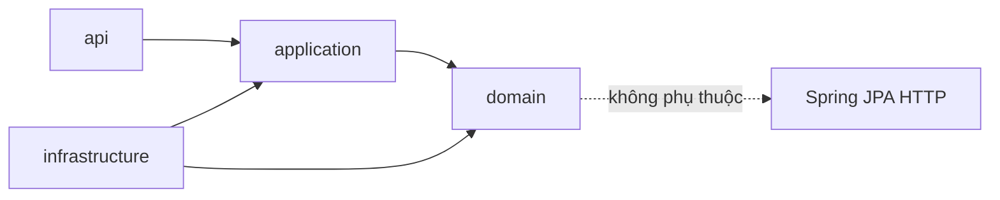

# Quy tắc cấu trúc và phát triển mã nguồn website bất động sản

> **Phạm vi áp dụng:** toàn bộ repository website bất động sản dùng Spring Boot và React TypeScript.  
> **Đối tượng sử dụng:** lập trình viên, người review và mọi AI coding agent.  
> **Trạng thái:** baseline đề xuất để phê duyệt tại G2 của quy trình Waterfall.  
> **Cập nhật:** 11/09/2026.

## 1. Mục đích và cách dùng

Tệp này là quy ước kỹ thuật bắt buộc nhằm giữ mã nguồn nhất quán, dễ kiểm thử và dễ bảo trì khi nhiều người hoặc nhiều AI cùng phát triển. Tệp phải nằm ở thư mục gốc của repository. Khi dùng Codex, Claude hoặc AI khác, yêu cầu AI đọc toàn bộ tệp này trước khi phân tích hoặc sửa code.

Không có một “chuẩn thế giới” duy nhất cho mọi dự án. Baseline này kết hợp tài liệu chính thức của Spring, React Router, TypeScript, Tailwind CSS, Docker, PostgreSQL, OWASP, W3C, OpenAPI và RFC về lỗi HTTP; các lựa chọn riêng của dự án được ghi rõ để toàn đội làm giống nhau.

### 1.1 Từ khóa quy ước

- **MUST / MUST NOT:** bắt buộc hoặc cấm. Vi phạm làm PR không đạt.
- **SHOULD / SHOULD NOT:** mặc định phải làm; ngoại lệ cần giải thích trong PR.
- **MAY:** được phép lựa chọn nếu không phá vỡ các quy tắc khác.
- Khi tệp này mâu thuẫn với SRS, mô hình dữ liệu hoặc quyết định kiến trúc đã được phê duyệt, tài liệu được phê duyệt mới hơn có ưu tiên. Phải cập nhật lại tệp này trong cùng change request.

### 1.2 Thứ tự ưu tiên tài liệu

1. Yêu cầu pháp luật, bảo mật và bảo vệ dữ liệu đã được phê duyệt.
2. SRS và tiêu chí chấp nhận đã baseline tại G1.
3. ADR, OpenAPI, migration và thiết kế đã baseline tại G2.
4. Tệp quy tắc này.
5. Quy ước mặc định của framework hoặc thư viện.

AI MUST dừng và nêu rõ mâu thuẫn nếu không thể đồng thời tuân thủ hai tài liệu ưu tiên ngang nhau. AI MUST NOT tự chọn một phương án rồi âm thầm làm tiếp.

### 1.3 Prompt khởi động dành cho AI

Dùng đoạn sau ở đầu mỗi phiên làm việc lớn:

```text
Trước khi phân tích hoặc sửa mã nguồn, hãy đọc toàn bộ
PROJECT_CODE_RULES_BDS.md và các tài liệu được tệp đó dẫn chiếu.
Hãy cho biết module sở hữu thay đổi, file dự kiến sửa, ảnh hưởng tới
API/CSDL/biến môi trường/bảo mật và các kiểm tra sẽ chạy.
Không tạo cấu trúc, dependency hoặc quy ước mới nếu chưa có trong baseline.
Sau khi làm xong, báo chính xác lệnh đã chạy và phần nào chưa kiểm tra.
```

Nếu công cụ AI tự động đọc `AGENTS.md` hoặc `CLAUDE.md`, file tự động đó chỉ nên dẫn AI tới `PROJECT_CODE_RULES_BDS.md`; không sao chép nguyên bộ quy tắc sang nhiều nơi vì sẽ dễ lệch phiên bản.

## 2. Baseline công nghệ và kiến trúc

| Thành phần | Baseline bắt buộc |
| --- | --- |
| Kiến trúc | Modular monolith; không tự tách microservice |
| Backend | Java, Spring Boot, Spring MVC, Spring Security, Spring Data JPA/JDBC |
| Frontend | React, TypeScript strict, React Router Framework Mode, Vite |
| UI | Tailwind CSS và daisyUI; mobile-first |
| Dữ liệu | PostgreSQL, PostGIS, Flyway |
| Phiên | Spring Session JDBC; cookie HttpOnly, Secure, SameSite |
| Hàng đợi nghiệp vụ | Durable outbox trong PostgreSQL; worker Java |
| Cache và giới hạn | Redis; không phải nguồn dữ liệu chuẩn |
| API | REST JSON, OpenAPI 3.1, lỗi theo RFC 9457 mở rộng |
| Build và chạy | Maven Wrapper, npm lockfile, Docker multi-stage, Docker Compose |
| Kiểm thử | JUnit, Spring Test, Testcontainers, React Testing Library, Playwright |

Phiên bản Java, Spring Boot, Node, npm và image nền phải được chốt tại G2, ghi trong `docs/architecture/technology-baseline.md`, lockfile và CI. Không dùng từ `latest` trong Dockerfile hoặc pipeline phát hành. Nâng phiên bản lớn phải có ADR, kiểm thử hồi quy và kế hoạch rollback.

## 3. Cấu trúc repository bắt buộc

```text
/
├── backend/
│   ├── .mvn/
│   ├── mvnw
│   ├── mvnw.cmd
│   ├── pom.xml
│   ├── Dockerfile
│   └── src/
│       ├── main/
│       │   ├── java/com/<company>/bds/
│       │   └── resources/
│       │       ├── db/migration/
│       │       ├── i18n/
│       │       │   ├── messages.properties
│       │       │   ├── messages_vi.properties
│       │       │   ├── validation.properties
│       │       │   └── validation_vi.properties
│       │       ├── application.yml
│       │       └── logback-spring.xml
│       └── test/
│           ├── java/com/<company>/bds/
│           └── resources/
├── frontend/
│   ├── app/
│   │   ├── root.tsx
│   │   ├── routes.ts
│   │   ├── routes/
│   │   ├── features/
│   │   ├── entities/
│   │   ├── shared/
│   │   ├── i18n/
│   │   ├── styles/
│   │   └── generated/
│   ├── public/
│   ├── tests/e2e/
│   ├── package.json
│   ├── package-lock.json
│   ├── tsconfig.json
│   ├── vite.config.ts
│   └── Dockerfile
├── infra/
│   ├── compose.yaml
│   ├── compose.dev.yaml
│   ├── docker/
│   ├── nginx/
│   └── monitoring/
├── docs/
│   ├── architecture/
│   │   ├── adr/
│   │   └── technology-baseline.md
│   ├── api/openapi.yaml
│   ├── database/
│   ├── operations/
│   ├── security/
│   └── testing/
├── scripts/
├── .github/workflows/
├── .editorconfig
├── .env.example
├── .gitignore
├── .dockerignore
├── README.md
└── PROJECT_CODE_RULES_BDS.md
```

Quy tắc gốc:

- MUST dùng một tên base package Java duy nhất dạng `com.<company>.bds`. Không tạo package `util`, `common`, `helper`, `service` chung chung ở root.
- MUST để mã backend và frontend tách biệt. Frontend không chứa SQL; backend không chứa component React.
- MUST để tài liệu kiến trúc, API, database và vận hành trong `docs/`; không rải file thiết kế tại root.
- MUST đặt script tái sử dụng trong `scripts/`, có hướng dẫn và chế độ fail-fast. Không lưu lệnh thủ công quan trọng chỉ trong lịch sử chat.
- MUST NOT commit file build như `target/`, `build/`, `dist/`, `node_modules/`, log, dump dữ liệu hoặc `.env` thật.
- Không tạo thêm tầng thư mục hoặc tên gọi mới chỉ vì AI thích cách tổ chức khác. Thay đổi cây thư mục cần ADR được duyệt.

## 4. Cấu trúc backend theo module nghiệp vụ

### 4.1 Các module cấp cao

```text
com.<company>.bds
├── BdsApplication.java
├── shared/
│   ├── api/
│   ├── config/
│   ├── error/
│   ├── security/
│   ├── time/
│   └── observability/
├── iam/
├── catalog/
├── listing/
├── media/
├── search/
├── moderation/
├── verification/
├── lead/
├── content/
├── privacy/
├── importing/
└── audit/
```

`shared` chỉ chứa hạ tầng hoặc kiểu dùng thật sự cho từ ba module trở lên. Không đưa logic nghiệp vụ BĐS vào `shared` để tránh biến nó thành nơi chứa mọi thứ.

### 4.2 Cấu trúc bên trong một module

Ví dụ module `listing`:

```text
listing/
├── api/
│   ├── ListingController.java
│   ├── request/
│   ├── response/
│   └── ListingApiMapper.java
├── application/
│   ├── command/
│   ├── query/
│   ├── port/in/
│   ├── port/out/
│   └── service/
├── domain/
│   ├── model/
│   ├── event/
│   ├── policy/
│   └── exception/
└── infrastructure/
    ├── persistence/
    │   ├── entity/
    │   ├── repository/
    │   └── mapper/
    ├── client/
    └── config/
```

### 4.3 Luật phụ thuộc



- `api` MAY gọi `application.port.in`; MUST NOT gọi repository hoặc JPA entity.
- `application` điều phối use case, transaction và authorization nghiệp vụ; MAY dùng `domain`; MUST NOT phụ thuộc HTTP hoặc component React.
- `domain` chứa invariant, state transition, value object và domain event; MUST NOT phụ thuộc controller, DTO, database client hoặc SDK nhà cung cấp.
- `infrastructure` hiện thực output port, persistence và adapter tích hợp; MUST NOT chứa quyết định nghiệp vụ mới.
- Module A MUST NOT import `infrastructure`, repository hay entity của module B. Giao tiếp liên module qua public application port hoặc domain event đã công bố.
- Dùng ArchUnit hoặc Spring Modulith test để khóa các ranh giới này trong CI.

### 4.4 Quy ước lớp backend

| Loại | Tên | Trách nhiệm |
| --- | --- | --- |
| REST controller | `*Controller` | Parse request, gọi use case, map response |
| Request DTO | `*Request` | Dữ liệu vào và Bean Validation |
| Response DTO | `*Response` | Hợp đồng trả về; không lộ entity |
| Command/query | `*Command`, `*Query` | Input bất biến của use case |
| Use case | động từ + nghiệp vụ | Một mục tiêu người dùng rõ ràng |
| Application service | `*Service` | Điều phối transaction và port |
| Domain model | danh từ nghiệp vụ | Invariant và hành vi nghiệp vụ |
| Output port | `*Port` | Hợp đồng mà application cần |
| Adapter | `*Adapter` | Kết nối DB, Redis, object storage, OTP |
| JPA entity | `*JpaEntity` | Mô hình persistence nội bộ |
| Repository | `*Repository` | Truy cập dữ liệu, không chứa flow nghiệp vụ |
| Mapper | `*Mapper` | Chuyển đổi rõ ràng, không truy cập DB |

Quy tắc Java và Spring:

- MUST dùng constructor injection. Cấm field injection.
- SHOULD dùng `record` cho DTO/command/query bất biến khi phù hợp.
- Controller mỏng; không đặt transaction, query JPA, tính giá, đổi trạng thái hoặc authorization nghiệp vụ trong controller.
- Transaction bắt đầu ở application service. Command dùng `@Transactional`; query chỉ đọc dùng `@Transactional(readOnly = true)` khi có lợi.
- Không dựa vào self-invocation của `@Transactional`. Tách use case hoặc bean rõ ràng.
- MUST kiểm tra quyền trên tài nguyên, không chỉ kiểm tra role chung ở route.
- MUST dùng `Clock` được inject cho thời gian nghiệp vụ; không gọi rải rác `Instant.now()` trong domain để test ổn định.
- MUST dùng `BigDecimal` cho diện tích/tỷ lệ cần phần thập phân; dùng `long` cho số tiền VND nếu SRS không cho phép phần lẻ. Không dùng `float`/`double` cho tiền.
- MUST lưu thời điểm bằng `Instant`/UTC. Chuyển múi giờ chỉ ở boundary hiển thị.
- Không trả JPA entity qua API. Không nhận entity trực tiếp từ request.
- Không dùng `Optional` cho field entity/DTO hoặc tham số; dùng cho giá trị trả về khi thật sự biểu diễn có/không.
- Không tạo generic base service/repository để “tái sử dụng” nếu làm mất ngữ nghĩa nghiệp vụ.
- Không dùng Lombok `@Data` cho entity. Nếu dùng Lombok, chỉ dùng annotation hẹp và phải kiểm soát `equals`, `hashCode`, `toString` để không tải lazy relation hoặc lộ PII.
- Không dùng cascade `ALL` mặc định. Mỗi cascade và fetch strategy phải được chọn theo aggregate.
- Phát hiện và ngăn N+1 bằng projection, entity graph hoặc query rõ ràng; không đổi toàn bộ relation thành EAGER.
- Một method vượt khoảng 40 dòng, một class vượt khoảng 300 dòng hoặc có nhiều lý do thay đổi MUST được review về trách nhiệm; không chia file máy móc chỉ để đạt số dòng.

## 5. Cấu trúc frontend React TypeScript

### 5.1 Cây thư mục

```text
frontend/app/
├── root.tsx
├── routes.ts
├── routes/
│   ├── _public.home.tsx
│   ├── _public.listings._index.tsx
│   ├── _public.listings.$listingId.tsx
│   ├── _account.saved.tsx
│   └── _admin.moderation.tsx
├── features/
│   └── listing-search/
│       ├── api/
│       ├── model/
│       ├── ui/
│       ├── lib/
│       └── index.ts
├── entities/
│   └── listing/
│       ├── model/
│       ├── ui/
│       └── index.ts
├── shared/
│   ├── api/
│   ├── config/
│   ├── i18n/
│   ├── lib/
│   ├── types/
│   └── ui/
├── i18n/
│   ├── vi/
│   └── en/
├── styles/
└── generated/
    └── api/
```

### 5.2 Luật phụ thuộc frontend

- `routes` điều phối loader/action, layout và feature; không chứa business logic dài hoặc component dùng lại.
- `features` biểu diễn hành động người dùng như tìm tin, lưu tin, gửi liên hệ. Feature MAY dùng `entities` và `shared`.
- `entities` biểu diễn đối tượng nghiệp vụ như listing, user, lead. Entity MAY dùng `shared`; MUST NOT import feature.
- `shared` không import `features`, `entities` hoặc `routes`.
- Chỉ import qua public API `index.ts` của feature/entity; không deep-import file nội bộ từ module khác.
- Không tạo barrel export toàn ứng dụng; barrel chỉ là public API nhỏ, tránh circular dependency.
- Types tạo từ OpenAPI đặt trong `generated/api/` và không sửa tay. Thay hợp đồng tại `docs/api/openapi.yaml`, sinh lại client và commit diff.

### 5.3 Quy tắc TypeScript và React

- `strict: true` là bắt buộc. SHOULD bật thêm `noUncheckedIndexedAccess`, `exactOptionalPropertyTypes`, `noImplicitOverride` khi công cụ tương thích.
- Cấm `any`, `@ts-ignore` và type assertion chỉ để làm compiler im lặng. Ngoại lệ phải có comment lý do, validation runtime và issue xử lý nợ kỹ thuật.
- Dữ liệu ngoài biên như API, query string, storage và form MUST được parse/validate; không ép kiểu bằng `as` rồi tin dữ liệu.
- Component dùng PascalCase; hook bắt đầu bằng `use`; file route theo quy ước React Router; hằng số UPPER_SNAKE_CASE khi thật sự bất biến.
- Component ưu tiên thuần và nhỏ. Side effect đặt trong loader/action, hook hoặc adapter phù hợp; không gọi API trong component trình bày.
- Không lưu cùng một dữ liệu server ở nhiều store. React Router loader/action là cơ chế mặc định; thêm thư viện server-state chỉ khi có ADR.
- Không đưa state có thể suy ra vào state riêng. Không dùng `useEffect` để thay thế event handler hoặc dữ liệu dẫn xuất.
- Props và return type của public component/hook MUST rõ ràng. Không dùng `React.FC` như yêu cầu bắt buộc.
- Mỗi danh sách động MUST có key ổn định từ dữ liệu, không dùng index nếu phần tử có thể thay đổi thứ tự.
- Error boundary phải tồn tại ở root và các route quan trọng. Loading, empty, partial và error state là trạng thái thiết kế bắt buộc.
- Không viết chuỗi URL API rải rác. Dùng một API client và cấu hình base URL tập trung.
- Không hardcode chuỗi hiển thị trong nhiều component. Chuỗi giao diện và lỗi do frontend tạo đặt trong `app/i18n/<locale>/` với key ổn định.
- Không sao chép component chỉ để đổi vài class. Tách variant có giới hạn và API rõ ràng; tránh component “vạn năng” với hàng chục boolean props.

## 6. Responsive và khả năng truy cập

### 6.1 Nguyên tắc responsive

- MUST thiết kế mobile-first. Class Tailwind không prefix là giao diện nhỏ; `sm:`, `md:`, `lg:` chỉ tăng cường khi đủ không gian.
- MUST có `<meta name="viewport" content="width=device-width, initial-scale=1.0">`.
- Không đặt chiều rộng cố định gây tràn. Ưu tiên `w-full`, `max-w-*`, grid/flex, `minmax()` và container query khi cần.
- Không dùng absolute positioning để dựng layout chính. Absolute chỉ cho overlay có container tương đối rõ ràng.
- Ảnh MUST có kích thước nội tại/aspect ratio để tránh layout shift, dùng `srcset`/`sizes` hoặc dịch vụ biến thể ảnh, lazy-load ảnh ngoài viewport.
- Bảng rộng phải có bản trình bày mobile phù hợp hoặc vùng cuộn ngang có nhãn; không thu nhỏ chữ đến mức khó đọc.
- Filter bất động sản trên mobile dùng drawer/sheet; trạng thái lọc phải được giữ và phản ánh trên URL khi có thể chia sẻ.
- Màn hình danh sách–bản đồ trên mobile MUST có nút chuyển rõ ràng; không ép hiển thị hai cột hẹp.

### 6.2 Ma trận màn hình tối thiểu

| Nhóm | Viewport kiểm tra | Yêu cầu |
| --- | --- | --- |
| Mobile nhỏ | 320 × 568 | Không tràn ngang, thao tác chính dùng được |
| Mobile phổ biến | 360 × 800 và 390 × 844 | Form, filter, modal, bàn phím ảo không che nút |
| Tablet | 768 × 1024 | Xoay dọc/ngang không mất nội dung |
| Laptop | 1024 × 768 và 1280 × 800 | Grid, menu, bản đồ và panel cân đối |
| Desktop | 1440 × 900 và 1920 × 1080 | Có max-width; nội dung không kéo quá dài |

Mỗi màn hình mới MUST được kiểm tra ít nhất ở 360, 768, 1024 và 1440 CSS pixel. Chỉ resize trình duyệt là chưa đủ cho luồng quan trọng; CI E2E phải có project mobile và desktop.

### 6.3 Accessibility

- Mục tiêu là WCAG 2.2 AA. Semantic HTML có ưu tiên hơn ARIA.
- Mọi input có label; lỗi gắn với trường bằng `aria-describedby`; focus chuyển hợp lý sau submit lỗi.
- Mọi thao tác dùng được bằng bàn phím; focus indicator không bị xóa.
- Nút chỉ có icon phải có accessible name. Ảnh thông tin có alt; ảnh trang trí dùng alt rỗng.
- Màu không phải tín hiệu duy nhất. Kiểm tra contrast ở mọi state.
- Vùng chạm SHOULD đạt 44 × 44 CSS pixel; MUST không thấp hơn yêu cầu tối thiểu của WCAG nếu không thuộc ngoại lệ.
- Tôn trọng `prefers-reduced-motion`; không animation gây cản trở.
- Nội dung vẫn dùng được khi zoom chữ 200% và khi lỗi mạng chậm.

## 7. Cấu hình và biến môi trường

### 7.1 Quy tắc bắt buộc

- MUST lưu cấu hình thay đổi theo môi trường ngoài mã nguồn. Spring Boot đọc qua environment/config tree; frontend SSR đọc qua environment của process.
- `.env` chỉ dùng cho phát triển cục bộ. MUST có `.env.example` chứa tên biến và giá trị mẫu không nhạy cảm.
- MUST gitignore `.env`, `.env.*` và chỉ cho phép commit `.env.example`.
- Production MUST dùng secret manager, secret của nền tảng hoặc file secret mount; không coi `.env` trên server là kho bí mật dài hạn.
- Không commit password, token, private key, DSN có credential, OTP secret, encryption key hoặc dữ liệu cá nhân.
- Không hardcode URL môi trường, bucket, domain, timeout, giới hạn rate hoặc feature flag trong code.
- Backend SHOULD bind nhóm cấu hình bằng `@ConfigurationProperties` có Bean Validation; hạn chế `@Value` rải rác.
- Ứng dụng MUST fail fast khi thiếu biến bắt buộc hoặc giá trị sai định dạng. Không tự dùng default yếu cho secret.
- Không log giá trị secret. Trang Actuator `env` và `configprops` phải bị bảo vệ và sanitize.

### 7.2 Biến frontend không phải bí mật

Biến có prefix `VITE_` có thể được đóng gói vào JavaScript phía trình duyệt và MUST được coi là công khai. Không đặt secret vào biến `VITE_*`. Biến chỉ dùng trên server SSR không được serialize vào loader response hoặc HTML.

### 7.3 `.env.example` chuẩn

```dotenv
# Runtime
APP_ENV=development
APP_BASE_URL=http://localhost:3000
API_INTERNAL_URL=http://backend:8080
VITE_PUBLIC_API_BASE_URL=/api

# Spring Boot
SPRING_PROFILES_ACTIVE=local
SERVER_PORT=8080
POSTGRES_DB=bds
POSTGRES_USER=bds
POSTGRES_PASSWORD=change-me
SPRING_DATASOURCE_URL=jdbc:postgresql://postgres:5432/bds
SPRING_DATASOURCE_USERNAME=bds
SPRING_DATASOURCE_PASSWORD=change-me
SPRING_DATA_REDIS_HOST=redis
SPRING_DATA_REDIS_PORT=6379

# Storage and external adapters
OBJECT_STORAGE_ENDPOINT=http://object-storage:9000
OBJECT_STORAGE_BUCKET=bds-local
OBJECT_STORAGE_ACCESS_KEY=change-me
OBJECT_STORAGE_SECRET_KEY=change-me
OTP_PROVIDER_BASE_URL=https://example.invalid
OTP_PROVIDER_API_KEY=change-me

# Security: development placeholder only; generate a strong value locally
PII_ENCRYPTION_KEY=change-me
PHONE_LOOKUP_HMAC_KEY=change-me
```

Trong Docker Compose, `.env` chủ yếu phục vụ nội suy. Muốn biến đi vào container phải khai báo `env_file` hoặc `environment` rõ ràng. AI MUST NOT giả định Spring Boot tự đọc tệp `.env` khi chạy trực tiếp ngoài Compose.

### 7.4 `.gitignore` tối thiểu

```gitignore
.env
.env.*
!.env.example
**/target/
**/build/
**/dist/
**/node_modules/
*.log
*.pid
*.dump
.idea/
.vscode/
```

## 8. Validation và quản lý message lỗi

### 8.1 Nguyên tắc

- Message validation backend MUST đặt trong `backend/src/main/resources/i18n/validation.properties`; không hardcode tiếng Việt/Anh trong annotation, validator, controller hoặc exception.
- MUST có file base `validation.properties` để tránh thiếu bundle. Bản tiếng Việt ở `validation_vi.properties`; thêm locale khác bằng file cùng basename.
- Message nghiệp vụ không phải validation trường đặt trong `messages.properties` và `messages_vi.properties`.
- Key là ổn định và có namespace: `validation.<module>.<field>.<rule>` hoặc `error.<module>.<case>`.
- API trả cả `code` ổn định cho máy và `message` đã localize cho người. Frontend logic dựa trên `code`, MUST NOT so sánh chuỗi message.
- Lỗi không được lộ stack trace, SQL, tên bảng, đường dẫn máy chủ, secret, tồn tại tài khoản hoặc dữ liệu của người khác.
- Validation frontend giúp trải nghiệm; backend luôn là nguồn xác nhận cuối cùng.

### 8.2 Cấu hình Spring

```yaml
spring:
  messages:
    basename: i18n/messages,i18n/validation
    encoding: UTF-8
    fallback-to-system-locale: false
```

Nếu phiên bản Spring Boot đã pin không tự nối `MessageSource` của ứng dụng với Bean Validation, cấu hình một bean trung tâm:

```java
@Configuration
class ValidationConfig {

    @Bean
    LocalValidatorFactoryBean validator(MessageSource messageSource) {
        var validator = new LocalValidatorFactoryBean();
        validator.setValidationMessageSource(messageSource);
        return validator;
    }
}
```

Không tạo nhiều validator factory ở từng module.

### 8.3 Ví dụ request và properties

```java
public record CreateListingRequest(
    @NotNull(message = "{validation.listing.purpose.required}")
    ListingPurpose purpose,

    @NotNull(message = "{validation.listing.area.required}")
    @DecimalMin(value = "1.0", message = "{validation.listing.area.min}")
    BigDecimal areaM2,

    @Size(min = 30, max = 5000, message = "{validation.listing.description.size}")
    String description
) {}
```

```properties
# i18n/validation.properties
validation.listing.purpose.required=Listing purpose is required.
validation.listing.area.required=Area is required.
validation.listing.area.min=Area must be at least {value} m².
validation.listing.description.size=Description must contain from {min} to {max} characters.
```

```properties
# i18n/validation_vi.properties
validation.listing.purpose.required=Vui lòng chọn mục đích đăng tin.
validation.listing.area.required=Vui lòng nhập diện tích.
validation.listing.area.min=Diện tích phải từ {value} m².
validation.listing.description.size=Mô tả phải có từ {min} đến {max} ký tự.
```

### 8.4 Hợp đồng lỗi API

Mọi lỗi HTTP dùng `application/problem+json` theo RFC 9457 và mở rộng thống nhất:

```json
{
  "type": "https://api.example.vn/problems/validation-error",
  "title": "Dữ liệu không hợp lệ",
  "status": 400,
  "detail": "Có 2 trường cần kiểm tra lại.",
  "instance": "/api/v1/listings",
  "code": "VALIDATION_ERROR",
  "traceId": "01J...",
  "errors": [
    {
      "field": "areaM2",
      "code": "validation.listing.area.required",
      "message": "Vui lòng nhập diện tích."
    }
  ]
}
```

MUST có một `@RestControllerAdvice` trung tâm map exception sang status/code. Domain exception không chứa HTTP status. Không bắt `Exception` rồi luôn trả 200 hoặc 400.

| Trường hợp | HTTP mặc định |
| --- | --- |
| Request sai cú pháp/validation | 400 |
| Chưa đăng nhập | 401 |
| Không có quyền | 403 |
| Không tìm thấy hoặc không được phép biết tồn tại | 404 theo chính sách |
| Xung đột version/idempotency/state | 409 |
| Quá giới hạn | 429 |
| Lỗi ngoài dự kiến | 500 với thông tin an toàn |
| Nhà cung cấp tạm lỗi | 502/503 tùy bản chất |

## 9. Quy tắc REST API và hợp đồng dữ liệu

- Public API MUST có prefix `/api/v1`; thay đổi phá vỡ hợp đồng cần version mới hoặc kế hoạch tương thích.
- `docs/api/openapi.yaml` là nguồn chuẩn của request, response, error, auth và example.
- JSON dùng `camelCase`; URL resource dùng danh từ số nhiều dạng kebab-case.
- Không đưa động từ CRUD vào URL khi HTTP method đã biểu đạt hành động. Hành động nghiệp vụ như `submit`, `pause`, `approve` MAY dùng subresource/action đã mô tả trong OpenAPI.
- ID công khai dùng UUID/ULID theo baseline; không phơi ID tuần tự nếu tạo rủi ro enumeration.
- Thời gian API là ISO 8601 có timezone; server lưu UTC.
- Pagination bắt buộc với collection có thể tăng. Không có endpoint “lấy tất cả” cho listing, lead, audit hoặc report.
- Sort/filter phải nằm trong allowlist; cấm ghép trực tiếp tên cột từ input.
- Upload dùng flow intent/presigned URL và kiểm tra loại, kích thước, checksum, malware policy; không tin MIME do client gửi.
- Operation tạo lead, submit, approve, import và thanh toán trong tương lai MUST có chiến lược idempotency.
- Endpoint thay đổi aggregate cần optimistic locking hoặc lock rõ ràng; xung đột trả 409, không ghi đè im lặng.
- Deprecation phải được ghi trong OpenAPI, release note và có thời hạn loại bỏ.
- Không log toàn bộ body nếu có PII, credential, nội dung xác minh hoặc file.

## 10. Cơ sở dữ liệu và migration

### 10.1 Flyway là nguồn chuẩn

- Mọi thay đổi schema MUST qua migration trong `backend/src/main/resources/db/migration/`.
- Tên file: `V<version>__<mo_ta_snake_case>.sql`, ví dụ `V012__add_listing_public_location.sql`.
- Migration đã chạy trên bất kỳ môi trường dùng chung MUST NOT bị sửa hoặc đổi tên. Tạo migration mới để sửa.
- `ddl-auto` production MUST là `validate` hoặc `none`; cấm `update`, `create`, `create-drop`.
- Migration phải chạy được từ DB sạch và nâng cấp từ version production gần nhất.
- Thay đổi phá hủy theo expand–migrate–contract: thêm cấu trúc tương thích, backfill/dual-read khi cần, chuyển ứng dụng, sau đó mới xóa ở release khác.
- Migration dữ liệu lớn phải có ước tính lock/thời gian, batch và kế hoạch rollback/roll-forward.

### 10.2 Ràng buộc và truy vấn

- Invariant bắt buộc phải được bảo vệ cả ở service và DB khi DB biểu đạt được: `NOT NULL`, `CHECK`, `UNIQUE`, FK.
- FK mặc định `RESTRICT`; chỉ dùng `CASCADE` khi vòng đời con thực sự thuộc hoàn toàn về cha.
- Mọi FK và query quan trọng cần đánh giá index. Index phải dựa trên query thực tế và `EXPLAIN`, không thêm theo cảm tính.
- Query có dữ liệu người dùng MUST luôn có điều kiện tenant/owner/quyền phù hợp.
- Không dùng `SELECT *` trong query native hoặc báo cáo ổn định.
- PostGIS: lưu `private_location` và `public_location` riêng; API công khai chỉ dùng public location đã làm mờ theo chính sách.
- PII nhạy cảm mã hóa ở application/adapter theo thiết kế; trường tra cứu số điện thoại dùng HMAC có secret, không dùng SHA đơn thuần.
- Dữ liệu audit/outbox append-only theo quyền ứng dụng; job dọn dữ liệu tuân retention và legal hold.
- Backup chưa được coi là đạt nếu chưa diễn tập restore và ghi bằng chứng.

### 10.3 Quy tắc nghiệp vụ BĐS bất biến

- Revision đã `SUBMITTED`, `APPROVED` hoặc `REJECTED` MUST bất biến; sửa nội dung tạo revision mới.
- `Listing.publicRevisionId` chỉ trỏ revision đã duyệt. Tin ACTIVE cũ có thể tiếp tục hiển thị khi đang soạn nháp mới; khi submit sửa, hành vi ẩn/hiện theo SRS và moderation policy.
- Tạo lead phải đọc lại trạng thái ACTIVE, hạn tin, chủ tin và public revision trong transaction.
- Consent, lead, lead event, idempotency receipt và outbox của một thao tác phải commit nhất quán theo thiết kế.
- Worker retry có giới hạn; không gửi SMS/email khi đang giữ transaction hoặc lock DB dài.
- Không công khai địa chỉ riêng, số điện thoại khách, hồ sơ xác minh hoặc ghi chú moderation.

## 11. Docker và Docker Compose

### 11.1 Dockerfile

- Mỗi ứng dụng có Dockerfile riêng và multi-stage build.
- Builder chứa compiler/dependency; runtime chỉ chứa artifact và runtime cần thiết.
- Container runtime MUST chạy non-root, có filesystem chỉ ghi tại thư mục được chỉ định.
- Image nền dùng registry tin cậy, pin major/minor và pin digest ở production. Dependabot/Renovate mở PR cập nhật; không tự trôi version.
- MUST có `.dockerignore`; không copy `.git`, `.env`, test report, local cache, `node_modules` hoặc `target` từ máy host.
- Sắp xếp layer để cache dependency: copy manifest/lockfile trước, tải dependency, sau đó copy source.
- Không cài editor, curl hoặc package không cần trong runtime image.
- Không bake secret vào `ARG`, `ENV`, layer hoặc artifact frontend. Build secret dùng BuildKit secret mount khi cần.
- Image MUST có OCI labels tối thiểu cho source, revision và created time do CI gắn.
- Health endpoint phân biệt liveness/readiness; không trả healthy nếu dependency bắt buộc chưa sẵn sàng.

Ví dụ backend, cần thay digest và version theo baseline G2:

```dockerfile
# syntax=docker/dockerfile:1
FROM maven:3.9-eclipse-temurin-21 AS build
WORKDIR /workspace
COPY pom.xml mvnw ./
COPY .mvn .mvn
RUN ./mvnw -B -DskipTests dependency:go-offline
COPY src src
RUN ./mvnw -B -DskipTests package

FROM eclipse-temurin:21-jre AS runtime
WORKDIR /app
RUN addgroup --system app && adduser --system --ingroup app app
COPY --from=build --chown=app:app /workspace/target/*.jar /app/app.jar
USER app
EXPOSE 8080
ENTRYPOINT ["java", "-jar", "/app/app.jar"]
```

Ví dụ frontend SSR:

```dockerfile
# syntax=docker/dockerfile:1
FROM node:24-alpine AS deps
WORKDIR /app
COPY package.json package-lock.json ./
RUN npm ci

FROM deps AS build
COPY . .
RUN npm run build

FROM node:24-alpine AS runtime
ENV NODE_ENV=production
WORKDIR /app
COPY package.json package-lock.json ./
RUN npm ci --omit=dev && npm cache clean --force
COPY --from=build --chown=node:node /app/build ./build
USER node
EXPOSE 3000
CMD ["npm", "run", "start"]
```

Dockerfile chỉ là skeleton. AI phải khớp đúng artifact và script thực tế, nhưng không được bỏ multi-stage/non-root.

### 11.2 Compose

```yaml
name: bds

services:
  postgres:
    image: postgis/postgis:<approved-version>@sha256:<approved-digest>
    env_file: ../.env
    volumes:
      - postgres-data:/var/lib/postgresql/data
    healthcheck:
      test: ["CMD-SHELL", "pg_isready -U $${POSTGRES_USER} -d $${POSTGRES_DB}"]
      interval: 10s
      timeout: 5s
      retries: 10

  redis:
    image: redis:<approved-version>@sha256:<approved-digest>
    command: ["redis-server", "--appendonly", "no"]

  backend:
    build:
      context: ../backend
    env_file: ../.env
    depends_on:
      postgres:
        condition: service_healthy
    read_only: true
    tmpfs:
      - /tmp

  frontend:
    build:
      context: ../frontend
    env_file: ../.env
    depends_on:
      - backend

volumes:
  postgres-data:
```

- Dev Compose MAY publish DB/Redis port ở `compose.dev.yaml`; production không publish cổng nội bộ.
- Compose không chứa secret thật. `docker compose config` MUST chạy thành công trước merge.
- Database, backend, frontend, Redis và worker là container trách nhiệm riêng. Không chạy tất cả trong một container.
- Dữ liệu bền vững ở named volume/object storage; container app phải có thể bị xóa và tạo lại.

Lệnh chuẩn:

```bash
cp .env.example .env
docker compose -f infra/compose.yaml -f infra/compose.dev.yaml config
docker compose -f infra/compose.yaml -f infra/compose.dev.yaml build --pull
docker compose -f infra/compose.yaml -f infra/compose.dev.yaml up -d
docker compose -f infra/compose.yaml -f infra/compose.dev.yaml ps
```

## 12. Security và quyền riêng tư

- Áp dụng checklist OWASP ASVS phù hợp mức rủi ro và threat model của hệ thống.
- Deny-by-default cho endpoint riêng tư. Kiểm tra authorization cả ở API và application service cho operation nhạy cảm.
- Cookie phiên: `HttpOnly`, `Secure`, `SameSite` phù hợp; rotate session sau đăng nhập/thay đổi đặc quyền; logout thu hồi session.
- State-changing request dùng CSRF protection. CORS là allowlist chính xác, không dùng `*` với credential.
- Password nếu có dùng password encoder chuẩn của Spring Security; OTP có TTL, số lần thử, rate limit và replay protection.
- Rate limit theo IP, account, phone lookup hoặc operation tùy threat model; không chỉ theo một header do client tự gửi.
- Input validation không thay thế output encoding. React không dùng `dangerouslySetInnerHTML` trừ khi sanitizer và test được duyệt.
- Query parameter hóa; không nối SQL, JPQL, shell hoặc URL nhà cung cấp từ input chưa kiểm soát.
- SSRF: endpoint gọi URL bên ngoài dùng allowlist host/scheme, timeout, giới hạn redirect và chặn mạng nội bộ.
- File upload kiểm tra extension, MIME thực, magic bytes, dung lượng, số lượng; đổi tên server-side và tách kho private/public.
- Log và analytics không chứa OTP, session ID, token, số điện thoại đầy đủ, địa chỉ riêng hoặc hồ sơ xác minh.
- Dependency scanning, secret scanning và SAST chạy trong CI. Lỗ hổng critical/high có đường xử lý và SLA nội bộ.
- GitHub Actions dùng quyền tối thiểu, pin action theo commit SHA trong workflow production, không checkout code không tin cậy trong workflow có secret.

## 13. Logging quan sát và vận hành

- Production log dạng structured JSON; mỗi request có `traceId`/correlation ID xuyên frontend SSR, backend và worker.
- Log theo event và kết quả, không log nguyên object/request. Dùng field có schema: `event`, `module`, `actorId`, `aggregateId`, `result`, `durationMs`, `traceId`.
- Dữ liệu PII phải mask hoặc loại bỏ trước khi log. Không chỉ dựa vào cấu hình logger để che dữ liệu.
- Metrics tối thiểu: request rate/error/latency, DB pool, query chậm, cache, outbox lag, worker retry/dead-letter, lead submit, OTP rate và external provider error.
- Readiness có thể phụ thuộc DB; liveness không nên chết chỉ vì nhà cung cấp ngoài tạm lỗi.
- Alert phải gắn runbook trong `docs/operations/`; runbook có owner, chẩn đoán, giảm thiểu và rollback.
- Audit nghiệp vụ tách với log kỹ thuật. Log kỹ thuật không thay thế audit trail.

## 14. Kiểm thử bắt buộc

### 14.1 Kim tự tháp test

| Tầng | Phạm vi |
| --- | --- |
| Unit | Domain invariant, policy, mapper, utility thuần |
| Slice | Controller, serializer, repository, security rule |
| Integration | PostgreSQL/PostGIS, Redis, Flyway, transaction, outbox qua Testcontainers |
| Contract | OpenAPI request/response/error và client sinh tự động |
| Component | React component với tương tác người dùng |
| E2E | Luồng P0 trên mobile và desktop qua Playwright |
| NFR | Load, security, accessibility, backup/restore trước G4/G5 |

### 14.2 Quy tắc test

- Mỗi bug fix MUST có test tái hiện lỗi trước hoặc cùng lúc sửa.
- Test tên theo hành vi và kết quả, không theo implementation.
- Không dùng `Thread.sleep` cho async; dùng clock giả, polling có timeout hoặc công cụ đồng bộ.
- Test độc lập thứ tự, không dùng dữ liệu chung có thể rò trạng thái.
- Integration test dùng phiên bản Postgres/PostGIS tương thích production, không thay bằng H2 cho hành vi SQL quan trọng.
- Test transaction đồng thời cho approve, dedup lead, receipt idempotency và import cùng source key.
- Contract test xác nhận mọi response lỗi có `code`, `traceId` và không lộ dữ liệu nhạy cảm.
- Frontend test theo role/name/label như người dùng, hạn chế query theo class hoặc test id.
- E2E P0 tối thiểu: đăng nhập, tạo/lưu/gửi tin, kiểm duyệt, tìm tin, gửi liên hệ, xử lý lead, report/gỡ tin và nhập dữ liệu.
- Coverage là tín hiệu, không phải mục tiêu duy nhất. Code critical về state, quyền, tiền, PII và transaction phải có branch coverage có ý nghĩa.
- Cấm xóa/skip test để build xanh. Quarantine test flaky phải có issue, owner và thời hạn.

## 15. Chất lượng giao diện SEO và hiệu năng

- Trang public quan trọng dùng SSR và metadata chính xác; canonical, sitemap và structured data phải phản ánh nội dung thật.
- URL filter có allowlist và chiến lược index/noindex; không sinh vô hạn URL crawlable.
- Mỗi trang có loading/empty/error/unauthorized/not-found state được thiết kế.
- Component dùng token/theme; không đưa mã màu, spacing tùy ý lặp lại. daisyUI theme là nguồn màu chính, Tailwind theme variables là nguồn token.
- Không làm responsive bằng JavaScript nếu CSS giải quyết được; tránh đọc `window.innerWidth` để quyết định layout.
- Đặt performance budget tại G2 cho JS, ảnh, LCP, INP và CLS; CI hoặc monitoring cảnh báo regression.
- Route-level code splitting; không import toàn bộ thư viện icon, map hoặc editor vào initial bundle.
- Map, gallery và nội dung dưới fold được lazy-load có skeleton ổn định.
- Không tối ưu bằng cache trước khi có số liệu; cache key, TTL, invalidation và fallback phải được ghi rõ.

## 16. Quy ước code style và công cụ

### 16.1 Chung

- UTF-8, LF, newline cuối file, không trailing whitespace.
- Dùng `.editorconfig` thống nhất indent; formatter là nguồn quyết định, không tranh luận style thủ công.
- Tên biến/hàm mô tả nghiệp vụ bằng tiếng Anh; tài liệu và message người dùng có thể đa ngôn ngữ.
- Comment giải thích “vì sao” và constraint, không lặp lại “code làm gì”.
- TODO bắt buộc có issue/mã công việc, owner hoặc điều kiện xóa; không để TODO vô thời hạn.
- Không commit dead code, code comment-out, log debug hoặc fixture chứa PII.

### 16.2 Backend

- Dùng formatter/linter đã pin trong Maven, ví dụ Spotless và Checkstyle; không chạy formatter khác phá diff.
- Warning mới phải được xử lý. `@SuppressWarnings` cần phạm vi nhỏ và giải thích.
- Package-private mặc định cho implementation nội bộ; chỉ public những gì thuộc API module.

### 16.3 Frontend

- ESLint và Prettier được pin; CI chạy trên toàn source.
- Import order do linter xử lý. Alias được khai báo một nơi và khớp Vite/TypeScript/test.
- CSS custom chỉ dùng khi Tailwind/daisyUI không biểu đạt hợp lý; đặt gần feature hoặc trong layer styles phù hợp.
- Không dùng inline style cho token tĩnh; inline style MAY dùng giá trị động như tọa độ/kích thước đã kiểm soát.

## 17. Git workflow và CI

- Nhánh chính luôn có thể build. Mọi thay đổi qua PR và review; không push production trực tiếp.
- Commit nhỏ, có một mục đích, message rõ; SHOULD dùng Conventional Commits.
- PR phải liên kết FR/US/bug/CR; nêu thay đổi schema, API, env, security, rollout và rollback.
- Lockfile MUST commit. Dependency thêm mới cần lý do, giấy phép và đánh giá bảo mật/kích thước.
- Không trộn refactor lớn với feature/bug fix nếu không cần thiết.
- Generated code phải sinh bằng lệnh có thể lặp lại; không sửa tay.

Pipeline tối thiểu:

```text
format/lint
  ├── backend compile + unit + architecture tests
  ├── frontend typecheck + unit + build
  ├── migration + integration tests
  ├── OpenAPI lint + contract diff
  ├── secret/SAST/dependency/container scan
  ├── E2E P0 mobile + desktop
  └── Docker build + smoke test
```

Các lệnh chuẩn mà AI phải dùng nếu script tồn tại:

```bash
cd backend && ./mvnw -B verify
cd frontend && npm ci
cd frontend && npm run format:check
cd frontend && npm run lint
cd frontend && npm run typecheck
cd frontend && npm run test
cd frontend && npm run build
docker compose -f infra/compose.yaml config
docker compose -f infra/compose.yaml build
```

Nếu repository cung cấp `make verify` hoặc `scripts/verify.*`, đó là entry point ưu tiên và phải gọi các kiểm tra tương đương.

## 18. Quy trình bắt buộc khi AI sửa code

### 18.1 Trước khi sửa

AI MUST:

1. Đọc `PROJECT_CODE_RULES_BDS.md`, yêu cầu liên quan, `README`, OpenAPI, migration và ADR của module.
2. Dùng tìm kiếm để xác định implementation, test và call site hiện có trước khi tạo file mới.
3. Xác định module sở hữu nghiệp vụ và ranh giới transaction.
4. Nêu ngắn gọn file dự kiến sửa, thay đổi API/schema/env và rủi ro.
5. Nếu yêu cầu mơ hồ có thể làm đổi dữ liệu, quyền, public API hoặc kiến trúc, phải hỏi trước.

### 18.2 Trong khi sửa

- Chọn thay đổi nhỏ nhất nhưng đầy đủ, không sửa file không liên quan.
- Tái sử dụng abstraction/component hiện có nếu đúng trách nhiệm; không tạo bản thứ hai chỉ khác tên.
- Không “sửa cột” hoặc đổi tên cột trực tiếp trong entity rồi bỏ qua migration, OpenAPI, mapper và test.
- Khi thêm field, phải kiểm tra đủ chuỗi: migration → constraint/index → persistence → domain → mapper → DTO → OpenAPI → generated client → form/list/detail → i18n → test.
- Khi đổi state, phải cập nhật state machine/invariant, authorization, audit, outbox, API error, activity/sequence liên quan và test chuyển trạng thái.
- Khi thêm env, cập nhật `.env.example`, typed config, Compose/manifest, tài liệu vận hành và startup validation.
- Khi thêm message lỗi, cập nhật properties base và các locale được hỗ trợ; không đưa chuỗi vào code.
- Không tự thêm dependency lớn, framework, state manager, ORM khác hoặc message broker nếu chưa có ADR.
- Không vô hiệu CSRF/CORS/security, không dùng `permitAll()` để chữa lỗi test, không cấp role rộng hơn để flow chạy.
- Không swallow exception; giữ cause ở log an toàn và trả Problem Details phù hợp.
- Không dùng retry mù cho operation không idempotent.

### 18.3 Sau khi sửa

AI MUST:

1. Chạy formatter, lint, typecheck, unit/integration test liên quan và build.
2. Chạy full verify nếu thay public contract, migration, security, shared code hoặc flow P0.
3. Build Docker và smoke test nếu sửa Dockerfile, dependency, config runtime hoặc startup.
4. Kiểm tra UI ở ma trận responsive và bàn phím nếu sửa frontend.
5. Báo rõ lệnh đã chạy và kết quả; không nói “đã test” nếu chưa chạy.
6. Liệt kê migration, env, API hoặc bước deploy cần chú ý.
7. Không để file tạm, secret, log hoặc dữ liệu test trong diff.

## 19. Checklist thay đổi thường gặp

### 19.1 Thêm hoặc sửa một cột CSDL

- [ ] Xác nhận ý nghĩa, nullable, default, dữ liệu cũ và retention.
- [ ] Tạo Flyway migration mới; không sửa migration đã áp dụng.
- [ ] Thêm constraint/index có lý do.
- [ ] Cập nhật persistence entity và mapper.
- [ ] Cập nhật domain/value object/invariant nếu liên quan.
- [ ] Cập nhật request/response DTO và OpenAPI nếu public.
- [ ] Cập nhật client sinh tự động và UI.
- [ ] Cập nhật validation properties ở mọi locale.
- [ ] Test DB sạch, upgrade, rollback/roll-forward và dữ liệu cũ.
- [ ] Kiểm tra log/audit/PII và quyền đọc field.

### 19.2 Thêm endpoint

- [ ] Có US/FR và authorization rule.
- [ ] OpenAPI trước hoặc cùng code.
- [ ] Request validation dùng message key.
- [ ] Response DTO không lộ entity/PII.
- [ ] Problem Details cho mọi nhánh lỗi.
- [ ] Pagination/idempotency/version nếu cần.
- [ ] Controller, application use case, domain và adapter đúng tầng.
- [ ] Unit/slice/integration/contract test.
- [ ] Rate limit, audit và observability nếu nhạy cảm.

### 19.3 Thêm màn hình hoặc component

- [ ] Có route/feature owner rõ ràng; không đặt logic dài trong route.
- [ ] Dùng generated API types.
- [ ] Loading, empty, error, unauthorized và retry state.
- [ ] Chuỗi ở i18n; lỗi theo code.
- [ ] Semantic HTML, keyboard, focus, label và contrast.
- [ ] Kiểm tra 360/768/1024/1440, zoom 200% và reduced motion.
- [ ] Component/unit test và E2E nếu là luồng P0.
- [ ] Kiểm tra bundle/ảnh/SSR/SEO nếu là trang public.

### 19.4 Thêm biến môi trường

- [ ] Tên có namespace và ý nghĩa rõ.
- [ ] Có trong `.env.example` nhưng không có secret thật.
- [ ] Có typed binding và startup validation.
- [ ] Có mapping Compose/deployment.
- [ ] Không đặt secret trong `VITE_*`.
- [ ] Không log giá trị; có hướng dẫn rotate nếu là secret.

## 20. Definition of Done

Một task chỉ được coi là hoàn thành khi tất cả điều kiện áp dụng đều đạt:

- [ ] Tiêu chí chấp nhận của US/FR đã có bằng chứng test.
- [ ] Kiến trúc module và dependency rule không bị phá.
- [ ] Không hardcode secret, URL môi trường hoặc message lỗi.
- [ ] API/OpenAPI, migration, entity, DTO, client và UI nhất quán.
- [ ] Validation base + locale đầy đủ; frontend xử lý theo error code.
- [ ] Authorization, PII, audit, idempotency và transaction được review.
- [ ] Responsive và accessibility đạt ma trận yêu cầu.
- [ ] Formatter, lint, typecheck, test và build đều qua.
- [ ] Docker image build được, chạy non-root và smoke test qua nếu liên quan.
- [ ] Không có test bị skip, warning mới, file tạm hoặc dependency không giải thích.
- [ ] Tài liệu, ADR, runbook, `.env.example` và release note được cập nhật nếu liên quan.
- [ ] PR mô tả rollout, rollback và tương thích dữ liệu/API.

## 21. Các hành vi bị cấm

- Tự đổi kiến trúc, framework, database hoặc tách microservice.
- Tạo một thư mục `utils`/`common` khổng lồ hoặc copy logic giữa module.
- Để business logic trong controller, React component, JPA repository hoặc migration.
- Frontend truy cập DB hoặc dùng credential backend.
- Hardcode secret, domain môi trường, message lỗi, role ID hoặc trạng thái bằng số ma thuật.
- Sửa/xóa migration đã chạy; dùng `ddl-auto=update` ở môi trường chung.
- Trả entity, stack trace, SQL hoặc PII qua API.
- Dùng `any`, `@ts-ignore`, raw type hoặc suppress warning để né lỗi mà không xử lý nguyên nhân.
- Tắt test, security, CSRF, lint hoặc typecheck để build xanh.
- Bắt exception rồi bỏ qua; retry vô hạn; gọi external provider trong transaction giữ lock dài.
- Viết query ghép chuỗi từ input; log request body nhạy cảm.
- Tạo UI chỉ đẹp ở một kích thước; ẩn chức năng quan trọng trên mobile thay vì thiết kế lại.
- Thêm dependency chỉ để làm một việc nhỏ đã có trong platform hoặc project.
- Refactor hàng loạt file ngoài phạm vi task mà không có CR/ADR.
- Khẳng định task hoàn thành khi chưa chạy các kiểm tra đã nêu.

## 22. Quản lý ngoại lệ và ADR

Ngoại lệ không được tồn tại chỉ trong comment hoặc chat. Tạo ADR tại `docs/architecture/adr/ADR-XXXX-<ten>.md` với tối thiểu:

```markdown
# ADR XXXX Tên quyết định

## Trạng thái
Proposed | Accepted | Deprecated | Superseded

## Bối cảnh
Vấn đề, constraint và bằng chứng.

## Quyết định
Phương án được chọn và phạm vi.

## Phương án đã cân nhắc
Lợi ích, chi phí và lý do không chọn.

## Hệ quả
Ảnh hưởng tới code, dữ liệu, security, vận hành và rollback.

## Liên kết
US, FR, CR, PR, migration, OpenAPI và tài liệu liên quan.
```

ADR không dùng để hợp thức hóa vi phạm sau khi code đã merge. Quyết định phải được review trước hoặc cùng PR triển khai.

## 23. Tài liệu tham chiếu chính

- [Spring Boot Externalized Configuration](https://docs.spring.io/spring-boot/reference/features/external-config.html)
- [Spring Framework Bean Validation](https://docs.spring.io/spring-framework/reference/core/validation/beanvalidation.html)
- [Spring Security CSRF](https://docs.spring.io/spring-security/reference/servlet/exploits/csrf.html)
- [Spring Data JPA Locking](https://docs.spring.io/spring-data/jpa/reference/jpa/locking.html)
- [React Router Framework Mode](https://reactrouter.com/start/framework/installation)
- [TypeScript strict](https://www.typescriptlang.org/tsconfig/strict.html)
- [Tailwind CSS Responsive Design](https://tailwindcss.com/docs/responsive-design)
- [Docker Build Best Practices](https://docs.docker.com/build/building/best-practices/)
- [PostgreSQL Constraints](https://www.postgresql.org/docs/current/ddl-constraints.html)
- [OpenAPI Specification 3.1](https://spec.openapis.org/oas/v3.1.1.html)
- [RFC 9457 Problem Details for HTTP APIs](https://www.rfc-editor.org/rfc/rfc9457.html)
- [OWASP Application Security Verification Standard](https://owasp.org/www-project-application-security-verification-standard/)
- [W3C Web Content Accessibility Guidelines 2.2](https://www.w3.org/TR/WCAG22/)
- [GitHub Actions Secure Use](https://docs.github.com/en/actions/reference/security/secure-use)
- [The Twelve-Factor App Config](https://12factor.net/config)

Các nguồn trên cung cấp nguyên tắc nền; quy tắc cụ thể trong tệp này là baseline riêng của dự án. Việc dẫn nguồn không đồng nghĩa dự án đã được chứng nhận tuân thủ.
