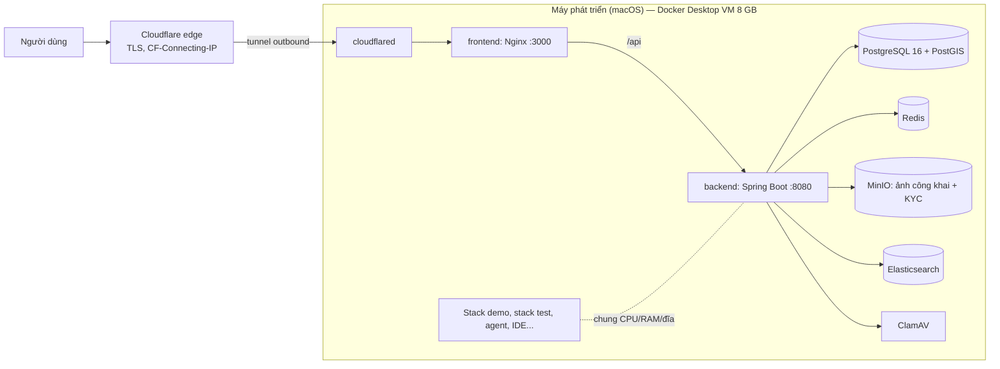
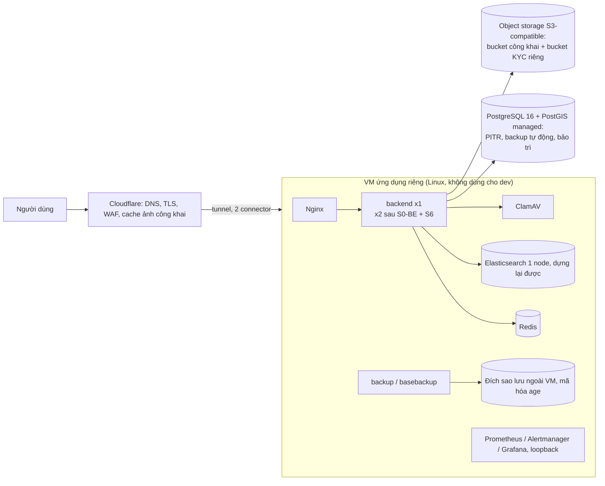

# Topology production: hiện trạng, rủi ro, đề xuất và quy trình rollback

Yêu cầu audit F21.4 (tách production khỏi máy dev — việc hạ tầng, EXTERNAL), D-15 (topology production nhỏ; 2 instance
sau khi sửa SSE/scheduler), và phần vận hành của F21.2/F21.5 (sao lưu, PITR, rollback). Không có số liệu nào ở đây là
kết quả đo tải production; các con số đo được đều ghi rõ nguồn và thời điểm.

## 1. Hiện trạng



- Compose project `bds-production` từ `docker-compose.yml`, chạy trên máy phát triển của chủ dự án, cùng Docker Desktop
  VM với stack demo (`bds-enterprise-stack`) và hạ tầng test (`bds-test`).
- Mức dùng bộ nhớ đo bằng `docker stats` ngày 28/09/2026 01:0x (+07): backend 834 MiB, Elasticsearch 992 MiB,
  ClamAV 557 MiB, MinIO 116 MiB, PostgreSQL 61 MiB, cloudflared 29 MiB, Redis 10 MiB, Nginx 9 MiB. Tổng cả VM lúc đó
  khoảng 7,4/8 GB, swap của VM gần cạn (còn khoảng 6 MB) vì các stack dev/test chạy cùng.
- Secret ở `.env` trên máy dev; credential tunnel ở `~/.cloudflared` của máy dev.
- Không có PITR; bản sao lưu duy nhất trước đợt này là snapshot volume thô commit vào Git LFS
  (`docs/ops/BACKUP_CLASSIFICATION.md`).
- Chưa có giám sát/cảnh báo chạy thật.
- Nginx publish cổng 3000 trên mọi interface (đã đổi thành `127.0.0.1:3000` trong đợt này).

## 2. Rủi ro của mô hình hiện tại

| Rủi ro | Hệ quả | Ghi chú |
|---|---|---|
| Một máy, một đĩa, là máy làm việc cá nhân | Máy ngủ, khởi động lại, cập nhật macOS/Docker Desktop, mất điện/mạng = sập toàn bộ; hỏng đĩa = mất dữ liệu tới bản sao lưu gần nhất | Không phải HA theo bất kỳ nghĩa nào |
| Tranh chấp tài nguyên với dev/test | Build, test, agent làm backend production chậm hoặc bị OOM killer của VM chọn | Quan sát trực tiếp: VM gần hết RAM và swap trong lúc làm đợt audit này |
| Mất hoặc bị trộm máy | Toàn bộ dữ liệu, `.env`, khóa PII, credential tunnel | Phụ thuộc mã hóa đĩa của máy |
| Không có PITR, sao lưu cùng máy | RPO không xác định; sao lưu mất cùng máy | Công cụ mới: `infra/compose.backup.yaml`, `infra/compose.pitr*.yaml` |
| Deploy bằng build ngay trên máy production | Build nặng ảnh hưởng người dùng; không có image có version để rollback | Mục 8 |
| Truy cập trực tiếp vào Nginx từ LAN | Giả mạo địa chỉ khách qua `CF-Connecting-IP` | Đã khóa: publish loopback |
| Không giám sát | Sự cố chỉ được phát hiện khi người dùng báo | `infra/compose.observability.yaml` |

## 3. Topology đề xuất cho production nhỏ



| Thành phần | Đề xuất | Vì sao |
|---|---|---|
| Máy ứng dụng | Một VM Linux riêng cho production (tối thiểu 4 vCPU, 8 GB RAM, SSD), chỉ chạy stack production | Số đo ở mục 1 cho thấy riêng backend + ES + ClamAV đã khoảng 2,4 GB; cần dư cho GC, cache hệ điều hành và đợt tải |
| PostgreSQL | Dịch vụ managed có PostGIS, PITR (7–14 ngày), backup tự động; hoặc tự vận hành với `infra/compose.pitr*.yaml` trên đĩa riêng và đích sao lưu ngoài máy | PostgreSQL là nguồn chuẩn; mất nó là mất nghiệp vụ |
| Object storage | Dịch vụ S3-compatible có versioning; ảnh công khai qua CDN; **ảnh KYC ở bucket riêng**, không public, chỉ URL ký ngắn hạn (luồng S1-MEDIA) | Hiện ảnh KYC và ảnh tin cùng một bucket MinIO |
| Redis | Container trên VM ứng dụng (hoặc managed nhỏ) | Không phải nguồn dữ liệu; rate limiter có dự phòng cục bộ |
| Elasticsearch | Một node trên VM ứng dụng hoặc managed; không cần HA | Chỉ mục dựng lại được từ PostgreSQL; tìm kiếm tự chuyển sang PostgreSQL khi ES lỗi |
| Edge | Giữ Cloudflare Tunnel, chạy 2 connector (2 replica `cloudflared`); không mở cổng vào VM | Không lộ origin; `set_real_ip_from` chỉ cần mạng Docker |
| Secret | Secret manager hoặc tối thiểu `.env` chỉ root đọc trên VM production, không nằm trên laptop | Tách quyền với máy dev |
| Giám sát | `infra/compose.observability.yaml` + kiểm tra uptime từ bên ngoài + receiver Alertmanager thật | Cảnh báo phải tới được người trực |
| Kubernetes | Chưa cần (audit §7.5) | Tốn công vận hành trước khi biết tải |

### HA: cái gì được bảo vệ, cái gì không

| Sự cố | Hiện tại | Đề xuất (1 VM + DB managed) | Khi có 2 instance backend (cùng VM) |
|---|---|---|---|
| Tiến trình backend chết | Docker restart, gián đoạn khoảng 30–60 s | Như cũ | Instance còn lại phục vụ |
| Deploy lỗi | Rollback thủ công | Rollback theo mục 8 | Rolling từng instance |
| Mất VM/máy ứng dụng | Sập + có thể mất dữ liệu | Sập tới khi dựng VM mới từ image (RTO cần đo); **dữ liệu còn** ở DB managed + object storage | Không đổi: hai instance cùng một VM không chống mất VM |
| Hỏng đĩa | Mất dữ liệu tới bản sao lưu gần nhất | DB và object không nằm trên đĩa đó | — |
| Lỗi PostgreSQL | Sập | Failover nếu gói managed có HA; nếu không: PITR | — |
| Redis / Elasticsearch lỗi | Tiếp tục chạy (dự phòng) | Như cũ | — |
| Cloudflare Tunnel lỗi | Sập | 2 connector | — |

**2 instance backend chỉ bật sau khi** có khóa scheduler (`ScheduledTaskLock`, S0-BE) — nếu không, tác vụ định kỳ như
đồng bộ ES chạy trùng — và SSE fan-out qua Redis (S6) — nếu không, người dùng nối vào instance A không nhận thông báo
phát từ instance B. Khi chạy 2 instance, bộ đếm rate limit dùng chung Redis; lúc Redis lỗi, mỗi instance đếm riêng
(giới hạn thực tế nhân số instance).

## 4. Lộ trình chuyển đổi (EXTERNAL — việc của chủ hệ thống)

1. Dựng VM production riêng; cài Docker Engine; tạo `.env` production mới (không sao chép từ laptop những gì không cần).
2. Chọn và tạo PostgreSQL managed có PostGIS; khôi phục bản sao lưu mới nhất (`infra/backup/restore.sh db`) vào đó;
   chạy Flyway validate; đối soát bằng `restore.sh verify-db`.
3. Chọn object storage; nạp ảnh bằng `restore.sh media`; tách bucket KYC khi S1-MEDIA sẵn sàng.
4. Chuyển tunnel: tạo connector trên VM mới, kiểm tra bằng `scripts/verify-headers.sh https://<domain>`, rồi tắt
   connector trên laptop.
5. Bật sao lưu (`infra/compose.backup.yaml` nếu còn tự vận hành phần nào), giám sát, receiver cảnh báo; chạy
   `scripts/restore-drill.sh` và lưu biên bản vào `docs/ops/drills/`.
6. Gỡ stack production khỏi máy dev; xoay vòng các secret đã từng nằm trên máy dev.

## 5. Edge và địa chỉ khách (F13.1)

- Cloudflare đặt `CF-Connecting-IP`; cloudflared chuyển tiếp tới `frontend:3000` trong mạng Compose.
- Nginx (`frontend/nginx.conf`) chỉ tin `CF-Connecting-IP` từ loopback và dải Docker (`172.16.0.0/12`,
  `192.168.0.0/16`), rồi gửi địa chỉ đã xác định cho backend qua `X-Real-IP`/`X-Forwarded-For`.
- Backend chỉ tin các header đó từ peer nằm trong `APP_SECURITY_TRUSTED_PROXIES` (mặc định cùng các dải trên).
- Cổng 3000 chỉ publish trên `127.0.0.1`: không máy nào trong LAN nói chuyện trực tiếp với Nginx được.
- Nếu chuyển từ tunnel sang DNS proxied tới IP public của VM: thêm các dải IP của Cloudflare vào `set_real_ip_from`,
  chặn mọi nguồn khác bằng firewall (hoặc Authenticated Origin Pulls), không nới dải Docker.
- Nếu đặt một reverse proxy khác trước backend (ví dụ `infra/compose.production-overlay.yaml` với Caddy): backend ưu
  tiên hop ngoài cùng bên phải của `X-Forwarded-For` không phải proxy tin cậy (client chỉ chèn được vào bên trái), và
  chỉ dùng `X-Real-IP` khi không có `X-Forwarded-For`. Proxy đó vẫn phải **ghi đè** `X-Real-IP` và bỏ
  `CF-Connecting-IP` do client gửi (`infra/production/Caddyfile` đã làm), vì mọi container trong mạng Compose đều là
  proxy tin cậy.

## 6. Sao lưu, PITR, RPO/RTO

### Bật sao lưu mã hóa
```bash
# một lần, trên máy offline: tạo khóa; public key đưa vào .env, private key cất riêng (password manager/két)
age-keygen -o bds-backup-identity.txt        # in ra "Public key: age1..."
# trên máy production
mkdir -p /srv/bds-backups && chmod 700 /srv/bds-backups   # Linux: chown 10001:10001 (999:999 nếu bật PITR shipping)
BACKUP_DIR=/srv/bds-backups BACKUP_AGE_RECIPIENTS=age1... \
  docker compose -p bds-production -f docker-compose.yml -f infra/compose.backup.yaml --profile ops up -d backup
```
`BACKUP_DIR` phải nằm ngoài repository và nên được đồng bộ ra ngoài máy (ví dụ `rclone sync` sang object storage khác
vùng): các file đều đã mã hóa, đích đồng bộ không cần tin cậy nội dung.

### PITR (tùy chọn khi tự vận hành PostgreSQL)
```bash
docker compose -p bds-production -f docker-compose.yml -f infra/compose.pitr.yaml \
  -f infra/compose.backup.yaml -f infra/compose.pitr-backup.yaml --profile ops up -d postgres backup postgres-basebackup
```
- `archive_mode` cần khởi động lại PostgreSQL một lần (vài giây lỗi API).
- WAL được lưu cục bộ tối đa `WAL_ARCHIVE_KEEP_MINUTES` (mặc định 72 giờ, job prune), gửi đi mỗi 5 phút (zstd + age),
  base backup hằng ngày (sidecar dùng chung network namespace với PostgreSQL). Base backup phải dày hơn thời gian giữ WAL.
- Dung lượng: `archive_timeout=300` tạo tối thiểu 288 segment 16 MB mỗi ngày kể cả khi rảnh (khoảng 4,6 GB/ngày
  trước nén trong volume archive); bản gửi đi được nén (thử nghiệm: 96 MB segment → 6,1 MB).

| Kịch bản | RPO | RTO (cần đo trên dữ liệu thật) |
|---|---|---|
| Chỉ `compose.backup.yaml` | Tới 1 giờ (pg_dump hằng giờ); ảnh tới 24 giờ | Khôi phục pg_dump + nạp object; biên bản tổng hợp: 11 s cho 18 MB DB + 15 MB object |
| + PITR, mất volume dữ liệu nhưng còn archive | Khoảng 5 phút (`archive_timeout`) | Giải nén base backup + replay WAL từ lúc base backup |
| + PITR shipping, mất cả máy | Khoảng 10 phút (5 phút segment + 5 phút chu kỳ gửi), với điều kiện `BACKUP_DIR` được đồng bộ ra ngoài | Như trên + dựng máy mới |
| PostgreSQL managed có PITR | Theo nhà cung cấp (thường vài phút) | Theo nhà cung cấp + đổi chuỗi kết nối |

Gợi ý mục tiêu ban đầu (audit §7.5): RPO ≤ 15 phút, RTO ≤ 60 phút; chủ dự án chốt và đo bằng diễn tập.

### Khôi phục
```bash
# pg_dump + object vào môi trường cô lập, có đối soát và biên bản:
BACKUP_DIR=/srv/bds-backups AGE_IDENTITY_FILE=/secure/bds-backup-identity.txt scripts/restore-drill.sh --env production

# PITR tới một thời điểm: dữ liệu vào một volume mới (không bao giờ ghi đè volume đang chạy)
docker volume create bds-restore-data && docker volume create bds-restore-wal
docker run --rm -v bds-restore-data:/d -v bds-restore-wal:/w alpine:3.22 chown 999:999 /d /w
docker run --rm --user 999:999 -e BACKUP_ENV=production -e AGE_IDENTITY_FILE=/run/id \
  -v /secure/bds-backup-identity.txt:/run/id:ro -v /srv/bds-backups:/backups:ro \
  -v bds-restore-data:/restore-data -v bds-restore-wal:/restore-wal \
  --entrypoint /usr/local/bin/restore.sh bds-backup:1 basebackup latest /restore-data
docker run --rm --user 999:999 -e BACKUP_ENV=production -e AGE_IDENTITY_FILE=/run/id \
  -v /secure/bds-backup-identity.txt:/run/id:ro -v /srv/bds-backups:/backups:ro -v bds-restore-wal:/restore-wal \
  --entrypoint /usr/local/bin/restore.sh bds-backup:1 wal /restore-wal
# thêm vào postgresql.auto.conf của bds-restore-data, rồi tạo file recovery.signal:
#   restore_command = 'cp /restore-wal/%f %p'
#   recovery_target_time = '2026-09-28 10:15:00+07'
#   recovery_target_action = 'promote'
# chạy postgis/postgis:16-3.4 với bds-restore-data làm PGDATA và bds-restore-wal mount read-only ở /restore-wal
```
Quy trình PITR này đã được chạy thử với container tạm: xóa hẳn volume archive, khôi phục chỉ từ `BACKUP_DIR`, dừng đúng
trước mốc thời gian (báo cáo luồng `docs/audit-2026-09-27/streams/s5-sec-a.md`).

### Lịch diễn tập
Mỗi quý và sau mỗi thay đổi lớn về schema hoặc hạ tầng: chạy `scripts/restore-drill.sh`, commit biên bản vào
`docs/ops/drills/`. Biên bản đầu tiên (`2026-09-27-synthetic.md`) dùng dữ liệu tổng hợp; diễn tập với bản sao lưu
production thật là việc của chủ hệ thống.

## 7. Giám sát
`infra/compose.observability.yaml` (Prometheus 127.0.0.1:9090, Alertmanager 127.0.0.1:9093, Grafana 127.0.0.1:3001,
exporter PostgreSQL/Redis/Elasticsearch/host). Cảnh báo và cách xử lý: `docs/operations/ALERT_RUNBOOK.md`. Cần thêm một
receiver thật trong `infra/observability/alertmanager.yml` và một kiểm tra uptime từ bên ngoài (máy chủ tự giám sát
mình thì không báo được khi chính nó sập).

## 8. Triển khai và rollback (ứng dụng + migration)

### Nguyên tắc migration
- **Expand → migrate → contract:** release N chỉ thêm (cột nullable/có default, bảng mới, index `CONCURRENTLY` khi
  bảng lớn); release N+1 mới bỏ cột/bảng mà code release N đã thôi dùng. Không đổi tên cột trong một release.
- Flyway chỉ đi tiến. Code cũ chạy được trên schema mới vì Flyway mặc định bỏ qua migration "future"
  (`ignoreMigrationPatterns=*:future`), nên rollback ứng dụng không cần rollback schema nếu migration là expand.
- Migration nào không thể tương thích ngược (xóa dữ liệu, đổi kiểu) phải có bản sao lưu ngay trước khi chạy và kế hoạch
  riêng trong PR.

### Trước khi deploy
```bash
cd /path/to/Real-estate && git rev-parse HEAD > /srv/bds-deploys/$(date +%Y%m%d%H%M).rev
STAMP=$(date +%Y%m%d%H%M)
docker tag bds-production-backend:latest  bds-production-backend:rollback-$STAMP
docker tag bds-production-frontend:latest bds-production-frontend:rollback-$STAMP
docker compose -p bds-production exec -T postgres psql -U "$POSTGRES_USER" -d "$POSTGRES_DB" -Atc \
  "SELECT max(version) FROM flyway_schema_history WHERE success" > /srv/bds-deploys/$STAMP.flyway
docker compose -p bds-production -f docker-compose.yml -f infra/compose.backup.yaml --profile ops run --rm backup db
```

### Deploy và kiểm tra
```bash
docker compose -p bds-production up -d --build backend frontend
curl -fsS http://127.0.0.1:3000/healthz && curl -fsS http://127.0.0.1:3000/backend-health
scripts/verify-headers.sh https://nhadatchuan.online
# thủ công: đăng nhập, tìm kiếm, mở chi tiết tin, gửi lead thử bằng tài khoản nội bộ
```

### Rollback ứng dụng (migration expand hoặc không có migration)
```bash
docker tag bds-production-backend:rollback-$STAMP  bds-production-backend:latest
docker tag bds-production-frontend:rollback-$STAMP bds-production-frontend:latest
docker compose -p bds-production up -d --no-build --force-recreate backend frontend
```

### Rollback khi migration không tương thích
1. Rollback ứng dụng như trên; nếu ứng dụng cũ không chạy được trên schema mới:
2. Khôi phục bản sao lưu chụp trước deploy vào **database mới** (`restore.sh db <set> bds_before_<STAMP>`), kiểm tra
   bằng `restore.sh verify-db`, rồi trỏ `SPRING_DATASOURCE_URL` sang database đó và recreate backend. Dữ liệu ghi sau lúc
   chụp bị mất — hoặc dùng PITR tới ngay trước thời điểm migration nếu đã bật.
3. Ghi lại sự cố; sửa migration thành dạng expand trước lần deploy sau.

Giữ tối thiểu 3 image rollback gần nhất; xóa bớt bằng `docker image rm bds-production-backend:rollback-<cũ>`.

## 9. Ghi chú triển khai cho các thay đổi của luồng S5-SEC pha A

| Thay đổi | Tác động khi deploy | Việc cần làm |
|---|---|---|
| `frontend` publish `127.0.0.1:3000` thay vì `3000` | Máy khác trong LAN không mở được `http://<ip-máy>:3000` nữa; truy cập công khai qua tunnel không đổi | Kiểm thử từ thiết bị khác dùng domain qua Cloudflare, hoặc overlay dev |
| Header/CSP mới trong Nginx, Google Fonts bị loại khỏi CSP | Nếu frontend chưa tự host font (S0-FE), trình duyệt rơi về font hệ thống — không lỗi chức năng | Deploy cùng hoặc sau thay đổi font của S0-FE; chạy `scripts/verify-headers.sh https://nhadatchuan.online` |
| HSTS `max-age=31536000; includeSubDomains` trên HTTPS | Trình duyệt ép HTTPS cho mọi subdomain trong một năm | Nếu có subdomain chỉ chạy HTTP, bỏ `includeSubDomains` trước khi deploy |
| Rate limiter v2 | Giới hạn theo policy (xem `RateLimitPolicies`); 429 dạng Problem Details có `Retry-After` | Đặt `RATE_LIMIT_KEY_PEPPER` (bí mật ngẫu nhiên ≥ 32 ký tự); theo dõi dashboard "BDS — Rate limit" tuần đầu |
| Địa chỉ khách thật | `APP_SECURITY_TRUSTED_PROXIES` mặc định là loopback + dải Docker | Nếu mạng Compose production dùng dải khác, đặt biến này |
| Không có migration Flyway mới | — | — |
| Overlay backup / PITR / observability | Không tự bật; PITR và observability khởi động lại PostgreSQL một lần | Bật theo mục 6–7 khi chủ hệ thống quyết định |
